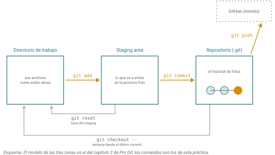

## Práctica: git para científicos

Ustedes son jóvenes pero en algún momento puede que tengan una carpeta parecida a esto:

```         
tesis-v1.docx
tesis-v3_correcciones_JM_corregidoTutor24may.docx
analisis_bien.R
analisis_ya_bien.R
tesis-final-BUENA.docx
tesis-final-BUENA-ahora-sí.docx
```

Vince Buffalo abre con este ejemplo el capítulo 5 de *Bioinformatics Data Skills*, que es el que vamos a seguir hoy, y su observación es que ese sistema de control de versiones *ad hoc* puede funcionar a pequeña escala pero puede complicarse. Una necesidad en un proyecto vivo es guardar copias para poder regresar a ellas. Sin embargo, para un proyecto con scripts, datos, figuras y tres personas tocándolo, el directorio se vuelve ilegible y nadie sabe cuál archivo produjo cuál figura. Lo cual es un problema cuando el tutor o el revisor te pide modificar esa figura para incluir otros datos o hacer modificaciones menores.

La solición es Git, que Buffalo propone como una solición del campo de la porgramación que tiene incluso más sentido para el trabajo de datos científico. Guarda versiones completas del proyecto, para poder regresar a cualquier momento del pasado. Registra qué cambió, cuándo y por qué, así que cuando una figura cambia pueden rastrear qué la cambió. Y mantiene el código organizado y disponible cuando la persona que lo escribió se va del laboratorio, que en un laboratorio académico pasa cada bien seguido. Es decir, sirve un poco como bitácora de laboratorio y respaldo para poder explorar ideas sin perder el trabajo ya hecho.

Ustedes ya vieron git una vez, con la Dra. Evelia Coss, para publicar su página web desde RStudio. Hoy es distinto en tres cosas: teclearemos los comandos en la terminal, en una máquina remota compartida, y deseamos que lo que versionen sea una práctica que abarque el semestre y más allá. Es decir, que creemos un repositorio donde entreguen sus tareas de todo el semestre, y que así esta forma de trabajar se vuelva un hábito.

::: callout-box
Esta práctica sigue el capítulo 5 de Buffalo, *Git for Scientists*, adaptado. El enfoque y varios ejercicios están adaptados también del curso de introducción a la bioinformática de Evelia Coss (LCG, UNAM), usado con su permiso, bajo licencia CC BY-NC-SA 4.0.
:::

### Lo que vamos a construir

Al final de la sesión van a tener un repositorio llamado `bioinfo1` en su cuenta de `ken`, conectado a un repositorio en GitHub, con su primer commit adentro. Ese repositorio es donde van a entregar todo el semestre. Cada tarea, cada bitácora, cada script va ahí, en Markdown, y se entrega haciendo push. No hace falta usar ESTE repositorio que creemos hoy ni trabajar necesariamente desde la terminal, pero sí trabajar en git e ir subiendo allí sus tareas. Si ya tienen una manera a partir de GUI para usar git pueden usarla. La idea es que no sea un ejercicio desechable, sino la infraestructura del semestre.

### Primer contacto con ken

`ken` es el cluster del curso. Es una máquina compartida: cuando ustedes están conectados, lo están también sus compañeros y varias personas más, por eso es una etiqueta diferente a trabajar sólo en su laptop.

``` bash
ssh usuario@ken.lavis.unam.mx
```

La primera vez les va a preguntar si confían en la máquina; contesten `yes`. Van a caer en el **login node**, que es la puerta de entrada, con un mensaje de bienvenida y links útiles.

Sólamente dice:

``` bash
[usuario@ken ~]$
```

El pelito de la ñ o "virgulilla" indica que estamos en "home". Que es diferente para cada usuario: /home/usuario.

Acá se editan archivos, se mueven datos y se mandan trabajos a la cola, pero no se corre nada pesado. Para eso está SLURM, que verán después. Todo lo de hoy es ligero.

Ubíquémonos en el sistema de archivos antes que nada:

``` bash
whoami
hostname
pwd
```

::: {.callout-note collapse="true"}
## ¿Quién soy? ¿Dónde estoy?

`whoami` devuelve su usuario, `hostname` devuelve `ken` (confirma que ya no están en su laptop) y `pwd` les muestra su home.
:::

::: callout-box
Cosas que no se hacen en una máquina compartida. No llenen el disco con archivos que pueden volver a bajar. Y no corran programas pesados en el login node.
:::

### Ejercicio 0. Módulos

Cada que prendemos nuestra laptop, el sistema carga los programas que hemos instalado como navegador, reproductor de música o editor de texto. Sin embargo, en un sistema compartido, no es útil cargar todos los programas porque no los necesitamos si compartimos el clúster con matemáticos, bioinformáticos, científicos de la tierra o físicos, y sólo queremos utilizar git. Como cuando abrimos una laptop con muchos programas que abren por defecto, gasta memoria RAM y tiempo (recursos), por ello, el manejo del software en el clúster es modular. Hay un "estante" de módulos como en un a biblioteca y podemos bajar los que necesitemos en un momento dado para trabajar.

``` bash
module load git
module list
```

Podemos ver la lista de programas que están en nuestro "escritorio". Con `module avail`, podemos ver todos los que están disponibles en el "estante".

### Ejercicio 1. Decirle a git quién eres

Buffalo pone esto como el primer paso de todos, y por una razón práctica: cada commit lleva pegado un nombre y un correo, y si no los configuran, git se niega a hacer el commit o lo firma con algo inútil. Es el error número uno de los que empiezan.

``` bash
git config --global user.name "Nombre Apellido"
git config --global user.email "correo@ejemplo.com"
git config --global init.defaultBranch main
```

Verifiquen que quedó:

``` bash
git config --list
```

::: {.callout-note collapse="true"}
## Solución

`--global` escribe en `~/.gitconfig`, o sea que aplica a todos sus repositorios en esta máquina. Como `ken` es compartida, cada quien tiene su propio archivo en su propio home.

Usen el mismo correo con el que abrieron su cuenta de GitHub. Si no coincide, GitHub no va a reconocer sus commits como suyos y su perfil no los va a mostrar.

La tercera línea es por herencia histórica. git llamaba `master` a la rama principal, y hoy la convención es `main`. Sin esa línea van a acabar con repositorios inconsistentes.
:::

### Ejercicio 2. Crear el repositorio

``` bash
mkdir -p ~/bioinfo1
cd ~/bioinfo1
git init
```

::: {.callout-note collapse="true"}
## Solución

`git init` crea un directorio oculto `.git` dentro de la carpeta. Ahí vive todo el historial. Compruébenlo:

``` bash
ls -a
```

Deben ver `.git` en la lista. Ese directorio **es** el repositorio; el resto son sus archivos de trabajo. Si borran `.git`, pierden el historial y se quedan con los archivos tal como estaban. Si copian la carpeta completa a otro lado, se llevan el historial con ella.

Un repositorio de git es entonces una carpeta normal con memoria.
:::

### Un esquema/modelo mental para trabajar con git

Git maneja tres zonas. El **directorio de trabajo** son los archivos locales como están ahora mismo. El **staging area** es una antesala donde ustedes escogen qué cambios van a entrar en la próxima foto. Y el **repositorio** es la colección de versiones ya commiteadas, el historial (@fig-zonas).

{#fig-zonas}

Esa zona de en medio es lo que confunde puede confundir al principio, y es también lo que hace útil a git. Sin ella, cada commit tendría que incluir todo lo que cambió. Con ella, ustedes pueden trabajar en cinco cosas a la vez y guardar tres commits limpios, uno por tema.

### Ejercicio 3. Rastrear y preparar archivos

Hagan un `README.md` que diga qué es este repositorio, y guarden ahí también sus notas de la parte teórica.

``` bash
nano README.md
```

Escriban algo mínimo, en Markdown, que ya lo conocen:

``` markdown
# Bioinformática I, 2026-2

Repositorio de entregables del curso.
Autor: (su nombre)
```

Ctrl + x para salir, nano pregunta si quieren guardar y en cuál archive, Yes a todo.

Ahora vean qué opina git:

``` bash
git status
```

::: {.callout-note collapse="true"}
## Solución

Git les dice que `README.md` está **untracked**. Nunca lo ha visto, no le está siguiendo la pista, y le está avisando.

Buffalo separa este paso en dos partes justamente porque `git add` hace dos trabajos distintos que se ven iguales. La primera vez que le hacen `add` a un archivo, le están diciendo a git "empieza a rastrear esto". De ahí en adelante, `add` significa otra cosa: "mete los cambios actuales de este archivo al staging area".

``` bash
git add README.md
git status
```

Ahora dice **changes to be committed**. El archivo pasó de la primera zona a la segunda.
:::

### Ejercicio 4. Tomar la foto

``` bash
git commit -m "Primer commit: README del repositorio del curso"
```

::: {.callout-note collapse="true"}
## Solución

`-m` es el mensaje. No es opcional en la práctica: un commit sin mensaje útil es un commit que nadie, ustedes incluidos, va a poder interpretar en marzo.

Un buen mensaje dice **qué cambió y por qué**, no cómo. "Arreglé el bug" es malo. "Corrijo el conteo de bases: no descontaba los saltos de línea" es bueno. Escríbanlos en presente o infinitivo, como una orden, que es la convención.

Hay un dato incómodo sobre esto. Un estudio de Isomöttönen y Cochez encontró que cerca del 47% de los estudiantes no lee los mensajes de commit, o los hojea de casualidad. O sea que mucha gente escribe mensajes que nadie lee, incluidos los suyos propios de hace tres meses. Escriban los suyos pensando en esa persona.
:::

### Ejercicio 5. Ver qué cambió y qué ha pasado

Modifiquen el `README.md`: agréguenle una línea con la fecha de hoy. Antes de hacer nada más:

``` bash
git diff
```

Luego revisen la historia:

``` bash
git log
git log --oneline
```

::: {.callout-note collapse="true"}
## Solución

`git diff` les muestra, línea por línea, la diferencia entre lo que tienen ahora y lo último que commitearon. Las líneas con `-` son las que quitaron, las de `+` las que agregaron. Esta es la razón de fondo por la que un cuaderno de laboratorio computacional se escribe en texto plano y no en Word: git puede decirles exactamente qué cambió en un `.md`, y no puede hacer nada con un `.docx`, que para él es un blob binario indescifrable.

Un detalle: `git diff` a secas compara el directorio de trabajo contra el área de staging, es decir, sólo muestra lo que todavía no han hecho `add`. Si ya lo hicieron, `add` de un cambio no van a ver nada. Para eso está `git diff --staged` que compara el staging contra el último commit. Si quieren verlo todo, lo stageado y lo no, contra el último commit, es git diff HEAD.

`git log` les da el historial completo con autor, fecha y mensaje. `--oneline` lo comprime a un renglón por commit. Ese código de siete caracteres al inicio es el hash del commit, su identificador único. Con él pueden regresar a ese punto exacto.
:::

### Ejercicio 6. Decirle a git qué ignorar

Acá viene la parte específica de bioinformática, y es la más importante de todo el día.

Los repositorios de git **no son para datos**. Están diseñados para archivos de texto que cambian poco a poco, y guardan cada versión de cada archivo para siempre. Un FASTQ de 30 GB en un repositorio no solo no sirve: lo arruina de forma difícil de deshacer, porque aunque después lo borren, sigue en el historial.

GitHub además pone límites duros: avisa arriba de 50 MB y **rechaza** cualquier archivo mayor a 100 MB.

Creen un `.gitignore`:

``` bash
nano .gitignore
```

``` gitignore
# Datos de secuencias: nunca se versionan
*.fasta
*.fa
*.fastq
*.fq
*.bam
*.sam
*.vcf
*.gz

# Resultados regenerables
resultados/
*.log

# Basura del sistema y del editor
.DS_Store
*~
.Rhistory
```

::: {.callout-note collapse="true"}
## Solución

Cada línea es un patrón. Lo que corresponda queda invisible para git: no aparece en `git status`, no se puede agregar por accidente con `git add .`.

El `.gitignore` **sí** se commitea, porque es parte de la configuración del proyecto y sus colaboradores lo necesitan igual que ustedes.

``` bash
git add .gitignore
git commit -m "Agrego .gitignore para datos de secuencias y resultados"
```

Regla de oro: el `.gitignore` se escribe **antes** del primer `git add .`, no después. Sacar un archivo grande del historial una vez que entró requiere reescribir la historia con herramientas como `git filter-repo` y un push forzado, y es un dolor que no necesitan conocer todavía.
:::

::: callout-box
Si no se versionan los datos, cómo se garantiza que el análisis sea reproducible? Versionando la **receta** en lugar del ingrediente. En un archivo `datos/README.md` se anota de dónde salió cada archivo: el accession, la fecha de descarga, el comando exacto y su checksum.

``` bash
md5sum archivo.fasta > archivo.fasta.md5
```

Con eso, cualquiera puede volver a bajar el dato y verificar con `md5sum -c` que es bit por bit el mismo que ustedes usaron. Eso es lo que Buffalo llama descargar datos de forma reproducible, y es el patrón que van a usar todo el semestre.

En Mac los comandos son `md5` y `shasum -a 256` en lugar de `md5sum` y `sha256sum`.
:::

### Ejercicio 7. Conectarse a GitHub desde ken

Este es el paso que más tiempo se lleva, así que vamos con calma.

Ustedes ya generaron una llave SSH el semestre pasado, pero fue en su laptop. En `ken` empiezan de cero, porque una llave vive en la máquina donde se generó.

``` bash
ssh-keygen -t ed25519 -C "correo@ejemplo.com"
```

Acepten la ruta por defecto y pongan una passphrase. Después:

``` bash
chmod 700 ~/.ssh
#Llave privada, sólo visible para cada usuario
chmod 600 ~/.ssh/id_ed25519
#Llave pública, visible y ejecutable para todos
chmod 644 ~/.ssh/id_ed25519.pub
cat ~/.ssh/id_ed25519.pub
```

Copien lo que imprime `cat` y péguenlo en GitHub, en Settings, SSH and GPG keys, New SSH key. Verifiquen:

``` bash
ssh -T git@github.com
```

::: {.callout-note collapse="true"}
## Solución

Deben ver algo como `Hi usuario! You've successfully authenticated, but GitHub does not provide shell access.` Ese mensaje, que parece un error, es el éxito.

Sobre los permisos: SSH **ignora en silencio** las llaves cuyos permisos son demasiado abiertos. Si se saltan los `chmod`, la autenticación falla sin decirles por qué. Es la causa más común de "no me funciona" en este paso.

Sobre por qué llaves y no un token. Un personal access token guardado en el disco de una máquina compartida es un archivo de texto que da acceso a toda su cuenta de GitHub. En su laptop es discutible; en `ken`, con treinta personas, no. Solo la parte pública de la llave (`.pub`) sale de la máquina; la privada nunca, jamás, se copia ni se pega a ningún lado.
:::

### Ejercicio 8. El remoto y el primer push

Creen en GitHub un repositorio nuevo llamado `bioinfo1`, **vacío**, sin README ni `.gitignore` (si GitHub le mete archivos, van a chocar con los suyos). Luego, desde `ken`:

``` bash
git remote add origin git@github.com:usuario/bioinfo1.git
git remote -v
git push -u origin main
```

Estos comandos también salen justo después de crear el repo en la página de github. ¡Hay que cambiar usuario por su nombre de usuario en github!

::: {.callout-note collapse="true"}
## Solución

`git remote add` le da un nombre corto, `origin`, a una dirección larga. Es solo un apodo; podría llamarse de otro modo, pero `origin` es la convención universal.

`git push -u origin main` sube la rama `main` a `origin`. La bandera `-u` establece el vínculo, y por eso de aquí en adelante les basta con `git push`.

Abran el repositorio en el navegador. Ahí está su README, renderizado, y su historial de commits con su nombre y la hora. Ese mismo hash de siete caracteres que vieron en `git log` está en la página. Eso es lo que quiere decir que git es distribuido: hay dos copias completas del historial, una en `ken` y otra en GitHub, y son la misma.
:::

### Ejercicio 9. Romper algo y recuperarlo

Acá es donde el control de versiones deja de ser abstracto.

Borren el contenido de su README:

``` bash
echo "" > README.md
cat README.md
```

Está vacío. En una carpeta normal, eso sería definitivo. Acá no:

``` bash
git status
git checkout -- README.md
cat README.md
```

::: {.callout-note collapse="true"}
## Solución

`git checkout -- archivo` descarta los cambios no commiteados y restaura el archivo tal como estaba en el último commit. El texto volvió.

Fíjense en la condición: funcionó **porque ya lo habían commiteado**. Git no puede recuperar lo que nunca le dieron. Esa es la moraleja operativa de la sesión: un commit frecuente es barato, y es lo único que separa "me equivoqué" de "perdí el trabajo".

También es la razón práctica por la que se hace commit seguido y con mensajes claros, en lugar de un commit gigante al final del día.
:::

### Lo que no vimos hoy

Git tiene mucho más, y el capítulo de Buffalo sigue con ramas (`git branch`), fusiones (`git merge`), conflictos, y el flujo de forks y pull requests que usa el software libre. Nada de eso les hace falta todavía, y meterlo creo que solo produciría confusión.

Creo que loo van a ver en el curso de Python del siguiente semestre. Por ahora, con `add`, `commit`, `push` y saber recuperar un archivo, tienen lo suficiente para trabajar de forma seria durante todo este curso.

::: callout-box
Un aviso sobre el libro de Buffalo, que además es una lección sobre materiales técnicos en general. Es de 2015, y en la sección de autenticación describe conectarse a GitHub con usuario y contraseña. Eso **ya no funciona**: GitHub dejó de aceptar contraseñas para operaciones de git el 13 de agosto de 2021. Por eso hoy usamos llaves SSH.

El libro sigue siendo excelente y el resto del capítulo es válido. Pero cuando sigan un tutorial, chequen la fecha, y cuando algo no funcione como está escrito, esa es la primera hipótesis a considerar.
:::

### Cómo se entrega en este curso

De aquí en adelante, todo entregable del curso es un archivo Markdown en su repositorio `bioinfo1`, subido con push. Sin excepciones, sin PDFs por correo.

Así, al final del semestre van a tener un repositorio público con cuatro meses de trabajo documentado, con su nombre en cada commit. Eso es un portafolio, y puede servir para solicitar una estancia o un posgrado mucho mejor que una calificación.

```{=html}
<!-- NOTA PARA JERO, no renderizar: la numeración de ejercicios reinicia por
     sesión. Renumerar a la secuencia continua del libro antes de compilar. -->
```

## Para seguirle {.unnumbered}

- Buffalo, V. (2015). *Bioinformatics Data Skills*. O'Reilly. Capítulo 5, "Git for Scientists"; capítulo 2, organización de proyectos; capítulo 6, descarga reproducible de datos. <https://vincebuffalo.com/book/>
- Chacon, S. & Straub, B. *Pro Git*. Libro completo y gratuito, con traducción al español. <https://git-scm.com/book/es/v2>
- Software Carpentry. *Version Control with Git*, con versión en español. <https://swcarpentry.github.io/git-novice-es/>
- Bryan, J. *Happy Git and GitHub for the useR*. La referencia práctica para cuando algo se rompe. <https://happygitwithr.com/>
- Mastretta-Yanes, A. & Verdugo, R. *Introducción a la bioinformática e investigación reproducible*. Unidad 1, organización de un proyecto bioinformático. <https://github.com/u-genoma/BioinfinvRepro>
- Perez-Riverol, Y. et al. (2016). Ten Simple Rules for Taking Advantage of Git and GitHub. *PLoS Computational Biology* 12(7): e1004947. [doi:10.1371/journal.pcbi.1004947](https://doi.org/10.1371/journal.pcbi.1004947)
- Noble, W. S. (2009). A Quick Guide to Organizing Computational Biology Projects. *PLoS Computational Biology* 5(7): e1000424. [doi:10.1371/journal.pcbi.1000424](https://doi.org/10.1371/journal.pcbi.1000424)
- Wilson, G. et al. (2017). Good enough practices in scientific computing. *PLoS Computational Biology* 13(6): e1005510. [doi:10.1371/journal.pcbi.1005510](https://doi.org/10.1371/journal.pcbi.1005510)
- Coss, E. Buenas prácticas en Bioinformática (LCG, UNAM). <https://eveliacoss.github.io/LCG2026_Buenas_practicas_libro/>
