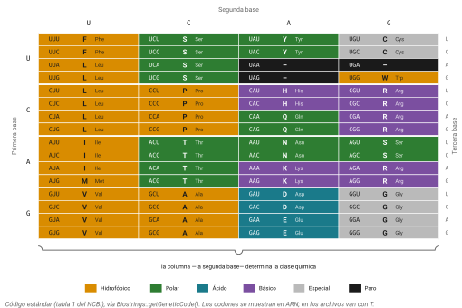
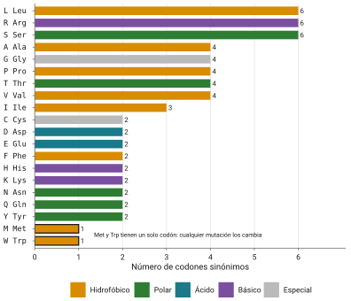
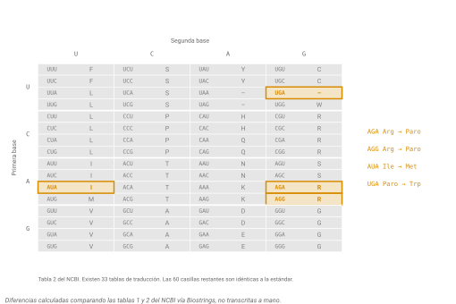
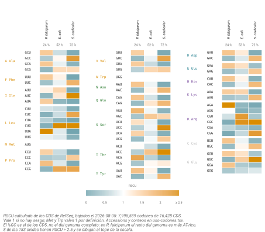
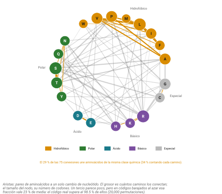

## Idea central

Sesenta y cuatro codones, veinte aminoácidos. El reparto podría ser cualquiera, y sin embargo no lo es: la tabla del código genético tiene una estructura que amortigua errores, y esa estructura explica por qué unas sustituciones de aminoácido son toleradas y otras no.

Ese es el punto del capítulo, y también su gancho hacia la siguiente sesión. Cuando veamos matrices de sustitución, van a encontrarse con tablas de números que parecen sacadas de la nada. No lo están. Buena parte de esos números está prefigurada en cómo se reparten los codones.

De paso vamos a desarmar la idea de que el código es universal, que es la creencia más extendida y más falsa de este tema.

## Desarrollo

### La tabla no es aleatoria

Empecemos por lo que se ve al mirar la tabla completa.

Si el reparto codón a aminoácido fuera un sorteo, no habría patrón alguno. Pero hay dos, y son fuertes.

El primero es que **la segunda posición del codón determina en gran medida la clase química del aminoácido**. Casi todos los codones con U en segunda posición codifican aminoácidos hidrofóbicos: Phe, Leu, Ile, Met, Val. Los que llevan A en segunda posición tienden a ser polares o cargados. La tabla está organizada, sin que nadie la organizara.

El segundo es que **la tercera posición es la más prescindible**. En ocho de las dieciséis cajas de la tabla, la tercera base no cambia nada: los cuatro codones codifican el mismo aminoácido.

Junten los dos patrones y sale la consecuencia que sostiene el resto del capítulo. Un cambio de nucleótido en tercera posición casi nunca cambia el aminoácido. Uno en primera posición suele dar un aminoácido químicamente parecido. Uno en segunda posición es el que típicamente cambia de clase química y rompe cosas.

Dicho de otro modo: **los aminoácidos que están a una mutación de distancia tienden a parecerse entre sí** (@fig-tabla-codones). Guarden esa frase. Al final del capítulo se convierte en otra cosa.

{#fig-tabla-codones}

### Cómo leer la tabla en su forma cruda

En archivos y en documentación del NCBI van a encontrarse el código escrito así, que es como se guarda de verdad:

```
AAs    = FFLLSSSSYY**CC*WLLLLPPPPHHQQRRRRIIIMTTTTNNKKSSRRVVVVAAAADDEEGGGG
Starts = ---M------**--*----M---------------M----------------------------
Base1  = TTTTTTTTTTTTTTTTCCCCCCCCCCCCCCCCAAAAAAAAAAAAAAAAGGGGGGGGGGGGGGGG
Base2  = TTTTCCCCAAAAGGGGTTTTCCCCAAAAGGGGTTTTCCCCAAAAGGGGTTTTCCCCAAAAGGGG
Base3  = TCAGTCAGTCAGTCAGTCAGTCAGTCAGTCAGTCAGTCAGTCAGTCAGTCAGTCAGTCAGTCAG
```

Cada columna es un codón. Las tres últimas líneas dan sus bases y la primera dice qué aminoácido le toca, con asterisco para los paros. La línea `Starts` marca cuáles pueden funcionar como codón de inicio.

No es bonito, pero es el formato con el que se comunican las herramientas entre sí, y reconocerlo les va a ahorrar confusión.

### Degeneración

Sesenta y un codones con sentido para veinte aminoácidos. Ese exceso se llama **degeneración**, y no está repartido parejo.

Tres aminoácidos tienen seis codones cada uno: leucina, serina y arginina. Cinco tienen cuatro (valina, prolina, treonina, alanina, glicina) y forman las cajas donde la tercera posición da igual. Isoleucina es el único con tres. Nueve tienen dos. Y dos aminoácidos tienen uno solo: metionina y triptófano (@fig-degeneracion).

{#fig-degeneracion}

Que Met y Trp tengan un solo codón tiene una consecuencia inmediata: cualquier mutación en cualquiera de sus tres posiciones los cambia. No tienen colchón. Es una de las razones por las que el triptófano es tan informativo en un alineamiento.

De acá salen dos términos que van a usar todo el semestre. Una sustitución **sinónima** cambia el nucleótido pero no el aminoácido. Una **no sinónima** sí lo cambia. Y las posiciones donde cualquier cambio es sinónimo se llaman sitios de degeneración cuádruple, y se usan como aproximación de evolución neutral, porque la selección sobre la proteína no los ve.

Digo aproximación con intención. No son neutrales del todo, y la razón la vemos más adelante cuando lleguemos al sesgo de uso de codones.

### Wobble: por qué no hacen falta 61 ARNt

Si hay 61 codones con sentido, la intuición dice que hacen falta 61 ARNt distintos. No es así, y la explicación es de 1966.

Francis Crick propuso que el apareamiento entre la tercera base del codón y la primera del anticodón es más laxo que los otros dos. Le llamó **wobble** (tambaleo), y las reglas son: una G del anticodón puede aparear con C o con U, una U puede aparear con A o con G, y la inosina, una base modificada, puede aparear con U, C o A.

La inosina es la clave de la economía. Un solo ARNt con inosina en esa posición lee tres codones distintos.

Los números humanos dan idea de la escala: alrededor de 450 genes de ARNt producen hasta 274 especies moleculares distintas, organizadas en unas 49 familias por anticodón. Cuarenta y nueve anticodones leyendo sesenta y un codones.

Lo que Crick no podía saber en 1966 es cuánto depende esto de modificaciones químicas del ARNt. La inosina se genera desaminando una adenina. Otras modificaciones de esa misma posición, como mcm5s2U o la queuosina, ajustan finamente qué codones lee cada ARNt. Perder simultáneamente dos de esas modificaciones es letal en ratón y en mosca. El wobble resultó ser bastante menos "tambaleante" y bastante más regulado de lo que sugería el nombre.

### Inicio y paro

**AUG** es el codón de inicio canónico y codifica metionina.

Canónico no quiere decir único. En bacterias, GUG y UUG funcionan como inicio con regularidad: en *E. coli*, el 83% de los genes empieza con AUG, el 14% con GUG y el 3% con UUG. Uno de cada seis genes de la bacteria más estudiada del planeta no empieza con AUG. Si su predictor de genes solo busca AUG, se le van a escapar.

En bacterias además el iniciador no es metionina simple sino N-formilmetionina, aunque en los archivos de GenBank siempre aparece como M por convención.

Lo que decide dónde empieza la traducción no es solo el codón sino su contexto. En eucariotas es la **secuencia de Kozak**, con consenso `gccRccAUGG`, donde lo que más pesa es tener una purina en la posición -3 y una G en +4. En bacterias es la **secuencia de Shine-Dalgarno**, rica en purinas (`AGGAGG`), unos cinco a ocho nucleótidos antes del inicio, y que funciona apareándose con el extremo 3' del ARNr 16S.

Los tres codones de paro son **UAA, UAG y UGA**. No hay ARNt que los lea; los reconocen proteínas llamadas factores de liberación.

::: callout-box
Los codones de paro tienen apodos que van a encontrarse en la literatura y que no significan nada químico: UAG es amber, UAA es ochre, UGA es opal.

La historia del primero vale la pena. Los mutantes que definieron UAG los aisló un estudiante de posgrado apellidado Bernstein, y sus compañeros de laboratorio, Epstein y Steinberg, bautizaron la mutación con la traducción de su apellido al inglés: Bernstein es "ámbar" en alemán. Cuando apareció el segundo tipo, siguieron con nombres de color solo por mantener el chiste.

Es el recordatorio de que la nomenclatura de la biología molecular la inventaron personas, en general jóvenes y de buen humor, y de que buena parte de lo que memorizamos como si fuera técnico es en realidad una broma privada de 1962.
:::

### Cómo se descifró

La historia es corta y con nombres, porque conviene saber que esto no siempre se supo.

En 1958 Crick propuso que debía existir una molécula adaptadora entre el ácido nucleico y el aminoácido, algo que tradujera de un alfabeto al otro. Todavía no se había visto.

El 27 de mayo de 1961, a las tres de la mañana, Heinrich Matthaei corrió el experimento que rompió el problema. Con Marshall Nirenberg había montado un sistema libre de células de *E. coli*, y le agregó poli-U, un ARN sintético de puros uracilos. El sistema produjo polifenilalanina. El tubo con fenilalanina marcada dio 38,000 cuentas por miligramo contra 70 del control. **UUU codifica Phe**, y era la primera palabra del diccionario.

Los cinco años siguientes fueron llenar la tabla. Har Gobind Khorana sintetizó ARN de secuencia definida y Nirenberg desarrolló un ensayo de unión de tripletes; entre los dos métodos, para 1966 los 64 codones estaban asignados. Robert Holley, por su lado, determinó la estructura del ARNt de alanina de levadura, que fue el primer ácido nucleico secuenciado completo, y con eso apareció la molécula adaptadora que Crick había postulado.

Los tres compartieron el Nobel en 1968.

### De dónde salió el código

Acá viene la parte que a mí más me gusta, y es la que no tiene respuesta cerrada.

Si el código no es aleatorio, por qué tiene la estructura que tiene? Hay cuatro respuestas en competencia y ninguna ha ganado.

La primera es de Crick, en 1968, y se llama **accidente congelado**. Las asignaciones fueron arbitrarias en origen, pero una vez establecidas quedaron atrapadas: cambiar el significado de un codón alteraría todas las proteínas del organismo a la vez, así que cualquier variación es catastrófica y el código se congela tal como quedó. Es la hipótesis por defecto porque no necesita explicar nada.

La segunda dice que el código fue **seleccionado para minimizar errores**. Acá sí hay números. En 1998, Freeland y Hurst generaron códigos alternativos al azar y midieron cuánto daño causa una mutación en cada uno. Ponderando por el sesgo entre transiciones y transversiones, el código natural resultó mejor que aproximadamente uno en un millón de códigos aleatorios. El título del artículo es literalmente "The genetic code is one in a million".

Ahora, cuidado con leer eso como que el código es óptimo. Análisis posteriores encontraron códigos con costo todavía menor. El estándar está en la cola buena de la distribución, no en el extremo. Es muy bueno, no es perfecto, y esa distinción importa.

La tercera hipótesis es **estereoquímica**: habría afinidades químicas directas entre cada aminoácido y sus codones, y esas afinidades fijaron las asignaciones. Hay evidencia experimental parcial con aptámeros, pero no alcanza a explicar la mayoría de las asignaciones.

La cuarta es de **coevolución**: el código creció junto con las rutas de síntesis de aminoácidos, y los aminoácidos que aparecieron después heredaron codones de sus precursores metabólicos.

No son excluyentes. Lo más probable es que las cuatro hayan aportado algo. Lo que sí es un dato duro, independientemente de la explicación, es que el código tiene estructura y que esa estructura amortigua errores.

### El código no es universal

Esta es la parte que hay que decir en voz alta porque casi todo el mundo llega creyendo lo contrario.

Se le llamó "código universal" durante años y el nombre pegó. Es falso. El NCBI mantiene actualmente **33 tablas de traducción distintas**, numeradas del 1 al 33 con huecos, y la lista sigue creciendo.

Algunas divergencias que vale la pena conocer (@fig-mito):

En la **mitocondria de vertebrados** (tabla 2), UGA no es paro sino triptófano, AGA y AGG dejan de ser arginina y funcionan como paro, y AUA codifica metionina en lugar de isoleucina. Cuatro codones cambiados respecto al estándar.

En **bacterias, arqueas y plástidos** (tabla 11) las asignaciones internas son idénticas a la estándar. Lo que cambia es la iniciación, con GUG y UUG admitidos de rutina.

En el **núcleo de los ciliados** (tabla 6), UAA y UAG codifican glutamina y solo queda UGA como paro. En **Mycoplasma** (tabla 4), UGA es triptófano. En los **euplótidos** (tabla 10), UGA es cisteína.

Y hay casos recientes que estiran la definición de código. En *Condylostoma* (tabla 28), los tres codones de paro pueden funcionar como paro o como sentido según el contexto. En *Blastocrithidia* (tabla 31), UGA es triptófano y UAG y UAA son glutamato o paro. Ahí la palabra "código" empieza a quedar chica.

{#fig-mito}

### Lo que esto le hace a su traducción

Los archivos de GenBank declaran qué código aplica. Cada feature CDS lleva un qualifier `/transl_table=N`, y cuando N vale 1 simplemente no se escribe porque es el default.

Si ignoran ese campo, pasa lo siguiente.

Tomen el gen humano MT-CO3, la subunidad III de la citocromo c oxidasa, en el genoma mitocondrial de referencia `NC_012920.1`, coordenadas 9207 a 9990, con `/transl_table=2`. En el codón 16 hay un TGA que bajo la tabla 2 es triptófano.

Tradúzcanlo con la tabla estándar y ese TGA se lee como paro. La traducción se corta ahí y obtienen un péptido de **15 aminoácidos** en lugar de la proteína real de **261**. Perdieron el 94% de la proteína, y el programa no marcó ningún error: hizo exactamente lo que le pidieron.

Hay una prueba biológica de que ese TGA se traduce normalmente. Existe una mutación patogénica, G9952A, que lo convierte en un TAA (paro genuino en cualquier tabla) y trunca los últimos trece aminoácidos, causando deficiencia de citocromo c oxidasa. Fue la primera mutación en codón de paro reportada en el ADN mitocondrial humano.

::: callout-box
La lección operativa: antes de traducir cualquier CDS, sepan de qué organismo y de qué compartimento viene. Un CDS mitocondrial, uno de *Mycoplasma* y uno de un ciliado necesitan tres tablas distintas.

La tabla de codones que memorizaron en Biología Molecular es la número 1 de 33. Es la más común, y no es la única.
:::

### Cuando el ribosoma hace trampa

Además de los códigos alternativos, hay mecanismos que reinterpretan un codón según el contexto, dentro del mismo organismo y el mismo gen.

La **selenocisteína** es el aminoácido 21. Se inserta en un UGA cuando el ARNm tiene corriente abajo una estructura llamada elemento SECIS, una horquilla que le indica al ribosoma que ese paro en particular no es paro. La **pirrolisina** es el 22 y se inserta en un UAG en ciertas arqueas metanogénicas.

Está también el **readthrough**, en el que el ribosoma simplemente ignora un codón de paro con cierta frecuencia y sigue traduciendo, algo común en virus.

Y está el **frameshifting ribosomal programado**, que es la trampa más elegante. El caso que todos vimos de cerca hace unos años es SARS-CoV-2. Entre ORF1a y ORF1b hay una secuencia resbaladiza, `U UUA AAC`, seguida unos nucleótidos después de un pseudonudo de ARN. El pseudonudo frena al ribosoma justo ahí, y una fracción de los ribosomas resbala un nucleótido hacia atrás, entrando al marco de lectura menos uno. Los que resbalan producen la poliproteína larga, que incluye la RNA polimerasa. Los que no, producen la corta.

El virus usa la eficiencia de ese resbalón, que va del 25 al 75% según el sistema, para fijar la proporción entre dos productos. No necesita dos promotores ni dos genes: le basta con un nudo bien puesto.

Si quieren verlo, está en `NC_045512.2`, alrededor del nucleótido 13462.

### El sesgo de uso de codones

Si seis codones significan leucina, se usan los seis por igual? No.

El **sesgo de uso de codones** es el uso desigual de codones sinónimos, y todos los genomas lo tienen. Las causas son dos y se pelean por el crédito.

Una es el **sesgo mutacional**. Un genoma con GC bajo va a acumular codones terminados en A o T simplemente porque la mutación empuja para allá, sin que nadie seleccione nada.

La otra es la **selección traduccional**. Los ARNt no están en la misma abundancia; los genes que se expresan mucho tienden a usar los codones cuyos ARNt abundan, lo que hace la traducción más rápida y más fiel.

Cuál domina depende del organismo. En bacterias y levaduras de crecimiento rápido la evidencia de selección traduccional es sólida. En mamíferos el asunto está mucho más discutido y buena parte del sesgo se explica por composición y por procesos mutacionales (@fig-uso-codones).

{#fig-uso-codones}

Para medirlo hay varios índices. El **RSCU** compara el uso observado de un codón contra lo esperado si todos los sinónimos se usaran igual. El **CAI**, de Sharp y Li en 1987, compara el gen contra un conjunto de genes muy expresados y da un valor entre 0 y 1 que predice nivel de expresión. El **ENC** cuenta cuántos codones se usan efectivamente, de 20 (sesgo máximo) a 61 (ninguno). El **tAI** pondera por abundancia de ARNt, que es lo más cercano al mecanismo.

Ninguno es inocente. El CAI, que es el más usado, depende críticamente de qué genes escojan como referencia: Sharp y Li usaron 24 genes, casi la mitad ribosomales. Y comparado entre especies confunde señal de GC con señal de selección.

::: callout-box
Un aviso práctico que les va a ahorrar un error.

La base de datos de uso de codones más citada del mundo, la de Kazusa, está congelada en 2007. Sus tablas se calcularon con tres millones de secuencias codificantes; hoy hay más de doscientos millones disponibles. Algunas de sus tablas se construyeron con un puñado de secuencias: la del gorila, con dos.

Sigue apareciendo en artículos publicados este año. Usen HIVE-CUTs o CoCoPUTs, que se actualizan, y desconfíen de cualquier recurso que no diga cuándo fue su última actualización.
:::

Todo esto tiene aplicación directa. La **optimización de codones** consiste en reescribir un gen con los codones favoritos del organismo donde se va a expresar. Funciona, y tiene un modo de fallar que es instructivo: si suben el CAI hasta 1.0 eliminan las pausas traduccionales, y esas pausas eran lo que le daba tiempo a la proteína de plegarse mientras se sintetiza. Resultado: mucha proteína, mal plegada, en cuerpos de inclusión. La solución que se usa hoy se llama armonización, y consiste en imitar el patrón de pausas del organismo original en lugar de maximizar la velocidad.

Es un buen recordatorio de que las mutaciones sinónimas no son silenciosas.

### Por qué esto importa en bioinformática

Hasta acá ha sido biología molecular. Acá es donde se vuelve cómputo.

**Traducción en seis marcos.** Como vimos en Tipos de secuencias, una secuencia de doble hebra tiene seis marcos de lectura. Sin anotación, la única forma de buscar proteínas potenciales es traducirlos los seis. Eso es lo que hacen blastx y tblastn, que van a ver con detalle más adelante.

**Comparar proteína detecta homología más lejana que comparar nucleótido.** Hay tres razones. El alfabeto de proteínas tiene veinte símbolos contra cuatro, así que cada posición carga más información y hay menos coincidencias por azar. La degeneración hace que muchas sustituciones de nucleótido sean invisibles a nivel proteína, así que las terceras posiciones se saturan de cambios mientras la señal proteica aguanta. Y las matrices de sustitución puntúan positivamente los cambios conservativos, que a nivel de nucleótido no dan ninguna señal.

Hay un límite conocido. Por debajo de aproximadamente 25 a 30% de identidad de secuencia, la detección de homología por alineamiento simple deja de ser fiable; a esa región se le llama la **zona crepuscular**. Arriba del 30%, cerca del 90% de los pares resultan homólogos de verdad; abajo del 25%, menos del 10%. Para pasar de ahí hacen falta métodos de perfil, que se ven después.

**Sinónimo contra no sinónimo: dN/dS.** Si cuentan las sustituciones no sinónimas por sitio no sinónimo (dN) y las sinónimas por sitio sinónimo (dS), el cociente les dice qué le hizo la selección a la proteína. Menor a 1 es selección purificadora, el caso normal en un gen funcional: los cambios de aminoácido se eliminan. Cercano a 1 es evolución neutral. Mayor a 1 es selección positiva, que es rara y típica de genes inmunes, de reproducción y de proteínas virales.

Dos advertencias. Promediar sobre el gen entero esconde sitios puntuales bajo selección, por eso existen métodos posición por posición. Y dN/dS fue diseñado para linajes divergentes; aplicarlo dentro de una población da resultados engañosos.

**Cuánto mide un ORF por azar.** Tres de los 64 codones son paro, así que la probabilidad de encontrar uno es cerca de 0.047 por codón, y la longitud media entre paros en secuencia aleatoria es de unos **21 codones**. Por eso un ORF de más de 100 codones es improbable por azar y sugiere que ahí hay algo. Sugiere, no demuestra: como ya vieron con Evelia, un ORF es una señal estructural y no todo ORF es un gen.

**Cómo alinear secuencias codificantes.** Como las terceras posiciones saturan, alinear CDS divergentes como nucleótidos da mal resultado y además el alineador puede meter gaps que rompan el marco de lectura. La práctica estándar es alinear la proteína y usar ese alineamiento para guiar el de nucleótidos, manteniendo los codones enteros.

### El puente

Volvamos a la frase del principio.

Los aminoácidos que están a una mutación de distancia tienden a parecerse entre sí. Eso se puede dibujar: tomen los veinte aminoácidos, y conecten dos cuando exista algún par de codones suyos que difiera en un solo nucleótido (@fig-grafo).

{#fig-grafo}

Lo que sale no es un grafo revuelto, pero tampoco uno perfectamente ordenado. Alrededor de un tercio de las conexiones cae dentro de una misma clase química: los hidrofóbicos con los hidrofóbicos, los dos ácidos entre sí. Un tercio suena a poco hasta que se compara contra el azar: en códigos barajados esa fracción es del 23%, y el código estándar supera al 98.5% de ellos. El sesgo es real y es modesto, que es la misma conclusión a la que llegamos hace unas páginas con Freeland y Hurst.

Ahora piensen qué pasa a lo largo de la evolución. Los cambios de aminoácido que ocurren son, sobre todo, los mutacionalmente accesibles, o sea los vecinos en ese grafo. Y de esos, los que sobreviven a la selección son los que la proteína tolera, o sea los químicamente parecidos. Las dos presiones apuntan al mismo lado.

En la próxima sesión vamos a construir matrices de sustitución contando qué pares de aminoácidos aparecen intercambiados en alineamientos reales. Van a ver que ciertos pares puntúan positivo (glutamato con aspartato, leucina con isoleucina) y otros puntúan muy negativo (triptófano con casi cualquier cosa).

Cuando vean esos números, van a poder explicar de dónde salen. No son arbitrarios: son el residuo estadístico de la estructura del código genético más la tolerancia estructural de las proteínas, acumulados durante mil millones de años.

## Práctica

Los ejercicios de hoy son de papel y razonamiento. El manejo de archivos de secuencia en la terminal viene en la sesión de formatos.

### Ejercicio 1. Traducir en el marco correcto

Traduzcan esta secuencia en el marco +1 y después en el marco +2. Comparen.

```
ATGGCACCTGAATGGTACCGCTAA
```

::: {.callout-note collapse="true"}
## Solución

Marco +1, partiendo del primer nucleótido: `ATG GCA CCT GAA TGG TAC CGC TAA` da **M A P E W Y R** y para. Es un péptido de siete residuos con inicio y paro en su lugar.

Marco +2, corriendo una base: `TGG CAC CTG AAT GGT ACC GCT AA` da **W H L N G T A** y se queda sin paro, con dos bases sobrantes.

El mismo ADN, dos proteínas sin ninguna relación. Por eso saber el marco no es un detalle administrativo: es la diferencia entre una proteína y ruido. Y por eso una inserción o deleción de un nucleótido (un frameshift) es tan destructiva, mientras que una de tres suele ser tolerable.
:::

### Ejercicio 2. La misma secuencia, dos tablas

Este fragmento es el inicio del CDS de MT-CO3 humano.

```
ATGACCCACCAATCACATGCCTATCATATAGTAAAACCCAGCCCATGA
```

Tradúzcanlo con la tabla estándar (1) y con la mitocondrial de vertebrados (2). Expliquen la diferencia.

::: {.callout-note collapse="true"}
## Solución

Con la **tabla 2**, que es la correcta: `ATG ACC CAC CAA TCA CAT GCC TAT CAT ATA GTA AAA CCC AGC CCA TGA` da **M T H Q S H A Y H M V K P S P W**, dieciséis residuos y la traducción sigue, porque ese TGA final es triptófano.

Con la **tabla 1**: los primeros quince residuos salen casi iguales, con una diferencia en el décimo (ATA se lee **I**, isoleucina, en vez de **M**), y el TGA se interpreta como paro. La traducción se corta ahí: **M T H Q S H A Y H I V K P S P**, quince residuos y se acabó.

La proteína real tiene 261 aminoácidos. Traducirla con la tabla equivocada les entrega el 6% de ella, con un error adicional en el residuo 10, y sin un solo mensaje de advertencia.

Dos codones distintos, dos comportamientos distintos. Es la razón por la que el qualifier `/transl_table` existe.
:::

### Ejercicio 3. Vecinos de una mutación

El codón GAA codifica glutamato (E). Enumeren todos los aminoácidos alcanzables cambiando un solo nucleótido de ese codón, y clasifíquenlos según si el cambio conserva la clase química o no.

::: {.callout-note collapse="true"}
## Solución

Cambiando la **primera** posición: AAA es lisina (K), CAA es glutamina (Q), TAA es paro.

Cambiando la **segunda**: GCA es alanina (A), GGA es glicina (G), GTA es valina (V).

Cambiando la **tercera**: GAT y GAC son aspartato (D), GAG es glutamato otra vez (sinónimo).

Ahora clasifiquen. El cambio a **aspartato** conserva casi todo: también es ácido, también está cargado negativo, y hasta el tamaño se parece. El cambio a **glutamina** conserva el tamaño y la polaridad pero pierde la carga. El cambio a **lisina** invierte la carga, de negativa a positiva, que es de los cambios más drásticos posibles. Los de segunda posición mandan a clases completamente distintas.

Fíjense en el patrón: el cambio más conservativo (E a D) salió de la tercera posición, y los más disruptivos salieron de la segunda. Justo lo que anticipaba la estructura de la tabla.

Cuando vean la matriz BLOSUM62 en la siguiente sesión, el par E-D va a tener puntuación positiva y el par E-K negativa. Acá está la razón.
:::

### Ejercicio 4. Interpretar dN/dS

Tres genes de un mismo genoma dan estos valores: gen A, ω = 0.05; gen B, ω = 0.98; gen C, ω = 2.3. Interpreten cada uno y propongan qué tipo de gen podría ser.

::: {.callout-note collapse="true"}
## Solución

**Gen A (0.05)**: selección purificadora fuerte. Casi todo cambio de aminoácido se elimina, así que la proteína está muy restringida. Candidatos: una histona, un componente del ribosoma, una enzima central del metabolismo. Son los genes que se parecen entre humano y levadura.

**Gen B (0.98)**: indistinguible de evolución neutral. O el gen no tiene restricción funcional, o es un pseudogén, o la selección purificadora y la positiva se están cancelando en el promedio.

**Gen C (2.3)**: selección positiva. Los cambios de aminoácido se están fijando más rápido de lo neutral, así que algo los favorece. Candidatos: un gen del sistema inmune, una proteína de superficie de un patógeno, un gen de reproducción.

Una advertencia sobre el gen B. Un ω cercano a 1 promediado sobre todo el gen puede esconder unos pocos sitios bajo selección positiva fuerte dentro de una proteína por lo demás conservada. Es un caso frecuente en proteínas virales de superficie, donde solo los epítopos están bajo presión. Por eso existen métodos que calculan ω sitio por sitio.
:::

### Ejercicio 5. Un gen optimizado que no sirvió

Un laboratorio quiere producir una proteína humana en *E. coli*. Mandan sintetizar el gen con los codones óptimos de *E. coli*, alcanzando un CAI de 0.98. Obtienen muchísima proteína, toda insoluble y sin actividad. Qué pasó y qué harían distinto?

::: {.callout-note collapse="true"}
## Solución

Al maximizar el CAI se eliminaron las pausas traduccionales del gen original. Esas pausas, que ocurren donde hay codones raros, le daban tiempo a los dominios de la proteína de plegarse mientras el resto todavía se sintetizaba. Sin ellas, la cadena sale demasiado rápido, los dominios se pliegan mal o se agregan entre sí, y la proteína termina en cuerpos de inclusión.

La estrategia correcta se llama **armonización de codones**: en lugar de poner el codón más rápido en todas partes, se busca reproducir en *E. coli* el patrón de velocidades relativas que el gen tenía en su organismo original. Donde había un codón lento, se pone un codón lento de *E. coli*.

Otras medidas complementarias: bajar la temperatura de inducción para frenar la síntesis, coexpresar chaperonas, o usar una cepa con un promotor más débil.

La moraleja general: las mutaciones sinónimas no cambian la proteína, pero sí cambian cómo se hace. Y a veces eso es lo que importa.
:::

### Ejercicio 6. Economía de ARNt

La caja GGN codifica glicina con sus cuatro codones. Cuántos ARNt distintos harían falta como mínimo para leerla completa, y qué lo permite?

::: {.callout-note collapse="true"}
## Solución

En principio harían falta cuatro anticodones. Con wobble, bastan dos y en algunos organismos uno.

Un ARNt con **inosina** en la posición 34 del anticodón puede aparear con U, C o A en la tercera posición del codón, así que un solo ARNt lee GGU, GGC y GGA. Queda GGG, que necesita otro ARNt (con C en posición 34, que aparea G).

Con dos ARNt se leen los cuatro codones. Extendido a toda la tabla, ese es el mecanismo por el que unas 49 familias de anticodones alcanzan para 61 codones en humano.

Y explica de paso por qué la tercera posición es la más degenerada del código: es justamente la posición donde el apareamiento es laxo.
:::

## Fuentes {.unnumbered}

- Crick, F. H. C. (1966). Codon-anticodon pairing: the wobble hypothesis. *Journal of Molecular Biology* 19: 548-555. [doi:10.1016/S0022-2836(66)80022-0](https://doi.org/10.1016/S0022-2836(66)80022-0)
- Crick, F. H. C. (1968). The origin of the genetic code. *Journal of Molecular Biology* 38: 367-379. [doi:10.1016/0022-2836(68)90392-6](https://doi.org/10.1016/0022-2836(68)90392-6)
- Nirenberg, M. W. & Matthaei, J. H. (1961). The dependence of cell-free protein synthesis in *E. coli* upon naturally occurring or synthetic polyribonucleotides. *PNAS* 47: 1588-1602. [doi:10.1073/pnas.47.10.1588](https://doi.org/10.1073/pnas.47.10.1588)
- Freeland, S. J. & Hurst, L. D. (1998). The genetic code is one in a million. *Journal of Molecular Evolution* 47: 238-248. [doi:10.1007/PL00006381](https://doi.org/10.1007/PL00006381)
- Koonin, E. V. & Novozhilov, A. S. (2017). Frozen Accident Pushing 50: Stereochemistry, Expansion, and Chance in the Evolution of the Genetic Code. *Life* 7: 22. [doi:10.3390/life7020022](https://doi.org/10.3390/life7020022)
- Agris, P. F. et al. (2018). Celebrating wobble decoding: half a century and still much is new. *RNA Biology* 15: 537-553. [doi:10.1080/15476286.2017.1356562](https://doi.org/10.1080/15476286.2017.1356562)
- Hecht, A. et al. (2017). Measurements of translation initiation from all 64 codons in *E. coli*. *Nucleic Acids Research* 45: 3615-3626. [doi:10.1093/nar/gkx070](https://doi.org/10.1093/nar/gkx070)
- Kozak, M. (1987). An analysis of 5'-noncoding sequences from 699 vertebrate messenger RNAs. *Nucleic Acids Research* 15: 8125-8148.
- NCBI. The Genetic Codes (tablas de traducción). <https://www.ncbi.nlm.nih.gov/Taxonomy/Utils/wprintgc.cgi>
- INSDC. Genetic code tables. <https://www.insdc.org/submitting-standards/genetic-code-tables/>
- Genoma mitocondrial humano de referencia, NCBI [NC_012920.1](https://www.ncbi.nlm.nih.gov/nuccore/NC_012920.1); proteína MT-CO3 en UniProt [P00414](https://www.uniprot.org/uniprotkb/P00414).
- Bhatt, P. R. et al. (2021). Structural basis of ribosomal frameshifting during translation of the SARS-CoV-2 RNA genome. *Science* 372: 1306-1313. [doi:10.1126/science.abf3546](https://doi.org/10.1126/science.abf3546)
- Sharp, P. M. & Li, W. H. (1987). The codon adaptation index. *Nucleic Acids Research* 15: 1281-1295. [doi:10.1093/nar/15.3.1281](https://doi.org/10.1093/nar/15.3.1281)
- Plotkin, J. B. & Kudla, G. (2011). Synonymous but not the same: the causes and consequences of codon bias. *Nature Reviews Genetics* 12: 32-42. [doi:10.1038/nrg2899](https://doi.org/10.1038/nrg2899)
- Athey, J. et al. (2017). A new and updated resource for codon usage tables. *BMC Bioinformatics* 18: 391. [doi:10.1186/s12859-017-1793-7](https://doi.org/10.1186/s12859-017-1793-7)
- Angov, E. et al. (2008). Heterologous protein expression is enhanced by harmonizing the codon usage frequencies of the target gene with those of the expression host. *PLoS One* 3: e2189. [doi:10.1371/journal.pone.0002189](https://doi.org/10.1371/journal.pone.0002189)
- Rost, B. (1999). Twilight zone of protein sequence alignments. *Protein Engineering* 12: 85-94. [doi:10.1093/protein/12.2.85](https://doi.org/10.1093/protein/12.2.85)
- Kryazhimskiy, S. & Plotkin, J. B. (2008). The population genetics of dN/dS. *PLoS Genetics* 4: e1000304. [doi:10.1371/journal.pgen.1000304](https://doi.org/10.1371/journal.pgen.1000304)
- Coss, E. Introducción a la Bioinformática (LCG, UNAM). Definición actualizada y didáctica del gen. <https://eveliacoss.github.io/LCG2025_IntroBioinfo_S1/genes_orf.html>