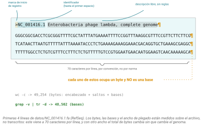
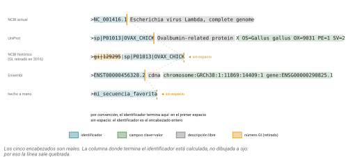
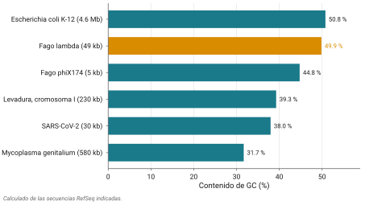
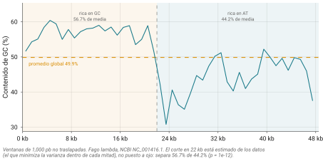

## Idea central

FASTA es el formato más usado de la biología molecular y **no tiene una especificación formal**. Nadie lo estandarizó nunca. Es una costumbre que se salió de control y funcionó.

Ese hecho, que suena a trivia, explica casi todos los problemas que van a tener con archivos de secuencia durante el resto de su carrera. Hoy los vamos a provocar a propósito, para que los reconozcan cuando aparezcan solos.

## Desarrollo

### De dónde salió

En 1985, David Lipman y William Pearson publicaron un programa para buscar proteínas parecidas entre sí, llamado FASTP. En 1988 sacaron una versión mejorada y la llamaron FASTA.

Ese programa necesitaba un formato de entrada, y sus autores inventaron uno sencillo: una línea que empieza con `>` describiendo la secuencia, y luego la secuencia.

O sea que **el formato se llama así por el programa, no al revés**. El programa hace tiempo que dejó de ser el estándar de búsqueda; el formato de entrada que inventó de pasada sigue siendo universal cuarenta años después.

### Lo que nadie especificó

Acá está el punto del capítulo, así que léanlo despacio.

No existe un documento que diga qué es un archivo FASTA válido. No hay un RFC, no hay un comité, no hay una versión 2.0. El NCBI publica *recomendaciones* ("se sugiere que las líneas tengan menos de 80 caracteres"), que no es lo mismo que una especificación.

Lo único que todo el mundo respeta:

- Un registro empieza con una línea que abre con `>`.
- La secuencia va en las líneas siguientes.
- El registro termina cuando aparece otro `>` o se acaba el archivo.

Todo lo demás está en disputa. A qué ancho se cortan las líneas. Qué caracteres se permiten en la secuencia. Qué va en el encabezado y dónde termina el identificador. Si se permiten líneas en blanco adentro de un registro. Si las líneas de comentario que empiezan con `;` siguen siendo legales (lo eran, ya casi nadie las usa). Si el archivo debe terminar con un salto de línea.

Cada base de datos y cada programa resolvió esas preguntas por su cuenta, y no coinciden.

::: callout-box
Una definición operativa que circula entre bioinformáticos, y que es medio broma pero medio cierta: **un archivo FASTA válido es el que el programa FASTA puede leer**.

Como definición formal es un desastre. Como descripción de la realidad es exacta.
:::

### Anatomía de un registro

Vean uno de verdad, del genoma del fago lambda:

```
>NC_001416.1 Escherichia virus Lambda, complete genome
GGGCGGCGACCTCGCGGGTTTTCGCTATTTATGAAAATTTTCCGGTTTAAGGCGTTTCCG
TTCTTCTTCGTCATAACTTAATGTTTTTATTTAAAATACCCTCTGAAAAGAAAGGAAACG
ACAGGTGCTGAAAGCGAGCTTTTTGGCCTCTGTCGTTTCCTTTCTCTGTTTTTGTCCGTG
```

La primera línea es el **encabezado** o *defline*. Después viene la secuencia, cortada cada 60 caracteres.

Y acá está la trampa que va a costarles puntos si no la interiorizan hoy: **esos cortes de línea son caracteres reales dentro del archivo** (@fig-anatomia). No son adorno de presentación. Si cuentan bytes, los están contando. Si cuentan bases, no.

{#fig-anatomia}

Sobre el ancho: 60 caracteres es lo que usa el NCBI y lo que usa UniProt. Otras fuentes usan 70 u 80. Y algunos archivos vienen con la secuencia completa en una sola línea gigante. Los tres son FASTA legítimo, porque nadie especificó nada.

### Los encabezados, que es donde se pone feo

Ustedes ya diseccionaron un encabezado de UniProt con Evelia el semestre pasado, ese con los campos `OS=`, `OX=`, `GN=`, `PE=` y `SV=`. No lo voy a repetir.

Lo que sí quiero es que vean cuántos formatos distintos conviven (@fig-encabezados):

```
>NC_001416.1 Escherichia virus Lambda, complete genome
>sp|P01013|OVAX_CHICK Ovalbumin-related protein X OS=Gallus gallus OX=9031 PE=1 SV=2
>gi|129295|sp|P01013|OVAX_CHICK
>ENST00000456328.2 cdna chromosome:GRCh38:1:11869:14409:1 gene:ENSG00000290825.1
>mi_secuencia_favorita
```

{#fig-encabezados}

El primero es el estilo actual del NCBI: `accession.version`, un espacio, y descripción libre. El segundo es UniProt. El tercero es el estilo histórico del NCBI con barras verticales, que incluía un número GI; el NCBI **dejó de mostrar los GI en 2016** y hoy solo asigna accession con versión. El cuarto es Ensembl, con pares clave:valor donde van a reconocer los biotypes de la sesión 2. El quinto lo escribió alguien a mano un martes.

Pregunta práctica: dónde termina el identificador y dónde empieza la descripción?

La convención mayoritaria es que el identificador es lo que va **hasta el primer espacio**. Es lo que usa `samtools faidx`, por ejemplo. Pero no todos los programas están de acuerdo, y por eso una secuencia puede aparecer con nombres distintos según qué herramienta la lea.

::: callout-box
Hay un chiste viejo que dice que todo bioinformático escribe al menos tres parsers de FASTA en su carrera.

No es del todo chiste. Como el formato no está especificado, cada quien implementa su interpretación, y esas implementaciones difieren en los casos raros. Por eso la recomendación práctica es: **para contar cosas rápido, la terminal; para cualquier cosa seria, una biblioteca**. Biopython y Biostrings ya resolvieron los casos raros por ustedes.
:::

### Extensiones

`.fasta` y `.fa` son genéricas. El NCBI usa un esquema más fino: `.fna` para ácidos nucleicos, `.faa` para aminoácidos, `.ffn` para regiones codificantes en nucleótidos, `.frn` para RNAs. Existen `.fsa`, `.mfa`, `.fas` y otras.

En la práctica se usan cuatro: `.fa`, `.fasta`, `.fna`, `.faa`.

Y una advertencia que suena obvia y no lo es: **la extensión no garantiza nada**. Un archivo llamado `.fna` puede contener proteínas si alguien se equivocó al nombrarlo, y nada lo va a impedir.

Peor todavía: como vieron en la sesión 2, los códigos de ambigüedad IUPAC de nucleótidos son todos letras válidas de aminoácido. Una cadena de DNA llena de N, R e Y es, técnicamente, una proteína legal. Un programa de proteínas la va a procesar sin marcar error y va a devolver basura con formato impecable.

### Multi-FASTA

Un archivo puede tener muchos registros. Así vienen los genomas ensamblados (un registro por cromosoma o contig), los proteomas completos y los conjuntos de genes.

Trae dos consecuencias. Una es buena: pueden procesar mil secuencias con un comando. La otra es que **nada impide que dos registros tengan el mismo identificador**, y cuando eso pasa, cada herramienta reacciona distinto y casi siempre en silencio.

### Dónde se acaba FASTA

Antes de pasar a la práctica, conviene saber qué no puede hacer este formato, porque explica por qué existen los demás que vieron en el mapa de la sesión 2.

FASTA no guarda calidad por base, y por eso existe FASTQ para las lecturas crudas del secuenciador. No guarda coordenadas ni anotación, y por eso existen GFF3 y BED. Es ineficiente para genomas enormes, y por eso existen 2bit y la compresión contra referencia de CRAM. No tiene checksum ni versión adentro. Y no puede representar un grafo, que es la razón por la que los pangenomas necesitaron formatos nuevos como rGFA.

Entonces por qué sigue vivo cuarenta años después?

Porque es texto plano legible por humanos, se procesa con las herramientas de UNIX que ya existían, no necesita ninguna biblioteca, se puede transmitir por una tubería sin cargarlo completo en memoria, y si se corta a la mitad la primera mitad sigue sirviendo. Esa tolerancia es exactamente la misma que produce todos sus problemas. El formato sobrevivió **por** ser flojo, no a pesar de serlo.

## Práctica

Acá es donde pasamos la mayor parte de la sesión. Todos los ejercicios son de terminal, en `ken`.

Empiecen conectándose y armando el espacio:

```bash
ssh usuario@ken.lavis.unam.mx
mkdir -p ~/bioinfo1/sesion05/{datos,resultados}
cd ~/bioinfo1/sesion05
```

::: callout-box
Los archivos de hoy ya están descargados en un directorio compartido de solo lectura. **No los bajen ustedes.**

La razón es concreta: el NCBI limita a tres peticiones por segundo por dirección IP, y `ken` sale a internet con una sola IP para todos. Si treinta personas corren `efetch` al mismo tiempo, el NCBI nos bloquea a todos y la clase se acaba ahí.

Es el mismo principio de convivencia que vimos el primer día. En una máquina compartida, sus acciones tienen consecuencias para los demás.

```bash
cp /datos/cursos/bioinfo1/sesion05/*.fa datos/
ls -lh datos/
```
:::

### Ejercicio 1. Mirar antes de contar

Antes de calcular nada, vean qué tienen.

```bash
head -n 3 datos/lambda.fa
grep -c "^>" datos/lambda.fa
wc -l datos/lambda.fa
```

Por qué el número de líneas no les dice cuántas bases tiene el genoma?

::: {.callout-note collapse="true"}
## Solución

`head -n 3` muestra el encabezado y dos líneas de secuencia. `grep -c "^>"` cuenta registros: debe dar **1**.

`wc -l` da alrededor de **809** líneas. Ese número no es biología: es el resultado de dividir 48,502 bases entre 60 caracteres por línea, más el encabezado. Cambien el ancho de línea y cambia el número, sin que el genoma cambie.

Un detalle sobre el ancla. `grep -c "^>"` cuenta líneas que **empiezan** con `>`. Si escriben `grep -c ">"` sin el acento circunflejo, cuentan cualquier línea que contenga un `>` en cualquier posición, y hay encabezados con `>` a media descripción. En un archivo de una secuencia da igual; en uno de cincuenta mil, no.
:::

### Ejercicio 2. El tamaño del genoma, de tres maneras

Calculen el tamaño de tres formas distintas y expliquen por qué solo una sirve.

```bash
wc -c datos/lambda.fa
wc -l datos/lambda.fa
grep -v "^>" datos/lambda.fa | tr -d '\n' | wc -c
```

::: {.callout-note collapse="true"}
## Solución

`wc -c` cuenta **bytes del archivo**: incluye el encabezado completo y los 808 saltos de línea. Da alrededor de 49,365, un número más grande que el real y peligrosamente parecido, que es lo que lo hace difícil de detectar.

`wc -l` cuenta líneas, que ya vimos que es un artefacto del ancho.

La tercera es la correcta y debe dar **48,502**. Léanla de izquierda a derecha: `grep -v "^>"` tira el encabezado, `tr -d '\n'` borra todos los saltos de línea y deja la secuencia como una sola tira, `wc -c` cuenta lo que quedó.

Ese `tr -d '\n'` es el corazón del asunto. Sin él están contando la decisión de formato de quien generó el archivo, no el genoma.
:::

### Ejercicio 3. Contenido de GC

Cuál es la fracción de bases G o C en lambda?

```bash
gc=$(grep -v "^>" datos/lambda.fa | tr -d '\n' | tr -cd 'GCgc' | wc -c)
tot=$(grep -v "^>" datos/lambda.fa | tr -d '\n' | wc -c)
echo "GC: $gc de $tot"
echo "scale=2; 100*$gc/$tot" | bc
```

Por qué `GCgc` y no `GC`?

::: {.callout-note collapse="true"}
## Solución

`tr -cd 'GCgc'` combina dos banderas: `-d` borra y `-c` complementa el conjunto, así que juntas borran todo lo que no sea G, C, g o c. Debe darles alrededor de **49.9%**.

Sobre las minúsculas: como vieron en la sesión 2, muchos genomas vienen soft-masked, con las regiones repetitivas en minúsculas. Si escriben `tr -cd 'GC'`, están descartando en silencio todas las G y C enmascaradas, y su porcentaje sale mal sin que nada les avise.

Lambda no está enmascarado, así que aquí da igual. La costumbre se agarra ahora, no el día que les toque un genoma de eucarionte.

Una nota de convención: las bases ambiguas (N, R, Y y demás) no cuentan como GC pero sí están en el denominador. Cuando reporten un GC, digan qué convención usaron.
:::

### Ejercicio 4. La composición completa, y un control de calidad

Contar solo GC tira información. Saquen la composición completa.

```bash
grep -v "^>" datos/lambda.fa | tr -d '\n' | fold -w1 | LC_ALL=C sort | uniq -c
```

Y después, un chequeo:

```bash
grep -v "^>" datos/lambda.fa | tr -d 'ACGTNacgtn\n' | wc -c
```

::: {.callout-note collapse="true"}
## Solución

`fold -w1` parte la tira en un carácter por línea, y de ahí `sort | uniq -c` es el mismo idiom de conteo que ya usaron con archivos GTF. Deben ver cuatro renglones, uno por base, y nada más.

El `LC_ALL=C` de enfrente le dice a `sort` que ordene por bytes en lugar de usar las reglas del idioma configurado. Sirve para dos cosas: el orden queda predecible y el comando corre bastante más rápido. Háganlo costumbre en cualquier `sort` sobre archivos grandes.

El segundo comando borra todo lo que **sí** es una base esperada y cuenta lo que sobra. Debe dar **cero**. Cualquier otro número significa que hay caracteres inesperados y merece investigación antes de seguir.

Es el control de calidad más barato que existe y casi nadie lo corre.
:::

### Ejercicio 5. La clínica de archivos rotos

Este es el ejercicio importante del día. En `datos/rotos/` hay cinco archivos FASTA con problemas distintos. Diagnostiquen cada uno.

```bash
ls datos/rotos/
```

Herramientas de diagnóstico que les van a servir:

```bash
cat -A archivo.fa | head          # muestra caracteres invisibles
file archivo.fa                    # adivina el tipo y los finales de línea
grep -n '^$' archivo.fa            # líneas en blanco
grep "^>" archivo.fa | sort | uniq -d   # identificadores repetidos
tail -c 20 archivo.fa | xxd         # cómo termina el archivo
```

::: {.callout-note collapse="true"}
## Solución

**Archivo 1, finales de línea de Windows.** `cat -A` muestra `^M$` al final de cada línea. Ese `^M` es un retorno de carro que cuenta como carácter, así que infla el tamaño en una unidad por línea. Se arregla con `tr -d '\r' < roto1.fa > bueno1.fa` o con `dos2unix`.

**Archivo 2, identificadores repetidos.** `grep "^>" | sort | uniq -d` los muestra. `samtools faidx` se niega a indexarlo; otras herramientas se quedan con el primero, o con el último, o con los dos, en silencio. Se arregla renombrando o con `seqkit rmdup -n`.

**Archivo 3, líneas en blanco adentro de un registro.** `grep -n '^$'` las localiza. Algunos parsers las toman como fin de registro y truncan la secuencia. Se arregla reescribiendo con `seqkit seq`.

**Archivo 4, sin salto de línea final.** `tail -c 20 | xxd` muestra que el último byte no es `0a`. Las herramientas basadas en líneas pueden perder el último registro. Se arregla con `echo >> archivo.fa`.

**Archivo 5, soft-masked.** `grep -v '^>' | grep -c '[acgt]'` encuentra minúsculas. No está roto: está enmascarado. Pero si le calculan GC contando solo mayúsculas, el resultado sale mal. Se arregla siendo explícito, o uniformando con `seqkit seq -u`.

El patrón de los cinco es el mismo: **el archivo se ve bien en pantalla y produce números equivocados**. Ninguna de estas herramientas les va a decir "error". Por eso hay que mirar antes de calcular.
:::

### Ejercicio 6. Linealizar, el truco maestro

En `datos/multi.fa` hay varias secuencias. Saquen una tabla con la longitud de cada una.

Van a descubrir que los comandos del ejercicio 2 ya no sirven, porque `tr -d '\n'` pega todas las secuencias entre sí.

El problema de fondo es que una secuencia ocupa muchas líneas, y las herramientas de UNIX cuentan líneas. Linealizar devuelve la correspondencia entre una línea y una cosa (@fig-linealizar).

{#fig-linealizar}

```bash
awk '/^>/{if(seq)print seq; print; seq=""; next}{seq=seq $0}END{if(seq)print seq}' \
  datos/multi.fa > resultados/multi-lineal.fa

head -n 4 resultados/multi-lineal.fa
```

Con el archivo linealizado, saquen la tabla de longitudes.

::: {.callout-note collapse="true"}
## Solución

El `awk` va acumulando líneas de secuencia en una variable y solo la imprime cuando llega el siguiente encabezado. El resultado tiene exactamente dos líneas por registro: encabezado y secuencia completa.

Con eso, la tabla de longitudes es directa:

```bash
awk '/^>/{name=substr($0,2); next}{print length($0)"\t"name}' \
  resultados/multi-lineal.fa
```

**Este truco es el que desbloquea casi todo lo demás.** Buscar motivos, filtrar por longitud, extraer secuencias, contar por registro: todo se vuelve trivial en un archivo linealizado y es un dolor en uno plegado.

La razón de fondo es que las herramientas de UNIX trabajan por líneas, y el plegado hace que una unidad biológica (una secuencia) ocupe muchas líneas. Linealizar devuelve la correspondencia entre una línea y una cosa.
:::

### Ejercicio 7. La forma adulta

Todo lo anterior sirvió para entender qué hay adentro del archivo. Ahora vean cómo se hace en el trabajo real.

```bash
seqkit stats -a datos/lambda.fa
seqkit stats -a datos/multi.fa
seqkit fx2tab -nl datos/multi.fa
```

Comparen con lo que calcularon a mano.

::: {.callout-note collapse="true"}
## Solución

`seqkit stats -a` da en un renglón el número de secuencias, la suma de longitudes, el mínimo, el promedio, el máximo, el N50 y el GC. Reemplaza los ejercicios 2, 3, 4 y 6 completos.

Y es **correcto por construcción**: no se rompe con secuencias plegadas, ni con minúsculas, ni con líneas en blanco, porque tiene un parser de verdad adentro.

Esto no vuelve inútil lo que hicieron. Al revés. Ahora saben qué está calculando `seqkit` y por qué su respuesta es confiable, y eso es exactamente lo que les va a permitir dudar de él el día que dé un resultado raro.

Otras herramientas del mismo estilo que van a ver: `seqtk` (más chica y rápida), `bioawk` (awk que entiende FASTA), `samtools faidx` (acceso aleatorio por identificador).
:::

### Ejercicio 8. Indexar y extraer

Con un multi-FASTA grande, leer el archivo completo para sacar una secuencia es un desperdicio. Para eso está el índice.

```bash
samtools faidx datos/multi.fa
cat datos/multi.fa.fai
```

Miren las columnas del `.fai`. Después extraigan una secuencia por identificador.

::: {.callout-note collapse="true"}
## Solución

El `.fai` tiene cinco columnas: **nombre, longitud, posición en bytes donde empieza la secuencia, bases por línea, y bytes por línea** (que es lo anterior más el salto de línea).

Con esos cinco números, extraer la base número 5,000 de un cromosoma es aritmética: no hay que leer nada de lo anterior.

Ahora fíjense en la consecuencia. Para que esa aritmética funcione, **todas las líneas de un registro tienen que tener el mismo ancho**. Un archivo con plegado irregular no se puede indexar, y `samtools` se los va a decir.

Ahí tienen la venganza del formato sin especificación: la falta de estándar hace que algunos archivos legítimos no sean indexables.

Para extraer:

```bash
samtools faidx datos/multi.fa NC_001416.1
samtools faidx datos/multi.fa NC_001416.1:1-100    # solo las primeras 100 bases
```

Y una nota sobre compresión: `samtools faidx` puede indexar un FASTA comprimido, pero solo si se comprimió con `bgzip`, no con `gzip` normal. `bgzip` escribe en bloques independientes que permiten saltar; `gzip` obliga a descomprimir desde el principio.
:::

### Ejercicio 9. Comparar genomas

En `datos/` hay seis genomas. Comparen su contenido de GC.

```bash
seqkit stats -a datos/*.fa
```

| Organismo | Accession | Tamaño |
|---|---|---|
| Fago phiX174 | NC_001422.1 | 5,386 pb |
| SARS-CoV-2 | NC_045512.2 | 29,903 pb |
| Fago lambda | NC_001416.1 | 48,502 pb |
| Levadura, cromosoma I | NC_001133.9 | 230,218 pb |
| *Mycoplasma genitalium* | NC_000908.2 | 580,076 pb |
| *E. coli* K-12 | NC_000913.3 | 4,641,652 pb |

::: {.callout-note collapse="true"}
## Solución

El rango va de alrededor de **31.7%** en *Mycoplasma* a **50.8%** en *E. coli*, con SARS-CoV-2 en **38.0%** y lambda cerca de **49.9%** (@fig-gc-genomas).

No es ruido. El contenido de GC es una característica del linaje y correlaciona con historia evolutiva, estilo de vida y tamaño de genoma. *Mycoplasma* tiene un genoma diminuto y muy pobre en GC, que es un patrón común en bacterias con estilo de vida reducido.

Un detalle que van a notar: el archivo de SARS-CoV-2 trae T y no U, aunque el virus es de RNA. Como vieron en la sesión del código genético, las bases de datos de nucleótidos guardan todo como DNA por convención.
:::

{#fig-gc-genomas}

### Ejercicio 10. Lo que el promedio esconde

Lambda tiene 49.9% de GC, casi exactamente la mitad. Ese número invita a pensar que las bases están repartidas parejo.

Calculen el GC en ventanas a lo largo del genoma.

```bash
seqkit sliding -s 1000 -W 1000 datos/lambda.fa \
  | seqkit fx2tab -n -g \
  | awk 'BEGIN{OFS="\t"}{print NR*1000, $NF}' \
  > resultados/gc-ventanas.tsv

head resultados/gc-ventanas.tsv
```

::: {.callout-note collapse="true"}
## Solución

`seqkit sliding -s 1000 -W 1000` corta el genoma en ventanas de mil bases sin traslape (el paso `-s` igual al ancho `-W`), `fx2tab -g` saca el GC de cada una, y el `awk` arma dos columnas: posición y porcentaje.

Lo que aparece es que **la primera mitad del genoma es rica en GC y la segunda es rica en AT**, con un cambio bastante marcado en medio (@fig-ventanas). El promedio del 49.9% no describe ninguna parte del genoma: describe el punto medio entre dos mitades distintas.

Lambda es de hecho un ejemplo clásico en estadística de lo que se llama un punto de cambio, y se usa como caso de prueba para algoritmos de segmentación.

Fíjense en la división de trabajo: la terminal les dio los números en un pipeline de tres comandos, pero para **ver** el patrón hace falta graficar, y eso se hace en R o Python. La terminal es buena para obtener datos y mala para mirarlos.
:::

{#fig-ventanas}

### Ejercicio 11. Procedencia, o cómo cerrar el círculo

En la sesión 1 aprendieron que un resultado que no pueden reproducir no es un resultado, y que los datos crudos no se versionan: se versiona la receta para conseguirlos.

Hoy toca aplicarlo.

Creen un archivo `procedencia.md` que registre, para cada genoma que usaron: el accession, la fecha de descarga, el comando exacto, y el checksum del archivo.

```bash
cd ~/bioinfo1/sesion05
sha256sum datos/*.fa > datos/checksums.sha256
cat datos/checksums.sha256
```

Después armen el `.gitignore`, hagan el commit y suban.

::: {.callout-note collapse="true"}
## Solución

Un `procedencia.md` mínimo:

```markdown
# Sesión 05. Formatos de secuencia

- Autor: (su nombre)
- Fecha: 2026-09-XX
- Máquina: ken.lavis.unam.mx

## Datos
Copiados de /datos/cursos/bioinfo1/sesion05/
Origen original: NCBI, descargados con
`efetch -db nuccore -id <ACCESSION> -format fasta`

| Organismo | Accession | Tamaño verificado |
|---|---|---|
| Fago lambda | NC_001416.1 | 48502 pb |
| ... | ... | ... |

Checksums en datos/checksums.sha256

## Resultados
GC de lambda: 49.9% (24198 de 48502)
Ventanas de GC en resultados/gc-ventanas.tsv
```

Y el `.gitignore`:

```gitignore
datos/*.fa
datos/*.fa.gz
datos/*.fai
```

Después:

```bash
git add procedencia.md datos/checksums.sha256 .gitignore
git add resultados/gc-ventanas.tsv
git commit -m "Sesión 05: composición de seis genomas y ventanas de GC en lambda"
git push
```

Fíjense en qué entra y qué no. Los `.fa` se quedan fuera porque pesan y se pueden volver a bajar. Los checksums sí entran, porque son la prueba de que el archivo que ustedes usaron es exactamente el que cualquiera puede volver a bajar.

En Mac los comandos son `shasum -a 256` y `md5` en lugar de `sha256sum` y `md5sum`.

Un extra que vale la pena conocer: el NCBI publica archivos `md5checksums.txt` junto con sus descargas de genomas ensamblados, así que en esos casos no tienen que confiar en su propio cálculo: pueden verificar contra el de ellos con `md5sum -c`.
:::

## Fuentes {.unnumbered}

- Lipman, D. J. & Pearson, W. R. (1985). Rapid and sensitive protein similarity searches. *Science* 227: 1435-1441. [doi:10.1126/science.2983426](https://doi.org/10.1126/science.2983426)
- Pearson, W. R. & Lipman, D. J. (1988). Improved tools for biological sequence comparison. *PNAS* 85: 2444-2448. [doi:10.1073/pnas.85.8.2444](https://doi.org/10.1073/pnas.85.8.2444)
- NCBI. BLAST Topics: formato FASTA y deflines. <https://blast.ncbi.nlm.nih.gov/doc/blast-topics/>
- NCBI. Sequence identifiers y la eliminación de los números GI (2016). <https://www.ncbi.nlm.nih.gov/genbank/sequenceids/>
- UniProt. FASTA headers. <https://www.uniprot.org/help/fasta-headers>
- Dalke, A. Parsing FASTA files. <http://www.dalkescientific.com/writings/NBN/parsing.html>
- Buffalo, V. (2015). *Bioinformatics Data Skills*. O'Reilly. Capítulo 6, sobre datos y descarga reproducible. <https://vincebuffalo.com/book/>
- Shen, W. et al. (2016). SeqKit: a cross-platform and ultrafast toolkit for FASTA/Q file manipulation. *PLoS ONE* 11(10): e0163962. [doi:10.1371/journal.pone.0163962](https://doi.org/10.1371/journal.pone.0163962)
- Shen, W., Sipos, B. & Zhao, L. (2024). SeqKit2: a Swiss Army knife for sequence and alignment processing. *iMeta* 3: e191. [doi:10.1002/imt2.191](https://doi.org/10.1002/imt2.191)
- Li, H. et al. (2009). The Sequence Alignment/Map format and SAMtools. *Bioinformatics* 25: 2078-2079. [doi:10.1093/bioinformatics/btp352](https://doi.org/10.1093/bioinformatics/btp352)
- Especificación del índice faidx, htslib. <https://github.com/samtools/htslib/blob/develop/faidx.5>
- Cock, P. J. A. et al. (2009). Biopython. *Bioinformatics* 25: 1422-1423. [doi:10.1093/bioinformatics/btp163](https://doi.org/10.1093/bioinformatics/btp163)
- Salgado, H. Introducción a la Bioinformática (LCG, CCG-UNAM Cuernavaca). L4, archivos y formatos. <https://lcg-cursos.github.io/material/introbioinfo/L4-archivos.html>
- Coss, E. Introducción a la Bioinformática (LCG, UNAM). Extracción de información de diversos archivos. <https://eveliacoss.github.io/LCG2025_IntroBioinfo_S1/Anotation_ejercicios.html>
- Vinuesa, P. Curso de AWK y Bash para bioinformática, práctica de parseo de FASTA. <https://vinuesa.github.io/intro2linux/>
- Mastretta-Yanes, A. & Verdugo, R. Introducción a la bioinformática e investigación reproducible. <https://github.com/u-genoma/BioinfinvRepro>