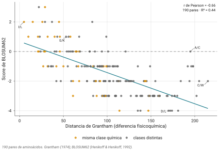
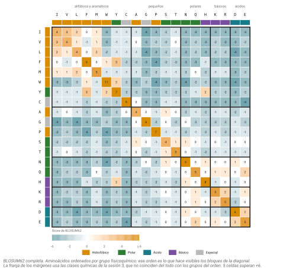
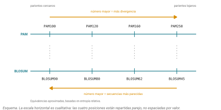
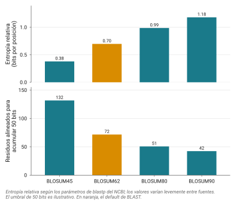

## Idea central

La sesión pasada cerré prometiéndoles que iban a poder explicar de dónde salen los números de una matriz de sustitución. Hoy pago esa deuda.

La respuesta corta es que no son medidas de parecido químico, aunque lo parezcan: son logaritmos de una razón entre dos probabilidades. La respuesta larga ocupa el resto del capítulo, e incluye por qué la matriz más usada del mundo tiene un error de programación que nadie ha querido corregir.

## Desarrollo

### Cobrando la promesa

Terminamos la sesión anterior con un grafo: los veinte aminoácidos conectados cuando un solo cambio de nucleótido lleva de uno a otro, y alrededor de un tercio de esas conexiones caía dentro de una misma clase química, bastante más de lo que le tocaría al azar.

Ese argumento se puede medir, y los números están publicados.

Primero, cuántos pares de aminoácidos son alcanzables por una sola mutación. De los 190 pares posibles entre veinte aminoácidos, **solo 75 se alcanzan cambiando una sola base**. El 39%. El código genético, por su estructura, ya decidió que el 61% de los cambios posibles requieren al menos dos mutaciones, y por lo tanto casi nunca ocurren.

Segundo, si los scores de una matriz correlacionan con la distancia química. En 1974 Grantham construyó una medida de distancia entre aminoácidos combinando tres propiedades de la cadena lateral: composición, polaridad y volumen. Al correlacionar la distancia de Grantham con los scores de BLOSUM62 sobre los 190 pares distintos sale un coeficiente de **−0.66**, negativo porque Grantham mide diferencia y BLOSUM mide parecido (@fig-grantham).

Un aviso sobre esa cifra, porque van a encontrar otras. El coeficiente depende de qué se cuente: si además de los 190 pares se incluyen las veinte identidades, que Grantham pone todas en distancia cero y BLOSUM premia fuerte, sube a −0.75. Si se quitan los pares con cisteína, que Grantham castiga muchísimo, sube a −0.74. Y contra PAM250 en vez de BLOSUM62 da −0.72. Ninguna es la correcta: son medidas de cosas ligeramente distintas, y conviene decir cuál se usó.

{#fig-grantham}

Un trabajo posterior, con datos evolutivos reales de primates, roedores, levadura y *Drosophila*, encuentra correlaciones entre −0.56 y −0.67, dependiendo del linaje. Y la distancia de Grantham por sí sola explica entre el 31 y el 45% de la varianza en qué tan intercambiables son dos aminoácidos. Si se le agrega la estructura del código genético, la explicación sube por encima del 71%.

Ahí está el puente completo. Las dos presiones (accesibilidad mutacional y tolerancia estructural) explican juntas la mayor parte de lo que una matriz de sustitución contiene.

Dicho eso, ahora les voy a estropear la intuición.

### Por qué no basta con contar aciertos

Piensen en cómo puntuarían un alineamiento a mano. Lo obvio es sumar uno por cada posición idéntica y restar uno por cada diferencia.

Ese esquema trata igual estos dos casos:

```
L  contra  I     dos alifáticos casi intercambiables
L  contra  D     un alifático contra un ácido cargado
```

Biológicamente no son lo mismo, ni de lejos. La primera sustitución ocurre todo el tiempo sin que la proteína se inmute. La segunda mete una carga negativa donde había una cadena hidrofóbica, y suele romper algo.

En BLOSUM62, L contra I vale **+2** y L contra D vale **−4**. Esa diferencia de seis puntos es información real que el esquema de acierto y error tira a la basura. La primera es lo que llamamos una **sustitución conservativa**: no es un acierto, pero tampoco es un error del todo.

Necesitamos entonces 400 números, uno por cada par de aminoácidos. La pregunta es de dónde los sacamos.

### La respuesta: log-odds

Acá está el corazón del capítulo, y es una sola fórmula.

$$S(i,j) = \frac{1}{\lambda}\,\log\frac{q_{ij}}{p_i\,p_j}$$

Desármenla por partes.

**$q_{ij}$** es la frecuencia con la que el par $i$ con $j$ aparece alineado en alineamientos que sabemos que son de proteínas homólogas. Es lo que de verdad se observa cuando dos secuencias comparten ancestro.

**$p_i \cdot p_j$** es la frecuencia con la que ese par aparecería si los dos residuos fueran independientes, cada uno apareciendo a su frecuencia de fondo en las proteínas. Es lo que se esperaría por pura casualidad.

El cociente entre ambas compara dos hipótesis: que los residuos están correlacionados porque son homólogos, contra que se toparon por azar. Si el par aparece más de lo esperado, el cociente es mayor que uno.

**El logaritmo** hace algo que parece cosmético y no lo es. Convierte productos en sumas, y por eso **el score de un alineamiento completo es la suma de los scores de cada posición**. Sin esa propiedad, los algoritmos de programación dinámica que van a ver con Jero (Needleman-Wunsch, Smith-Waterman) no funcionarían. La aditividad no es una comodidad: es lo que hace computable el problema.

**$\lambda$** es solo un factor de escala, elegido para poder redondear los 400 números a enteros manejables.

De ahí sale la interpretación del signo. Score positivo significa que el par aparece más seguido que por azar. Score negativo, menos seguido. Nada más.

### Cuatro números que rompen la intuición

Stephen Eddy hizo el ejercicio de recalcular BLOSUM62 desde sus frecuencias, y los resultados son la mejor forma de entender qué mide la matriz.

Con λ = 0.347:

| Par | Frecuencia observada | Frecuencias de fondo | Score | Redondeado |
|---|---|---|---|---|
| L/L | 0.0371 | L = 0.099 | +3.8 | **+4** |
| W/W | 0.0065 | W = 0.013 | +10.5 | **+11** |
| A/L | 0.0044 | A = 0.074, L = 0.099 | −1.47 | **−1** |
| K/E | 0.0041 | K = 0.058, E = 0.054 | +0.76 | **+1** |

Miren los dos primeros renglones. Alinear un triptófano con otro triptófano vale **+11**, casi el triple que alinear dos leucinas. Los dos son la misma sustitución (ninguna, en realidad: es identidad). La diferencia es que el triptófano es raro, así que toparse con dos alineados es mucho más sorprendente que toparse con dos leucinas, que están en todas partes.

Y ahora miren los dos últimos. **A con L, dos hidrofóbicos que uno pensaría compatibles, puntúa negativo. K con E, una lisina positiva contra un glutamato negativo, puntúa positivo.**

Si la matriz midiera parecido químico, eso sería absurdo. No lo mide. Alanina y leucina son tan comunes que se encuentran alineadas por azar con frecuencia, y eso hunde su score. Lisina y glutamato, pese a tener cargas opuestas, se intercambian en proteínas reales más de lo que el azar predice, probablemente porque ambos son residuos de superficie, largos y polares.

Con los 400 números enfrente se ve que estos cuatro casos no son rarezas sueltas sino parte de una estructura (@fig-matriz). Ordenando los aminoácidos por grupo fisicoquímico en vez de alfabéticamente, aparecen bloques cálidos sobre la diagonal —los alifáticos entre sí, los ácidos entre sí, las dos básicas entre sí— y todo lo que cruza de un bloque a otro se enfría. Esa es la correlación de la primera sección, vista como mapa en lugar de como nube de puntos.

{#fig-matriz}

Fíjense también en la diagonal, que son los scores de identidad: no son todos iguales, van de +4 a +11. Y en que la escala está recortada arriba porque el +11 de W/W se sale tanto del resto que, sin recortar, aplanaría toda la figura.

::: callout-box
Guarden esta frase: **una matriz de sustitución mide sorpresa estadística, no parecido bioquímico**.

Que la sorpresa estadística correlacione fuerte con el parecido bioquímico (eso fue la sección anterior, r ≈ −0.66) es un hecho biológico interesante, no la definición. Y correlacionar fuerte no es correlacionar perfecto: con ese coeficiente, la distancia química explica menos de la mitad de la varianza de los scores. Los pares que se salen de la línea, como K con E, son justamente los interesantes.
:::

Un detalle de unidades. BLOSUM62 está escalada en **medios bits**: un score de +4 quiere decir que el par es $2^{4/2} = 4$ veces más probable en homología que por azar. Los enteros se usan por velocidad histórica y porque son legibles.

### PAM: la ruta de Dayhoff

Hay dos maneras de llenar esos 400 números, y las dos familias de matrices que van a encontrarse corresponden a las dos.

La primera es de Margaret Dayhoff, en 1978, en el mismo *Atlas* que mencioné cuando hablamos de la historia de la disciplina.

Su base de datos era, para estándares de hoy, minúscula: **71 grupos de proteínas emparentadas, con 1,572 cambios de aminoácido observados**, todos en secuencias con al menos 85% de identidad.

Esa restricción de identidad alta no es un accidente. Si dos secuencias son casi idénticas, el alineamiento es inequívoco y cada diferencia es casi con certeza **un solo** evento mutacional. En cuanto se alejan, empiezan a acumularse mutaciones múltiples en la misma posición y uno cuenta un cambio donde hubo tres.

Dayhoff definió su unidad así: **1 PAM equivale a una mutación puntual aceptada por cada 100 residuos**. La palabra clave es *aceptada*: fijada por la selección y heredada, no simplemente ocurrida. Una mutación letal ocurre y no se acepta.

De ahí construyó la matriz PAM1, la de 1% de divergencia. Y para las divergencias mayores hizo algo elegante y discutible a partes iguales: **multiplicar la matriz por sí misma**. PAM250 es PAM1 elevada a la potencia 250.

::: callout-box
Ese paso mete un supuesto fuerte, y vale la pena nombrarlo en lugar de esconderlo.

Multiplicar una matriz de transición por sí misma equivale a modelar la evolución como un **proceso de Markov**: lo que pase en un sitio no depende de lo que pasó antes en ese sitio, ni de lo que pasa en los sitios vecinos, y las tasas son iguales en todo momento.

Nada de eso es cierto. El contexto estructural condiciona qué sustituciones se toleran, y las tasas cambian entre linajes. Además, extrapolar de 1% a 250% amplifica cualquier error de estimación de una PAM1 construida con 1,572 observaciones.

Funciona razonablemente bien de todos modos, que es distinto de ser correcto.
:::

Regla direccional que hay que memorizar: **en PAM, número más alto significa más divergencia**. PAM250 es para parientes lejanos.

Vinieron después correcciones con los mismos métodos y muchos más datos. Jones, Taylor y Thornton en 1992 recalcularon todo con **59,190 mutaciones a partir de 16,130 secuencias**, casi cuarenta veces más observaciones que Dayhoff. Gonnet y colaboradores, el mismo año, compararon todas las secuencias contra todas. Y VTML, en 2000, corrigió el sesgo de estimación a distancias grandes usando máxima verosimilitud.

### BLOSUM: la ruta de los Henikoff

La segunda ruta abandona la extrapolación por completo.

Steven y Jorja Henikoff, en 1992, razonaron que si uno quiere una matriz para secuencias lejanas, lo sensato es medirla en secuencias lejanas, no extrapolarla desde cercanas.

Su materia prima fue la base de datos BLOCKS: **unos 2,000 bloques de segmentos alineados, caracterizando más de 500 grupos de proteínas relacionadas**. Un bloque es una región conservada de un alineamiento múltiple, **sin huecos**, o sea las zonas donde el alineamiento no admite discusión.

El procedimiento tiene tres pasos. Contar todos los pares de aminoácidos en cada columna de cada bloque. Convertir esas frecuencias a log-odds. Y en medio, el paso que le da nombre a la matriz.

Ese paso es el **clustering**. Dentro de cada bloque, las secuencias con identidad mayor o igual a cierto umbral se agrupan y cuentan como una sola. Sirve para que una familia muy secuenciada no domine el conteo solo por estar sobre-representada en las bases de datos.

**El umbral es el número del nombre.** BLOSUM62 se construyó agrupando al 62% de identidad.

::: callout-box
Acá está la confusión más común de todo el tema, y va a aparecer en el examen.

**PAM y BLOSUM numeran en direcciones opuestas.**

En PAM, número alto significa más divergencia: PAM250 es para lejanos, PAM120 para cercanos.

En BLOSUM, número alto significa que se entrenó con secuencias más parecidas entre sí: BLOSUM80 es para cercanos, BLOSUM45 para lejanos.

La regla mnemotécnica que me funciona: en BLOSUM el número **es** el porcentaje de identidad del entrenamiento. Más identidad, secuencias más parecidas, matriz para parientes cercanos.

Y no, BLOSUM62 no significa 62% de divergencia. Significa que se agruparon las secuencias con 62% o más de identidad.
:::

Las equivalencias aproximadas entre las dos series, que salen de comparar su contenido de información, dejan ver el cruce de golpe (@fig-direccion):

| PAM | ≈ BLOSUM |
|---|---|
| PAM100 | BLOSUM90 |
| PAM120 | BLOSUM80 |
| PAM160 | BLOSUM62 |
| PAM250 | BLOSUM45 |

{#fig-direccion}

BLOSUM62 acabó siendo el default de BLAST porque en la práctica funciona bien en un rango amplio de divergencias. No hay una razón teórica más profunda que esa.

### El bug que nadie quiso arreglar

Y ahora la historia que hace que este capítulo valga la pena.

En 2008, Styczynski y colaboradores decidieron reconstruir BLOSUM desde cero para verificar el procedimiento. Encontraron un error en el código fuente original: el paso de clustering tenía un problema de redondeo con enteros que asignaba secuencias a un grupo aunque no alcanzaran el umbral especificado.

Ejemplo concreto: para un bloque de 93 residuos, el umbral del 62% debería ser 57.66 residuos idénticos. El redondeo lo movía. Alrededor del **15% de las entradas de la matriz** quedaron distintas de lo que el algoritmo publicado debería haber producido.

O sea que la matriz BLOSUM62 que usa el mundo entero no es la matriz que describe el artículo de 1992.

Tres cosas hacen esto notable, y las digo en el orden en que ellos las dicen. Primero, BLOSUM está en todos lados. Segundo, el error pasó desapercibido **quince años**. Y tercero, la parte que de verdad muerde: **las matrices "incorrectas" funcionan mejor que las "correctas"**.

Publicaron las versiones corregidas, llamadas RBLOSUM. En pruebas de búsqueda, la matriz con el bug rinde mejor.

Qué hizo la comunidad? Esencialmente nada. En 2026, el NCBI sigue distribuyendo la BLOSUM62 original, con bug incluido, como default de blastp. Y la historia siguió complicándose: en 2016 otro grupo propuso una corrección alternativa (CorBLOSUM) alegando mejora, y un análisis de 2018 concluyó que RBLOSUM le sigue ganando.

::: callout-box
Conecten esto con lo que vieron en la primera sesión sobre reproducibilidad.

Reproducibilidad no es solo poder volver a correr un análisis. Es saber **qué código se corrió realmente**, que puede no ser el que describe el artículo. Aquí hubo quince años de resultados publicados usando una matriz que nadie había verificado contra su propia descripción.

Y hay una segunda lección, más incómoda: cuando se descubrió el error, la comunidad no cambió. Porque cambiar habría roto la comparabilidad con dos décadas de literatura, y porque la versión errónea funcionaba mejor. La inercia del software instalado es una fuerza real en la ciencia, y no siempre es irracional.
:::

### Escoger matriz

Cada matriz está sintonizada, implícitamente, a una distancia evolutiva. Altschul lo formalizó en 1991 con el concepto de **entropía relativa**: cuánta información, en bits, aporta en promedio cada posición del alineamiento para distinguir homología de azar.

| Matriz | Entropía (bits/posición) |
|---|---|
| BLOSUM90 | ~1.2 |
| BLOSUM80 | ~0.99 |
| BLOSUM62 | ~0.70 |
| BLOSUM45 | ~0.38 |

La regla práctica sale sola: **usen la matriz que corresponda a la divergencia que esperan**. Si comparan secuencias muy parecidas, una matriz de baja entropía desperdicia señal. Si comparan lejanas, una de alta entropía no las va a encontrar.

Hay una consecuencia menos obvia. Si un alineamiento necesita acumular 50 bits para ser estadísticamente significativo, y BLOSUM45 aporta 0.38 bits por posición, hacen falta **al menos 130 residuos alineados**. Con matrices para parientes lejanos, los alineamientos cortos no alcanzan significancia aunque sean reales. Eso explica frustraciones que van a tener con BLAST.

Puesto en una gráfica, el costo se ve mejor (@fig-entropia): entre los dos extremos de la serie hay un factor de tres. Un dominio de 60 residuos alcanza significancia de sobra con BLOSUM90 y no llega ni cerca con BLOSUM45, y no porque la homología sea menos real, sino porque cada posición aporta un tercio de la información.

{#fig-entropia}

### Huecos

Falta una pieza. Un alineamiento no solo tiene sustituciones: tiene inserciones y deleciones.

El modelo estándar se llama **afín** y cobra dos precios distintos: uno por **abrir** un hueco y otro, más barato, por **extenderlo**. Un hueco de longitud $k$ cuesta apertura más $(k-1)$ veces extensión.

La justificación es biológica. Un solo evento de deleción que se lleva cinco residuos es mucho más probable que cinco deleciones independientes de un residuo cada una. Penalizar fuerte la apertura y suave la extensión favorece la interpretación de "pocos huecos largos" sobre "muchos huecos cortos".

::: callout-box
Un punto de honestidad que los libros suelen saltarse.

Los scores de sustitución se derivan de datos, con el marco log-odds que acabamos de ver. **Las penalizaciones de hueco no.** Se escogen probando qué valores dan buenos resultados en conjuntos de prueba.

Por eso una matriz y sus penalizaciones tienen que elegirse juntas, y por eso BLAST no las deja combinar libremente: rechaza combinaciones para las que no existe estadística validada.

Los defaults de blastp con BLOSUM62 son apertura 11 y extensión 1. Los de `needle` de EMBOSS con la misma matriz son 10 y 0.5.
:::

### Y para nucleótidos?

Mucho más simple, y esa simpleza tiene consecuencias.

Para DNA basta con premio por acierto y castigo por error. Los defaults de blastn son +1 y −2, que están optimizados para secuencias con alrededor de 95% de identidad. El histórico +5/−4 sirve para secuencias mucho más divergentes, cerca del 65%.

Fíjense en que **la proporción entre premio y castigo codifica la divergencia esperada**, igual que el número de una BLOSUM. No es un detalle arbitrario.

Por qué son tan simples: con cuatro letras solo hay dos resultados posibles, acierto o error, sin gradiente intermedio. No existe el equivalente nucleotídico de "sustitución conservativa".

Y esto conecta con la zona crepuscular que vimos la sesión pasada. Por azar, dos secuencias de DNA no relacionadas coinciden en **25%** de las posiciones, una de cada cuatro. Dos proteínas coinciden en **5%**, una de cada veinte. El alfabeto de veinte letras, más las sustituciones conservativas que las matrices sí capturan, empujan mucho más atrás la frontera de lo detectable. Por eso, para homología profunda de regiones codificantes, se compara a nivel de proteína.

### A dónde fue esto después

Sería deshonesto terminar en 1992 como si ahí se hubiera acabado la historia.

El primer límite de una matriz fija es evidente en cuanto se piensa: usa los mismos 400 números para todas las posiciones de la proteína, cuando es obvio que el sitio activo y un asa expuesta no evolucionan igual. La respuesta son las **matrices específicas de posición** (PSSM), que asignan puntuaciones columna por columna a partir de un alineamiento múltiple. PSI-BLAST itera: busca, construye una PSSM con lo que encontró, y vuelve a buscar. Encuentra homólogos que blastp pierde.

Los **HMM de perfil**, que son la base de Pfam y de HMMER, van un paso más allá y modelan también la probabilidad de insertar o borrar en cada posición.

Y en los últimos años el frente se movió a dos lugares nuevos. **Foldseek** codifica la estructura tridimensional como un alfabeto de veinte letras (llamado 3Di) y busca a velocidad de BLAST, aprovechando que ahora existen predicciones estructurales para casi todo. Y los **modelos de lenguaje de proteínas** como ESM-2 generan representaciones vectoriales que capturan relaciones que la secuencia sola no muestra.

En los bancos de prueba de homología remota, estos métodos superan a BLAST por márgenes grandes. Dicho eso, y para calibrar: para el trabajo cotidiano con parientes razonablemente cercanos, blastp con BLOSUM62 sigue siendo lo que todo el mundo usa, por rápido, interpretable y con estadística madura.

Esta última sección es la que más rápido va a envejecer de todo el capítulo. Si la están leyendo dos años después de escrita, verifíquenla.

## Práctica

Los ejercicios 1 a 4 son de papel. Los ejercicios 5 y 6 son de terminal y necesitan que hayan entrado a `ken`; no requieren manejar archivos FASTA, que viene después.

Para los de papel van a necesitar la matriz BLOSUM62 impresa o en pantalla. Está en `ftp.ncbi.nlm.nih.gov/blast/matrices/BLOSUM62`, y también dentro de cualquier instalación de BLAST.

### Ejercicio 1. Calcular un score a mano

Con λ = 0.347, calculen el score de BLOSUM62 para el par K/E, sabiendo que su frecuencia observada es 0.0041 y las frecuencias de fondo son 0.058 para K y 0.054 para E.

Después háganlo para A/L, con frecuencia observada 0.0044 y fondos 0.074 y 0.099.

Expliquen por qué el par de cargas opuestas sale positivo y el par de hidrofóbicos sale negativo.

::: {.callout-note collapse="true"}
## Solución

Para K/E, la frecuencia esperada por azar es 0.058 × 0.054 = 0.00313. Ojo con un detalle: como K/E y E/K son el mismo par observado, el esperado se multiplica por dos, dando 0.00626. El cociente es 0.0041 / 0.00626 = 0.655... y acá el signo depende de cómo se manejen esos factores de dos. Siguiendo el cálculo de Eddy, el resultado es **+0.76**, que redondea a **+1**.

Para A/L, el esperado es mayor porque ambos son residuos comunes: 0.074 × 0.099 × 2 = 0.01465. Observado 0.0044. El cociente es menor que uno, el logaritmo es negativo, y el score sale **−1.47**, redondeado a **−1**.

La explicación es la misma en los dos casos y no tiene que ver con química. Alanina y leucina son tan frecuentes que se topan alineadas por azar constantemente; para que su score fuera positivo tendrían que aparecer juntas todavía más de lo mucho que ya lo hacen por casualidad. Lisina y glutamato son menos comunes, y su intercambio en proteínas reales sí excede lo esperado, probablemente porque ambos son residuos largos y polares de superficie.

Si les da un poco distinto por el factor de dos, no importa: el punto del ejercicio es el signo y su razón, no la tercera cifra.
:::

### Ejercicio 2. Puntuar un alineamiento

Tienen este alineamiento sin huecos:

```
L S P A D K
L T P E E K
```

Calculen el score total con BLOSUM62. Después identifiquen cuál posición aporta más y cuál menos.

::: {.callout-note collapse="true"}
## Solución

Posición por posición, buscando cada par en la matriz:

| Posición | Par | BLOSUM62 |
|---|---|---|
| 1 | L/L | +4 |
| 2 | S/T | +1 |
| 3 | P/P | +7 |
| 4 | A/E | −1 |
| 5 | D/E | +2 |
| 6 | K/K | +5 |
| | **Total** | **+18** |

La suma es directa porque los scores son log-odds, y esa aditividad es exactamente lo que discutimos.

La posición que más aporta es la 3, con la prolina: +7. La prolina es relativamente rara y estructuralmente muy restrictiva (rompe hélices), así que encontrar dos alineadas es informativo.

La que menos aporta es la 4, A/E, con −1. Es la única sustitución que cruza clases químicas.

Fíjense en la 5, D con E: dos ácidos, +2. Y comparen con la 2, S con T: dos polares pequeños, solo +1. Ambas son sustituciones conservativas, pero no valen lo mismo.
:::

### Ejercicio 3. Escoger matriz

Tres situaciones. Digan qué matriz usarían y por qué.

a) Comparar la misma proteína entre humano y chimpancé.
b) Buscar un homólogo bacteriano de una enzima humana.
c) Anotar una proteína de un genoma recién ensamblado, de un organismo sin parientes cercanos secuenciados.

::: {.callout-note collapse="true"}
## Solución

a) **BLOSUM80** o incluso BLOSUM90. Humano y chimpancé comparten alrededor del 99% de identidad en la mayoría de proteínas. Una matriz de alta entropía saca más señal por posición y evita hits espurios.

b) **BLOSUM45** o PAM250. La divergencia entre humano y bacteria es enorme; con BLOSUM80 probablemente no encuentren nada. Prepárense a necesitar alineamientos largos: con 0.38 bits por posición hacen falta más de 130 residuos para alcanzar significancia.

c) **BLOSUM62**, y después PSI-BLAST. BLOSUM62 es el default justo porque funciona decentemente cuando uno no sabe qué esperar. Si no aparece nada, el siguiente paso es un método de perfil, que es más sensible que cualquier matriz fija.

La respuesta general: la matriz codifica una hipótesis sobre qué tan lejos está lo que buscan. Escoger matriz es escoger hipótesis.
:::

### Ejercicio 4. Explicarlo con sus palabras

Un compañero de otra carrera les dice: "entonces BLOSUM62 es para secuencias con 62% de divergencia, y PAM250 para 250%, que no tiene sentido".

Corríjanlo en tres frases.

::: {.callout-note collapse="true"}
## Solución

Algo así:

"El 62 de BLOSUM62 no es divergencia: es el umbral de identidad al que se agruparon las secuencias durante el entrenamiento, así que número más alto significa matriz para secuencias más parecidas. En PAM el número sí es divergencia, medido en mutaciones aceptadas por cada 100 residuos, y sí puede pasar de 100 porque una misma posición puede mutar varias veces a lo largo del tiempo. Las dos series numeran en direcciones opuestas, y eso es una trampa histórica, no una lógica."

La segunda frase es la que más se olvida: PAM250 no significa que el 250% de los residuos cambió, significa 250 eventos de sustitución aceptados por cada 100 posiciones, acumulados. Muchos caen en posiciones que ya habían cambiado antes.
:::

### Ejercicio 5. Ver una matriz por dentro

Entren a `ken` y consigan una copia local de la matriz para leerla.

```bash
cd ~/bioinfo1
mkdir -p sesion04 && cd sesion04
embossdata -fetch EBLOSUM62
head -n 20 EBLOSUM62
```

Busquen en el archivo los valores de L/I, L/D y W/W, y confirmen que coinciden con lo que dice el capítulo.

::: {.callout-note collapse="true"}
## Solución

`embossdata -fetch` copia un archivo de datos de EMBOSS al directorio actual. Si no está EMBOSS instalado, la alternativa es bajarla del NCBI o leerla desde Python con Biopython.

El archivo empieza con líneas de comentario que citan el artículo de Henikoff, y luego viene la matriz con encabezados de fila y columna. Es un archivo de texto plano de unas treinta líneas: **la matriz más usada de la bioinformática cabe en media pantalla**.

Los valores: L/I = **+2**, L/D = **−4**, W/W = **+11**.

Fíjense también en la diagonal, que son los scores de identidad. No son todos iguales: van de +4 a +11, según qué tan raro sea cada aminoácido. Eso es la sorpresa estadística que discutimos, hecha archivo.
:::

### Ejercicio 6. La matriz cambia el alineamiento

Alineen el mismo par de secuencias con dos matrices distintas y comparen.

```bash
cd ~/bioinfo1/sesion04

printf '>seqA\nMKTAYIAKQRQISFVKSHFSRQLEERLGLIEVQ\n' > a.fa
printf '>seqB\nMKTAYVAKQRQITFAKSHFSRQMEERLGLIEIQ\n' > b.fa

needle -asequence a.fa -bsequence b.fa -datafile EBLOSUM80 \
       -gapopen 10 -gapextend 0.5 -outfile con80.needle

needle -asequence a.fa -bsequence b.fa -datafile EBLOSUM45 \
       -gapopen 10 -gapextend 0.5 -outfile con45.needle

grep -E "Score|Identity|Similarity" con80.needle con45.needle
```

::: {.callout-note collapse="true"}
## Solución

Las dos secuencias son bastante parecidas (rondan el 85% de identidad), así que el alineamiento en sí no va a cambiar: no hay ambigüedad que resolver.

Lo que sí cambia es el **score**, y bastante. Con BLOSUM80 sale más alto que con BLOSUM45, porque BLOSUM80 premia más fuerte las identidades y estas secuencias son casi todas identidades.

El punto del ejercicio: el score de un alineamiento **no es una propiedad de las secuencias**. Es una propiedad de las secuencias más la matriz más las penalizaciones. Comparar scores obtenidos con matrices distintas no significa nada, y es un error que se ve publicado.

Si quieren ver la matriz cambiar el alineamiento y no solo el score, hay que usar secuencias más divergentes, donde sí haya ambigüedad sobre dónde poner los huecos. Prueben con un par de proteínas homólogas de humano y de levadura.
:::

## Fuentes {.unnumbered}

- Eddy, S. R. (2004). Where did the BLOSUM62 alignment score matrix come from? *Nature Biotechnology* 22: 1035-1036. [doi:10.1038/nbt0804-1035](https://doi.org/10.1038/nbt0804-1035). La explicación más clara que existe del marco log-odds; de aquí salen los cuatro ejemplos numéricos del capítulo.
- Dayhoff, M. O., Schwartz, R. M. & Orcutt, B. C. (1978). A model of evolutionary change in proteins. En *Atlas of Protein Sequence and Structure*, vol. 5, supl. 3, pp. 345-352. National Biomedical Research Foundation.
- Henikoff, S. & Henikoff, J. G. (1992). Amino acid substitution matrices from protein blocks. *PNAS* 89: 10915-10919. [doi:10.1073/pnas.89.22.10915](https://doi.org/10.1073/pnas.89.22.10915)
- Altschul, S. F. (1991). Amino acid substitution matrices from an information theoretic perspective. *Journal of Molecular Biology* 219: 555-565. [doi:10.1016/0022-2836(91)90193-A](https://doi.org/10.1016/0022-2836(91)90193-A)
- Styczynski, M. P., Jensen, K. L., Rigoutsos, I. & Stephanopoulos, G. (2008). BLOSUM62 miscalculations improve search performance. *Nature Biotechnology* 26: 274-275. [doi:10.1038/nbt0308-274](https://doi.org/10.1038/nbt0308-274)
- Hess, M. et al. (2016). Addressing inaccuracies in BLOSUM computation improves homology search performance. *BMC Bioinformatics* 17: 189. [doi:10.1186/s12859-016-1060-3](https://doi.org/10.1186/s12859-016-1060-3)
- Grantham, R. (1974). Amino acid difference formula to help explain protein evolution. *Science* 185: 862-864. [doi:10.1126/science.185.4154.862](https://doi.org/10.1126/science.185.4154.862)
- Tang, H., Wyckoff, G. J., Lu, J. & Wu, C.-I. (2004). A universal evolutionary index for amino acid changes. *Molecular Biology and Evolution* 21: 1548-1556. [doi:10.1093/molbev/msh158](https://doi.org/10.1093/molbev/msh158)
- Jones, D. T., Taylor, W. R. & Thornton, J. M. (1992). The rapid generation of mutation data matrices from protein sequences. *CABIOS* 8: 275-282. [doi:10.1093/bioinformatics/8.3.275](https://doi.org/10.1093/bioinformatics/8.3.275)
- Karlin, S. & Altschul, S. F. (1990). Methods for assessing the statistical significance of molecular sequence features by using general scoring schemes. *PNAS* 87: 2264-2268. [doi:10.1073/pnas.87.6.2264](https://doi.org/10.1073/pnas.87.6.2264)
- van Kempen, M. et al. (2024). Fast and accurate protein structure search with Foldseek. *Nature Biotechnology* 42: 243-246. [doi:10.1038/s41587-023-01773-0](https://doi.org/10.1038/s41587-023-01773-0)
- Matrices en el NCBI: <https://ftp.ncbi.nlm.nih.gov/blast/matrices/>