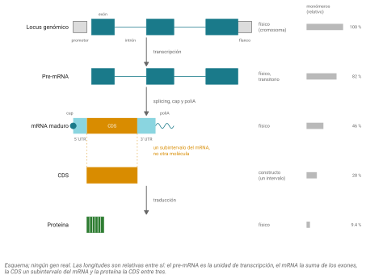
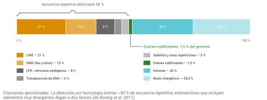
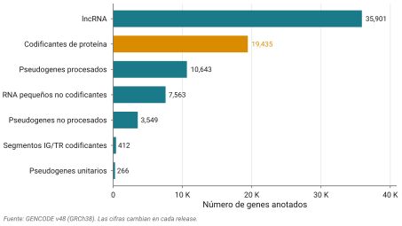
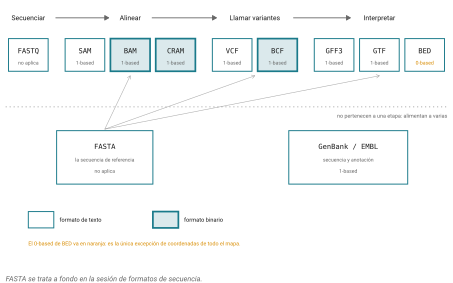
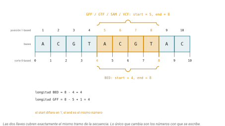

## Idea central

Cuando alguien dice "la secuencia del gen BRCA1", esa frase puede referirse a por lo menos cinco cadenas distintas, de longitudes distintas y en alfabetos distintos. El locus genómico, el transcrito primario, el mRNA maduro, la CDS y la proteína son cinco cosas diferentes, y confundirlas es de los errores más caros que se cometen en este oficio.

Este capítulo es un mapa. Primero, qué tipos de secuencia biológica existen y en qué se distinguen. Después, en qué archivos viven y cómo se distinguen esos archivos entre sí. Al final deben poder ver un header, una línea de anotación o un nombre de archivo y saber qué tienen enfrente antes de correrle nada.

## Desarrollo

### Los tres alfabetos

Todo empieza con tres alfabetos. El DNA usa A, C, G, T. El RNA usa A, C, G, U. Las proteínas usan veinte letras, una por aminoácido canónico.

Acá hay una rareza que confunde a todo el mundo la primera vez. Bajen el genoma del SARS-CoV-2 del NCBI (accession `NC_045512.2`), un virus cuyo material genético es RNA, y el archivo empieza así:

```
ATTAAAGGTTTATACCTTCCCAGGTAACAAACC...
```

Con T, no con U. No es un error de la base de datos. Las bases del INSDC (GenBank, ENA, DDBJ) almacenan por convención la representación en cDNA de la hebra sentido, y esa convención no distingue si la molécula real era DNA o RNA. Además, en la práctica el RNA se retrotranscribe a cDNA antes de secuenciarlo, así que lo que la máquina leyó literalmente fue DNA.

La regla que hay que interiorizar: **la T en el archivo es una convención de almacenamiento, no una afirmación sobre la molécula**. El virus es de RNA. El archivo es su transcripción a DNA.

### Cuando una letra no es una letra

No todas las posiciones de una secuencia se conocen con certeza. Para eso existen los códigos de ambigüedad de la IUPAC, que codifican "una de estas bases" en un solo carácter.

| Código | Bases | De dónde viene | Complemento |
|---|---|---|---|
| R | A, G | puRina | Y |
| Y | C, T | pirimidina (pYrimidine) | R |
| S | C, G | Strong, tres puentes de hidrógeno | S |
| W | A, T | Weak, dos puentes | W |
| K | G, T | Keto | M |
| M | A, C | aMino | K |
| B | C, G, T | no A | V |
| D | A, G, T | no C | H |
| H | A, C, T | no G | D |
| V | A, C, G | no T | B |
| N | A, C, G, T | aNy, cualquiera | N |

Fíjense en la simetría de la última columna, que es elegante y además útil: R y Y son complementarios, K y M también, B con V, D con H, y S, W y N son complementarios de sí mismos. Si escriben una función de complemento reverso que solo maneje ACGT, se les va a romper con la primera secuencia real que traiga una R.

Los van a encontrar en cuatro lugares: cromatogramas de Sanger en posiciones heterocigotas o de mala calidad, secuencias consenso de una población, primers degenerados, y las corridas de N que marcan huecos en un ensamblaje.

Las proteínas tienen sus propios códigos especiales. **B** es Asx (D o N), **Z** es Glx (E o Q), **J** es Xle (L o I) y **X** es cualquier residuo. Aparte están **U**, la selenocisteína, y **O**, la pirrolisina, que son el aminoácido 21 y 22 y sí son residuos reales codificados por codones de paro recodificados.

::: callout-box
Un detalle desagradable. Los once códigos de ambigüedad de nucleótidos son, todos, letras válidas de aminoácido con un significado completamente distinto. R en DNA significa "A o G"; en proteína significa arginina.

La consecuencia práctica es que si le dan una secuencia de DNA a una herramienta de proteínas, no va a marcar error. Va a procesarla en silencio y devolver basura con formato correcto. Antes de correr algo, sepan en qué alfabeto está su secuencia.
:::

### Hebras, complemento reverso y marcos

El DNA es de doble hebra y antiparalelo, y cada hebra se lee 5' a 3'. En un ensamblaje se elige una de las dos como referencia y se le llama hebra positiva o forward; la otra es la negativa o reverse.

Todas las coordenadas de un genoma se dan sobre la hebra positiva. Cuando un gen está en la negativa, la anotación lo marca con `-` y su secuencia real es el complemento reverso del fragmento de referencia.

El complemento reverso son dos operaciones seguidas: complementar cada base (A con T, G con C) y voltear la cadena. Con `ATGC`: el complemento es `TACG`, y volteado queda `GCAT`.

Hay una trampa acá que agarra a todos al menos una vez. En casi todos los formatos de anotación, `start` es siempre la coordenada menor, la de la izquierda, sin importar la hebra. Para un gen en la hebra negativa, ese `start` es en realidad el extremo 3' del gen, y el codón de inicio está en la coordenada mayor. Si extraen la secuencia y la traducen sin complementar y voltear primero, obtienen una proteína inventada.

Sobre marcos de lectura: cada hebra tiene tres, según se empiece a leer en la primera, segunda o tercera base. Seis en total contando ambas hebras. Los ORF y los codones de inicio y paro ya los vieron el semestre pasado, así que solo los retomo acá porque los seis marcos son exactamente lo que explota BLAST cuando compara DNA contra proteína.

### Del locus a la proteína

Esta es la parte conceptual más importante del capítulo.

Un solo gen produce una cascada de secuencias distintas, y hay que tener claro cuáles son moléculas físicas que existen en la célula y cuáles son constructos de base de datos, es decir, intervalos que alguien definió sobre otra secuencia (@fig-jerarquia).

{#fig-jerarquia}

El **locus genómico** es el tramo de cromosoma, con exones, intrones y regiones flanqueantes. El **pre-mRNA** es el transcrito primario, antes del splicing, y es una molécula física pero fugaz. El **mRNA maduro** ya tiene cap, poliA y los intrones fuera, y se compone de 5' UTR, CDS y 3' UTR. La **CDS** no es una molécula aparte: es el subintervalo del mRNA que se traduce, del codón de inicio al de paro. El **cDNA** es la copia en DNA del mRNA, física en el laboratorio y a la vez la forma en que las bases de datos guardan un transcrito. Y la **proteína** es el polipéptido traducido.

Así que "la secuencia del gen" es una frase ambigua. Cuando alguien les pase un FASTA con el nombre de un gen en el header, revisen la longitud y el alfabeto antes de suponer qué es.

### El catálogo

Con esa jerarquía clara, ya se puede recorrer qué tipos de secuencia existen en un genoma.

#### RNAs no codificantes

La mayor parte de lo que se transcribe en un genoma humano no se traduce. Las clases principales:

Los **tRNA** son los adaptadores de la traducción, de unos 76 a 90 nucleótidos. Los **rRNA** son el núcleo estructural del ribosoma. Los **miRNA**, de unos 22 nucleótidos, reprimen transcritos vía el complejo RISC. Los **snRNA** forman el espliceosoma (U1, U2, U4, U5, U6) y los **snoRNA** guían modificaciones químicas del rRNA.

Los **lncRNA** son los transcritos largos no codificantes, definidos operacionalmente como mayores de 200 nucleótidos y sin capacidad codificante aparente. Es una categoría de cajón de sastre, funcionalmente heterogénea, y es también la clase con más genes anotados en el humano hoy.

Después vienen los que no siempre aparecen en la anotación estándar: **siRNA**, **piRNA** (silenciamiento de transposones en línea germinal), **circRNA** (circulares, producto de back-splicing), y varias clases más recientes como los eRNA y los fragmentos derivados de tRNA.

#### Pseudogenes

Un pseudogén es una copia de un gen que perdió la función. Hay tres tipos y la distinción importa.

Un **pseudogén procesado** surgió por retrotransposición de un mRNA maduro: se retrotranscribió y se reinsertó en el genoma. Como venía de un mRNA, **no tiene intrones**, suele traer restos de cola poliA y no tiene promotor. Un **pseudogén no procesado** surgió por duplicación génica seguida de pérdida de función, así que conserva la estructura de exones e intrones. Un **pseudogén unitario** no tiene parálogo funcional: el ortólogo sigue siendo funcional en otras especies y en esta se perdió.

Por qué les importa computacionalmente: un pseudogén procesado es casi idéntico al mRNA del gen padre. Eso significa hits espurios en BLAST, reads que mapean a varios sitios en RNA-seq, y familias génicas infladas. Cuando su mejor hit resulte ser un pseudogén, no es que la búsqueda haya fallado. Es que el genoma trae copias muertas de casi todo.

#### Elementos repetitivos

Una fracción enorme del genoma humano son repeticiones, y saber que están ahí explica la mitad de los problemas de un ensamblaje o un alineamiento (@fig-composicion).

{#fig-composicion}

Los **elementos transponibles** se dividen en cuatro grandes grupos. Los **LINE** son retrotransposones autónomos sin LTR, alrededor del 21% del genoma, y L1 sigue activo. Los **SINE** no son autónomos y su familia dominante es **Alu**, con más de 1.1 millones de copias que ocupan cerca del 10% del genoma, lo cual la vuelve la secuencia más abundante del genoma humano. Los **retrotransposones con LTR**, incluidos los retrovirus endógenos, aportan alrededor del 8%. Los **transposones de DNA** son cerca del 3% y en humano están prácticamente fosilizados.

Aparte están las repeticiones en tándem: el **DNA satélite** de centrómeros (arreglos de megabases del monómero alfa-satélite de 171 pb), los **minisatélites** o VNTR, y los **microsatélites** o STR, de unidades de 1 a 6 pb, que son la base de la identificación forense y de varias enfermedades por expansión.

Sobre qué fracción del genoma es repetitiva, la respuesta honesta es un rango. Con detección estándar por homología se llega a cerca del 50%. Un análisis de de Koning y colaboradores en 2011 argumenta que la cifra real es de al menos dos tercios, porque los elementos muy divergentes ya no se parecen lo suficiente a nada como para ser detectados. Cuando el ensamblaje completo T2T-CHM13 cerró los huecos en 2022, lo que agregó fueron casi 200 megabases de satélite y duplicaciones segmentales.

#### Secuencias reguladoras

Promotores, enhancers, silenciadores y aisladores. Acá hay un punto conceptual que vale más que la lista.

Estas secuencias no tienen un alfabeto propio ni nada que las distinga al mirarlas. Son los mismos nucleótidos que todo lo demás. Lo único que las convierte en "un enhancer" es una anotación: un intervalo de coordenadas que alguien determinó experimentalmente y guardó en un archivo aparte. En un FASTA pelón son invisibles.

Eso vale para casi todo este capítulo. La mayoría de los tipos de secuencia no son propiedades de la cadena de letras. Son afirmaciones sobre esa cadena, guardadas en otro lado.

### De reads a cromosomas

Un ensamblaje se construye por niveles y cada nivel es un tipo de secuencia con su nombre.

Los **reads** son la salida cruda del secuenciador. Los **contigs** son tramos continuos de consenso construidos a partir de reads traslapados, sin huecos. Los **scaffolds** son contigs ordenados y orientados con información de enlace, con huecos de longitud estimada representados como corridas de N. Y los **cromosomas** son scaffolds ya localizados y orientados en secuencias cromosómicas completas.

En un ensamblaje publicado no todo llega a cromosoma. Hay scaffolds **placed** (con posición conocida), **unlocalized** (se sabe el cromosoma pero no dónde), **unplaced** (ni siquiera el cromosoma, los que aparecen como `chrUn_*`), y **alt loci**, que son representaciones alternativas de regiones muy polimórficas como el MHC. GRCh38 trae 261 de estos.

### Qué es y qué no es un genoma de referencia

Acá quiero que se detengan, porque hay una idea equivocada muy extendida.

GRCh38 no es el genoma de una persona. Es un **mosaico haploide** ensamblado a partir de varios donantes. La biblioteca de clones dominante, llamada RP11, aporta el 72.6% de la secuencia y proviene de un solo individuo de ascendencia afroamericana mezclada. Cerca del 93% del total viene de apenas once personas.

Tampoco es "el genoma normal" ni "el genoma correcto". Es un sistema de coordenadas compartido y un sustrato común contra el cual todos comparamos. Nada más, y es muchísimo.

Eso trae un problema con nombre: **sesgo de referencia**. Si todo el mundo alinea contra una sola secuencia mosaico, las variantes y las diferencias estructurales de poblaciones poco representadas en esa referencia se detectan peor. El problema es sistemáticamente peor para poblaciones no europeas.

Hay dos respuestas en curso. Una es completar la referencia: el ensamblaje **T2T-CHM13** de 2022 fue el primero sin huecos, 3.055 gigabases, construido a partir de una mola hidatidiforme que es esencialmente un solo haplotipo.

La otra es abandonar la idea de una sola secuencia. El **pangenoma** representa la variación de muchos individuos como una gráfica, con burbujas donde hay alelos alternativos, en lugar de una cadena lineal. El borrador del Human Pangenome Reference Consortium, publicado en *Nature* en 2023, incluía 47 ensamblajes diploides con fase, o sea 94 haplotipos, y agregaba 119 megabases de secuencia eucromática polimórfica que no estaba en GRCh38. Su segunda entrega, de mayo de 2025, pasó de 200 individuos.

No necesitan usar un pangenoma todavía. Sí necesitan saber que existe, porque es el cambio más grande en curso en esta parte del campo y les va a tocar.

### Enmascaramiento

Las regiones repetitivas causan alineamientos espurios y tiempos de cómputo absurdos, así que es común marcarlas. Hay dos formas.

El **soft-masking** escribe las repeticiones en minúsculas y deja el resto en mayúsculas. La secuencia se conserva íntegra y cada herramienta decide si le hace caso. El **hard-masking** sustituye las repeticiones por N. Ahí la información se destruye.

La trampa vale un ejercicio completo. Si calculan composición de bases sobre un genoma soft-masked contando solo mayúsculas, están descartando en silencio todas las bases enmascaradas y su resultado sale mal sin ningún aviso. Si corren una búsqueda contra un genoma hard-masked, los hits reales que caigan dentro de repeticiones simplemente no aparecen. Y hay herramientas que ignoran el soft-masking por completo: hay un caso documentado de un predictor de genes que, tratando minúsculas como si fueran mayúsculas, reportó unos 68 mil genes donde se esperaban 50 mil.

Antes de contar o buscar cualquier cosa, revisen si su genoma está enmascarado y de qué forma.

### Ponerle nombre a los tipos

Todo lo anterior necesita un vocabulario controlado, porque si cada laboratorio inventa sus etiquetas nada se puede integrar. Hay dos que van a ver.

La **Sequence Ontology** es un vocabulario estructurado de las partes de una anotación genómica y de las relaciones entre ellas: qué es parte de qué, qué es un tipo de qué, qué deriva de qué. Su conexión con la práctica es directa: la tercera columna de un archivo GFF3 tiene que ser un término de la Sequence Ontology, y las relaciones de la ontología definen qué jerarquías de padre e hijo son legales.

Los **biotypes** son la clasificación que usan Ensembl y GENCODE para etiquetar genes y transcritos: `protein_coding`, `lncRNA`, `processed_pseudogene`, `miRNA` y varias decenas más. Es el vocabulario que van a encontrar cuando filtren un GTF, que es justo lo que ya hicieron el semestre pasado.

Con esos biotypes se puede armar el censo del genoma humano (@fig-biotypes).

{#fig-biotypes}

En la versión 48 de GENCODE hay 78,686 genes anotados en el humano. De esos, 19,435 son codificantes de proteína, 35,901 son lncRNA, 14,695 son pseudogenes (10,643 procesados, 3,549 no procesados y 266 unitarios) y 7,563 son RNA no codificantes pequeños. Los transcritos totales son 385,669.

Dos cosas saltan de esa tabla. Los genes codificantes de proteína son minoría: hay casi el doble de genes de lncRNA. Y hay casi tantos pseudogenes como genes codificantes.

::: callout-box
Todos esos números caducan. GENCODE saca release cada pocos meses y las cifras cambian en cada uno, sobre todo las de lncRNA y pseudogenes, que son las categorías donde la anotación sigue moviéndose.

Cuando reporten un número de este tipo, digan de qué release salió. "El genoma humano tiene unos 20 mil genes" sin más es una frase que envejeció y que además esconde que la definición de gen cambió mientras nadie miraba.
:::

### Los formatos: un mapa

Ya sabemos qué tipos de secuencia hay. Falta dónde viven.

Acá vamos a ver el mapa completo, no el manejo detallado. FASTA tiene su propia sesión, con ejercicios en la terminal, así que hoy solo lo ubico en el paisaje (@fig-formatos).

{#fig-formatos}

| Formato | Qué guarda | Texto o binario | Extensión | Índice | Coordenadas |
|---|---|---|---|---|---|
| FASTA | secuencia | texto | .fa .fasta .fna .faa | .fai | no aplica |
| FASTQ | secuencia y calidad | texto (casi siempre .gz) | .fastq .fq | no | no aplica |
| GFF3 | anotación | texto | .gff3 | .tbi | 1-based cerrado |
| GTF | anotación, centrada en gen y transcrito | texto | .gtf | .tbi | 1-based cerrado |
| BED | intervalos | texto | .bed | .tbi | **0-based semiabierto** |
| SAM | alineamientos de reads | texto | .sam | no | 1-based |
| BAM | alineamientos | binario | .bam | .bai .csi | 1-based |
| CRAM | alineamientos contra referencia | binario | .cram | .crai | 1-based |
| VCF | variantes | texto | .vcf | .tbi .csi | 1-based |
| BCF | variantes | binario | .bcf | .csi | 1-based |
| GenBank | secuencia y anotación rica | texto | .gb .gbk | no | 1-based |

Algunas notas sobre los que más confunden.

**FASTQ** guarda cuatro líneas por registro y añade una calidad por base. La calidad es un valor Phred, definido como Q igual a menos diez veces el logaritmo base diez de la probabilidad de error, codificado como un carácter ASCII. El problema histórico es que el archivo **no declara en ninguna parte con qué desplazamiento fue codificado**. Sanger e Illumina 1.8 en adelante usan Phred+33; las versiones viejas de Illumina usaban Phred+64. Darle un archivo con un desplazamiento a una herramienta que asume el otro produce probabilidades de error completamente equivocadas, en silencio, y contamina todo lo que venga después. No lo adivinen: pregúntenlo o detéctenlo con FastQC.

**GFF3 y GTF** comparten las primeras ocho columnas y difieren en la novena. GFF3 usa pares `clave=valor` con `ID` y `Parent` para construir jerarquías arbitrarias tipificadas con la Sequence Ontology. GTF usa `clave "valor"` y está centrado en gen y transcrito. Coexisten porque GTF es más simple y está incrustado en todo el ecosistema de RNA-seq, mientras que GFF3 es más expresivo. Ensembl publica los dos.

**SAM, BAM y CRAM** son el mismo contenido en tres presentaciones. SAM es texto legible, BAM es su equivalente binario comprimido e indexable, y CRAM guarda solo las diferencias respecto a la referencia, lo que lo hace bastante más chico pero lo vuelve inútil si pierden la referencia con la que se construyó.

### La trampa de las coordenadas

Si de este capítulo se llevan una sola cosa práctica, que sea esta.

Hay dos convenciones de coordenadas en uso simultáneo y no coinciden.

**BED es 0-based y semiabierto**. La primera base del cromosoma es la posición 0, y la coordenada final apunta una base después de la última incluida.

**GFF3, GTF, SAM y VCF son 1-based y cerrados**. La primera base es la posición 1 y ambos extremos están incluidos.

Tomen el mismo fragmento, las bases quinta a octava de un cromosoma (@fig-coordenadas):

| Sistema | start | end | Longitud |
|---|---|---|---|
| BED | 4 | 8 | 8 − 4 = 4 |
| GFF, GTF, SAM, VCF | 5 | 8 | 8 − 5 + 1 = 4 |

{#fig-coordenadas}

El start de BED es uno menos. El end es el mismo número. La regla de conversión es corta: `start_GFF = start_BED + 1`, el end no se toca.

Esto es el error silencioso más común de toda la genómica, y es silencioso porque un desfase de una base no rompe nada: produce resultados que se ven perfectamente razonables y están mal. Lo peor es que el UCSC Genome Browser, que inventó BED, guarda internamente en 0-based pero muestra y acepta 1-based en su caja de búsqueda. Dentro de la misma institución conviven las dos.

La defensa práctica es no hacer aritmética de coordenadas a mano entre formatos distintos. Herramientas como `bedtools` y las clases `GRanges` de Bioconductor hacen la conversión solas, y por eso se usan.

### Comprimir e indexar

Último apunte, breve pero necesario.

`gzip` comprime un archivo completo y hay que descomprimirlo en orden desde el principio, así que no permite acceso aleatorio. `bgzip` produce un archivo compatible con gzip pero escrito en bloques independientes, y eso permite saltar directo al bloque que interesa. BAM y BCF usan ese esquema internamente.

`tabix` construye un índice sobre un archivo de texto comprimido con bgzip y ordenado por posición (GFF, BED, VCF) y permite consultar una región sin leer todo. La consecuencia práctica: **tabix necesita bgzip, no gzip**. Un VCF comprimido con gzip normal no se puede indexar, y ese es un mensaje de error que van a ver.

## Práctica

Esta sesión no tiene ejercicios de terminal sobre FASTA; eso viene en la sesión dedicada a formatos. Lo de hoy es leer, interpretar y convertir, que es lo que en la vida real hace uno antes de correr nada.

### Ejercicio 1. Leer una línea de GFF3

```
chr1  HAVANA  mRNA  11869  14409  .  +  .  ID=transcript:ENST00000456328;Parent=gene:ENSG00000290825;biotype=lncRNA
```

Contesten: qué tipo de feature es y de dónde sale ese nombre, en qué hebra está, en qué sistema de coordenadas, cuánto mide, y de qué es hijo.

::: {.callout-note collapse="true"}
## Solución

Es un `mRNA`, y ese nombre no es arbitrario: es un término de la Sequence Ontology, que es lo que exige la tercera columna de GFF3.

Está en la hebra positiva (`+`). Las coordenadas son 1-based cerradas, porque es GFF3, así que la longitud es 14409 − 11869 + 1 = **2,541 pb**.

Su padre es un gen, indicado en `Parent`. Y el `biotype=lncRNA` dice que, a pesar de que el feature se llama `mRNA`, este transcrito no codifica proteína. Ese choque entre el término SO y el biotype confunde, y es real: `mRNA` en la Sequence Ontology se usa como término genérico de transcrito maduro.
:::

### Ejercicio 2. Convertir coordenadas

Un pico de ChIP-seq viene en BED como `chr2  1000  1050`. Exprésenlo en las coordenadas de un GFF y den la longitud calculada en ambos sistemas.

Después, al revés: una variante en VCF está en `chr2` posición 200 a 209. Cómo se escribe en BED?

::: {.callout-note collapse="true"}
## Solución

De BED a GFF: start 1000 + 1 = **1001**, end **1050** sin cambio. Longitud en BED: 1050 − 1000 = 50. Longitud en GFF: 1050 − 1001 + 1 = 50. El mismo fragmento, la misma longitud, escrito distinto.

De GFF a BED: start 200 − 1 = **199**, end **209**. Longitud 209 − 199 = 10, que coincide con 209 − 200 + 1 = 10.

Si alguna vez intersectan un BED con un GFF restando coordenadas a mano, van a perder o ganar una base en cada intervalo. Con miles de intervalos, eso es un resultado distinto.
:::

### Ejercicio 3. Clasificar qué tienen enfrente

Para cada uno, digan qué tipo de secuencia es y cuál es la precaución computacional que traen:

a) Un FASTA que empieza con `>NC_045512.2 Severe acute respiratory syndrome coronavirus 2` y sigue con `ATTAAAGG...`
b) Un header `sp|P38398|BRCA1_HUMAN Breast cancer type 1 susceptibility protein`
c) Una entrada de GENCODE marcada `biotype=processed_pseudogene`
d) Un tramo de genoma que se ve `ATGCatgcatgcATGC`
e) Una secuencia con muchas R, Y y N

::: {.callout-note collapse="true"}
## Solución

a) Genoma de un virus de RNA, almacenado como cDNA. La T es convención, no error. Precaución: si su herramienta espera U, va a haber que convertir.

b) Una proteína curada de Swiss-Prot (el prefijo `sp` lo delata; `tr` sería TrEMBL, sin revisar). Alfabeto de aminoácidos. Precaución: no le apliquen operaciones de nucleótidos.

c) Un pseudogén procesado. No tiene intrones y es casi idéntico al mRNA del gen padre. Precaución: va a producir hits espurios en BLAST y reads multimapeados en RNA-seq.

d) Genoma con soft-masking: las minúsculas son repeticiones marcadas. Precaución: no calculen composición contando solo mayúsculas, y revisen si su herramienta respeta o ignora el enmascaramiento.

e) O es una secuencia consenso, o un primer degenerado, o un tramo de baja calidad. Precaución: cualquier función que solo maneje ACGT la va a procesar mal, y si la manda a una herramienta de proteínas no va a marcar error.
:::

### Ejercicio 4. Hebra y traducción

Un gen está anotado en `chr5`, de la posición 1000 a la 1012, en la hebra negativa. El fragmento de referencia en esas coordenadas es `ATTACCCGGGCAT`.

Cuál es la secuencia real del gen? Dónde está su codón de inicio?

::: {.callout-note collapse="true"}
## Solución

La referencia siempre se da sobre la hebra positiva, así que hay que sacar el complemento reverso.

Complemento de `ATTACCCGGGCAT`: `TAATGGGCCCGTA`. Volteado: `ATGCCCGGGTAAT`.

Esa es la secuencia del gen leída 5' a 3': `ATG CCC GGG TAA T`, con codón de inicio y codón de paro en su sitio. Su `ATG` está al principio de esa cadena, lo que corresponde a la coordenada **1012** de la referencia, no a la 1000. Para un gen en la hebra negativa, el inicio está en la coordenada mayor.

Fíjense en la trampa: el fragmento tal como se lee en la referencia empieza con `ATT`, no con `ATG`. Si lo hubieran traducido sin complementar y voltear, no habrían encontrado ningún marco con sentido.
:::

### Ejercicio 5. Razonar sobre enmascaramiento

Dos compañeros tienen problemas. Uno calculó el contenido de GC de un cromosoma humano y le dio un valor raro, más bajo de lo esperado. Otro corrió una búsqueda de un gen que sabe que está embebido en una región rica en Alu y no obtuvo ningún hit.

Qué le pasó a cada uno?

::: {.callout-note collapse="true"}
## Solución

El primero probablemente usó un genoma soft-masked y contó solo mayúsculas, descartando en silencio todas las bases de regiones repetitivas. Como las repeticiones no tienen la misma composición que el resto del genoma, el resultado se sesga. Solución: contar mayúsculas y minúsculas, o convertir todo a mayúsculas antes.

El segundo usó un genoma hard-masked, donde las repeticiones fueron sustituidas por N. Su gen sigue ahí en el genoma real, pero en ese archivo esa región es una corrida de N contra la que nada alinea. Solución: usar el genoma sin enmascarar o soft-masked.

Los dos casos son el mismo error de fondo: no revisaron en qué estado venía el archivo antes de usarlo.
:::

### Ejercicio 6. Interpretar el censo

Con la tabla de GENCODE v48: son la mayoría los genes codificantes de proteína? Cómo se comparan los pseudogenes con ellos? Y por qué estos números van a ser distintos el año que entra?

::: {.callout-note collapse="true"}
## Solución

No son mayoría. Hay 19,435 genes codificantes contra 35,901 de lncRNA, casi el doble.

Los pseudogenes son 14,695, o sea casi tantos como genes codificantes. El genoma humano trae aproximadamente una copia muerta por cada gen vivo.

Van a cambiar porque la anotación es un proceso en curso, no un hecho consumado. Cada release de GENCODE reclasifica transcritos, fusiona o separa genes, y agrega lncRNA nuevos conforme aparece evidencia. Las categorías que más se mueven son justamente lncRNA y pseudogenes, que son las de definición más blanda.
:::

## Fuentes {.unnumbered}

- Eilbeck, K. et al. (2005). The Sequence Ontology: a tool for the unification of genome annotations. *Genome Biology* 6: R44. [doi:10.1186/gb-2005-6-5-r44](https://doi.org/10.1186/gb-2005-6-5-r44)
- Especificación de GFF3, Sequence Ontology Project. <https://github.com/The-Sequence-Ontology/Specifications/blob/master/gff3.md>
- Especificaciones de SAM, BAM, CRAM, VCF y tabix. <https://samtools.github.io/hts-specs/>
- Li, H. et al. (2009). The Sequence Alignment/Map format and SAMtools. *Bioinformatics* 25(16): 2078-2079. [doi:10.1093/bioinformatics/btp352](https://doi.org/10.1093/bioinformatics/btp352)
- Danecek, P. et al. (2011). The variant call format and VCFtools. *Bioinformatics* 27(15): 2156-2158. [doi:10.1093/bioinformatics/btr330](https://doi.org/10.1093/bioinformatics/btr330)
- Cock, P. J. A. et al. (2010). The Sanger FASTQ file format for sequences with quality scores, and the Solexa/Illumina FASTQ variants. *Nucleic Acids Research* 38(6): 1767-1771. [doi:10.1093/nar/gkp1137](https://doi.org/10.1093/nar/gkp1137)
- Cornish-Bowden, A. (1985). Nomenclature for incompletely specified bases in nucleic acid sequences. *Nucleic Acids Research* 13(9): 3021-3030.
- UCSC Genome Browser, formatos de archivo. <https://genome.ucsc.edu/FAQ/FAQformat.html>
- GENCODE, estadísticas de la versión humana. <https://www.gencodegenes.org/human/stats.html>
- Ensembl, biotypes de genes y transcritos. <https://www.ensembl.org/info/genome/genebuild/biotypes.html>
- Nurk, S. et al. (2022). The complete sequence of a human genome. *Science* 376(6588): 44-53. [doi:10.1126/science.abj6987](https://doi.org/10.1126/science.abj6987)
- Aganezov, S. et al. (2022). A complete reference genome improves analysis of human genetic variation. *Science* 376(6588): eabl3533. [doi:10.1126/science.abl3533](https://doi.org/10.1126/science.abl3533)
- Liao, W. W. et al. (2023). A draft human pangenome reference. *Nature* 617: 312-324. [doi:10.1038/s41586-023-05896-x](https://doi.org/10.1038/s41586-023-05896-x)
- Human Pangenome Reference Consortium. <https://humanpangenome.org>
- de Koning, A. P. J. et al. (2011). Repetitive elements may comprise over two-thirds of the human genome. *PLOS Genetics* 7(12): e1002384. [doi:10.1371/journal.pgen.1002384](https://doi.org/10.1371/journal.pgen.1002384)
- International Human Genome Sequencing Consortium (2001). Initial sequencing and analysis of the human genome. *Nature* 409: 860-921. [doi:10.1038/35057062](https://doi.org/10.1038/35057062)
- Genome Reference Consortium, terminología de ensamblajes. <https://www.ncbi.nlm.nih.gov/grc/help/definitions/>
- Buffalo, V. (2015). *Bioinformatics Data Skills*. O'Reilly. Capítulo 9, sobre rangos y coordenadas. <https://vincebuffalo.com/book/>
- Coss, E. Introducción a la Bioinformática (LCG, UNAM). Anotación y tipos de secuencia. <https://eveliacoss.github.io/LCG2025_IntroBioinfo_S1/Anotation_ejercicios.html>
