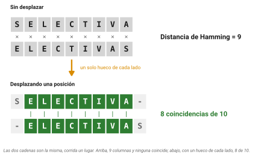
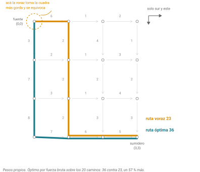
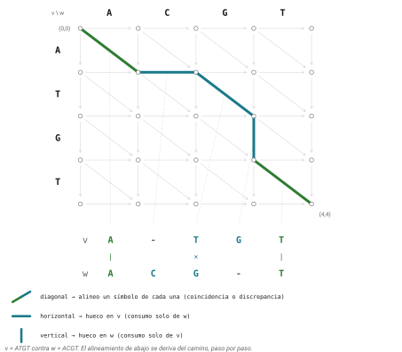
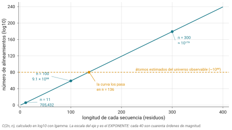
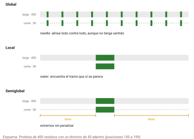

## Idea central

Comparar dos genes suena a una pregunta simple. Convertirla en una pregunta que una computadora pueda contestar cuesta más de lo que parece, y ese trabajo de traducción es el capítulo entero.

Vamos a intentar tres definiciones de "parecido", verlas fallar, y de ese fracaso sacar la definición correcta. Al final vamos a tener un problema perfectamente planteado y una razón muy concreta para no poder resolverlo a mano.

::: callout-box
La secuencia expositiva de este capítulo (de la distancia de Hamming a la subsecuencia común más larga, el problema del turista de Manhattan y el grafo de alineamiento) sigue el enfoque de Phillip Compeau y Pavel Pevzner en *Bioinformatics Algorithms: An Active Learning Approach*, adaptado y reescrito, sin reproducir sus figuras.
:::

## Desarrollo

### Homología no es similitud

Antes de cualquier cosa, un asunto de vocabulario que no es cosmético.

**Similitud** es una medida. Se cuenta: qué fracción de las posiciones coincide entre dos secuencias. Es un número continuo y es un hecho observable.

**Homología** es una afirmación histórica: que dos secuencias descienden de una secuencia ancestral común. No es un número. Es sí o no. Y no se observa nunca, porque el ancestro no está aquí; se infiere.

De ahí sale el error más repetido del campo. La frase "estas dos proteínas son 80% homólogas" no significa nada. Pueden ser 80% idénticas, o 80% similares. Homólogas lo son o no lo son.

En 1987, once autoridades del campo, entre ellas Walter Fitch y Russell Doolittle, publicaron una carta en *Cell* justamente para frenar el mal uso. Su formulación:

> "Homology should mean 'possessing a common evolutionary origin' and in the vast majority of reports should have no other meaning. Evidence for evolutionary homology should be explicitly laid out, making it clear that the proposed relationship is based on the level of observed similarity, the statistical significance of the similarity, and possibly other lines of reasoning."

Fíjense en la estructura lógica que proponen. La similitud es el dato. La homología es la hipótesis. La similitud alta, sobre suficiente longitud y con significancia estadística, es **evidencia a favor** de la homología. No es lo mismo.

### Un alineamiento es una hipótesis

Con eso claro, ya se puede definir bien lo que vamos a construir.

Un **alineamiento** de dos secuencias es una matriz de dos renglones, uno por secuencia, donde se pueden insertar guiones para que ambos queden del mismo largo. Cada columna afirma algo: que esos dos residuos descienden de la misma posición ancestral, o que hubo una inserción o deleción.

O sea que un alineamiento no es un cálculo ni una observación. **Es una hipótesis sobre lo que pasó.** Las secuencias son el dato; el alineamiento es su interpretación.

Y como toda hipótesis, no es única. Las mismas dos secuencias admiten muchísimos alineamientos distintos, y cuál sea "el mejor" depende por completo del sistema de puntuación que elijamos. No existe *el* alineamiento de dos secuencias. Existe *el alineamiento óptimo bajo este esquema de puntuación*, que es una frase mucho más larga y mucho más honesta.

### Intento 1: distancia de Hamming

Empecemos por la definición más obvia de "qué tan parecidas son dos cadenas": contar en cuántas posiciones difieren.

Eso tiene nombre. Es la **distancia de Hamming**, y la definió Richard Hamming en 1950 en los laboratorios Bell, trabajando en códigos que detectaran y corrigieran errores de transmisión.

Aplicada a dos secuencias:

```
SELECTIVA
ELECTIVAS
```

Posición por posición: S contra E, no coincide. E contra L, no coincide. Y así las nueve. **Distancia de Hamming = 9**, el máximo posible. Según esta medida, estas dos secuencias no tienen absolutamente nada que ver.

Sin embargo, son la misma cadena, corrida un lugar.

```
SELECTIVA-
-ELECTIVAS
```

Con un guión de cada lado hay ocho coincidencias de nueve.

El problema de Hamming es que compara rígidamente posición contra posición, y por eso **no puede ver un corrimiento**. Un solo aminoácido insertado al principio desalinea todo lo que sigue y la medida colapsa (@fig-hamming).

{#fig-hamming}

Hay un segundo problema, más básico: Hamming **exige que las dos cadenas midan lo mismo**. Sin noción de hueco, no hay manera de comparar una secuencia de 300 bases con una de 340.

::: callout-box
No tiren la distancia de Hamming a la basura. Es la medida correcta cuando las cadenas ya están alineadas y son de la misma longitud, y ahí se usa todo el tiempo.

El caso más común que van a encontrar es el diseño de códigos de barras para secuenciación multiplexada. Cuando se secuencian treinta muestras juntas, cada una lleva un código de barras corto. Esos códigos se diseñan a propósito para estar lejos entre sí en distancia de Hamming: si el mínimo es 3, un error de secuenciación en una base todavía deja identificar sin ambigüedad de qué muestra venía. Con distancia mínima de 4 o más, prácticamente se elimina la asignación cruzada.

Lo mismo aplica al colapso de UMIs en single cell y transcriptómica espacial y a buscar vecinos de un k-mer. Hamming no es inútil: es la herramienta correcta para otro problema.
:::

### Intento 2: la subcadena común más larga

Segundo intento. Si Hamming falla por rígido, busquemos el bloque idéntico más largo que compartan.

Acá hay que fijar un término que confunde a todos. Una **subcadena** (substring) es un tramo **contiguo**. `LECT` es subcadena de `SELECTIVA` porque aparece de corrido.

El problema con exigir contigüidad es que es demasiado frágil. Una sola mutación puntual en medio de una región idéntica de 200 bases parte la subcadena común en dos de 100. Y dos genes que comparten tres exones conservados separados por intrones divergentes no tienen ninguna subcadena común larga, aunque su parentesco sea evidente.

La contigüidad pide demasiado.

### Intento 3: contar k-mers compartidos

Tercer intento. Si la contigüidad larga es demasiado exigente, contemos palabras cortas: cuántas subcadenas de longitud k comparten las dos secuencias.

Esto ya tolera lo que rompía al intento anterior: las mutaciones dispersas destruyen algunos k-mers pero dejan muchos intactos.

Falla por otro lado. **Contar k-mers tira el orden y la posición.** Dos secuencias pueden compartir muchísimas palabras cortas por pura casualidad, sobre todo si k es chico o si hay regiones de baja complejidad, sin tener ninguna relación. Y sobre todo: un conteo no produce un alineamiento. Nos da un número, no una hipótesis sobre qué corresponde con qué.

::: callout-box
Este tercer intento fracasa como definición de similitud y triunfa como otra cosa.

Los k-mers exactos compartidos son exactamente las **semillas** que usa BLAST, y los mapeadores modernos, para encontrar rápidamente regiones candidatas antes de alinearlas con cuidado. Buscar palabras cortas idénticas es barato; alinear es caro. La estrategia es usar lo barato para decidir dónde vale la pena gastar lo caro.

Lo van a ver a fondo con Jero cuando lleguen a BLAST.
:::

### El juego de emparejar símbolos

Los tres intentos fallaron y de sus fracasos sale la definición correcta.

Hamming falló por no admitir huecos. La subcadena falló por exigir contigüidad. Los k-mers fallaron por perder el orden. Lo que necesitamos entonces es algo que **admita huecos, no exija contigüidad y conserve el orden**.

Piénsenlo como un juego. Tienen las dos secuencias escritas una arriba de otra y avanzan de izquierda a derecha. En cada paso pueden hacer una de tres cosas: emparejar el siguiente símbolo de arriba con el siguiente de abajo, o poner un hueco arriba y avanzar solo abajo, o poner un hueco abajo y avanzar solo arriba. Nunca retroceden.

El objetivo del juego: **emparejar la mayor cantidad posible de símbolos idénticos**.

Jueguen un par de minutos con `SELECTIVA` y `ELECTIVAS` en papel antes de seguir. Van a notar dos cosas: que hay muchas maneras de jugar, y que unas dejan más coincidencias que otras.

Con eso ya tenemos las cuatro cosas que puede haber en una columna de un alineamiento: **coincidencia** (match), **discrepancia** (mismatch), **inserción** e **deleción**.

### Los huecos, y una ambigüedad honesta

Cada columna con guión es una hipótesis sobre un evento de **inserción o deleción**, que en conjunto se llaman **indel**.

Y esa palabra revuelta no es pereza terminológica. Si la secuencia A tiene `ATG` donde B tiene `A--G`, no hay manera de saber, con esas dos secuencias, si B perdió `TG` o si A ganó `TG`. Las dos historias producen exactamente el mismo alineamiento.

Para decidir la dirección hace falta una tercera secuencia, un **grupo externo**, que diga cómo era el estado ancestral. Eso ya es filogenética y no lo vamos a ver acá. Lo que sí les pido es que no lean un alineamiento de dos renglones como si fuera una historia causal. No lo es.

### Intento 4, el bueno: la subsecuencia común más larga

Volvamos al juego. Si el objetivo es emparejar la mayor cantidad de símbolos, qué es exactamente lo que estamos maximizando?

Miren los símbolos emparejados de una jugada cualquiera, leídos en orden. Aparecen en las dos secuencias, en ese orden, aunque no de corrido. Eso tiene nombre.

Una **subsecuencia** de una cadena es lo que queda al borrar cero o más símbolos, **conservando el orden de los que quedan pero sin exigir que sean contiguos**. `ACT` es subsecuencia de `AxCyTz`.

::: callout-box
Subcadena y subsecuencia no son lo mismo y se confunden todo el tiempo.

**Subcadena**: contigua. `LECT` en `SELECTIVA`.
**Subsecuencia**: en orden, no necesariamente contigua. `SELVA` en `SELECTIVA`.

Toda subcadena es una subsecuencia. Al revés no.
:::

Una **subsecuencia común** de dos cadenas es una que aparece en ambas. Y la **subsecuencia común más larga**, que en la literatura verán como **LCS** por sus siglas en inglés, es la más larga de todas.

Ejemplo chico: `mother` y `mutter`. La subsecuencia común más larga es `mter`, de longitud 4.

Ahora la observación que amarra todo: **los símbolos emparejados en un alineamiento forman una subsecuencia común de las dos secuencias**. Y maximizar los símbolos emparejados es, exactamente, encontrar la subsecuencia común más larga.

El juego que inventamos y el problema de la LCS **son el mismo problema**. Lo cual está muy bien, porque el segundo sí está definido con precisión matemática.

Un detalle que vale la pena: la *longitud* de la LCS es única, pero la subsecuencia que la realiza puede no serlo. En `mother` y `mutter` hay dos alineamientos distintos que dan `mter`. El número es único; la hipótesis no.

### Un rodeo por Manhattan

A su vez, el problema de encontrar LCS está emparentado con otro problema interesante.

Un turista está en la esquina noroeste de una cuadrícula de calles y quiere llegar a la esquina sureste. Solo puede caminar **hacia el sur o hacia el este**, nunca al norte ni al oeste. Cada cuadra tiene un número: cuántas atracciones turísticas hay en ella.

**Problema del turista de Manhattan:** encontrar la ruta que acumule más atracciones.

Primera idea, la obvia: en cada esquina, tomar la cuadra que valga más. Eso se llama una estrategia **voraz** (greedy): decidir localmente lo mejor en cada paso.

No funciona. Y no funciona de manera instructiva: una cuadra gorda al principio puede meterlos por un camino que después se queda sin nada, mientras la ruta que empezó modesta desemboca en un tramo lleno de atracciones (@fig-manhattan).

**Lo óptimo localmente no es lo óptimo globalmente.** Escriban eso. Es la razón de fondo por la que hace falta un método más listo que la intuición.

{#fig-manhattan}

Ahora quitémosle Manhattan al problema. Lo que tenemos es un conjunto de puntos conectados por flechas, cada flecha con un número, y buscamos la cadena de flechas de mayor suma total entre dos puntos.

Un **nodo** es un punto. Una **arista dirigida** es una flecha de un nodo a otro, de un solo sentido. El **peso** es el número que carga la arista. Un **camino** es una sucesión de aristas encadenadas. La **fuente** es donde se empieza y el **sumidero** donde se termina. Un **ciclo** es un camino que regresa a donde empezó.

Un **grafo dirigido acíclico**, que se abrevia **DAG** por sus siglas en inglés, es un conjunto de nodos y flechas **sin ningún ciclo**. La condición importa: si hubiera ciclos, uno podría dar vueltas acumulando peso para siempre y el problema no tendría respuesta.

La cuadrícula de Manhattan, cuando sólo se puede ir al sur y al este, es un DAG.

Entonces el problema del turista es un caso particular de este otro:

**Camino más largo en un DAG:** dado un grafo dirigido acíclico con pesos, una fuente y un sumidero, encontrar el camino de mayor peso total entre ellos.

### Alineamiento como camino en un DAG

Volvamos al alineamiento, con el vocabulario nuevo en la mano.

Tomen dos secuencias, v de longitud n y w de longitud m. Armen una cuadrícula de nodos, uno por cada par de índices (i, j) con i de 0 a n y j de 0 a m.

Qué significa el nodo (i, j)? Significa: **ya consumí los primeros i símbolos de v y los primeros j símbolos de w**. El nodo (0,0) es "no he consumido nada" y el nodo (n,m) es "consumí todo".

Ahora las flechas, que son exactamente las tres jugadas del juego:

La **diagonal**, de (i−1, j−1) a (i, j): consumo un símbolo de cada secuencia y los alineo. Es una coincidencia o una discrepancia.

La **horizontal**, de (i, j−1) a (i, j): consumo un símbolo de w solamente. Hueco en v.

La **vertical**, de (i−1, j) a (i, j): consumo un símbolo de v solamente. Hueco en w.

Y acá está lo que quiero que vean (@fig-grafo):

**Cada camino de (0,0) a (n,m) es un alineamiento, y cada alineamiento es un camino.** La correspondencia es exacta en los dos sentidos. Recorrer el grafo es construir el alineamiento; escribir el alineamiento es trazar el camino.

{#fig-grafo}

Falta un paso. Pónganle peso 1 a las diagonales que son coincidencia, y peso 0 a todas las demás flechas. Entonces **el peso total de un camino es el número de coincidencias del alineamiento correspondiente**.

Por lo tanto:

> Encontrar la subsecuencia común más larga de dos secuencias es equivalente a encontrar el camino de mayor peso en el grafo de alineamiento.

Ese es el rodeo por Manhattan pagando. Dedicamos diez minutos a un turista imaginario y resulta que el turista y el alineamiento son el mismo problema.

### Por qué no se puede a mano

Falta una pregunta obvia: ya que sabemos qué buscamos, por qué no probamos todos los caminos y nos quedamos con el mejor?

Porque son demasiados.

El número de alineamientos posibles de dos secuencias de longitud n, donde los huecos nunca se emparejan con huecos, es el coeficiente binomial C(2n, n), que crece aproximadamente como 2²ⁿ dividido entre la raíz de πn (@fig-explosion).

Los números:

| Longitud | Alineamientos posibles |
|---|---|
| 11 | 705,432 |
| 100 | cerca de 10⁵⁹ |
| 300 | del orden de 10¹⁷⁹ |

{#fig-explosion}

Dos secuencias de **once** bases ya tienen más de setecientos mil alineamientos. Dos proteínas de trescientos residuos, que es un tamaño perfectamente ordinario, tienen del orden de 10¹⁷⁹.

Para dimensionarlo: se estima que el universo observable tiene alrededor de 10⁸⁰ átomos. El número de alineamientos de dos proteínas normales es astronómicamente mayor que el número de átomos que existen.

Enumerarlos está fuera de discusión, y no por falta de computadora. Está fuera de discusión para siempre.

### Hasta aquí llego yo

Y ahí es donde los dejo.

Hemos reducido una pregunta biológica difusa, qué tan parecidos son estos dos genes, a un problema perfectamente definido: encontrar el camino de mayor peso en un grafo dirigido acíclico. Sabemos también que no se puede resolver enumerando.

**Cómo** se calcula ese camino de forma eficiente, sin recorrer los 10¹⁷⁹, es un método llamado programación dinámica, y es exactamente donde empieza la sesión del Dr. Miranda con los algoritmos de Needleman-Wunsch y Smith-Waterman. Está resuelto desde 1970, y la solución es más elegante de lo que uno esperaría.

Lo que sigue en este capítulo es lo que ya se puede hacer sin ese algoritmo, más algunas cosas que hay que saber para usarlo con criterio.

### Global, local, semiglobal

Los programas que van a correr en la práctica les van a pedir que elijan un tipo de alineamiento. Tres opciones y sus modos de fallar.

Un alineamiento **global** alinea las dos secuencias de extremo a extremo. Solo tiene sentido cuando se sospecha que son similares **en toda su extensión**. Si fuerzan un alineamiento global de un dominio conservado de 50 aminoácidos contra una proteína de 400, el programa va a regar huecos por todos lados y a enterrar la señal real. En EMBOSS es `needle`.

Un alineamiento **local** busca los tramos de mayor similitud e ignora lo demás. Es lo que quieren para encontrar un dominio dentro de una proteína larga. Su modo de fallar es el opuesto: puede reportar un parecido local fuerte entre secuencias sin ninguna relación, si comparten un motivo o una región de baja complejidad. En EMBOSS es `water`.

Un alineamiento **semiglobal** no penaliza los huecos en los extremos. Sirve cuando se espera que una secuencia esté contenida entera en otra, o para recortar adaptadores, o para solapar lecturas en un ensamblaje.

Las tres, sobre el mismo par de secuencias, se ven así (@fig-tipos). Lo que cambia no es el par: es la pregunta.

{#fig-tipos}

### La puntuación decide el alineamiento

Recuerden lo de la sesión pasada: cada columna se puntúa con una matriz de sustitución, y cada hueco cuesta según su apertura y su extensión.

El punto que quiero remachar: **cambiar el esquema de puntuación no cambia solo el score, cambia el alineamiento mismo**. Las columnas se mueven. Con una penalización de hueco alta el programa prefiere pocos huecos largos; con una baja, muchos cortos. Con BLOSUM45 tolera sustituciones que con BLOSUM80 rechaza.

Eso lo van a comprobar ustedes mismos en el ejercicio 3, y es la razón por la que "el alineamiento" no existe sin decir bajo qué esquema.

### La zona crepuscular

Una advertencia que ya salió cuando hablamos del código genético y que ahora aterriza.

Burkhard Rost analizó más de un millón de alineamientos entre proteínas de estructura conocida en 1999. Sus resultados:

Arriba de 30% de identidad, alrededor del **90%** de los pares resultaron ser homólogos de verdad. Abajo de 25%, **menos del 10%** lo eran. Entre 20 y 35% de identidad está lo que llamó la **zona crepuscular**, donde la señal se vuelve poco confiable: más del 95% de los pares que se "detectaban" ahí tenían estructuras distintas.

Dos lecturas, y las dos importan.

Un alineamiento en la zona crepuscular puede estar mal aunque la homología sea real. Y al revés: no detectar similitud **no es evidencia de que no haya homología**, porque hay homólogos verdaderos por debajo del 10% de identidad que ningún alineamiento de secuencia encuentra.

### Un score alto no significa nada por sí solo

Último concepto antes de la práctica, y es el que más se olvida.

Los programas de alineamiento **siempre** devuelven un alineamiento óptimo y un score, tengan las secuencias relación o no. Denle dos secuencias aleatorias y le va a dar su mejor alineamiento con toda seriedad.

Entonces, cómo saber si un score de 340 es alto?

La respuesta honesta es que no se sabe sin compararlo contra algo. Y hay una forma de generar ese algo sin nada de teoría: **barajar**.

Tomen la secuencia sujeto y revuelvan sus letras al azar, muchas veces. Cada versión barajada conserva la longitud y la composición, pero destruye cualquier orden heredado. Alineen la consulta contra cada barajada y junten los scores. Eso es la distribución de lo que se logra **por puro azar** con secuencias de ese tamaño y esa composición.

Ahora comparen: qué tan a la derecha cae el score real? Si de mil barajadas ninguna se le acerca, el resultado es improbable por azar. Si la mitad lo supera, no tienen nada.

Esa intuición es la base de los valores E de BLAST. Su formalización estadística la van a ver con el Dr. Miranda.

### Dos apuntes rápidos

**Alineamiento consciente de codones.** Si están alineando secuencias codificantes como nucleótidos, cuidado: un indel de longitud que no sea múltiplo de tres **corre el marco de lectura** y arruina todos los codones que siguen, mientras que uno de longitud 3, 6 o 9 lo conserva. Un alineador que no sepa de codones puede meter huecos que parten codones a la mitad. Para eso existen herramientas específicas como MACSE, pal2nal y TranslatorX, que alinean respetando el marco.

**No todo se compara con programación dinámica.** Para mapear millones de lecturas cortas contra un genoma, la programación dinámica es demasiado lenta y se usa un enfoque totalmente distinto, basado en la transformada de Burrows-Wheeler y el índice FM, que es lo que hay adentro de BWA y Bowtie. Es otro problema y otra sesión.

## Práctica

Los ejercicios 1 y 2 son de papel. Del 3 en adelante son de terminal, en `ken`.

```bash
ssh usuario@ken.lavis.unam.mx
mkdir -p ~/bioinfo1/sesion06/{datos,resultados}
cd ~/bioinfo1/sesion06
cp /datos/cursos/bioinfo1/sesion06/*.fasta datos/
```

::: callout-box
`ken` es un nodo de acceso compartido. Los alineamientos de hoy son de secuencias cortas y no pesan nada, pero el ejercicio 6 hace un ciclo de cien alineamientos. Respeten el tamaño: no lo escalen a mil ni lo corran sobre secuencias largas mientras treinta personas están conectadas.
:::

### Ejercicio 1. Romper a Hamming

Calculen a mano la distancia de Hamming entre estas dos cadenas. Después corran una respecto a la otra y cuenten coincidencias.

```
ATGCATGC
TGCATGCA
```

Qué les dice cada una de las dos cuentas?

::: {.callout-note collapse="true"}
## Solución

Posición por posición: A/T, T/G, G/C, C/A, A/T, T/G, G/C, C/A. Ninguna coincide. **Distancia de Hamming = 8**, el máximo posible para cadenas de ocho.

Corriendo una posición:

```
ATGCATGC-
-TGCATGCA
```

Ahora coinciden siete de las nueve columnas.

La conclusión no es que Hamming esté mal calculada. Está bien calculada y es inútil acá. Mide lo que dice medir (diferencias posición contra posición) y esa no es la pregunta biológica, porque las inserciones y deleciones existen.

Prueben también con `ATGCTTA` y `TGCATTAA`, de longitudes 7 y 8: la distancia de Hamming ni siquiera está definida.
:::

### Ejercicio 2. Subsecuencia contra subcadena

Con estas dos cadenas:

```
ATGTTATA
ATCGTCC
```

a) Encuentren la subcadena común más larga.
b) Encuentren una subsecuencia común más larga.
c) Comparen las longitudes y expliquen la diferencia.

::: {.callout-note collapse="true"}
## Solución

a) La **subcadena** común más larga es `AT`, de longitud 2. Contigua en ambas, al inicio. Cualquier tramo más largo se rompe porque las cadenas divergen enseguida.

b) Una **subsecuencia** común más larga es `ATGT` o `ATTA`, de longitud 4, según cómo se recorra. Las letras aparecen en ese orden en ambas cadenas, salteándose otras.

c) La subsecuencia duplica a la subcadena, y va a ser así casi siempre. Exigir contigüidad es una condición mucho más fuerte: una sola diferencia en medio parte una subcadena, mientras que una subsecuencia simplemente la salta.

Por eso el intento 2 fracasó y el intento 4 funcionó. Las secuencias biológicas acumulan cambios dispersos, y la contigüidad no sobrevive a eso.

Noten también que en (b) hay más de una respuesta correcta con la misma longitud. La longitud de la LCS es única; el alineamiento que la realiza, no.
:::

### Ejercicio 3. El mismo par, distintas matrices

Acá comprueban que el esquema de puntuación cambia el alineamiento, no solo el número.

```bash
cd ~/bioinfo1/sesion06

needle -asequence datos/protA.fasta -bsequence datos/protB.fasta \
  -datafile EBLOSUM62 -gapopen 10 -gapextend 0.5 \
  -outfile resultados/b62.needle

needle -asequence datos/protA.fasta -bsequence datos/protB.fasta \
  -datafile EBLOSUM45 -gapopen 10 -gapextend 0.5 \
  -outfile resultados/b45.needle

needle -asequence datos/protA.fasta -bsequence datos/protB.fasta \
  -datafile EBLOSUM62 -gapopen 20 -gapextend 1 \
  -outfile resultados/b62_duro.needle

grep -E "Score|Identity|Similarity|Gaps" resultados/*.needle
```

Después ábranlos y comparen las columnas.

::: {.callout-note collapse="true"}
## Solución

Los tres scores van a ser distintos, lo cual no sorprende: cambiamos la escala.

Lo que hay que ver es otra cosa. **Los alineamientos no son el mismo.** Con BLOSUM45, que está pensada para parientes lejanos, el programa tolera más discrepancias y produce alineamientos más compactos, con menos huecos. Con la penalización de apertura subida a 20, prefiere pocos huecos largos en lugar de varios cortos, y para lograrlo mueve columnas enteras.

Cuenten los huecos en cada salida (la línea `Gaps`) y van a ver la diferencia.

De ahí sale la regla operativa: **comparar scores obtenidos con matrices distintas no significa nada.** El par de secuencias es el mismo; lo que cambió es la hipótesis que le pedimos al programa que evaluara.

Las secuencias del ejercicio están alrededor del 28% de identidad, o sea en plena zona crepuscular. Justo ahí es donde la elección de matriz más pesa, y también donde el alineamiento es menos confiable.
:::

### Ejercicio 4. Global contra local

Aquí `datos/larga.fasta` es una proteína de unos 400 residuos y `datos/dominio.fasta` es un dominio conservado de unos 60 que está adentro de ella.

```bash
needle -asequence datos/larga.fasta -bsequence datos/dominio.fasta \
  -gapopen 10 -gapextend 0.5 -outfile resultados/global.needle

water -asequence datos/larga.fasta -bsequence datos/dominio.fasta \
  -gapopen 10 -gapextend 0.5 -outfile resultados/local.water

grep -E "Length|Identity|Gaps" resultados/global.needle resultados/local.water
```

::: {.callout-note collapse="true"}
## Solución

`needle` reporta un alineamiento de unos 400 de largo, con identidad bajísima y una cantidad enorme de huecos. Está obligado a alinear las dos secuencias completas, así que estira los 60 residuos del dominio a lo largo de toda la proteína rellenando con guiones. El resultado es técnicamente correcto y biológicamente inservible.

`water` reporta un alineamiento de unos 60 de largo, con identidad alta y casi sin huecos, ubicado exactamente donde está el dominio.

La lección: **la pregunta que le hacen al programa está codificada en cuál programa eligen.** `needle` pregunta "cómo se corresponden estas dos secuencias completas". `water` pregunta "dónde se parecen más". Son preguntas distintas y esperar la respuesta de una del otro es el error.
:::

### Ejercicio 5. Matrices de puntos

Un dot plot muestra el parecido entre dos secuencias sin usar ningún algoritmo de alineamiento: pone una secuencia en cada eje y marca dónde coinciden.

```bash
dottup -asequence datos/genomica.fasta -bsequence datos/cdna.fasta \
  -wordsize 10 -graph png -goutfile resultados/exones

dottup -asequence datos/repetida.fasta -bsequence datos/repetida.fasta \
  -wordsize 6 -graph png -goutfile resultados/autocomparacion
```

Interpreten las dos imágenes.

::: {.callout-note collapse="true"}
## Solución

El primero compara una región genómica contra su cDNA. Van a ver **varias diagonales separadas por saltos verticales**. Cada diagonal es un exón; cada salto es un intrón, presente en la secuencia genómica (que `dottup` pone en el eje y, porque es la `-asequence`) y ausente en el cDNA. Sin alinear nada, la estructura del gen se ve a simple vista.

El segundo compara una secuencia consigo misma. La diagonal principal aparece siempre y es trivial (todo coincide consigo mismo). Lo informativo son las **diagonales fuera del centro**, que marcan repeticiones internas.

El diccionario para leer estas figuras:

- Diagonal principal continua: las secuencias son muy parecidas.
- Diagonal interrumpida y desplazada: hubo un indel.
- Diagonales paralelas fuera del centro: repeticiones o duplicaciones.
- Segmento en la antidiagonal: inversión, o sea el complemento reverso.

`dottup` busca coincidencias exactas de palabras y es rápido. `dotmatcher` desliza una ventana y la puntúa con una matriz de sustitución, así que es más sensible para proteínas y más lento. Prueben también:

```bash
dotmatcher -asequence datos/protA.fasta -bsequence datos/protB.fasta \
  -windowsize 10 -threshold 23 -graph png -goutfile resultados/dotmatcher
```
:::

### Ejercicio 6. Barajar para saber qué es alto

Su alineamiento del ejercicio 3 dio cierto score. Es alto?

```bash
shuffleseq -sequence datos/protB.fasta -shuffle 100 \
  -outseq resultados/barajadas.fasta

water -asequence datos/protA.fasta -bsequence resultados/barajadas.fasta \
  -gapopen 10 -gapextend 0.5 -outfile resultados/nulo.water

grep "^# Score" resultados/nulo.water | awk '{print $3}' \
  | sort -n > resultados/scores_nulos.txt

head -3 resultados/scores_nulos.txt
tail -3 resultados/scores_nulos.txt
```

Comparen el score real contra esa distribución.

::: {.callout-note collapse="true"}
## Solución

`shuffleseq` revuelve el orden de los residuos conservando exactamente la longitud y la composición de aminoácidos. Cada barajada es una secuencia con la misma "materia prima" y ninguna historia evolutiva compartida.

Los cien scores del archivo son lo que se logra **por azar** con secuencias de ese tamaño y composición. Si el score real queda muy por encima del máximo de esa lista, el parecido es difícil de explicar por casualidad. Si cae en medio del montón, no tienen nada, por más alto que se vea el número en abstracto.

Fíjense en lo que hicimos: contestamos una pregunta estadística sin una sola fórmula, generando la hipótesis nula a mano.

Dos advertencias. Conservar la composición importa: si una proteína es 30% de serinas, dos proteínas cualesquiera con esa composición se van a parecer algo por fuerza, y barajar respeta eso. Y cien barajadas dan una idea, no un valor p decente; para eso hacen falta miles, o mejor, la teoría que verán con BLAST.
:::

## Fuentes {.unnumbered}

- Compeau, P. & Pevzner, P. *Bioinformatics Algorithms: An Active Learning Approach*. Active Learning Publishers. <https://bioinformaticsalgorithms.org>
- Hamming, R. W. (1950). Error detecting and error correcting codes. *Bell System Technical Journal* 29(2): 147-160. [doi:10.1002/j.1538-7305.1950.tb00463.x](https://doi.org/10.1002/j.1538-7305.1950.tb00463.x)
- Reeck, G. R., de Haën, C., Teller, D. C., Doolittle, R. F., Fitch, W. M., Dickerson, R. E., Chambon, P., McLachlan, A. D., Margoliash, E., Jukes, T. H. & Zuckerkandl, E. (1987). "Homology" in proteins and nucleic acids: a terminology muddle and a way out of it. *Cell* 50(5): 667. [doi:10.1016/0092-8674(87)90322-9](https://doi.org/10.1016/0092-8674(87)90322-9)
- Fitch, W. M. (1970). Distinguishing homologous from analogous proteins. *Systematic Zoology* 19(2): 99-113. [doi:10.2307/2412448](https://doi.org/10.2307/2412448)
- Rost, B. (1999). Twilight zone of protein sequence alignments. *Protein Engineering* 12(2): 85-94. [doi:10.1093/protein/12.2.85](https://doi.org/10.1093/protein/12.2.85)
- Torres, A., Cabada, A. & Nieto, J. J. (2003). An exact formula for the number of alignments between two DNA sequences. *DNA Sequence* 14(6): 427-430. [doi:10.1080/10425170310001617894](https://doi.org/10.1080/10425170310001617894)
- Needleman, S. B. & Wunsch, C. D. (1970). A general method applicable to the search for similarities in the amino acid sequence of two proteins. *Journal of Molecular Biology* 48(3): 443-453. [doi:10.1016/0022-2836(70)90057-4](https://doi.org/10.1016/0022-2836(70)90057-4)
- Smith, T. F. & Waterman, M. S. (1981). Identification of common molecular subsequences. *Journal of Molecular Biology* 147(1): 195-197. [doi:10.1016/0022-2836(81)90087-5](https://doi.org/10.1016/0022-2836(81)90087-5)
- Rice, P., Longden, I. & Bleasby, A. (2000). EMBOSS: The European Molecular Biology Open Software Suite. *Trends in Genetics* 16(6): 276-277. [doi:10.1016/S0168-9525(00)02024-2](https://doi.org/10.1016/S0168-9525(00)02024-2)
- Bystrykh, L. V. (2012). Generalized DNA barcode design based on Hamming codes. *PLoS ONE* 7(5): e36852. [doi:10.1371/journal.pone.0036852](https://doi.org/10.1371/journal.pone.0036852)
- Ranwez, V. et al. (2018). MACSE v2: toolkit for the alignment of coding sequences accounting for frameshifts and stop codons. *Molecular Biology and Evolution* 35(10): 2582-2584. [doi:10.1093/molbev/msy159](https://doi.org/10.1093/molbev/msy159)
- Salgado, H. Introducción a la Bioinformática (LCG, CCG-UNAM Cuernavaca). Alineamientos, con el desarrollo completo de Needleman-Wunsch. <https://lcg-cursos.github.io/material/introbioinfo/alineamientos.html>
- Vinuesa, P. Alineamientos pareados y búsqueda de homólogos mediante BLAST (CCG-UNAM). <https://www.ccg.unam.mx/~vinuesa/>