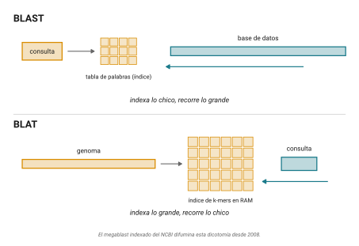
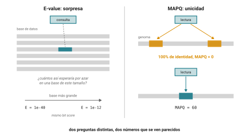

## Idea central

**BLAST no calcula Smith–Waterman, ni lo aproxima como algoritmo. Es otra
cosa: una heurística de seed-and-extend, con un objetivo propio, una
estadística propia y una moneda calibrada, el E-value.**

La sesión pasada cerró con una cuenta. Alinear una query de 300 residuos
contra una base de 200 millones de secuencias por Smith–Waterman son del
orden de 10¹³ operaciones por búsqueda: horas de cómputo. Nadie espera
horas por un BLAST. BLAST es la respuesta a esa cuenta, y la respuesta no
fue hacer Smith–Waterman más rápido, sino cambiar de pregunta.

La pregunta deja de ser "¿cuál es el mejor alineamiento?" y pasa a ser
"¿me sorprendería este parecido por azar?". La segunda tiene una respuesta
rápida y, sobre todo, una respuesta con número. Aprender a leer ese
número, y a saber lo que no dice, es el objetivo de la clase.

Los tres objetivos:

- Que entiendan seed-and-extend y por qué es rápido.
- Que sepan leer un E-value, y sobre todo qué **no** es.
- Que reconozcan los defaults silenciosos y las trampas que cambian el
  resultado sin avisar.

## 1. El problema: la base de datos

Alinear dos secuencias por programación dinámica es un problema resuelto y
barato. El problema no es ése. El problema es alinear una secuencia contra
todas las demás.

Smith–Waterman exacto sigue siendo la referencia de sensibilidad, y se usa
donde la sensibilidad importa más que la velocidad. Pero para la operación
más común de la bioinformática cotidiana, que es tomar una secuencia y
preguntar qué se le parece en el mundo, correr Smith–Waterman contra la
base entera es inviable. Hace falta hacer trampa. BLAST es esa trampa, y
lleva más de tres décadas siendo el idioma común del campo.

## 2. La prehistoria: FASTP y FASTA

BLAST no salió de la nada. Antes estuvieron FASTP (Lipman & Pearson 1985)
y FASTA (Pearson & Lipman 1988), que ya tenían la idea central: en vez de
alinear todo contra todo, primero localizar rápido las regiones
prometedoras y sólo ahí gastar el alineamiento caro.

FASTA parte de identidades exactas cortas (k-tuples) usando una tabla de
búsqueda, reescora las mejores regiones diagonales con una matriz de
sustitución, une regiones compatibles, y termina con un Smith–Waterman
confinado a una banda alrededor de la mejor región. Sigue vivo: el
servidor FASTA de la Universidad de Virginia y SSEARCH (el Smith–Waterman
completo de Pearson) se usan cuando se prioriza la sensibilidad y una
estadística cuidadosa.

BLAST ganó por tres cosas: era alrededor de un orden de magnitud más
rápido, traía un E-value interpretable y calibrado en vez de un score
crudo, y venía con el servidor del NCBI detrás. La diferencia técnica está
en el punto de partida. FASTA arranca de identidades exactas; BLAST
arranca de neighborhood words, palabras que se parecen a la query aunque
no sean idénticas, y encima trae una teoría estadística cerrada que
convierte un score en una probabilidad.

## 3. Seed-and-extend

La mecánica de BLAST son dos pasos: sembrar y extender.

**Sembrar.** BLAST corta la query en palabras de longitud fija $W$ (el
word size). Para proteínas no busca sólo esas palabras exactas: genera
todas las palabras que puntúan al menos $T$ contra alguna palabra de la
query según la matriz de sustitución. Ésas son las neighborhood words.
Una palabra muy común puede no generar ninguna vecina, y una muy
conservada puede generar muchas. Para DNA no hay vecinas: la semilla es
match exacto. Luego escanea la base buscando esas palabras. Cada
coincidencia es un hit.

**Extender.** Cada hit se extiende hacia ambos lados sin gaps, sumando y
restando según la matriz, hasta que el score acumulado cae una cantidad
$X$ por debajo de su máximo (la regla del X-drop). Lo que queda es un
**HSP** (high-scoring segment pair): un par de segmentos de igual longitud
cuyo alineamiento sin gaps es localmente maximal, o sea que no mejora ni
extendiendo ni acortando ambos lados. El HSP de mayor score es el **MSP**
(maximal segment pair), y es lo que BLAST realmente optimiza
(@fig-seed-extend).

{#fig-seed-extend}

Aquí está el trade-off que gobierna todo BLAST, y conviene decirlo con las
dos palancas a la vista:

::: callout-box
Bajar $T$ aumenta la probabilidad de sembrar un HSP verdadero, pero
dispara el número de hits y con eso el tiempo. Subir $W$ acelera pero
pierde homólogos lejanos. Cada default de BLAST es una postura sobre ese
equilibrio, no una verdad.
:::

**La vuelta de 1997.** La primera versión (1990) sólo hacía extensión sin
gaps. Gapped BLAST y PSI-BLAST (Altschul et al. 1997) trajeron tres
cambios. Primero, la heurística de dos hits: exigir dos word hits no
solapados en la misma diagonal, cercanos, antes de disparar la extensión.
Suena a que hace más trabajo, pero permite subir $T$, y por tanto acelerar
el escaneo, sin perder sensibilidad neta, porque la extensión, que es lo
caro, se dispara muchas menos veces (@fig-dos-hits). Segundo, la extensión
con gaps: un Smith–Waterman confinado a una franja alrededor de un par
central de residuos, que produce un solo alineamiento con gaps en vez de
varios HSP sueltos. Tercero, **PSI-BLAST**, del que hablamos en la
sección 6.

{#fig-dos-hits}

## 4. La estadística: el E-value

Ésta es la parte que nadie debería saltarse, porque es lo que separa a
BLAST de "un programa que encuentra parecidos" y lo convierte en un
instrumento de medición.

La ecuación de Karlin–Altschul (1990) es:

$$E = K \cdot m \cdot n \cdot e^{-\lambda S}$$

- $E$ es el **E-value**: el número esperado de alineamientos con score
  $\geq S$ que aparecerían por puro azar en el espacio de búsqueda. Va de 0
  a infinito.
- $m$ es la longitud de la query; $n$, la longitud total de la base. Su
  producto $m \cdot n$ es el espacio de búsqueda.
- $\lambda$ y $K$ son dos constantes que dependen del sistema de scoring
  (la matriz y las frecuencias de fondo). $\lambda$ reescala el score;
  $K$ corrige el tamaño efectivo del espacio. Están tabuladas para cada
  matriz. Para BLOSUM62 andan alrededor de $\lambda \approx 0.27$ y
  $K \approx 0.04$.

### El bit score

El score crudo $S$ no sirve para comparar entre búsquedas: depende de la
matriz. Por eso BLAST reporta también el **bit score**, que absorbe
$\lambda$ y $K$:

$$S' = \frac{\lambda S - \ln K}{\ln 2}, \qquad E = m \cdot n \cdot 2^{-S'}$$

El bit score sí es comparable: dice, en bits, qué tan grande tendría que
ser el espacio de búsqueda para esperar un alineamiento así de bueno por
azar. Un raw score de 200 no significa nada sin la matriz; un bit score de
50 significa lo mismo en cualquier búsqueda.

### Por qué una distribución de valores extremos

Los scores de alineamiento local óptimo entre secuencias aleatorias no se
distribuyen como una normal, sino como una **distribución de valores
extremos** (Gumbel). La razón es que un score local óptimo ya es un
máximo: el mejor de muchísimos alineamientos posibles. La distribución de
un máximo tiene la cola derecha más pesada que una normal. Si uno usara
una normal para calcular la probabilidad de un score alto por azar,
subestimaría gravemente esa probabilidad, y creería significativo lo que
es ruido. La EVD es lo que le da sentido al E-value (@fig-evd).

{#fig-evd}

### El punto que cambia todo: el E-value depende del tamaño de la base

Mírenlo en la ecuación: $E$ es proporcional a $n$. El mismo alineamiento
(mismo score, mismo bit score) obtiene un E-value **mayor**, es decir
menos significativo, si la base crece.

::: callout-box
Fijen un bit score de 40. Entonces $E = m \cdot n \cdot 2^{-40}$. Con una
query de 300 residuos y una base de $10^7$ residuos (el tamaño de `nr` a
principios de los noventa), $E \approx 3 \times 10^{-3}$: significativo.
Con la misma query y una base de $10^{11}$ residuos (el orden de `nr`
contemporáneo), $E \approx 27$: ruido. No cambió ni una letra de la
biología. Cambió el tamaño de la base. El bit score, en cambio, es el
mismo en los dos casos.
:::

{#fig-evalue-base}

Es el mismo mensaje del capítulo pasado, en otra clave: el resultado
depende de un parámetro que ustedes, o el crecimiento de las bases,
eligieron. Un hit reportado como significativo en un paper de 1998 puede
no serlo hoy sin que nada biológico haya cambiado. Al citar un E-value,
citen contra qué base y de qué año.

::: debate
**La estadística de BLAST no está probada para gaps.**

La teoría de Karlin–Altschul está demostrada rigurosamente sólo para
alineamientos locales **sin** gaps. Para alineamientos con gaps, que son
los que BLAST reporta desde 1997, no existe demostración analítica:
$\lambda$ y $K$ se estiman **empíricamente**, alineando secuencias
aleatorias y ajustando la distribución de valores extremos a los
resultados. Casi nadie que usa BLAST a diario lo sabe. No invalida nada,
porque la estimación empírica es sólida y está calibrada, pero conviene
saber que el número más autoritario de la bioinformática descansa, en su
caso más usado, sobre una simulación y no sobre un teorema.
:::

## 5. Lo que un E-value no es

Casi todos los errores con BLAST son errores de lectura del E-value.

- **No es un porcentaje de identidad.** Son cosas distintas. Se puede
  tener 99% de identidad sobre 20 residuos y un E-value pésimo.
- **No es la probabilidad de que el hit esté biológicamente equivocado.**
  Un E-value bajo dice "improbable por azar", no "es homólogo" y mucho
  menos "es ortólogo". La homología es una inferencia biológica que el
  E-value no hace por ustedes.
- **No es un p-value.** Están relacionados por $p = 1 - e^{-E}$, y para $E$
  chico ($E \lesssim 0.1$) se cumple $p \approx E$. Pero el p-value es una
  probabilidad (entre 0 y 1) y el E-value es un conteo esperado, que puede
  ser mayor que 1.

Y una cosa más que no se ve en el E-value: la **cobertura**. Un hit con
90% de identidad sobre 20 residuos de una query de 400 casi no dice nada.
La identidad sin la fracción de la query que se alineó (`qcovs`) es
engañosa. En la práctica se enseñan las dos, siempre juntas.

## 6. Los sabores de BLAST

BLAST es una familia de programas. La primera decisión es qué se traduce:

| Programa | Query | Base | Traduce | Uso típico |
|---|---|---|---|---|
| `blastn`  | nucleótido | nucleótido | no | DNA vs DNA |
| `blastp`  | proteína | proteína | no | proteína vs proteína |
| `blastx`  | nucleótido | proteína | la query (6 marcos) | anotar ORFs o reads |
| `tblastn` | proteína | nucleótido | la base (6 marcos) | buscar en genomas sin anotar |
| `tblastx` | nucleótido | nucleótido | ambos (36 marcos) | comparar regiones sin anotar |
| `dc-megablast` | nucleótido | nucleótido | no | codificantes divergentes (semillas no contiguas) |
| `deltablast` | proteína | proteína | no | perfil inicial desde dominios conservados (CDD) |
| PHI-BLAST | proteína | proteína | no | sólo hits que contienen un patrón dado |

: {tbl-colwidths="[16,20,20,24,20]"}

::: mito
**"Yo sólo hago un `blastn`."**

No: casi seguro corren **megablast** sin saberlo. `megablast` (word size
28) es el default tanto de la web de nucleótidos del NCBI como del comando
`blastn`. Está optimizado para secuencias muy parecidas, intraespecie, y
por su word size grande **pierde homólogos lejanos**. El `blastn` de word
size 11, el que sirve para comparar entre especies, hay que pedirlo
explícitamente con `-task blastn`. Es el default silencioso más caro de la
bioinformática cotidiana: alguien busca el ortólogo de otra especie, corre
"un blastn", y no lo ve.
:::

Del lado de los perfiles, el que hay que conocer es **PSI-BLAST**: hace
un blastp, construye una matriz de scoring específica de posición (PSSM)
con los hits significativos, y vuelve a buscar con ese perfil. Itera.
Encuentra parecidos débiles que un blastp de una sola pasada no ve.

::: callout-box
El peligro de PSI-BLAST es la **deriva de perfil** (profile drift): un
falso positivo que entra en la iteración 2 contamina el perfil y
arrastra más falsos positivos en las rondas siguientes. Se controla
mirando qué entra en cada ronda.
:::

## 7. Lo que vino después

Treinta años después, BLAST ya no es la única opción, y para cierto tipo
de trabajo tampoco es la mejor.

::: consenso
**DIAMOND y MMseqs2.**

Para búsqueda de proteínas a escala, BLAST dejó de ser la herramienta de
producción. **DIAMOND** (Buchfink et al. 2015, 2021) usa doble indexado,
spaced seeds y un alfabeto de aminoácidos reducido; en sus modos sensibles
iguala la sensibilidad de BLASTP con dos a cuatro órdenes de magnitud
menos de tiempo. **MMseqs2** (Steinegger & Söding 2017) usa un prefiltro
de k-mers que descarta la enorme mayoría de las secuencias antes de
alinear, y alcanza sensibilidades de PSI-BLAST cientos de veces más
rápido. Los MSA de AlphaFold y ColabFold se generan con MMseqs2, no con
BLAST.

Los números exactos de aceleración varían muchísimo según versión y modo.
El "20,000×" de DIAMOND es de su modo rápido de 2015, no de sus modos
sensibles. Cítenlos siempre con versión y modo, nunca sueltos.
:::

{#fig-velocidad}

La postura para la clase, sin diplomacia: para una consulta puntual, una
query contra `nr` en la web, BLAST sigue siendo el default correcto, por
interpretabilidad, E-values calibrados y el ecosistema del NCBI. Para
trabajo a escala (proteomas completos, metagenómica, clustering del
universo de proteínas) BLAST ya no es la elección razonable en 2026:
DIAMOND para proteínas y traducido, MMseqs2 para búsqueda y clustering
masivos. Que el propio paper de DIAMOND llame a BLASTP "el estándar de
oro" reconoce que BLAST sigue siendo la referencia de **sensibilidad**, no
de **velocidad**. Enséñenlo como el idioma común y la referencia
conceptual; úsenlo, a escala, con criterio.

Y cuando la señal de secuencia se agota del todo, en la twilight zone
por debajo de ~25% de identidad donde ninguna semilla sobrevive, la
búsqueda deja de ser por secuencia y pasa a ser por estructura. Eso ya
no es una mejora de BLAST: es cambiar de alfabeto, y lo vemos al final
de este capítulo.

## 8. BLAT: la misma idea, al revés

BLAST resuelve un problema. BLAT resuelve otro, y la diferencia está en
una sola decisión de diseño.

### 8.1 Qué se indexa

Vuelvan a lo que hace BLAST. Toma la consulta, la parte en palabras de
tamaño W, arma con ellas y sus vecinas una tabla de búsqueda, y después
**hace pasar la base de datos entera** por esa tabla buscando aciertos.

Jim Kent, en 2002, invirtió el arreglo. En sus palabras:

> "Where BLAST builds an index of the query sequence and then scans
> linearly through the database, BLAT builds an index of the database
> and then scans linearly through the query sequence."

BLAT indexa **el genoma**, lo mantiene en memoria, y hace pasar la
consulta por ahí (@fig-indexado).

{#fig-indexado}

Suena a un detalle de implementación y no lo es. Cambia por completo
para qué sirve cada herramienta.

Si indexan la consulta, pueden buscar contra cualquier base de datos,
tan grande como quieran, sin preparar nada. Es lo que uno quiere cuando
pregunta "¿qué hay en el mundo que se parezca a esto?".

Si indexan la base, pagan una vez por construir el índice y después
cada consulta es casi instantánea. Es lo que uno quiere cuando va a
hacer **muchas** preguntas contra **el mismo** genoma.

::: callout-box
Una honestidad sobre el contraste, porque la frase de Kent es de 2002 y
BLAST cambió.

BLAST **también** puede indexar la base hoy. El NCBI publicó
`makembindex` en 2008 y el megablast indexado es lo que corre por
debajo cuando uno busca contra un solo genoma en la web.

Entonces la dicotomía limpia es una simplificación didáctica: era
literalmente cierta como diseño original, y hoy tiene excepciones. Lo
que sigue siendo cierto es la consecuencia: BLAT asume alta identidad y
BLAST no.
:::

### 8.2 Para qué se construyó

BLAT no nació de una idea elegante. Nació de una fecha límite.

Kent estaba en la UCSC en 2000, con el borrador del genoma humano por
ensamblarse y la necesidad de colocar tres millones de ESTs y trece
millones de lecturas de ratón sobre él, en ciclos de dos semanas por
ensamblado.

Eso define todas sus decisiones. El índice guarda los k-mers no
traslapados del genoma, con tamaño de tesela 11 por defecto para DNA, y
vive en RAM. Los k-mers demasiado frecuentes se excluyen del índice
mediante un archivo de teselas sobreusadas, que es el equivalente a
nivel de índice del enmascaramiento de baja complejidad que ya conocen.

Y el diseño apunta a un caso concreto: **secuencias de 95% de identidad
o más, de longitud mayor a 40**. Fuera de esa ventana, BLAT no
encuentra nada.

Esa limitación no es un defecto. Es lo que compra la velocidad. Colocar
un mRNA humano sobre el genoma humano es un problema de alta identidad
por definición, y suponerlo permite descartar casi todo el espacio de
búsqueda de inmediato.

### 8.3 Coser exones

Hay una cosa que BLAT hace y BLAST no, y que sale directo de su caso de
uso.

Cuando se coloca un cDNA sobre el genoma, el cDNA no tiene intrones y
el genoma sí. El alineamiento correcto no es un bloque continuo: son
varios bloques separados por huecos enormes, uno por exón.

BLAT agrupa los aciertos que caen en la misma diagonal, los alinea por
separado, y después los **cose** con programación dinámica, ajustando
los bordes de los huecos grandes a sitios canónicos de splicing.

O sea que BLAT no solo encuentra dónde está el gen: reconstruye su
estructura de exones. Si en la sesión 11 vieron un dot plot de genómico
contra cDNA con sus diagonales separadas, esto es la versión
algorítmica de esa figura.

Su formato de salida se llama **PSL**, y es tabular con los bloques del
alineamiento en columnas propias.

### 8.4 Dónde está BLAT en 2026

Sigue vivo y sigue mantenido por la UCSC, que publica binarios frescos.
Es lo que corre cuando uno busca una secuencia en el genome browser.

Pero es una herramienta de nicho. Para mapeo masivo de lecturas cortas
perdió contra BWA y Bowtie hace más de una década; para alineamiento de
lecturas largas y con splicing, minimap2 lo desplazó.

Su nicho actual es exactamente el que Kent construyó: colocar
interactivamente una secuencia sobre un genoma de la misma especie, con
alta identidad. Ahí no tiene rival cómodo.

::: callout-box
**Semillas espaciadas, en un párrafo.**

BLAST busca semillas de once bases consecutivas. PatternHunter (Ma,
Tromp y Li, 2002) notó que no tienen por qué ser consecutivas: una
semilla como `111010010100110111`, que exige coincidencia solo en las
posiciones marcadas con uno, tiene el mismo peso (once coincidencias) y
**más sensibilidad**.

La razón es sutil y bonita. Los aciertos de una semilla consecutiva
están muy correlacionados entre sí: si una acierta, la de al lado casi
seguro también, así que muchos aciertos se amontonan sobre la misma
región y se desperdician. Los de una semilla espaciada son más
independientes, y cubren más homologías reales por cada falso positivo.

Las semillas espaciadas son hoy estándar: LAST y LASTZ las usan, y
DIAMOND también. Es de esas ideas que se ven obvias en retrospectiva y
que nadie tuvo durante diez años.
:::

## 9. Coda: mapear millones de lecturas

Hay un tercer caso, y con él se cierra el eje.

### 9.1 Otro problema

BLAST pregunta qué hay en el mundo que se parezca a esta secuencia.
BLAT pregunta dónde está esta secuencia en este genoma.

**BWA pregunta de dónde vino cada uno de estos cien millones de
fragmentos.**

Es mapeo de lecturas, y es un problema distinto en las tres dimensiones
que importan. La escala es de millones o miles de millones de
consultas, no una. La identidad esperada es altísima, porque las
lecturas vienen del mismo organismo o de uno muy cercano. Y el
resultado no es una lista de parecidos, sino una posición por lectura.

Con esos supuestos, ni el seed-and-extend de BLAST ni el índice de
k-mers de BLAT alcanzan. Hace falta otra estructura de datos.

### 9.2 Qué hace la transformada de Burrows-Wheeler

BWA usa la **transformada de Burrows-Wheeler** y una estructura llamada
**índice FM**. No vamos a construirla acá, pero sí quiero que se lleven
cuatro ideas.

La transformada es una **permutación reversible** del genoma: reordena
sus letras sin perder información, de modo que se puede deshacer. Al
reordenar, agrupa caracteres que aparecen en contextos parecidos, y por
eso comprime bien.

Sobre esa permutación se construye un índice que permite **búsqueda
hacia atrás**: se busca el patrón carácter por carácter, de derecha a
izquierda, y en cada paso el conjunto de posiciones candidatas se
estrecha.

Y acá está la propiedad que lo cambia todo: **el tiempo de búsqueda
depende del largo de la lectura, no del tamaño del genoma**. Buscar una
lectura de 150 bases cuesta lo mismo contra un genoma bacteriano que
contra el humano.

Por eso un solo índice, construido una vez, contesta millones de
consultas rápido. El índice del genoma humano ocupa unos cuatro
gigabytes de RAM y tarda horas en construirse, pero se construye una
vez.

::: callout-box
Si quieren ver la mecánica de la transformada, con las rotaciones, el
ordenamiento y el mapeo LF, está bien documentada y vale la pena. Pero
no la necesitan para usar BWA con criterio, y por eso no la vemos.

Lo que sí necesitan es lo de arriba: permutación reversible, búsqueda
hacia atrás, tiempo proporcional a la lectura, índice residente.
:::

### 9.3 MAPQ contra E-value

Y llegamos al punto que de verdad quiero que se lleven de esta coda.

BWA no reporta un E-value. Reporta un **MAPQ**, y no son lo mismo.

La especificación del formato SAM lo define así: MAPQ vale menos diez
veces el logaritmo base diez de la probabilidad de que la posición
asignada sea la equivocada. Va de 0 a 60 en BWA-MEM. Un 60 significa
una probabilidad de error de uno en un millón.

Comparen las dos preguntas.

El **E-value** pregunta: *¿cuántos alineamientos tan buenos como este
esperaría por azar en una base de datos de este tamaño?* Es una medida
de sorpresa, y crece con el tamaño de la base. El mismo bit score se
vuelve insignificante conforme las bases crecen.

El **MAPQ** pregunta: *¿qué tan seguro estoy de que esta lectura viene
de aquí y no de otro lado?* Es una medida de unicidad, y no depende del
tamaño del genoma sino de si hay otro lugar que explique la lectura
igual de bien.

La consecuencia es contraintuitiva y vale la pena decirla despacio
(@fig-mapq).

{#fig-mapq}

**Una lectura puede ser 100% idéntica al genoma y tener MAPQ cero.** Si
cae en una repetición y encaja igual de bien en dos sitios, BWA no sabe
de cuál vino, y lo dice. La identidad es perfecta; la confianza en la
posición es nula.

En BWA-MEM el cálculo sale esencialmente de la diferencia entre el
mejor score y el segundo mejor. Si el segundo mejor empata con el
primero, el MAPQ se va a cero directamente.

Los alumnos confunden estos números todo el tiempo porque los dos se
ven como "qué tan bueno es este resultado". No lo son. Uno mide rareza
estadística, el otro mide ambigüedad posicional.

Un aviso adicional: **MAPQ no es comparable entre alineadores**.
BWA-MEM usa 0 a 60, el viejo `bwa aln` llegaba a 37, y Bowtie2 escala
distinto. Comparar MAPQ entre herramientas no significa nada.

### 9.4 Las tres, en una tabla

|  | BLAST | BLAT | BWA-MEM |
|---|---|---|---|
| Qué indexa | la consulta | el genoma | el genoma (índice FM) |
| Qué recorre | la base de datos | la consulta | las lecturas |
| Consulta típica | una secuencia | mRNAs, primers | millones de lecturas |
| Identidad esperada | hasta \~25% | ≥95% | ≥\~95% |
| Salida | alineamientos, tabular | PSL, con exones cosidos | SAM/BAM |
| Qué significa el número | E-value: sorpresa | identidad y bloques | MAPQ: unicidad |
| La pregunta | ¿qué se parece a esto? | ¿dónde está esto acá? | ¿de dónde vino cada una? |

::: callout-box
El mapeo de lecturas a fondo, con la práctica de `bwa index`, `bwa mem`
y samtools, es contenido de **cuarto semestre**. Acá lo vemos solo como
el tercer caso del eje, porque sin él la historia queda coja.

Dos notas de actualidad para cuando lleguen allá. BWA-MEM sigue siendo
el estándar para lecturas cortas, pero `bwa-mem2` da resultados
idénticos más rápido a cambio de mucha más memoria, y para lecturas
largas el propio autor de BWA recomienda **minimap2** en lugar de su
propia herramienta.
:::

## 10. Cuando la secuencia ya no alcanza

El principio que lo hace posible es viejo: la estructura se conserva más
que la secuencia. Dos proteínas homólogas mantienen su plegamiento a
distancias evolutivas donde la secuencia ya es irreconocible. Lo nuevo
no es el principio, es que ahora se puede explotar a escala, porque por
primera vez existe estructura predicha para casi todo.

### 10.1 Foldseek

::: consenso
van Kempen et al. (2024), *Nature Biotechnology*, búsqueda estructural
rápida.

El truco es el **alfabeto 3Di**: 20 estados que describen las
interacciones terciarias entre cada residuo y su vecino espacialmente
más cercano. No describe el backbone, y por eso funciona: tiene menor
dependencia entre letras consecutivas y concentra la información en los
núcleos conservados. Con eso, una estructura se vuelve una cadena de
letras y se puede buscar como si fuera secuencia, con una matriz de
sustitución tipo BLOSUM.

Los números del abstract: Foldseek reduce el tiempo de cómputo en cuatro
a cinco órdenes de magnitud, conservando 86%, 88% y 133% de la
sensibilidad de Dali, TM-align y CE respectivamente. En el benchmark
SCOPe40 es \>4,000× más rápido que TM-align.
:::

### 10.2 La escala nueva

**AlphaFold DB** pasó de \~300 mil estructuras en 2021 a \>214 millones
en 2024. La versión 2025 está alineada a UniProt 2025_03 e incluye
isoformas.

Cuando Barrio-Hernandez et al. (2023) agruparon estructuralmente todo el
AFDB, encontraron 2.30 millones de clusters no-singleton, y que \~31%
carecían de anotación: familias "oscuras" sin homólogos detectables por
secuencia. Ahí apareció, entre otras cosas, similitud estructural remota
entre proteínas humanas de inmunidad y proteínas de procariotas. En
paralelo, Durairaj et al. describieron plegamientos nuevos. Eso es la
materia oscura del espacio de proteínas.

### 10.3 Los métodos de perfil no murieron

PSI-BLAST, HMMER/jackhmmer y HHblits/HHsearch/HHpred siguen siendo la
referencia. De hecho HHpred es el control fuerte contra el que se miden
los métodos nuevos. El orden, creciente en sensibilidad y en costo:

**secuencia** (BLAST, DIAMOND, MMseqs2) → **perfil** (HMMER, HHblits) →
**embeddings de modelos de lenguaje** (pLM-BLAST, PLMSearch) →
**estructura** (Foldseek, AFDB)

::: debate
**¿Se puede inferir ortología, no sólo homología, con estructura?**

A favor: FoldTree (Moi et al., *Nat Struct Mol Biol* 2025) construye
filogenias a partir de la forma; Unicore (Kim et al. 2025) reconstruye
con genes core estructurales.

En contra, y hay que citarlo para equilibrio: *"Newly Developed
Structure-Based Methods Do Not Outperform Standard Sequence-Based
Methods for Large-Scale Phylogenomics"* (*Mol Biol Evol* 2025). El
modelo de secuencia LG superó a los métodos estructurales en
filogenómica a gran escala.

La homología remota por estructura es un avance real y consolidado. La
ortología por estructura, no todavía.
:::

## Mitos y realidades: el resumen

::: mito
1.  **"BLAST es una aproximación de Smith–Waterman."** Con matiz: aproxima
    el *resultado* de un alineamiento local óptimo, pero no ejecuta ni
    aproxima el algoritmo Smith–Waterman. Es seed-and-extend, con objetivo
    (el MSP), estadística (Karlin–Altschul) y mecánica propios.
2.  **"El E-value es un p-value."** No. Relacionados por $p = 1 - e^{-E}$;
    el E-value puede ser mayor que 1.
3.  **"Un E-value bajo significa homólogo."** No. Significa improbable por
    azar. La homología es otra inferencia, y puede haber significancia por
    sesgo composicional o baja complejidad.
4.  **"Lo que importa es el % de identidad."** Importa junto con la
    cobertura. 99% sobre 20 residuos de 400 no vale casi nada.
5.  **"`megablast` es sólo `blastn` más rápido."** No: word size 28 vs 11.
    `megablast` pierde homólogos lejanos.
6.  **"BLAST encuentra todos los homólogos."** No. Es heurístico; pierde
    los que no tienen semilla y los de la twilight zone.
7.  **"El mejor hit de BLAST es el ortólogo."** No. Eso monta la sesión 10.
    Puede ser parálogo, xenólogo, o un homólogo más conservado que el
    ortólogo real.
8.  **"`-max_target_seqs 1` devuelve el mejor hit."** No. Devuelve el
    primer hit que pasa el umbral, no el de mayor score (ver la práctica).
9.  **"Un E-value de 0 significa identidad perfecta."** No. Es redondeo de
    un número extremadamente pequeño; no dice nada de la identidad.
10. **"BLAT es BLAST pero más rápido."** No. Indexa la base en lugar de
    la consulta y asume ≥95% de identidad. Es más rápido *porque* busca
    otra cosa.
11. **"Estructura conservada implica homología."** Es evidencia fuerte,
    no prueba: existe convergencia estructural. Y el principio tampoco
    es universal, porque loops y coils no se conservan.
:::

## Práctica

La práctica arma un pipeline completo sobre una familia de genes, en el
servidor, con BLAST+ local. El concepto de cómputo del día es **parsear
salida tabular** con `cut`, `sort` y `awk`.

1.  **Montar la base.** Bajar una familia de proteínas de UniProt/Swiss-Prot
    (licencia CC BY 4.0; las globinas son el ejemplo clásico) y construir
    la base con `makeblastdb -in globinas.fasta -dbtype prot
    -parse_seqids -out globinas`. Desde BLAST+ 2.10 el default es la base
    versión 5.
2.  **Buscar en local.** `blastp -query query.fasta -db globinas -outfmt 6
    -out hits.tsv`. En el servidor, con las bases montadas, siempre local:
    control de versión, `-num_threads`, sin límites de servidor.
    `-remote` sólo como demostración.
3.  **Parsear.** El formato `-outfmt 6` son doce columnas separadas por
    tab, sin encabezado: `qseqid sseqid pident length mismatch gapopen
    qstart qend sstart send evalue bitscore`. De ahí salen los ejercicios
    de `cut`/`sort`/`awk`. Conviene pedir columnas extra de cobertura:
    `-outfmt "6 qseqid sseqid pident qcovs evalue bitscore"`.
4.  **Alinear la familia.** Los hits recuperados se alinean con Clustal
    Omega o MAFFT, que es el puente al [capítulo de alineamiento
    múltiple](alineamiento-multiple.qmd).

::: mito
**La trampa de `-max_target_seqs`.**

Muchos creen que `-max_target_seqs 1` devuelve el mejor hit. No lo hace:
devuelve el **primer** hit que supera el umbral de E-value, que no tiene
por qué ser el de mayor score (Shah et al. 2019). Parte del
comportamiento fue un bug de optimización introducido en 2012 y corregido
en BLAST+ 2.8.1, según la respuesta del NCBI (Madden et al. 2019), pero el
malentendido sobrevive. La regla para la práctica: pedir un valor mayor
que el número de hits que necesitan y filtrar después por `bitscore` con
`awk`. Es la trampa perfecta para el aula, porque parece inofensiva.
:::

## Fuentes {.unnumbered}

**Fuentes primarias**

- Altschul SF, Gish W, Miller W, Myers EW, Lipman DJ (1990) "Basic local
  alignment search tool", *J Mol Biol* 215(3):403-410.
  [doi:10.1016/S0022-2836(05)80360-2](https://doi.org/10.1016/S0022-2836(05)80360-2)
- Altschul SF, Madden TL, Schäffer AA, Zhang J, Zhang Z, Miller W, Lipman
  DJ (1997) "Gapped BLAST and PSI-BLAST: a new generation of protein
  database search programs", *Nucleic Acids Res* 25(17):3389-3402.
  [doi:10.1093/nar/25.17.3389](https://doi.org/10.1093/nar/25.17.3389)
- Lipman DJ & Pearson WR (1985) "Rapid and sensitive protein similarity
  searches", *Science* 227(4693):1435-1441.
  [doi:10.1126/science.2983426](https://doi.org/10.1126/science.2983426)
- Pearson WR & Lipman DJ (1988) "Improved tools for biological sequence
  comparison", *PNAS* 85(8):2444-2448.
  [doi:10.1073/pnas.85.8.2444](https://doi.org/10.1073/pnas.85.8.2444)

**La estadística**

- Karlin S & Altschul SF (1990) "Methods for assessing the statistical
  significance of molecular sequence features by using general scoring
  schemes", *PNAS* 87(6):2264-2268.
  [doi:10.1073/pnas.87.6.2264](https://doi.org/10.1073/pnas.87.6.2264)
- Karlin S & Altschul SF (1993) "Applications and statistics for multiple
  high-scoring segments in molecular sequences", *PNAS* 90(12):5873-5877.
  [doi:10.1073/pnas.90.12.5873](https://doi.org/10.1073/pnas.90.12.5873)
- Dembo A, Karlin S, Zeitouni O (1994) "Limit distribution of maximal
  non-aligned two-sequence segmental score", *Ann Probab* 22(4):2022-2039.
- Schäffer AA et al. (2001) "Improving the accuracy of PSI-BLAST protein
  database searches with composition-based statistics and other
  refinements", *Nucleic Acids Res* 29(14):2994-3005.
  [doi:10.1093/nar/29.14.2994](https://doi.org/10.1093/nar/29.14.2994)

**Alternativas modernas**

- Buchfink B, Xie C, Huson DH (2015) "Fast and sensitive protein alignment
  using DIAMOND", *Nature Methods* 12:59-60.
  [doi:10.1038/nmeth.3176](https://doi.org/10.1038/nmeth.3176)
- Buchfink B, Reuter K, Drost HG (2021) "Sensitive protein alignments at
  tree-of-life scale using DIAMOND", *Nature Methods* 18:366-368.
  [doi:10.1038/s41592-021-01101-x](https://doi.org/10.1038/s41592-021-01101-x)
- Steinegger M & Söding J (2017) "MMseqs2 enables sensitive protein
  sequence searching for the analysis of massive data sets", *Nature
  Biotechnology* 35(11):1026-1028.
  [doi:10.1038/nbt.3988](https://doi.org/10.1038/nbt.3988)
- Kiełbasa SM et al. (2011) "Adaptive seeds tame genomic sequence
  comparison", *Genome Res* 21(3):487-493. (LAST)
- Rognes T et al. (2016) "VSEARCH: a versatile open source tool for
  metagenomics", *PeerJ* 4:e2584.

**BLAT y semillas espaciadas**

- Kent WJ (2002) "BLAT: the BLAST-like alignment tool", *Genome
  Research* 12(4):656-664.
  [doi:10.1101/gr.229202](https://doi.org/10.1101/gr.229202)
- Ma B, Tromp J, Li M (2002) "PatternHunter: faster and more sensitive
  homology search", *Bioinformatics* 18(3):440-445.
  [doi:10.1093/bioinformatics/18.3.440](https://doi.org/10.1093/bioinformatics/18.3.440)
- Morgulis A et al. (2008) "Database indexing for production MegaBLAST
  searches", *Bioinformatics* 24(16):1757-1764.
  [doi:10.1093/bioinformatics/btn322](https://doi.org/10.1093/bioinformatics/btn322)
- UCSC. Especificación del formato PSL y de la suite BLAT.
  <https://genome.ucsc.edu/goldenPath/help/blatSpec.html>

**Mapeo de lecturas**

- Li H & Durbin R (2009) "Fast and accurate short read alignment with
  Burrows-Wheeler transform", *Bioinformatics* 25(14):1754-1760.
  [doi:10.1093/bioinformatics/btp324](https://doi.org/10.1093/bioinformatics/btp324)
- Li H (2013) "Aligning sequence reads, clone sequences and assembly
  contigs with BWA-MEM", arXiv:1303.3997.
  [doi:10.48550/arXiv.1303.3997](https://doi.org/10.48550/arXiv.1303.3997)
- Li H, Ruan J, Durbin R (2008) "Mapping short DNA sequencing reads and
  calling variants using mapping quality scores", *Genome Research*
  18(11):1851-1858.
  [doi:10.1101/gr.078212.108](https://doi.org/10.1101/gr.078212.108)
- Li H et al. (2009) "The Sequence Alignment/Map format and SAMtools",
  *Bioinformatics* 25(16):2078-2079.
  [doi:10.1093/bioinformatics/btp352](https://doi.org/10.1093/bioinformatics/btp352)
- Li H (2018) "Minimap2: pairwise alignment for nucleotide sequences",
  *Bioinformatics* 34(18):3094-3100.
  [doi:10.1093/bioinformatics/bty191](https://doi.org/10.1093/bioinformatics/bty191)
- Ferragina P & Manzini G (2000) "Opportunistic data structures with
  applications", *IEEE FOCS*.
  [doi:10.1109/SFCS.2000.892127](https://doi.org/10.1109/SFCS.2000.892127)

**Homología remota y estructura**

- van Kempen M et al. (2024) "Fast and accurate protein structure search
  with Foldseek", *Nat Biotechnol* 42(2):243–246.
  [doi:10.1038/s41587-023-01773-0](https://doi.org/10.1038/s41587-023-01773-0)
- Varadi M et al. (2024) "AlphaFold Protein Structure Database in
  2024…", *Nucleic Acids Res* 52(D1):D368–D375.
  [doi:10.1093/nar/gkad1011](https://doi.org/10.1093/nar/gkad1011)
- Barrio-Hernandez I et al. (2023) "Clustering predicted structures at
  the scale of the known protein universe", *Nature* 622:637–645.
  [doi:10.1038/s41586-023-06510-w](https://doi.org/10.1038/s41586-023-06510-w)
- Moi D et al. (2025) FoldTree, *Nat Struct Mol Biol*.
  [doi:10.1038/s41594-025-01649-8](https://doi.org/10.1038/s41594-025-01649-8)
- "Newly Developed Structure-Based Methods Do Not Outperform Standard
  Sequence-Based Methods for Large-Scale Phylogenomics" (2025) *Mol Biol
  Evol* 42(7):msaf149.
  [doi:10.1093/molbev/msaf149](https://doi.org/10.1093/molbev/msaf149)
- Kaminski K et al. (2023) "pLM-BLAST…", *Bioinformatics*
  39(10):btad579.
  [doi:10.1093/bioinformatics/btad579](https://doi.org/10.1093/bioinformatics/btad579)

**`-max_target_seqs`**

- Shah N, Nute MG, Warnow T, Pop M (2019) "Misunderstood parameter of NCBI
  BLAST impacts the correctness of bioinformatics workflows",
  *Bioinformatics* 35(9):1613-1614.
  [doi:10.1093/bioinformatics/bty833](https://doi.org/10.1093/bioinformatics/bty833)
- Madden TL, Busby B, Ye J (2019) "Reply to the paper: Misunderstood
  parameters of NCBI BLAST…", *Bioinformatics* 35(15):2699-2700.
  <!-- VERIFICAR paginación: el dossier daba 35(15):2697. -->

**Pedagogía**

- Kerfeld CA & Scott KM (2011) "Using BLAST to Teach 'E-value-tionary'
  Concepts", *PLoS Biology* 9(2):e1001014 (CC BY).
  [doi:10.1371/journal.pbio.1001014](https://doi.org/10.1371/journal.pbio.1001014)

**Herramientas y manuales**

- NCBI BLAST: <https://blast.ncbi.nlm.nih.gov> · BLAST+ manual (NBK279690).
- DIAMOND: <https://github.com/bbuchfink/diamond> ·
  MMseqs2: <https://github.com/soedinglab/MMseqs2>
- UniProt/Swiss-Prot (datos del ejercicio, CC BY 4.0):
  <https://www.uniprot.org>

**Referencia del temario (LCG):**
[Heladia Salgado — Blast, variables y scripts](https://lcg-cursos.github.io/material/introbioinfo/blast_var_for_scripts.html).
Se enlaza como referencia del orden de temas; el capítulo no adapta su
material (ver [Créditos](/creditos.qmd)).
