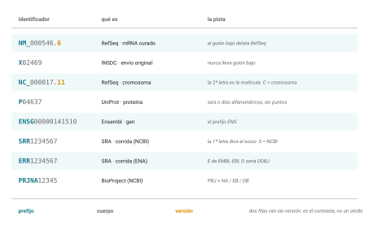

## Idea central

Un número de acceso es la dirección permanente de un registro. Es lo que
permite que alguien más, en otro país y en otro año, baje exactamente lo
mismo que ustedes bajaron.

Exactamente lo mismo, siempre y cuando anoten la versión. Si no la
anotan, están dando una dirección de calle sin número.

Este capítulo cierra la unidad porque es donde las tres bases anteriores
se vuelven una práctica.

## Desarrollo

### El decodificador

Van a encontrarse identificadores de media docena de recursos distintos y
todos se ven parecidos. Esta tabla es para que aprendan a distinguirlos
de un vistazo (@fig-decodificador).

{#fig-decodificador}

| Recurso | Forma | La pista |
|---|---|---|
| INSDC (GenBank, ENA, DDBJ) | `X02469`, `AF231982` | Nunca lleva guión bajo |
| RefSeq | `NM_000546.6`, `NC_000017.11` | **El guión bajo** |
| UniProt | `P04637`, `A0A023GPI8` | Seis o diez alfanuméricos |
| Ensembl | `ENSG00000141510` | El prefijo `ENS` |
| SRA, corridas | `SRR`, `ERR`, `DRR` | La letra dice el socio |
| BioProject | `PRJNA`, `PRJEB`, `PRJDB` | Igual |

La regla más útil de todas es la del guión bajo. **Si lleva guión bajo,
es RefSeq**, o sea capa curada del NCBI. Si no lo lleva, es un envío
original del INSDC. Con eso solo ya saben si están mirando lo que alguien
depositó o lo que alguien curó.

Dentro de RefSeq, las dos letras dicen más. La primera es el nivel de
curación: **N** significa validado o revisado, **X** significa predicho
por un pipeline automático. La segunda es el tipo de molécula: `M` mRNA,
`R` RNA no codificante, `P` proteína, `C` cromosoma, `G` región genómica.

Así que `NM_000546` es un mRNA curado y `XM_011526103` es un mRNA
predicho. Se ven casi iguales y no valen lo mismo.

### Accession, versión y el fantasma del GI

Un identificador de INSDC o RefSeq viene en dos partes: `NM_000546.6`.

**El accession** es `NM_000546` y es estable para siempre. Identifica al
registro como entidad.

**La versión** es el `.6`, y sube en uno cada vez que **cambia la
secuencia**. Ese seis quiere decir que la secuencia de referencia del
mRNA de TP53 se ha corregido cinco veces desde que se creó el registro.
Las actualizaciones que no tocan la secuencia no suben la versión.

Y hay un tercero que ya no deben usar. Los **números GI** eran
identificadores puramente numéricos que el NCBI dejó de mostrar en 2016 y
ya no asigna a secuencias nuevas. Si encuentran un tutorial que los use,
el tutorial está viejo.

::: mito
**"Con el accession basta."**

No. `NM_000546` sin versión apunta a "la versión actual, sea cual sea".
Si su análisis dice que usó `NM_000546` y alguien lo reproduce dos años
después, va a bajar una secuencia distinta y va a obtener números
distintos, sin que nada le avise.

Citar un accession sin versión en una sección de métodos es tan preciso
como citar "la Wikipedia".
:::

### Qué pasa cuando un registro cambia

Tres destinos posibles, y conviene reconocerlos.

Una **actualización** sube la versión. La anterior sigue siendo
recuperable, así que un análisis viejo se puede reproducir si anotaron
cuál usaron.

Un registro **suprimido** se retira de la circulación, casi siempre
porque resultó ser un error. El accession **nunca se reutiliza**: queda
quemado. Si su script pide uno suprimido, va a fallar, y eso es mejor que
devolver otra cosa en silencio.

Y cuando dos registros resultan ser el mismo, se **fusionan**: uno
sobrevive y el otro queda como **accession secundario**, apuntando al
superviviente. Por eso a veces un identificador viejo los lleva a un
registro con otro nombre.

### La disciplina

Acá es donde cierra el círculo con la sesión 1.

Aquel día quedamos en que un resultado que no pueden reproducir no es un
resultado, y en que los datos crudos no se versionan: se versiona la
receta para conseguirlos. Ahora ya tienen todas las piezas de esa receta.

Para cada archivo que bajen, anoten cuatro cosas:

**El accession con su versión.** `NM_000546.6`, no `NM_000546`.

**La fecha de descarga.** Porque incluso con versión, los metadatos
alrededor del registro pueden haber cambiado.

**El comando exacto.** No "lo bajé del NCBI", sino la línea que corrieron.

**El checksum.** `sha256sum archivo.fasta`, guardado junto al archivo. Es
la prueba de que lo que ustedes usaron es bit por bit lo que cualquiera
puede volver a bajar.

```markdown
## Datos
- Accession: NM_000546.6 (RefSeq, mRNA curado)
- Descargado: 2026-10-23
- Comando: efetch -db nucleotide -id NM_000546.6 -format fasta
- sha256: (pegar la salida de sha256sum)
```

Cuatro líneas. Es todo lo que separa un análisis reproducible de uno que
solo funcionó una vez.

::: callout-box
Un extra que vale la pena conocer: el NCBI publica archivos
`md5checksums.txt` junto a las descargas de genomas ensamblados. En esos
casos no tienen que confiar en su propio cálculo, pueden verificar
contra el de ellos con `md5sum -c`.

En Mac los comandos son `shasum -a 256` y `md5` en lugar de `sha256sum` y
`md5sum`.
:::

## Fuentes {.unnumbered}

- NCBI. Sequence identifiers: accession, version y el retiro de los GI. <https://www.ncbi.nlm.nih.gov/genbank/sequenceids/>
- NCBI. RefSeq accession prefixes y su significado. <https://www.ncbi.nlm.nih.gov/books/NBK21091/table/ch18.T.refseq_accession_numbers_and_mole/>
- INSDC. Formato de accession numbers. <https://www.insdc.org/submitting-standards/accession-numbers/>
- UniProt. Estabilidad de accessions y nombres de entrada. <https://www.uniprot.org/help/accession_numbers>
- Buffalo, V. (2015). *Bioinformatics Data Skills*. O'Reilly. Capítulo 6, descarga reproducible de datos. <https://vincebuffalo.com/book/>
