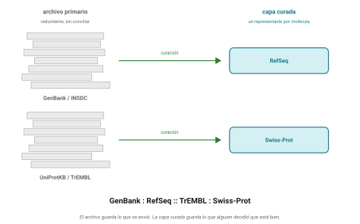
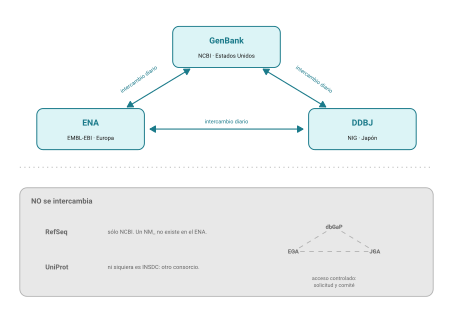

    
## Idea central

Hay tres archivos de secuencias de nucleótidos en el mundo, uno en
Estados Unidos, uno en Europa y uno en Japón, y **los tres tienen
exactamente los mismos datos**. Se sincronizan todos los días y llevan
más de treinta años haciéndolo.

Ese acuerdo tiene una consecuencia incómoda que casi nadie les va a
decir: nadie revisó si lo que ustedes van a bajar es correcto.

## Desarrollo

### Los tres y el trato

El **INSDC**, International Nucleotide Sequence Database Collaboration,
son GenBank en el NCBI, el **ENA** en el EMBL-EBI de Hinxton, y **DDBJ**
en el Instituto Nacional de Genética de Japón.

El trato es simple. Cada uno recibe envíos por su cuenta, y todas las
noches se pasan lo nuevo. Depositen en cualquiera y aparece en los tres.
En 2023 los tres fundadores firmaron un acuerdo formal que codificó la
gobernanza, pero el intercambio venía funcionando desde mucho antes.

Cómo evitan que dos registros distintos acaben con el mismo
identificador? Repartiéndose el espacio de nombres. Los proyectos del
NCBI empiezan con `PRJNA`, los del ENA con `PRJEB`, los de DDBJ con
`PRJDB`. Las corridas de secuenciación son `SRR`, `ERR` y `DRR`
respectivamente. Tres sistemas independientes, un solo namespace, cero
colisiones.

### Cómo llegamos acá

Vale la pena la cronología porque explica por qué son tres y no uno.

El primero fue europeo. La **EMBL Data Library** se estableció en
Heidelberg en octubre de 1980 y sacó su primer release en abril de 1982:
568 entradas, medio millón de bases. **GenBank** arrancó ese mismo 1982,
en Los Alamos, y se mudó al NCBI en 1992. **DDBJ** se sumó en 1987.

En 2002 el consejo asesor formalizó la política que sostiene todo esto.

::: consenso
El INSDC garantiza acceso libre e irrestricto a todos sus registros. Una
vez depositada, una secuencia no se puede retirar ni volver privada.

Y a continuación viene la parte que quiero que subrayen:

> *"Beyond limited editorial control and some internal integrity checks
> (for example, proper use of INSDC formats and translation of coding
> regions specified in CDS entries are verified), the quality and
> accuracy of the record are the responsibility of the submitting
> author, not of the database."*

Traducido y sin diplomacia: **el archivo verifica que el formato esté
bien, no que la biología esté bien.** Si alguien depositó una secuencia
etiquetada como una especie que no es, o contaminada con DNA del
huésped, ahí va a estar, para siempre, con su nombre equivocado.
:::

Eso no es un defecto de diseño. Es el diseño. Un archivo primario existe
para preservar lo que se depositó, no para juzgarlo. El juicio viene
después, y de eso trata la siguiente sección.

### Archivo primario contra capa curada

Acá está la idea que sostiene esta unidad entera, y que van a reconocer
después en tres o cuatro lugares más.

Un **archivo primario** acepta lo que la comunidad envía y lo guarda tal
cual. Es enorme, redundante, y su calidad es la de quien depositó.
GenBank es eso.

Una **capa curada** se construye encima: alguien elige un representante
por molécula, le corrige errores, lo anota de forma consistente y lo
mantiene al día. **RefSeq** es eso (@fig-archivo-curado).

{#fig-archivo-curado}

Las dos son necesarias y contestan preguntas distintas. Si quieren saber
qué se ha depositado sobre un gen, van al archivo. Si quieren *la*
secuencia de referencia para alinear contra ella, van a la capa curada.

::: mito
**"RefSeq es parte del INSDC."** No lo es, y esta es la confusión más
cara del tema.

RefSeq es un producto **exclusivo del NCBI**, construido a partir de los
datos del INSDC pero no compartido con ENA ni con DDBJ. Si buscan un
`NM_` en el ENA, no lo van a encontrar.

Lo que se intercambia todas las noches son los envíos originales. Lo que
cada socio decida construir encima es asunto suyo.
:::

Y hay más cosas que no se intercambian (@fig-insdc). Los datos humanos
identificables no pueden estar en un archivo abierto, así que existe una
estructura espejo de acceso controlado: **dbGaP** en el NCBI, **EGA** en
el EBI, **JGA** en Japón. Si alguna vez topan con un dataset que pide
solicitud y comité, es uno de esos.

{#fig-insdc}

### Para qué sirve cada uno en la práctica

Si los tres tienen lo mismo, por qué elegir?

Porque encima de los datos compartidos cada socio construyó herramientas
distintas, y algunas no tienen equivalente.

El **NCBI** tiene Entrez y sus enlaces cruzados, que es lo que ya vimos.

El **ENA** tiene una que vale oro y que no tiene contraparte limpia del
otro lado: el endpoint `filereport` de su Portal API, que devuelve las
rutas de descarga de los FASTQ de un experimento público.

```bash
curl "https://www.ebi.ac.uk/ena/portal/api/filereport?accession=SRR1234567&result=read_run&fields=run_accession,fastq_ftp,fastq_md5&format=tsv"
```

Eso les regresa las URLs de los archivos R1 y R2, listas para pasárselas
a `wget`, junto con sus checksums. Del lado del NCBI el camino
equivalente pasa por el SRA Toolkit y es bastante más incómodo. Cuando
necesiten lecturas públicas, empiecen por el ENA.

**DDBJ** es el más honesto de describir: es improbable que lo necesiten
específicamente, porque sus datos están en los otros dos. Importa por dos
razones. Una conceptual, que es ser la prueba viviente de que el
intercambio existe. Y una práctica y rara, que es toparse con un registro
depositado ahí con metadatos que solo DDBJ conserva.

En la práctica de hoy van a bajar el mismo registro de los tres y
compararlos. Es la única forma de creérselo.

## Fuentes {.unnumbered}

- INSDC. Política de datos y descripción de la colaboración. <https://www.insdc.org/>
- Karsch-Mizrachi, I. et al. (2025). INSDC: enhancing global participation in sequence data sharing. *Nucleic Acids Research* 53(D1). [doi:10.1093/nar/gkae1235](https://doi.org/10.1093/nar/gkae1235)
- Yuan, D. et al. (2026). The European Nucleotide Archive in 2025. *Nucleic Acids Research* 54(D1): D120-D127. [doi:10.1093/nar/gkaf1295](https://doi.org/10.1093/nar/gkaf1295)
- Kodama, Y. et al. (2025). DDBJ update in 2024. *Nucleic Acids Research* 53(D1): D45-D48. [doi:10.1093/nar/gkae882](https://doi.org/10.1093/nar/gkae882)
- ENA Portal API, documentación. <https://www.ebi.ac.uk/ena/portal/api/>
- NCBI. RefSeq: frequently asked questions. <https://www.ncbi.nlm.nih.gov/books/NBK50679/>
