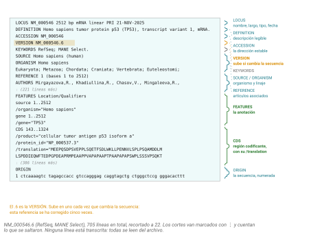

## Idea central

El NCBI no es una base de datos. Son unas cuarenta, conectadas entre sí,
y esa conexión es la mitad de lo que las hace útiles.

Hoy no vamos a recorrerlas todas. Vamos a entender la lógica del lugar,
quedarnos con las ocho o nueve que van a usar de verdad, y aprender a
sacar cosas sin dar un solo clic.

## Desarrollo

### Un boleto, muchas jaulas

El National Center for Biotechnology Information se fundó en 1988 por
acto del Congreso de Estados Unidos, dentro de la National Library of
Medicine. Empezó administrando GenBank y terminó administrando casi todo.

Lo que unifica ese zoológico se llama **Entrez**: un sistema de búsqueda
y recuperación que cubre todas las bases a la vez. Escriben un término,
y Entrez les dice cuántos aciertos hay en cada una.

Pero lo que de verdad importa de Entrez son los **enlaces cruzados**.
Cada registro sabe con qué registros de otras bases se relaciona. Desde
la ficha de un gen se salta a su mRNA, de ahí a la proteína traducida,
de ahí a los artículos que la mencionan, de ahí a las variantes
reportadas. No es un catálogo: es un grafo.

Ese grafo es la razón por la que el NCBI ganó. Otras bases tenían los
mismos datos; ninguna los tenía atados entre sí.

### Las jaulas que sí importan

De las cuarenta, estas son con las que van a tropezar:

**Nucleotide** es el punto de entrada a secuencias de DNA y RNA.
**Protein** guarda secuencias de aminoácidos, muchas derivadas de
traducir las CDS de Nucleotide. **Gene** está centrada en el gen como
entidad biológica y no en una secuencia particular: nomenclatura oficial,
ubicación, transcritos, fenotipos. Suele ser el mejor lugar para
*empezar*.

**Genome** y **Datasets** son donde viven los genomas ensamblados con su
anotación. **SRA** es el archivo de lecturas crudas de secuenciación, y
si alguna vez reanalizan un RNA-seq público, de ahí van a salir.

**PubMed** indexa literatura biomédica y **PMC** guarda texto completo de
la parte de acceso abierto. **Taxonomy** es el árbol de organismos, donde
cada especie tiene un identificador numérico (*Homo sapiens* es el 9606)
que sirve para filtrar búsquedas por linaje.

Y **dbSNP** y **ClinVar** guardan variantes: la primera todas, la segunda
las de relevancia clínica interpretada.

### Cómo se lee un registro

Casi todo lo que baje de Nucleotide se puede pedir en el formato de texto
plano de GenBank, que se llama *flat file*. Reconocer sus secciones les
evita depender de la interfaz gráfica (@fig-flatfile).

{#fig-flatfile}

Arriba va **LOCUS** con el nombre corto, la longitud, el tipo de
molécula y la fecha. Después **DEFINITION**, que es la descripción
legible. **ACCESSION** y **VERSION** identifican el registro, y de eso
hablamos en detalle dos capítulos más adelante.

**SOURCE** y **ORGANISM** dan el organismo con su linaje. **REFERENCE**
lista los artículos asociados.

**FEATURES** es la parte rica. Ahí está la anotación: dónde empieza y
termina el gen, dónde está la región codificante con su traducción
incluida, dónde caen los exones. Es la sección que vale la pena leer
despacio.

Y al final **ORIGIN**, con la secuencia numerada.

### Sacar cosas sin dar clics

Para cinco secuencias, la interfaz web está bien. Para quinientas, o para
que su análisis sea reproducible, hay que pedirlas desde código.

El NCBI expone las **E-utilities**, que son URLs con parámetros. Las que
importan: `esearch` busca, `efetch` descarga, `esummary` resume, `elink`
salta entre bases, `einfo` lista qué hay.

Encima de ellas está **EDirect**, que las envuelve en comandos de UNIX
conectables con pipes. Ya usaron `efetch` en la sesión de FASTA, así que
esto es ampliar, no empezar.

```bash
# Buscar un gen y bajarlo
esearch -db nucleotide -query "TP53[GENE] AND Homo sapiens[ORGN]" \
| efetch -format fasta

# Recorrer el grafo: de un gen a sus artículos
esearch -db gene -query "TP53[GENE] AND human[ORGN]" \
| elink -target pubmed \
| efetch -format uid | head

# Convertir XML en tabla, sin escribir un parser
esearch -db pubmed -query "TP53 tumor suppressor" \
| efetch -format docsum \
| xtract -pattern DocumentSummary -element Id Title
```

Ese último, `xtract`, es la joya del paquete: convierte el XML de Entrez
en columnas que `awk` y `sort` pueden masticar. Ahí se cierra el círculo
con todo lo que llevan hecho en terminal.

::: callout-box
**Un aviso de convivencia que hoy es crítico.**

El NCBI limita a **tres peticiones por segundo por dirección IP**. Con
una llave de API gratuita sube a diez. Pasarse devuelve un error 429.

`ken` sale a internet con una sola IP para los treinta. Ese límite de
tres por segundo no es de cada quien: **es de todos juntos**. Si media
clase corre un ciclo de `efetch` al mismo tiempo, el NCBI nos bloquea a
todos y la práctica se acaba.

Por eso los datos de hoy ya están descargados. Y por eso, cuando armen
un script propio que haga muchas llamadas, saquen su llave de API y
métanla en `NCBI_API_KEY`. Es gratis y toma dos minutos.
:::

### El tamaño del zoológico

Para dimensionar: GenBank, en su release 269.0 del 16 de diciembre de
2025, tenía alrededor de **49.73 billones de bases** en unos **6 mil
millones de registros**. Cuando arrancó, en 1982, tenía 606 secuencias.

Ese número envejece cada dos meses. Cuando lo citen, digan de qué release
salió, que es exactamente la disciplina del capítulo de accesiones.

## Fuentes {.unnumbered}

- Sayers, E. W. et al. (2025). GenBank 2025 update. *Nucleic Acids Research* 53(D1): D56-D63. [doi:10.1093/nar/gkae1114](https://doi.org/10.1093/nar/gkae1114)
- NCBI. Entrez Programming Utilities Help. <https://www.ncbi.nlm.nih.gov/books/NBK25501/>
- Kans, J. Entrez Direct: E-utilities on the Unix command line. <https://www.ncbi.nlm.nih.gov/books/NBK179288/>
- NCBI. Límites de uso y llaves de API. <https://www.ncbi.nlm.nih.gov/books/NBK25497/>
- Estadísticas de GenBank por release. <https://www.ncbi.nlm.nih.gov/genbank/statistics/>
