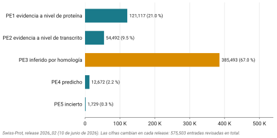

## Idea central

Este capítulo es el anterior otra vez, en proteínas.

Archivo primario contra capa curada, exactamente la misma estructura:
**TrEMBL es a Swiss-Prot lo que GenBank es a RefSeq**. Si entendieron
esa proporción, ya entendieron la mitad.

Lo que sí es propio de acá son los números, que son brutales, y una
sorpresa reciente que descoloca a cualquiera que crea que las bases de
datos solo crecen.

## Desarrollo

### Las dos mitades

**UniProtKB** se parte en dos secciones. **Swiss-Prot** está revisada a
mano por curadores: alguien leyó la literatura, evaluó la evidencia y
escribió la anotación. **TrEMBL** está anotada automáticamente por
pipelines, a la espera de una revisión que en su enorme mayoría no va a
llegar nunca.

UniProt **no es parte del INSDC**. Es un consorcio aparte (EMBL-EBI, el
SIB suizo y el PIR estadounidense) que se alimenta de traducir las CDS
del INSDC, entre otras fuentes. Una entrada de UniProt referencia el
accession de nucleótidos del que salió, pero su propio identificador es
independiente.

### Los números, y una sorpresa

En el release 2026_02, del 10 de junio de 2026, Swiss-Prot tenía
**575,503 entradas revisadas**, curadas a partir de casi 313 mil
referencias. TrEMBL tenía alrededor de **149 millones**.

Menos del 0.4% de UniProtKB pasó por manos humanas. Esa es la **brecha de
anotación** que vieron en la sesión 1, ahora con las cifras al día.

Y acá va la sorpresa. En 2025, TrEMBL tenía unos **253 millones** de
entradas. Bajó a 149. **Perdió cien millones de entradas en menos de un
año.**

::: callout-box
No se perdió nada. UniProt hizo una reorganización que eliminó
redundancia masiva: secuencias esencialmente idénticas depositadas
muchas veces, sobre todo de proyectos de metagenómica.

Vale la pena detenerse en lo que eso implica. **El tamaño de una base de
datos no es una medida de su contenido, es una decisión de diseño.** Una
base más chica puede tener exactamente la misma información y ser más
útil.

Cuando comparen bases por número de entradas, pregúntense primero qué
cuenta cada una como entrada.
:::

### Qué tan segura es una anotación curada

Acá viene lo que de verdad quiero que se lleven, y que sorprende incluso
a quien ya conoce Swiss-Prot.

Cada entrada trae un nivel de **evidencia de existencia de la proteína**,
que va del PE1 al PE5. PE1 significa que hay evidencia experimental a
nivel de proteína. PE2, a nivel de transcrito. PE3, que se infirió por
homología con otra proteína. PE4, predicha. PE5, incierta.

Vean cómo se reparten los 575 mil de Swiss-Prot (@fig-pe):

{#fig-pe}

**El 67% es PE3**, o sea inferido por homología. Apenas el 21% tiene
evidencia experimental a nivel de proteína.

Léanlo despacio. En la parte *manualmente curada* de la base de proteínas
más cuidada del mundo, dos de cada tres entradas existen porque se
parecen a algo que sí se caracterizó, no porque alguien haya visto la
proteína.

Eso no descalifica a Swiss-Prot. La inferencia por homología es
legítima, es lo que llevamos cinco sesiones aprendiendo a hacer bien. Lo
que descalifica es leer una anotación como si fuera un hecho medido.

Cuando en la sesión de BLAST les creyeron a las anotaciones de los hits,
esto es lo que estaban heredando.

### Lo demás del ecosistema

Tres piezas más que van a ver nombradas.

**UniParc** es el archivo puro: todas las secuencias de proteína que
alguna vez se han visto, sin anotación, con su historial de versiones. Si
una secuencia desapareció de UniProtKB, en UniParc sigue.

**UniRef** son agrupamientos por identidad: UniRef100, UniRef90 y
UniRef50 juntan secuencias con al menos ese porcentaje de identidad en un
solo representante. Sirve para reducir redundancia antes de un análisis.

Y el servicio de **ID mapping** traduce identificadores entre UniProt y
unas 180 bases distintas. Es la herramienta que van a maldecir menos el
día que tengan una lista de identificadores del recurso equivocado.

### Sacar cosas

La API REST es directa:

```bash
curl "https://rest.uniprot.org/uniprotkb/P04637.fasta"
curl "https://rest.uniprot.org/uniprotkb/P04637.txt"
```

El primero devuelve FASTA. El segundo, el registro completo en formato de
texto, con la anotación, las referencias y los enlaces cruzados. Vale la
pena abrirlo entero al menos una vez.

## Fuentes {.unnumbered}

- The UniProt Consortium (2025). UniProt: the Universal Protein Knowledgebase in 2025. *Nucleic Acids Research* 53(D1): D609-D617. [doi:10.1093/nar/gkae1010](https://doi.org/10.1093/nar/gkae1010)
- The UniProt website API (2025). *Nucleic Acids Research* 53(W1): W547. [doi:10.1093/nar/gkaf380](https://doi.org/10.1093/nar/gkaf380)
- UniProt. Estadísticas por release. <https://www.uniprot.org/uniprotkb/statistics>
- UniProt. Niveles de evidencia de existencia de proteína. <https://www.uniprot.org/help/protein_existence>
- UniProt. Documentación de la API REST. <https://www.uniprot.org/help/api>

