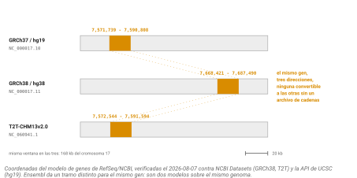
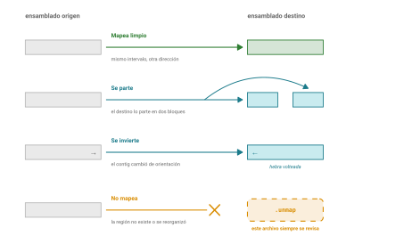
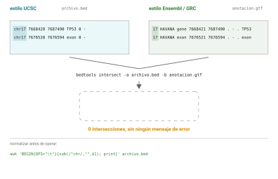

## Idea central

Una coordenada genómica no significa nada sola. `chr17:7,668,421` es una
dirección válida solo si además dicen en qué ensamblado.

En la sesión 2 vimos qué es un ensamblado y por qué el genoma de
referencia es un mosaico haploide. Hoy vemos lo que eso les va a costar
en la práctica, que es bastante más de lo que parece.

## Desarrollo

### Tres referencias humanas conviviendo

En 2026 hay tres ensamblados humanos en uso simultáneo, y no son
intercambiables.

**GRCh37**, que UCSC llama **hg19**, es de 2009. Debería estar retirado y
no lo está.

**GRCh38**, o **hg38**, es de 2013 con parches posteriores. Es el default
de trabajo para casi todo el mundo.

**T2T-CHM13**, versión 2.0 de 2022, que UCSC llama **hs1**, es el
primero completo sin huecos. Rellena más de 200 megabases que faltaban en
GRCh38, alrededor del 8% del genoma: centrómeros, los brazos cortos de
los cromosomas acrocéntricos y casi todo el cromosoma Y.

Y no es solo completitud estética. Un estudio de 2025 sobre mil genomas
suecos encontró **10 millones de variantes adicionales** al mapear contra
CHM13 en lugar de GRCh38, de las cuales 5.5 millones eran singletons, y
un 13% más de variantes clasificadas como de impacto moderado o alto.
Varios trabajos recientes recomiendan explícitamente adoptarlo, sobre
todo para evaluar variantes clínicamente relevantes.

### Por qué hg19 no se muere

Esta es la parte que a mí me parece más instructiva, porque no es un
problema técnico.

hg19 tiene diecisiete años y sigue vivo en genómica clínica. La razón es
que hay pipelines validados, bases de datos de variantes, y sobre todo
**reportes clínicos ya emitidos** cuyas coordenadas son de hg19.
Revalidar todo eso cuesta dinero, tiempo y trámite regulatorio.

O sea que la referencia que se usa no la decide la calidad técnica. La
decide la inercia institucional y el costo de migrar.

::: callout-box
Guarden ese patrón, porque no es exclusivo de acá. Ya lo vieron con la
matriz BLOSUM62 que tiene un error de programación conocido desde 2008 y
que nadie corrigió, porque la versión con el error funciona bien y
cambiarla habría roto la comparabilidad con veinte años de literatura.

El software instalado tiene una inercia propia, y no siempre es
irracional.
:::

El estado honesto para 2026: hg38 es el default, hg19 es el legado
clínico que no se va, y CHM13 está subiendo con evidencia sólida pero
todavía en transición. Ninguno de los tres es "el correcto".

### El mismo gen, tres direcciones

TP53 es el gen con el que vamos a trabajar toda la sesión. Miren dónde
está según a quién le pregunten (@fig-tres-ensamblados):

| Ensamblado | Coordenadas de TP53 |
|---|---|
| GRCh37 / hg19 | `NC_000017.10 : 7,571,739 - 7,590,808` |
| GRCh38 / hg38 | `NC_000017.11 : 7,668,421 - 7,687,490` |
| T2T-CHM13v2.0 | `NC_060941.1 : 7,572,544 - 7,591,594` |

{#fig-tres-ensamblados}

Casi cien mil bases de diferencia entre hg19 y hg38 para el mismo gen. Y
fíjense en que el accession del cromosoma también cambia: `NC_000017.10`
contra `NC_000017.11`. Esa versión que cambia es exactamente lo que
vimos en el capítulo de accesiones, ahora con consecuencias.

### Convertir coordenadas, y por qué duele

Para pasar coordenadas de un ensamblado a otro se usa un **archivo de
cadenas** (chain file) que describe el alineamiento entre los dos. Las
herramientas son **liftOver**, de UCSC, y **CrossMap**.

```bash
liftOver entrada.bed hg38ToHg19.over.chain.gz salida.bed sin_mapear.bed
```

Fíjense en el cuarto argumento. **Ese archivo de los que no mapearon no
es opcional y hay que abrirlo siempre.**

Porque la conversión pierde cosas, de cuatro maneras distintas
(@fig-liftover):

Un intervalo puede **no mapear** porque la región no existe o se
reorganizó en el destino. Puede **partirse** en varios pedazos. Puede
**mapear a varios lugares** si la región se duplicó. Y la más traicionera:
puede **invertirse**, porque el contig subyacente cambió de orientación
entre ensamblados, de modo que la secuencia que era hebra positiva ahora
es su complemento reverso.

{#fig-liftover}

Con archivos VCF es peor, porque además hay que reconciliar los alelos de
referencia y alternativo. En un mismo conjunto del proyecto 1000 Genomes,
CrossMap descartó unas 46,600 variantes donde `bcftools liftover` descartó
unas 12,600. Distintas herramientas, distintas pérdidas.

La regla: **liftOver es con pérdida**. No es una traducción, es una
aproximación. Si pueden rehacer el análisis contra el ensamblado nuevo en
lugar de convertir resultados viejos, háganlo.

### chr17 contra 17

Y ahora el error más tonto y más frecuente de toda la genómica práctica.

UCSC nombra los cromosomas `chr1`, `chr2`, ..., `chrM`. El GRC y Ensembl
los nombran `1`, `2`, ..., `MT`.

Son el mismo cromosoma. Son cadenas de texto distintas.

Si intersectan un BED con `chr17` contra un GTF con `17`, obtienen **cero
resultados y ningún mensaje de error** (@fig-nomenclatura). El programa
hizo su trabajo: buscó `chr17` en un archivo donde no existe. Y ustedes
concluyen que no hay solapamiento cuando lo que no hay es acuerdo de
nomenclatura.

{#fig-nomenclatura}

La solución es normalizar antes de operar:

```bash
# quitar el prefijo chr
awk 'BEGIN{OFS="\t"}{sub(/^chr/,"",$1); print}' archivo.bed > normalizado.bed

# o ponerlo
awk 'BEGIN{OFS="\t"}{if($1!~/^chr/) $1="chr"$1; print}' archivo.bed
```

Y el hábito: **cuando algo dé cero resultados, lo primero que se revisa
es la nomenclatura de cromosomas**, antes de dudar de la biología.

### Cómo saber en qué ensamblado está un archivo

Un BED o un GTF no traen encabezado que lo diga. Hay que inferirlo.

El estilo de nombres de cromosoma les dice de qué familia viene (`chr17`
sugiere UCSC, `17` sugiere Ensembl o NCBI), pero no la versión. Un VCF sí
suele traer líneas `##contig` con longitudes, y comparar esas longitudes
contra un `.fai` conocido identifica el ensamblado sin ambigüedad. Un
`.fai` propio les da lo mismo directamente.

Y si nada de eso está, queda la peor opción: adivinar por el rango de las
coordenadas y rezar.

Por eso la disciplina, que es la misma del capítulo de accesiones: **el
ensamblado va en el nombre del archivo y en la bitácora**.
`variantes_hg38.vcf`, no `variantes.vcf`. Cuesta doce caracteres y ahorra
tardes enteras.

## Fuentes {.unnumbered}

- Nurk, S. et al. (2022). The complete sequence of a human genome. *Science* 376(6588): 44-53. [doi:10.1126/science.abj6987](https://doi.org/10.1126/science.abj6987)
- Schmitz, D., Ameur, A. & Johansson, Å. (2025). T2T-CHM13 improves read mapping and detection of clinically relevant variation. *Genome Research* 35(11): 2377-2388. [doi:10.1101/gr.279320.124](https://doi.org/10.1101/gr.279320.124)
- Zhao, H. et al. (2014). CrossMap: a versatile tool for coordinate conversion between genome assemblies. *Bioinformatics* 30(7): 1006-1007. [doi:10.1093/bioinformatics/btt730](https://doi.org/10.1093/bioinformatics/btt730)
- BCFtools/liftover (2024). *Bioinformatics* 40(2): btae038. [doi:10.1093/bioinformatics/btae038](https://doi.org/10.1093/bioinformatics/btae038)
- UCSC. liftOver y archivos de cadenas. <https://genome.ucsc.edu/cgi-bin/hgLiftOver>
- Genome Reference Consortium. <https://www.ncbi.nlm.nih.gov/grc>