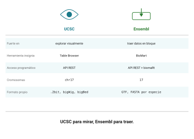

## Idea central

Ensembl y UCSC muestran los mismos genomas y no compiten: son buenos en
cosas distintas.

UCSC para mirar. **Ensembl para traer.**

## Desarrollo

### El modelo de datos

Ensembl piensa en objetos con identificadores estables, y esa estructura
es lo que lo hace bueno para consultas programáticas.

Un **gen** es `ENSG`, un **transcrito** es `ENST`, una **proteína** es
`ENSP`, un **exón** es `ENSE`. Con código de especie en medio para los no
humanos: el gen de ratón es `ENSMUSG`.

Y cada uno lleva su propia versión: `ENSG00000141510.18`. Misma
disciplina que vimos con RefSeq, mismo motivo para anotarla.

Los **biotypes** que vieron en la sesión 2 (`protein_coding`, `lncRNA`,
`processed_pseudogene`) son vocabulario de Ensembl, y son el filtro más
útil que existe para hacer preguntas sobre un genoma.

**Ensembl Compara** es la parte de ortología y paralogía, que es
literalmente lo que hicieron a mano con reciprocal best hits en la
sesión 10. Ahí está precalculado para cientos de especies, con métodos
basados en árboles en lugar de la heurística que ustedes programaron.

### BioMart

**BioMart** es la herramienta insignia y contesta preguntas de la forma
"dame estos atributos para este conjunto de cosas".

Tres piezas: eligen un **dataset** (una especie), unos **filtros** (qué
subconjunto quieren) y unos **atributos** (qué columnas quieren de
vuelta). Devuelve una tabla.

Es la respuesta a las preguntas que en UCSC son incómodas: traduzcan
estos cinco mil identificadores de Ensembl a símbolos HGNC, o denme la
posición y el biotype de todos los genes del cromosoma 17.

### La API REST

En `https://rest.ensembl.org`, con una versión aparte para hg19 en
`https://grch37.rest.ensembl.org`.

```bash
# Ficha de un gen por identificador
curl -s 'https://rest.ensembl.org/lookup/id/ENSG00000141510?expand=1' \
  -H 'Content-type:application/json'

# Qué hay solapando una región
curl -s 'https://rest.ensembl.org/overlap/region/human/17:7668421-7687490?feature=gene' \
  -H 'Content-type:application/json'
```

Para preguntas de solapamiento, prefieran el endpoint `overlap` sobre
BioMart. BioMart les va a devolver todos los genes con todos sus exones y
tienen que filtrar después.

### El puente a R

Y acá está la razón por la que Ensembl cierra esta sesión y no otra cosa.

El paquete **biomaRt** de Bioconductor pone BioMart dentro de R:

```r
library(biomaRt)
mart <- useEnsembl(biomart = "genes", dataset = "hsapiens_gene_ensembl")

getBM(attributes = c("ensembl_gene_id", "hgnc_symbol",
                     "chromosome_name", "start_position", "end_position"),
      filters = "hgnc_symbol",
      values = "TP53",
      mart = mart)
```

Las próximas sesiones del curso son de R. Esto es lo último que ven
conmigo y lo primero que van a reconocer allá.

::: callout-box
**Dos avisos prácticos.**

El primero es de cortesía: `biomaRt` pega contra los mismos servidores
que la web. Si van a pedir miles de regiones, párenlo en trozos. Treinta
personas mandando consultas gigantes al mismo tiempo es la versión
Ensembl del problema del límite del NCBI.

El segundo es de caducidad. El release 116, de junio de 2026, es el
**último sobre la plataforma actual** de Ensembl. A partir del verano de
2026 `ensembl.org` redirige a la plataforma nueva y los releases previos
quedan en Ensembl Archives.

O sea que las capturas de pantalla y algunas URLs de este capítulo van a
envejecer mal, posiblemente durante el semestre. Si algo no está donde
digo, búsquenlo en el archivo y avísenme.
:::

### Cuál usar

{#fig-ucsc-ensembl}

No es una rivalidad. Es que resuelven preguntas distintas, y saber cuál
abrir según la pregunta es parte del oficio (@fig-ucsc-ensembl).

## Fuentes {.unnumbered}

- Ensembl. <https://www.ensembl.org>
- Ensembl 2026. *Nucleic Acids Research*, Database issue.
- Documentación de la API REST. <https://rest.ensembl.org>
- Durinck, S. et al. (2009). Mapping identifiers for the integration of genomic datasets with biomaRt. *Nature Protocols* 4: 1184-1191. [doi:10.1038/nprot.2009.97](https://doi.org/10.1038/nprot.2009.97)
- Ensembl Archives, para releases anteriores. <https://www.ensembl.org/info/website/archives/>