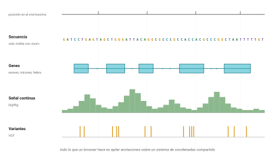

## Idea central

Un genome browser es un sistema de coordenadas con cosas apiladas
encima. Nada más.

Ese "nada más" resultó ser una de las ideas más productivas de la
genómica, y UCSC es donde mejor se ve.

## Desarrollo

### El track

Todo lo que hace un browser es dibujar un eje de coordenadas y colgarle
capas alineadas. Cada capa se llama **track** (@fig-tracks).

{#fig-tracks}

Un track puede ser la secuencia misma, los genes con su estructura de
exones e intrones, una señal continua como cobertura de secuenciación, un
conjunto de variantes, la conservación entre especies, marcas de
cromatina. Cualquier cosa que se pueda anclar a coordenadas.

Y ahí está la razón por la que la trampa de coordenadas de la sesión 2
importa tanto: si un track está en 0-based y otro en 1-based, se dibujan
desalineados por una base y nadie lo nota.

UCSC sirve más de seis mil tracks solo entre hg38 y hg19.

### Table Browser

La herramienta que distingue a UCSC de los demás es el **Table Browser**,
en `genome.ucsc.edu/cgi-bin/hgTables`.

Lo que hace es darles acceso a los datos que están detrás de lo que ven
dibujado, sin escribir código. Eligen ensamblado, track, región y
formato, y les devuelve una tabla o un BED.

Es la puerta de entrada para quien todavía no programa, y sigue siendo
cómoda para quien sí, cuando el problema es "quiero los exones de estos
doscientos genes y no quiero pensarle".

### Poner sus propios datos

Dos maneras de que UCSC dibuje algo suyo.

Un **custom track** es un archivo que ustedes suben o al que apuntan por
URL. Sirve para una sesión de trabajo.

Un **track hub** es una colección de tracks alojada en un servidor, que
UCSC lee bajo demanda. Es lo que usan los consorcios para publicar datos,
y es también la forma en que UCSC sirve T2T-CHM13, con el nombre `hs1`.

Lo interesante del mecanismo es que **solo se transmite lo que se está
viendo**. Si hacen zoom a veinte kilobases, el navegador pide veinte
kilobases, no el archivo de treinta gigas. Eso se logra con formatos
binarios indexados.

### Los formatos binarios

Tres que van a ver nombrados y que existen para lo mismo:

**.2bit** guarda un genoma completo a dos bits por base. **bigWig**
guarda señal continua, tipo cobertura. **bigBed** guarda intervalos.

Los tres están indexados por dentro, así que un programa puede pedir por
HTTP solo el pedazo que necesita. Es la misma idea del índice `.fai` de
samtools que vieron en la sesión 5, aplicada a datos remotos.

Las utilidades de conversión vienen sueltas y se descargan de
`hgdownload.soe.ucsc.edu/admin/exe/`: `faToTwoBit`, `bedToBigBed`,
`bigWigToBedGraph`, y el `liftOver` del capítulo anterior.

### Acceso programático

UCSC tiene una API REST en `https://api.genome.ucsc.edu`.

```bash
# Listar los ensamblados disponibles
curl -s "https://api.genome.ucsc.edu/list/ucscGenomes" | head -40

# Sacar una secuencia por coordenadas
curl -s "https://api.genome.ucsc.edu/getData/sequence?genome=hg38;chrom=chr17;start=7668420;end=7687490"
```

Fíjense en el `start=7668420` cuando el gen empieza en 7,668,421. La API
usa coordenadas 0-based. Otra vez la misma trampa, otra vez sin aviso.

### En qué es bueno

UCSC es el mejor lugar para **mirar**. Si la pregunta es "cómo se ve esta
región, qué hay alrededor, se solapa con algo", UCSC gana.

Si la pregunta es "dame los identificadores y las coordenadas de doce mil
genes en un archivo", el siguiente capítulo tiene mejor herramienta.

## Fuentes {.unnumbered}

- UCSC Genome Browser. <https://genome.ucsc.edu>
- Nassar, L. R. et al. (2026). The UCSC Genome Browser database: 2026 update. *Nucleic Acids Research*. [doi:10.1093/nar/gkaf1250](https://doi.org/10.1093/nar/gkaf1250)
- Documentación de la API REST. <https://genome.ucsc.edu/goldenPath/help/api.html>
- Track hubs y custom tracks. <https://genome.ucsc.edu/goldenPath/help/hgTrackHubHelp.html>
- Utilidades de línea de comandos. <https://hgdownload.soe.ucsc.edu/admin/exe/>