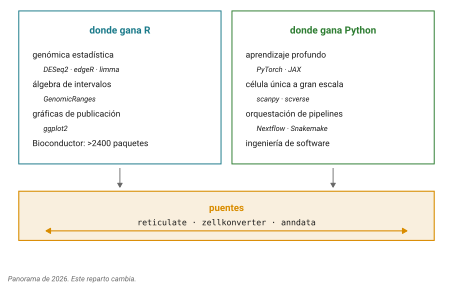

::: callout-box
**Lo que estos alumnos ya traen, y que no hay que volver a enseñar.**

Once sesiones de este curso. En concreto: terminal de Linux en un cluster
compartido; git y GitHub desde línea de comandos, con commits, remotos y
`.gitignore`; Markdown; disciplina de procedencia con accession, versión,
fecha y checksum; manipulación de FASTA con grep, tr, awk, seqkit y
samtools; matrices de sustitución y el marco log-odds; alineamiento por
pares incluyendo el problema del turista de Manhattan, el camino más
largo en un grafo dirigido acíclico, el grafo de alineamiento y la
explosión combinatoria; programación dinámica con Needleman-Wunsch y
Smith-Waterman, vistos algorítmicamente; BLAST y BLAT con valores E;
alineamiento múltiple; inferencia de ortología, que implementaron ellos
mismos en bash con awk; bases de datos y accesiones; ensamblados,
coordenadas y liftOver; y formatos de anotación con bedtools y tabix.

**No enseñar de nuevo**: qué es un directorio de trabajo, qué es control
de versiones, por qué importa la reproducibilidad, qué es un archivo
FASTA o BED, ni qué es un alineamiento.

Lo único genuinamente nuevo en esta sesión es la sintaxis de R.
:::

## Idea central

Casi todos los cursos de introducción a R empiezan con `iris` o con
pingüinos. El problema de eso no es que sea aburrido: es que obliga a
aprender dos cosas a la vez, un lenguaje nuevo y un problema nuevo.

Ustedes ya entienden Needleman-Wunsch. Lo trabajaron en papel, saben qué
es la matriz, saben qué es el traceback. Así que hoy lo único nuevo va a
ser cómo se escribe.

Vamos a programarlo. Y al final del bloque lo vamos a tirar a la basura y
usar el paquete, que es lo que hace uno en la vida real. Pero primero hay
que construirlo.

## Desarrollo

### R o Python

La pregunta llega siempre y merece una respuesta honesta en lugar de una
militancia.

En 2026 el reparto está bastante claro y no es una competencia.

{#fig-r-python}

**R gana en genómica estadística.** Bioconductor tiene más de dos mil
cuatrocientos paquetes revisados para datos de alto rendimiento, y las
herramientas estándar de expresión diferencial (DESeq2, edgeR, limma) son
exclusivas de R. Las gráficas de publicación con ggplot2 tampoco tienen
rival cómodo. El álgebra de intervalos con GenomicRanges es igual de
sólida.

**Python gana en aprendizaje profundo, en célula única a gran escala** con
scanpy y el ecosistema scverse, **y en pegar pipelines**. Si van a
entrenar un modelo o a orquestar un flujo de trabajo con Nextflow, es
Python.

Y lo importante: **hoy la norma es usar los dos**. La división en célula
única lo ilustra bien, con Bioconductor y Seurat en R y scanpy en Python,
y puentes maduros entre ellos (`reticulate`, `zellkonverter`). Nadie serio
elige un bando; se elige la herramienta según la tarea y se sabe pasar
datos de un lado al otro.

Aprenden R ahora porque es el camino más corto a hacer genómica de verdad
con lo que ya saben. Van a aprender Python también. No son rivales.

### Por qué programar, y no solo teclear comandos

Ustedes ya automatizan cosas en bash. Qué agrega un lenguaje?

Tres cosas, y las tres las van a reconocer de la sesión 1. Programar
**obliga a explicitar cada paso**, porque una computadora no infiere lo
que quisieron decir. **Ahorra tiempo**, porque lo que se escribió una vez
se corre mil. Y **es reproducible y compartible**, que es exactamente el
argumento con el que abrimos el curso.

### El primer objeto: vectores

Un **vector** en R es un grupo de elementos **del mismo tipo** en
secuencia. No pueden mezclar números con lógicos en el mismo vector; si lo
intentan, R convierte todo al tipo más general sin avisar.

```r
puntajes <- c(match = 1, mismatch = -1, gap = -2)
puntajes
puntajes["gap"]
typeof(puntajes)
```

Fíjense en tres cosas. La flecha `<-` es la asignación; hay razones
históricas y también prácticas para preferirla sobre `=`, y vamos a ver
una en un momento. La función `c()` combina elementos. Y los elementos
pueden llevar **nombre**, lo cual les permite pedir `puntajes["gap"]` en
lugar de acordarse de que el gap era el tercero.

Ese vector con nombres es, literalmente, un esquema de puntuación. Ya
programaron algo del capítulo de matrices de sustitución.

::: callout-box
**`=` contra `<-`.** Los dos asignan, pero no son intercambiables. `<-`
funciona en cualquier lado; `=` está restringido al nivel superior y a
nombrar argumentos de funciones.

El accidente clásico: si escriben `mean(x <- 5)` en lugar de
`mean(x = 5)`, acaban de crear una variable global `x` sin querer. Usen
`<-` para asignar y `=` solo dentro de paréntesis de función, y se
ahorran la categoría entera de errores.
:::

### Matrices

Una **matriz** es un vector con dos dimensiones. Y una matriz de
sustitución es exactamente eso, con nombres en filas y columnas.

```r
bases <- c("A", "C", "G", "T")
submat <- matrix(-1, nrow = 4, ncol = 4)
diag(submat) <- 1
dimnames(submat) <- list(bases, bases)
submat

submat["A", "A"]
submat["A", "G"]
```

Con `dimnames` puesto, `submat["A","G"]` es la puntuación de alinear una
A con una G. Eso es la sintaxis de R acercándose bastante a cómo lo
piensa uno.

### Ciclos

Un ciclo repite algo. La forma más común:

```r
for (i in 1:5) {
  print(i * 2)
}
```

`1:5` genera el vector `1 2 3 4 5`, y la variable `i` va tomando cada
valor. Los ciclos se pueden anidar, y ahí es donde se vuelven útiles para
nosotros:

```r
for (i in 1:3) {
  for (j in 1:3) {
    cat("celda", i, j, "\n")
  }
}
```

Nueve iteraciones recorriendo una cuadrícula de tres por tres. Les suena
esa cuadrícula?

### El turista de Manhattan, en código

Recuerden el problema. Una cuadrícula, un turista que solo puede ir al sur
o al este, un peso en cada cuadra, y la pregunta de cuál ruta acumula más
atracciones.

Y recuerden lo que vimos: la estrategia voraz falla, porque lo óptimo
local no es lo óptimo global.

La idea que resuelve el problema es que **el mejor camino hasta una
esquina solo depende del mejor camino hasta sus dos vecinas**, la de
arriba y la de la izquierda. Y eso se traduce a código casi
directamente.

```r
# Pesos de las aristas: bajar y moverse a la derecha
n <- 4; m <- 4
set.seed(42)
abajo    <- matrix(sample(0:4, (n-1)*m, replace = TRUE), nrow = n-1, ncol = m)
derecha  <- matrix(sample(0:4, n*(m-1), replace = TRUE), nrow = n, ncol = m-1)

# La tabla de resultados
S <- matrix(0, nrow = n, ncol = m)

# Primera columna: solo se puede llegar bajando
for (i in 2:n) {
  S[i, 1] <- S[i-1, 1] + abajo[i-1, 1]
}

# Primera fila: solo se puede llegar por la derecha
for (j in 2:m) {
  S[1, j] <- S[1, j-1] + derecha[1, j-1]
}

# El resto: lo mejor de las dos opciones
for (i in 2:n) {
  for (j in 2:m) {
    S[i, j] <- max(S[i-1, j] + abajo[i-1, j],
                   S[i, j-1] + derecha[i, j-1])
  }
}

S
S[n, m]   # el máximo de atracciones alcanzable
```

Léanlo despacio. La primera fila y la primera columna son casos
especiales porque solo hay una forma de llegar a ellas. El resto es un
`max` de dos opciones dentro de dos ciclos anidados.

**Eso es programación dinámica.** No hay más. La única razón por la que
se ve intimidante en un libro es la notación.

### De Manhattan a Needleman-Wunsch

Y acá está el momento del capítulo.

Needleman-Wunsch **es el mismo código**, con tres diferencias:

Primero, hay una tercera opción de movimiento: la diagonal, que
corresponde a alinear un residuo de cada secuencia.

Segundo, el peso de esa diagonal no está en una matriz de aristas fija:
sale de la matriz de sustitución, según qué dos residuos se están
alineando.

Tercero, hay que recordar de dónde vino cada celda, para poder reconstruir
el alineamiento al final.

```r
nw <- function(s1, s2, submat, gap = -2) {
  a <- strsplit(s1, "")[[1]]
  b <- strsplit(s2, "")[[1]]
  n <- length(a) + 1
  m <- length(b) + 1

  S <- matrix(0, nrow = n, ncol = m)
  T <- matrix("", nrow = n, ncol = m)   # de dónde vino cada celda

  # Bordes: solo huecos
  S[, 1] <- (0:(n-1)) * gap
  S[1, ] <- (0:(m-1)) * gap
  T[-1, 1] <- "arriba"
  T[1, -1] <- "izquierda"

  for (i in 2:n) {
    for (j in 2:m) {
      opciones <- c(
        diagonal  = S[i-1, j-1] + submat[a[i-1], b[j-1]],
        arriba    = S[i-1, j  ] + gap,
        izquierda = S[i,   j-1] + gap
      )
      S[i, j] <- max(opciones)
      T[i, j] <- names(which.max(opciones))
    }
  }

  list(score = S[n, m], S = S, T = T, a = a, b = b)
}
```

Fíjense en lo que aparece ahí y que ya vimos suelto: un vector con
nombres (`opciones`), una matriz indexada por nombre (`submat[a[i-1],
b[j-1]]`), ciclos anidados, y una **función** que recibe argumentos y
devuelve algo.

Eso último es nuevo. `function(s1, s2, submat, gap = -2)` define los
argumentos, y `gap = -2` le pone un valor por defecto: si no lo
especifican, R usa menos dos. Lo que la función devuelve es lo último que
evalúa, en este caso una `list()`, que a diferencia de un vector **sí
puede mezclar tipos**: acá guarda un número, dos matrices y dos vectores
de caracteres.

### El traceback

Falta reconstruir el alineamiento. Eso se hace caminando la matriz de
punteros desde la esquina inferior derecha hasta el origen, y para eso el
ciclo correcto no es `for` sino `while`, porque no sabemos de antemano
cuántos pasos son.

```r
reconstruir <- function(res) {
  i <- length(res$a) + 1
  j <- length(res$b) + 1
  aln1 <- character(0)
  aln2 <- character(0)

  while (i > 1 || j > 1) {
    paso <- res$T[i, j]
    if (paso == "diagonal") {
      aln1 <- c(res$a[i-1], aln1)
      aln2 <- c(res$b[j-1], aln2)
      i <- i - 1; j <- j - 1
    } else if (paso == "arriba") {
      aln1 <- c(res$a[i-1], aln1)
      aln2 <- c("-", aln2)
      i <- i - 1
    } else {
      aln1 <- c("-", aln1)
      aln2 <- c(res$b[j-1], aln2)
      j <- j - 1
    }
  }

  c(paste(aln1, collapse = ""),
    paste(aln2, collapse = ""))
}
```

Ahí hay dos cosas nuevas. El `while` repite mientras la condición sea
cierta, y `if / else if / else` escoge entre casos.

Y hay un detalle de R que vale la pena señalar: ese `||` de la condición
es la versión **escalar** del or. Existe también `|`, que opera elemento
por elemento sobre vectores. Acá comparamos dos números sueltos, así que
va el doble. Confundirlos es una fuente clásica de resultados raros.

Pruébenlo:

```r
res <- nw("ATGCTA", "ATCGTA", submat, gap = -2)
res$score
reconstruir(res)
```

### Smith-Waterman en dos líneas

Recuerden la diferencia: el alineamiento local no arrastra el costo de
alinear las partes que no se parecen.

En código son dos cambios. Uno: no dejar que ninguna celda baje de cero,
agregando un cero a las opciones. Dos: empezar el traceback en el máximo
de la matriz, no en la esquina, y parar en la primera celda con cero.

Eso queda como ejercicio.

::: callout-box
**Un momento de honestidad sobre lo que acaban de hacer.**

Existe `pwalign::pairwiseAlignment()`, que hace todo esto en C, más
rápido, con casos de borde resueltos y probado por miles de personas.

Nadie escribe su propio Needleman-Wunsch para trabajar. Lo escribieron
para **entenderlo por dentro**, que es distinto y que es lo que les va a
permitir interpretar bien la salida del paquete cuando dé algo raro.

En la sesión 15 vamos a usar el paquete y comparar. Su implementación
debería dar exactamente el mismo score. Si no lo da, hay un error, y
encontrarlo va a enseñarles más que si hubiera funcionado a la primera.

Un aviso técnico: `pairwiseAlignment()` **ya no vive en Biostrings**. Se
mudó a `pwalign` en Bioconductor 3.19 y quedó defunct en Biostrings desde
la 3.22. Cualquier tutorial que diga `Biostrings::pairwiseAlignment()`
está viejo y va a fallar.
:::

### Estilo

Última cosa, y es corta pero importante porque van a leer código ajeno
toda la vida.

Nombres de objetos en minúsculas con guión bajo: `matriz_puntajes`, no
`MatrizPuntajes`. Nombres de funciones que sean verbos: `reconstruir`,
no `reconstruccion`. Espacios alrededor de los operadores y después de
las comas, nunca antes. Sangría de dos espacios.

Y una línea no debería pasar de ochenta caracteres. En RStudio se marca
el margen en Tools, Global Options, Code, Display.

No es cosmética. Es la misma disciplina de nombrar archivos que vieron en
la sesión 1, aplicada al código.

## Práctica

### Ejercicio 1. Vectores y matrices

Construyan un vector con nombres para un esquema de puntuación distinto
al del ejemplo (match 2, mismatch -3, gap -5) y una matriz de sustitución
de DNA que penalice más las transversiones que las transiciones.

::: {.callout-note collapse="true"}
## Solución

```r
puntajes <- c(match = 2, mismatch = -3, gap = -5)

bases <- c("A", "C", "G", "T")
submat <- matrix(-3, nrow = 4, ncol = 4, dimnames = list(bases, bases))
diag(submat) <- 2

# Transiciones: A<->G (purinas) y C<->T (pirimidinas), menos penalizadas
submat["A", "G"] <- submat["G", "A"] <- -1
submat["C", "T"] <- submat["T", "C"] <- -1
submat
```

Fíjense en la asignación encadenada `submat["A","G"] <- submat["G","A"] <- -1`.
R la evalúa de derecha a izquierda, así que las dos celdas quedan en -1 y
la matriz queda simétrica, que es como debe ser.

Y noten que pasamos `dimnames` directo dentro de `matrix()` en lugar de
en una línea aparte. Las dos formas sirven.
:::

### Ejercicio 2. Turista de Manhattan

Corran el código del turista y después modifíquenlo para que además
guarde de dónde vino cada celda, como hace `nw()`. Reconstruyan la ruta
óptima.

::: {.callout-note collapse="true"}
## Solución

```r
T <- matrix("", nrow = n, ncol = m)
T[2:n, 1] <- "abajo"
T[1, 2:m] <- "derecha"

for (i in 2:n) {
  for (j in 2:m) {
    opciones <- c(abajo   = S[i-1, j] + abajo[i-1, j],
                  derecha = S[i, j-1] + derecha[i, j-1])
    S[i, j] <- max(opciones)
    T[i, j] <- names(which.max(opciones))
  }
}

# Reconstruir caminando hacia atrás
i <- n; j <- m
ruta <- character(0)
while (i > 1 || j > 1) {
  ruta <- c(T[i, j], ruta)
  if (T[i, j] == "abajo") i <- i - 1 else j <- j - 1
}
ruta
```

Si hicieron esto, ya tienen el traceback completo de Needleman-Wunsch,
porque es el mismo mecanismo con una opción más.
:::

### Ejercicio 3. Verificar contra el paquete

Instalen `pwalign` y comparen su implementación con la de referencia.

```r
BiocManager::install("pwalign")
library(pwalign)

ref <- pairwiseAlignment("ATGCTA", "ATCGTA",
                         substitutionMatrix = submat,
                         gapOpening = 0, gapExtension = 2,
                         type = "global")
score(ref)
```

Coincide con el suyo?

::: {.callout-note collapse="true"}
## Solución

Debería coincidir, y si no, casi siempre es por una de tres razones.

La primera es la **penalización de hueco**. `pairwiseAlignment()` usa el
modelo afín con apertura y extensión por separado, mientras que nuestra
implementación cobra lo mismo por cada hueco. Para que sean comparables
hay que poner `gapOpening = 0` y que `gapExtension` sea el valor absoluto
de nuestro `gap`.

La segunda es el **signo**. Nosotros escribimos `gap = -2` y sumamos;
`pairwiseAlignment()` recibe `gapExtension = 2` y resta. Es la misma
penalización escrita al revés.

La tercera es que la matriz de sustitución no sea la misma. Verifíquenlo
con `submat`.

Si después de eso sigue sin cuadrar, hay un error en la implementación, y
la forma de encontrarlo es imprimir la matriz `S` de los dos y comparar
celda por celda con una secuencia corta, de tres o cuatro letras.
:::

### Ejercicio 4. Smith-Waterman

Modifiquen `nw()` para que haga alineamiento local. Recuerden: cero como
cuarta opción, y el traceback empieza en el máximo y para en el primer
cero.

::: {.callout-note collapse="true"}
## Solución

```r
sw <- function(s1, s2, submat, gap = -2) {
  a <- strsplit(s1, "")[[1]]
  b <- strsplit(s2, "")[[1]]
  n <- length(a) + 1; m <- length(b) + 1

  S <- matrix(0, nrow = n, ncol = m)
  T <- matrix("", nrow = n, ncol = m)

  for (i in 2:n) {
    for (j in 2:m) {
      opciones <- c(
        diagonal  = S[i-1, j-1] + submat[a[i-1], b[j-1]],
        arriba    = S[i-1, j  ] + gap,
        izquierda = S[i,   j-1] + gap,
        cero      = 0
      )
      S[i, j] <- max(opciones)
      T[i, j] <- names(which.max(opciones))
    }
  }

  # El máximo está en cualquier lado, no en la esquina
  pos <- which(S == max(S), arr.ind = TRUE)[1, ]
  list(score = max(S), S = S, T = T, inicio = pos, a = a, b = b)
}
```

Los bordes ya no se inicializan con penalizaciones acumuladas: se quedan
en cero, que es lo que permite que un alineamiento local empiece en
cualquier parte sin pagar por lo que dejó fuera.

`which(S == max(S), arr.ind = TRUE)` devuelve los índices de fila y
columna del máximo. El `arr.ind` es lo que hace que devuelva coordenadas
en lugar de una posición lineal.
:::

```{=html}
<!-- NOTA PARA EL INSTRUCTOR, no renderizar.
TIEMPOS ESTIMADOS (alumno sin programación previa):
  R vs Python + por qué programar        20 min
  Vectores, matrices, operadores         50 min
  Ciclos                                 30 min
  Turista de Manhattan (ej. 2)          100 min
  Needleman-Wunsch                       90 min
  Traceback                              45 min
  Estilo                                 15 min
ORDEN DE RECORTE si va tarde:
  1. Smith-Waterman (ej. 4) -> tarea
  2. El grafo dirigido acíclico -> mencionar, no desarrollar
  3. Estilo -> pasarlo a lectura
NO RECORTAR: el turista y la transición turista -> NW. Es el capítulo.
-->
```

## Fuentes {.unnumbered}

- Compeau, P. & Pevzner, P. *Bioinformatics Algorithms: An Active Learning Approach*. <https://bioinformaticsalgorithms.org>
- Eglen, S. J. (2009). A Quick Guide to Teaching R Programming to Computational Biology Students. *PLoS Computational Biology* 5(8): e1000482. [doi:10.1371/journal.pcbi.1000482](https://doi.org/10.1371/journal.pcbi.1000482)
- Wickham, H. *Advanced R* (2a ed.). <https://adv-r.hadley.nz/>
- Burns, P. (2011). *The R Inferno*. <https://www.burns-stat.com/documents/books/the-r-inferno/>
- Bioconductor, paquete pwalign. <https://bioconductor.org/packages/pwalign/>
- Virshup, I. et al. (2023). The scverse project provides a computational ecosystem for single-cell omics data analysis. *Nature Biotechnology* 41: 604-606. [doi:10.1038/s41587-023-01733-8](https://doi.org/10.1038/s41587-023-01733-8)
