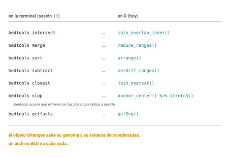
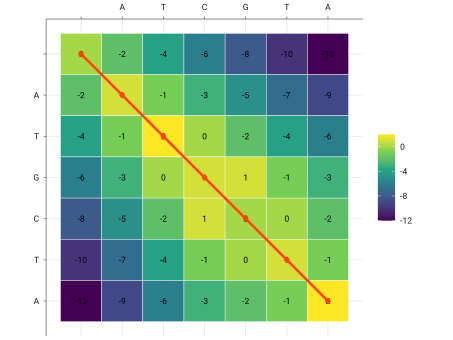

::: callout-box
**Lo que estos alumnos ya traen, y que no hay que volver a enseñar.**

Once sesiones de este curso. En concreto: terminal de Linux en un cluster
compartido; git y GitHub desde línea de comandos, con commits, remotos y
`.gitignore`; Markdown; disciplina de procedencia con accession, versión,
fecha y checksum; manipulación de FASTA con grep, tr, awk, seqkit y
samtools; matrices de sustitución y el marco log-odds; alineamiento por
pares incluyendo el problema del turista de Manhattan, el camino más
largo en un grafo dirigido acíclico, el grafo de alineamiento y la
explosión combinatoria; programación dinámica con Needleman-Wunsch y
Smith-Waterman, vistos algorítmicamente; BLAST y BLAT con valores E;
alineamiento múltiple; inferencia de ortología, que implementaron ellos
mismos en bash con awk; bases de datos y accesiones; ensamblados,
coordenadas y liftOver; y formatos de anotación con bedtools y tabix.

**No enseñar de nuevo**: qué es un directorio de trabajo, qué es control
de versiones, por qué importa la reproducibilidad, qué es un archivo
FASTA o BED, ni qué es un alineamiento.

Además, de las sesiones 12 y 13: vectores, matrices, ciclos, funciones,
tibbles, los verbos de dplyr, el pipe, y datos ordenados con
`pivot_longer()`. De sesiones anteriores del curso se cobran hoy dos
cosas: los alumnos ya cruzaron intervalos con `bedtools` y ya conocen la
trampa de coordenadas 0-based contra 1-based. Lo único genuinamente nuevo
en esta sesión es el objeto de rangos y la gramática de gráficas.
:::

## Idea central

Hoy hacen dos cosas que ya saben hacer, pero en R.

La primera es cruzar intervalos genómicos, que en la sesión 11 hicieron
con `bedtools`. La segunda es mirar los resultados, que hasta ahora
hacían exportando a otro lado.

Y al final van a graficar la matriz de su propio Needleman-Wunsch, que es
la figura más bonita que van a producir en este curso.

## Desarrollo

### Un intervalo que sabe que es un intervalo

En la sesión 11, un intervalo genómico era tres columnas de un archivo de
texto: cromosoma, inicio, fin. Nada más. Si el archivo decía `chr17` y el
otro decía `17`, `bedtools` devolvía cero sin quejarse. Si mezclaban un
GTF 1-based con un BED 0-based, todo salía corrido una base.

En R hay una alternativa: un objeto que **sabe** que es un rango genómico.

```r
library(GenomicRanges)

gr <- GRanges(
  seqnames = c("17", "17", "7"),
  ranges = IRanges(start = c(7668421, 7687000, 55019017),
                   end   = c(7687490, 7688000, 55211628)),
  strand = c("-", "-", "+"),
  gen = c("TP53", "algo", "EGFR")
)
gr
```

Miren lo que trae adentro. Cromosoma, coordenadas, **hebra**, y columnas
extra de metadatos. Y lo que no se ve pero está: un registro de qué
genoma es, que se llama `seqinfo`.

```r
seqinfo(gr)
genome(gr) <- "GRCh38"
seqinfo(gr)
```

Ese `genome` es lo que resuelve el problema de la sesión 11. Si intentan
cruzar dos objetos con genomas distintos declarados, R se niega y les
dice por qué, en lugar de devolver cero en silencio.

Además, **GenomicRanges es 1-based cerrado siempre**. No hay ambigüedad
que resolver, porque la conversión ocurre al leer el archivo y ya no
vuelve a aparecer.

::: callout-box
Esto no vuelve inútil a `bedtools`. Para cruzar dos archivos grandes desde
la terminal, `bedtools` sigue siendo lo correcto: es rápido, no necesita
cargar nada en memoria y funciona en cualquier máquina.

Lo que R agrega es que el intervalo y el análisis viven en el mismo
lugar. Cruzan, resumen, grafican y escriben el reporte sin exportar
nada. Cuando el trabajo es exploratorio, eso vale mucho.

Sepan las dos. Elijan según la tarea.
:::

### El mismo verbo, otra sintaxis

`plyranges` pone los verbos de dplyr sobre objetos de rangos. Si ya
piensan en `filter` y `mutate`, esto es directo.

Y hay una correspondencia casi uno a uno con lo que hicieron en bash:

{#fig-bedtools-plyranges}

| En `bedtools` | En `plyranges` |
|---|---|
| `intersect -a A -b B` | `join_overlap_inner(A, B)` |
| `merge` | `reduce_ranges()` |
| `sort` | `arrange()` o `sort()` |
| `subtract` | `setdiff_ranges()` |
| `closest` | `join_nearest()` |
| `slop -b 500` | `stretch(anchor_center(gr), 1000)` |
| `getfasta` | `Biostrings::getSeq()` |

```r
library(plyranges)

# Los exones que se solapan con variantes
exones %>%
  join_overlap_inner(variantes) %>%
  filter(width >= 50)

# Fundir los que se traslapan
exones %>% reduce_ranges()

# Ampliar 500 bases de cada lado
exones %>%
  anchor_center() %>%
  stretch(1000)
```

Ese `anchor_center()` antes de `stretch()` merece atención, porque es una
idea que `bedtools` no tiene. Al cambiar el ancho de un rango hay que
decidir qué se queda fijo: el inicio, el final o el centro. `plyranges`
los obliga a decirlo. `bedtools slop` lo asume.

### Leer archivos de verdad

`rtracklayer` lee los formatos que ya conocen y devuelve objetos de
rangos:

```r
library(rtracklayer)

anotacion <- import("datos/gencode_chr17.gtf")
exones <- import("resultados/tp53_exones.bed")
variantes <- import("datos/clinvar_chr17.vcf.gz")
```

Un solo verbo, `import()`, que reconoce el formato por la extensión. Y
acá viene lo importante: **al importar, `rtracklayer` hace la conversión
de coordenadas por ustedes**. Un BED 0-based entra y sale como un GRanges
1-based, correcto, sin que tengan que restar uno a nada.

El off-by-one de la sesión 11 desaparece porque el objeto sabe de dónde
vino.

```r
anotacion %>%
  filter(type == "exon", gene_name == "TP53") %>%
  reduce_ranges() %>%
  summarise(n_exones = n(), total_pb = sum(width))
```

### Graficar: la gramática

Ahora la segunda mitad de la sesión.

`ggplot2` implementa una idea llamada gramática de gráficas: una figura
se arma por capas, y cada capa dice **qué datos**, **qué se mapea a qué
propiedad visual**, y **con qué forma geométrica** se dibuja.

Tres piezas:

Los **datos**, que van en una tabla y deben estar en formato largo.

La **estética** (`aes`), que dice qué columna va al eje x, cuál al y,
cuál al color, cuál al tamaño.

El **geom**, que es la forma: puntos, líneas, barras, cajas, mosaicos.

```r
library(tidyverse)

gc <- read_tsv("resultados/gc-ventanas.tsv",
               col_names = c("posicion", "gc"))

ggplot(gc, aes(x = posicion / 1000, y = gc)) +
  geom_line()
```

Léanlo así: toma `gc`, mapea `posicion` al eje x y `gc` al eje y, y
dibújalo como línea. Las capas se suman con `+`, no con el pipe, que es
una inconsistencia histórica de R que a todos molesta y nadie va a
arreglar.

Agréguenle contexto:

```r
promedio <- mean(gc$gc)

ggplot(gc, aes(x = posicion / 1000, y = gc)) +
  geom_line(color = "steelblue") +
  geom_hline(yintercept = promedio, linetype = "dashed", color = "orange") +
  annotate("text", x = max(gc$posicion)/1000, y = promedio,
           label = sprintf("promedio %.1f%%", promedio),
           hjust = 1, vjust = -0.5, color = "orange") +
  labs(x = "Posición (kb)", y = "Contenido de GC (%)",
       caption = "Ventanas de 1 kb. Fago lambda, NC_001416.1.") +
  theme_minimal()
```

Fíjense en un detalle que confunde a todos: el color va **fuera** de
`aes()` cuando es un valor fijo, y **dentro** cuando depende de una
columna. `color = "steelblue"` pinta todo azul; `aes(color = genoma)`
pinta cada genoma de un color distinto y agrega una leyenda.

### Facetas

Cuando tienen varios grupos, en lugar de encimarlos se pueden separar en
paneles:

```r
gc_varios %>%
  ggplot(aes(x = posicion / 1000, y = gc)) +
  geom_line() +
  facet_wrap(~ genoma, ncol = 1, scales = "free_x") +
  labs(x = "Posición (kb)", y = "GC (%)")
```

Y acá se cobra `pivot_longer()` de la sesión pasada. Facetear requiere que
el grupo sea **una columna**, no varias. Con datos anchos hay que escribir
una capa por genoma; con datos largos es una línea.

Por eso ordenar los datos primero no es pedantería. Es lo que hace que
graficar sea corto.

### La matriz de programación dinámica

Y llegamos a la figura del capítulo.

Ustedes tienen una matriz de puntajes de su Needleman-Wunsch, y un
traceback. Vamos a dibujar los dos juntos.

{#fig-matriz-ejemplo}

Primero, la matriz tiene que pasar a formato largo, porque `ggplot2` no
sabe leer matrices:

```r
res <- nw("ATGCTA", "ATCGTA", submat, gap = -2)

matriz_larga <- as.data.frame(res$S) %>%
  mutate(i = row_number()) %>%
  pivot_longer(cols = -i, names_to = "j", values_to = "score") %>%
  mutate(j = as.integer(str_remove(j, "V")))

head(matriz_larga)
```

Después, el camino del traceback como una tabla de coordenadas:

```r
camino <- function(res) {
  i <- length(res$a) + 1; j <- length(res$b) + 1
  puntos <- list(c(i, j))
  while (i > 1 || j > 1) {
    paso <- res$T[i, j]
    if (paso == "diagonal")      { i <- i-1; j <- j-1 }
    else if (paso == "arriba")   { i <- i-1 }
    else                         { j <- j-1 }
    puntos[[length(puntos)+1]] <- c(i, j)
  }
  do.call(rbind, puntos) %>%
    as.data.frame() %>%
    setNames(c("i", "j"))
}

ruta <- camino(res)
```

Y ahora la gráfica:

```r
ggplot(matriz_larga, aes(x = j, y = i)) +
  geom_tile(aes(fill = score), color = "white") +
  geom_text(aes(label = score), size = 3) +
  geom_path(data = ruta, color = "orangered", linewidth = 1.2) +
  geom_point(data = ruta, color = "orangered", size = 2) +
  scale_fill_viridis_c() +
  scale_y_reverse(breaks = 1:(length(res$a)+1),
                  labels = c("", res$a)) +
  scale_x_continuous(breaks = 1:(length(res$b)+1),
                     labels = c("", res$b), position = "top") +
  coord_fixed() +
  labs(x = NULL, y = NULL, fill = "puntaje") +
  theme_minimal()
```

Deténganse a mirar lo que sale.

Cada celda es un estado del algoritmo. El color es el mejor puntaje
alcanzable hasta ahí. La línea naranja es el camino que el traceback
recorrió de regreso, y **ese camino es el alineamiento**.

En una sola figura está todo lo que vimos en la sesión 7 sobre
programación dinámica, calculado por su propio código.

Y de paso acaban de usar seis conceptos de `ggplot2`: dos geoms
superpuestos con datos distintos, una escala continua de relleno, un eje
invertido, ejes con etiquetas discretas puestas a mano, y proporción fija
con `coord_fixed()`.

::: callout-box
`scale_y_reverse()` está ahí por una razón concreta. Las matrices se leen
de arriba hacia abajo, con la celda (1,1) en la esquina superior
izquierda. Los ejes cartesianos van de abajo hacia arriba.

Sin ese `scale_y_reverse()`, la figura sale de cabeza y no corresponde a
cómo dibujaron la matriz en papel.

Es de esos detalles que no aparecen en ningún tutorial y que uno descubre
graficando.
:::

### Juntar figuras y guardarlas

Para poner varias gráficas en un panel:

```r
library(patchwork)

p1 + p2                    # lado a lado
p1 / p2                    # una encima de otra
(p1 + p2) / p3             # combinaciones
```

Y para guardar:

```r
ggsave("figuras/gc-lambda.png", plot = p1,
       width = 16, height = 8, units = "cm", dpi = 300)

ggsave("figuras/gc-lambda.svg", plot = p1,
       width = 16, height = 8, units = "cm")
```

Dos cosas. `ggsave()` guarda **la última gráfica** si no le dicen cuál,
lo cual es cómodo y también una fuente de errores; sean explícitos con
`plot =`. Y para figuras de publicación prefieran SVG o PDF sobre PNG,
porque son vectoriales y se pueden editar después sin perder calidad.

## Práctica

### Ejercicio 1. Del BED al GRanges

Importen su archivo de exones de la sesión 11 con `rtracklayer` y
compárenlo con lo que veían en el archivo de texto.

Las coordenadas son las mismas?

::: {.callout-note collapse="true"}
## Solución

```r
library(rtracklayer)
exones <- import("resultados/tp53_exones.bed")
exones
```

**No son las mismas, y eso es correcto.** El BED en disco tiene el inicio
en base 0; el objeto GRanges lo muestra en base 1, así que el número de
inicio aparece con una unidad más.

`rtracklayer` hizo la conversión al importar. Es exactamente el `+1` que
en la sesión 11 tuvieron que hacer a mano con `awk`, y que si se les
olvidaba corría todo una base.

Comprueben que el ancho sí coincide:

```r
width(exones)
```

El ancho es igual en las dos representaciones, porque es la diferencia y
la diferencia no cambia. Lo que cambia es dónde empieza a contarse.
:::

### Ejercicio 2. Cruzar en R lo que cruzaron en bash

Repitan el cruce de la sesión 11 (exones de TP53 contra variantes de
ClinVar) usando `plyranges`. Comparen el número de resultados con el que
obtuvieron con `bedtools`.

::: {.callout-note collapse="true"}
## Solución

```r
library(plyranges)

variantes <- import("datos/clinvar_chr17.vcf.gz")
exones <- import("resultados/tp53_exones.bed")

cruce <- exones %>%
  join_overlap_inner(variantes)

length(cruce)
```

Debería coincidir con el conteo de `bedtools`. Si no coincide, hay tres
sospechosos en orden de probabilidad.

El primero es la **nomenclatura de cromosomas**. Revísenla con
`seqlevels(exones)` y `seqlevels(variantes)`. Si difieren, se arregla así:

```r
seqlevelsStyle(exones) <- "Ensembl"
```

Ese comando es la versión civilizada del `sed` de la sesión 11, y encima
sabe qué estilos existen.

El segundo es que `bedtools` y `plyranges` cuenten distinto los
solapamientos parciales. Revisen si usaron `-f` en `bedtools`.

Y el tercero es el off-by-one, pero solo si el BED lo leyeron a mano en
lugar de con `import()`.
:::

### Ejercicio 3. Las ventanas de GC

Grafiquen sus ventanas de GC del fago lambda, con la línea del promedio
global anotada.

Después añadan un `geom_smooth()` y digan si aporta algo.

::: {.callout-note collapse="true"}
## Solución

El código base está en el desarrollo. Para el suavizado:

```r
ggplot(gc, aes(x = posicion / 1000, y = gc)) +
  geom_line(alpha = 0.4) +
  geom_smooth(method = "loess", span = 0.2, se = FALSE, color = "orangered") +
  geom_hline(yintercept = mean(gc$gc), linetype = "dashed") +
  labs(x = "Posición (kb)", y = "GC (%)")
```

`geom_smooth()` ajusta una curva. Con `method = "loess"` es un suavizado
local, bueno para menos de mil puntos; con más conviene `method = "gam"`.

Y sí aporta, bastante. La línea cruda tiene mucho ruido de ventana a
ventana; el suavizado deja ver el patrón de fondo, que es el punto de
cambio entre la mitad rica en GC y la rica en AT que discutieron en la
sesión 5.

El `span = 0.2` controla cuánto suaviza. Prueben con 0.05 y con 0.8 y
vean cómo cambia la historia que cuenta la figura. Ese parámetro es una
decisión analítica, no un default inocente.
:::

### Ejercicio 4. La matriz

Grafiquen la matriz de su Needleman-Wunsch con el traceback encima.

Después prueben con dos secuencias más largas, de unos quince
nucleótidos, y digan qué se rompe.

::: {.callout-note collapse="true"}
## Solución

El código está en el desarrollo. Con secuencias largas se rompen dos
cosas.

`geom_text()` con los puntajes se vuelve ilegible. La solución es
quitarlo, o ponerlo condicional:

```r
geom_text(aes(label = ifelse(abs(score) > 5, score, "")), size = 2)
```

Y `coord_fixed()` produce una figura muy alta o muy ancha si las
secuencias tienen longitudes muy distintas. Se puede quitar, aunque se
pierde la sensación de cuadrícula.

Hay una lección general ahí: **una figura que funciona con seis
elementos no necesariamente funciona con sesenta**. Diseñar para el
tamaño real de los datos es parte del trabajo.
:::

### Ejercicio 5. Anscombe, ahora sí

Con la tabla larga de Anscombe de la sesión pasada, grafiquen los cuatro
conjuntos en facetas con su recta de regresión.

::: {.callout-note collapse="true"}
## Solución

```r
ggplot(anscombe_largo, aes(x = x, y = y)) +
  geom_point(size = 2) +
  geom_smooth(method = "lm", se = FALSE, color = "orangered") +
  facet_wrap(~ conjunto) +
  labs(caption = "Los cuatro tienen la misma media, varianza y correlación.")
```

Las cuatro rectas son idénticas. Los cuatro conjuntos no se parecen en
nada: uno es lineal, otro es una parábola, otro es lineal con un
atípico que arrastra la recta, y el cuarto es una columna de puntos más
un punto solitario que inventa la pendiente entera.

Si tuvieran solo la tabla de estadísticas de la sesión pasada, los cuatro
serían el mismo análisis.

Prueben lo mismo con `datasaurus_dozen` y `facet_wrap(~ dataset)`.
:::

```{=html}
<!-- NOTA PARA EL INSTRUCTOR, no renderizar.
TIEMPOS ESTIMADOS:
  GRanges y por qué un objeto tipado   35 min
  plyranges y el puente desde bedtools 50 min
  rtracklayer                          25 min
  Gramática de ggplot2                 60 min
  Facetas                              25 min
  La matriz de programación dinámica   70 min
  patchwork y ggsave                   20 min
ORDEN DE RECORTE:
  1. Ejercicio 5 (Anscombe) -> ya lo vieron numéricamente, demostrarlo
  2. patchwork -> mencionar
  3. geom_smooth -> quitar del ejercicio 3
NO RECORTAR: la matriz de programación dinámica. Es el clímax del bloque.
-->
```

## Fuentes {.unnumbered}

- Lawrence, M. et al. (2013). Software for Computing and Annotating Genomic Ranges. *PLoS Computational Biology* 9(8): e1003118. [doi:10.1371/journal.pcbi.1003118](https://doi.org/10.1371/journal.pcbi.1003118)
- Lee, S., Cook, D. & Lawrence, M. (2019). plyranges: a grammar of genomic data transformation. *Genome Biology* 20: 4. [doi:10.1186/s13059-018-1597-8](https://doi.org/10.1186/s13059-018-1597-8)
- Lawrence, M., Gentleman, R. & Carey, V. (2009). rtracklayer: an R package for interfacing with genome browsers. *Bioinformatics* 25(14): 1841-1842. [doi:10.1093/bioinformatics/btp328](https://doi.org/10.1093/bioinformatics/btp328)
- Wickham, H. *ggplot2: Elegant Graphics for Data Analysis* (3a ed., en desarrollo). <https://ggplot2-book.org/>
- Hoja de referencia de ggplot2. <https://rstudio.github.io/cheatsheets/data-visualization.pdf>
- Pedersen, T. L. *patchwork*. <https://patchwork.data-imaginist.com/>
