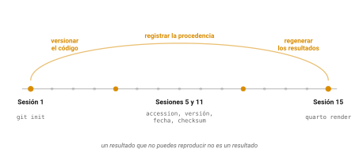

::: callout-box
**Lo que estos alumnos ya traen, y que no hay que volver a enseñar.**

Once sesiones de este curso. En concreto: terminal de Linux en un cluster
compartido; git y GitHub desde línea de comandos, con commits, remotos y
`.gitignore`; Markdown; disciplina de procedencia con accession, versión,
fecha y checksum; manipulación de FASTA con grep, tr, awk, seqkit y
samtools; matrices de sustitución y el marco log-odds; alineamiento por
pares incluyendo el problema del turista de Manhattan, el camino más
largo en un grafo dirigido acíclico, el grafo de alineamiento y la
explosión combinatoria; programación dinámica con Needleman-Wunsch y
Smith-Waterman, vistos algorítmicamente; BLAST y BLAT con valores E;
alineamiento múltiple; inferencia de ortología, que implementaron ellos
mismos en bash con awk; bases de datos y accesiones; ensamblados,
coordenadas y liftOver; y formatos de anotación con bedtools y tabix.

**No enseñar de nuevo**: qué es un directorio de trabajo, qué es control
de versiones, por qué importa la reproducibilidad, qué es un archivo
FASTA o BED, ni qué es un alineamiento.

Además, de las sesiones 12 a 14: R base, tibbles, dplyr, tidyr,
GenomicRanges, ggplot2, y una implementación propia de Needleman-Wunsch
con su gráfica. De la sesión 1 del curso se cobran hoy git, Markdown y la
disciplina de procedencia. Lo único genuinamente nuevo en esta sesión es
Quarto.
:::

## Idea central

El primer día de este curso quedamos en que un resultado que no pueden
reproducir no es un resultado.

Hoy, la última sesión, van a producir el objeto que cierra ese argumento:
un reporte que contiene el análisis y el código que lo generó, versionado
en el mismo repositorio donde han trabajado desde agosto.

Y antes de eso van a hacer algo que llevan tres sesiones esperando: tirar
a la basura su Needleman-Wunsch.

## Desarrollo

### El paquete

`pwalign::pairwiseAlignment()` resuelve alineamiento global, local y
ends-free. Está escrito en C, probado por miles de personas y con todos
los casos de borde resueltos.

````r
BiocManager::install("pwalign")
library(pwalign)

aln <- pairwiseAlignment(
  "ATGCTA", "ATCGTA",
  substitutionMatrix = submat,
  gapOpening = 0, gapExtension = 2,
  type = "global"
)
aln
score(aln)
````

Comparen con el suyo. Deberían coincidir.

::: callout-box
Un aviso que va a salvarles tiempo. Esta función **ya no vive en
Biostrings**. Se mudó al paquete `pwalign` en Bioconductor 3.19 y quedó
defunct en Biostrings desde la 3.22.

Cualquier tutorial, respuesta de foro o script heredado que diga
`Biostrings::pairwiseAlignment()` va a fallar con un mensaje que les dice
exactamente qué instalar. Ya saben por qué.

Es también un buen recordatorio del capítulo de accesiones: los recursos
cambian de versión, y el código que no dice contra qué versión se escribió
tiene fecha de caducidad silenciosa.
:::

Entonces para qué escribieron el suyo?

Porque ahora, cuando `pairwiseAlignment()` devuelva algo raro, van a
saber qué está pasando por dentro. Porque entienden por qué la
penalización de apertura y la de extensión son parámetros separados.
Porque cuando alguien les diga que BLAST "aproxima Smith-Waterman", van a
saber que no.

Nadie escribe su propio alineador para trabajar. Se escribe una vez, para
entenderlo, y después se usa el paquete.

### Quarto

Un script de R produce resultados. Un documento de Quarto produce
resultados **y** el argumento que los rodea, en un solo archivo.

Ya conocen Markdown de la sesión 1. Un `.qmd` es Markdown con dos cosas
más: un encabezado YAML y bloques de código que se ejecutan al compilar.

````markdown
---
title: "Análisis de homología en levaduras"
author: "Su nombre"
date: today
format: html
---

## Introducción

Texto normal en Markdown, con **negritas** y listas.

```{{r}}
#| label: carga
#| message: false
library(tidyverse)
hits <- read_tsv("resultados/blast_hits.tsv")
```

La tabla tiene `r nrow(hits)` filas.

```{{r}}
#| label: fig-identidad
#| fig-cap: "Distribución de identidad porcentual."
ggplot(hits, aes(x = pident)) +
  geom_histogram(bins = 30)
```
````

Tres cosas que vale la pena señalar.

Los bloques de código llevan opciones con `#|`, y las que más van a usar
son `echo` (mostrar o no el código), `eval` (ejecutarlo o no), `message` y
`warning` (silenciar el ruido), y `fig-cap` (poner pie de figura).

El `` `r nrow(hits)` `` en medio del texto es **código en línea**. Ese
número no está escrito a mano: se calcula al compilar. Si mañana cambian
los datos, el texto cambia solo. Ese pequeño detalle es la diferencia
entre un reporte vivo y una fotografía.

Y el `label: fig-identidad` permite referenciar la figura con `@fig-identidad`
en el texto, con numeración automática. Es el mismo mecanismo con el que
está escrito este libro.

### Compilar

````bash
quarto render reporte.qmd
````

Desde RStudio hay un botón que hace lo mismo.

Lo que ocurre por dentro: Quarto ejecuta todos los bloques de código en
orden, en una sesión limpia, y con los resultados arma el documento final.

Esa frase esconde la propiedad importante. **Una sesión limpia.** Si su
reporte compila, es porque el código funciona desde cero, sin depender de
objetos que quedaron en su memoria de trabajo de hace tres horas.

Un `.qmd` que compila es un análisis que alguien más puede correr. Uno
que solo funciona en su computadora, con su historial, no lo es.

::: callout-box
De ahí sale la regla de higiene más útil de todo el bloque: **reinicien R
y compilen desde cero antes de dar algo por terminado.**

En RStudio es Session, Restart R, y luego Render. Si compila, funciona. Si
no, acaban de descubrir una dependencia oculta que habrían descubierto
igual, pero en el peor momento posible.
:::

### Por qué esto cierra el arco

Vuelvan a la sesión 1.

{#fig-arco}

Ese día vimos que buena parte de los análisis publicados no se pueden
volver a correr, con cifras concretas: Stodden y colaboradores lograron
reproducir el 26% de los artículos de *Science* que examinaron; Culina y
colaboradores encontraron código disponible en apenas el 27% de los
trabajos de ecología que revisaron.

Y quedamos en que el antídoto tiene tres partes: versionar el código,
registrar la procedencia de los datos, y poder regenerar los resultados.

Ya tienen las tres. El repositorio de git lo abrieron en agosto. La
procedencia la vienen anotando desde la sesión 5. Y lo que falta,
regenerar los resultados con un comando, es exactamente lo que hace
`quarto render`.

El reporte de hoy no es un ejercicio de formato. Es la pieza que faltaba.

### Lo que sigue

Última cosa antes de la práctica, y es orientación más que contenido.

Este bloque fue una introducción. Lo que no vieron y van a necesitar:

**Estadística en R.** Modelos lineales, pruebas de hipótesis, y sobre todo
los métodos de expresión diferencial (DESeq2, edgeR, limma) que son la
razón principal por la que la genómica usa R.

**Python.** Como dijimos el primer día del bloque, no es una competencia.
Para célula única a gran escala, aprendizaje profundo y orquestación de
pipelines, es la herramienta. Van a usar las dos y a pasar datos de una a
otra.

**Bioconductor a fondo.** Vieron `Biostrings`, `GenomicRanges` y
`rtracklayer`, que son tres de más de dos mil cuatrocientos paquetes. El
contenedor estándar para datos de expresión se llama
`SummarizedExperiment` y lo van a conocer pronto.

**Entornos reproducibles.** `renv` guarda la versión exacta de cada
paquete de un proyecto. Es el siguiente paso natural de la disciplina que
ya tienen.

Y en cuarto semestre, mapeo de lecturas, que es la parte de la
bioinformática que deliberadamente no cubrimos acá.

## Práctica

La práctica de hoy es una sola cosa: **escribir el reporte**.

### Ejercicio 1. Verificar contra el paquete

Antes de empezar el reporte, cierren el asunto pendiente.

````r
library(pwalign)

mio <- nw("ATGCTAGCTA", "ATCGTAGCTA", submat, gap = -2)
suyo <- pairwiseAlignment("ATGCTAGCTA", "ATCGTAGCTA",
                          substitutionMatrix = submat,
                          gapOpening = 0, gapExtension = 2,
                          type = "global")

mio$score
score(suyo)
````

::: {.callout-note collapse="true"}
## Solución

Deben coincidir. Si no, revisen en este orden.

**El signo del gap.** Ustedes escribieron `gap = -2` y suman;
`pairwiseAlignment()` recibe `gapExtension = 2` y resta.

**El modelo de hueco.** Su implementación cobra lo mismo por cada hueco,
o sea un modelo lineal. `pairwiseAlignment()` usa el modelo afín, con
apertura y extensión separadas. Para que sean equivalentes hay que poner
`gapOpening = 0`.

**La matriz.** Que sea la misma en los dos y con los mismos `dimnames`.

Si después de eso no cuadra, comparen las matrices completas con
secuencias de tres o cuatro letras, celda por celda. Encontrar ese error
enseña más que si hubiera salido bien a la primera.
:::

### Ejercicio 2. El reporte

Escriban un documento de Quarto que analice **sus propios resultados del
semestre**, y compílenlo.

Lo mínimo que debe tener:

Un encabezado YAML con título, autor y fecha.

Una sección de **datos** que diga de dónde salió cada archivo, con
accession, versión y fecha. Es su archivo de procedencia, convertido en
prosa.

Al menos **tres figuras** hechas con `ggplot2`, cada una con su pie.
Sugerencias: la distribución de identidad de sus hits de BLAST, las
ventanas de GC del fago lambda, y la matriz de su Needleman-Wunsch.

Al menos **una tabla** resumida con `dplyr`, por ejemplo cuántos hits
significativos hubo por consulta, o cuántos pares recíprocos encontraron.

**Un número calculado en línea** en medio del texto, con `` `r ` ``.

Y una sección corta de **conclusiones** en prosa, escrita por ustedes, que
diga qué encontraron.

::: {.callout-note collapse="true"}
## Guía

Un esqueleto para arrancar:

````markdown
---
title: "Bioinformática I: resultados del semestre"
author: "Su nombre"
date: today
format:
  html:
    toc: true
    code-fold: true
---

## Datos

| Archivo | Origen | Accession | Fecha |
|---|---|---|---|
| lambda.fasta | NCBI | NC_001416.1 | 2026-09-11 |
| ... | ... | ... | ... |

```{{r}}
#| label: setup
#| message: false
library(tidyverse)
hits <- read_tsv("resultados/blast_hits.tsv")
gc   <- read_tsv("resultados/gc-ventanas.tsv")
```

## Búsqueda por similitud

Se analizaron `r nrow(hits)` alineamientos, de los cuales
`r sum(hits$evalue < 1e-20)` tienen un valor E menor a 1e-20.

```{{r}}
#| label: fig-identidad
#| fig-cap: "Distribución de identidad porcentual en los hits recuperados."
ggplot(hits, aes(x = pident)) +
  geom_histogram(bins = 30, fill = "steelblue") +
  labs(x = "Identidad (%)", y = "Número de hits")
```

## Conclusiones

(Su texto.)
````

Ese `code-fold: true` del YAML esconde el código detrás de un botón, de
modo que el reporte se lee como un documento pero el código sigue ahí
para quien lo quiera. Es la mejor opción por defecto para un reporte.

**Antes de entregarlo**: reinicien R y compilen desde cero. Si falla, hay
una dependencia oculta.
:::

### Ejercicio 3. Cerrar el repositorio

Suban el reporte a su repositorio y revisen qué hay adentro.

````bash
cd ~/bioinfo1
git add reporte.qmd reporte.html
git commit -m "Reporte final del semestre"
git push

git log --oneline | wc -l
git log --oneline | tail -5
````

::: {.callout-note collapse="true"}
## Solución

Ese conteo de commits es el número de veces que guardaron su trabajo
desde agosto.

Y las últimas cinco líneas de `git log`, que por el `tail` son en
realidad las **primeras**, deberían incluir aquel commit de la sesión 1
que decía algo como "Sesión 01: tamaño y GC del genoma de lambda".

Entre ese commit y el de hoy hay un semestre.

Sobre qué subir: el `.qmd` siempre, porque es el código. El `.html`
compilado es discutible; súbanlo si quieren que se pueda leer el
resultado sin compilar, pero recuerden que se regenera. Los datos crudos
no van, como siempre.

Lo que tienen ahora es un repositorio público con cuatro meses de trabajo
documentado y su nombre en cada commit. Eso es un portafolio, y sirve
para solicitar una estancia o un posgrado mejor que una calificación.
:::

````{=html}
<!-- NOTA PARA EL INSTRUCTOR, no renderizar.
TIEMPOS ESTIMADOS:
  Revelar pwalign y comparar        40 min
  Quarto: YAML, chunks, opciones    50 min
  Compilar y la sesión limpia       25 min
  Cerrar el arco de reproducibilidad 20 min
  Lo que sigue                      15 min
  Ejercicio 2 (el reporte)         120 min
  Ejercicio 3 (git)                 20 min
ORDEN DE RECORTE:
  1. "Lo que sigue" -> pasarlo a lectura
  2. El ejercicio 1 -> demostrarlo en vivo
  3. Reducir el reporte a dos figuras
NO RECORTAR: el tiempo del ejercicio 2. Es la entrega del curso y tienen
que poder terminarla en clase, con el instructor disponible.
-->
````

## Fuentes {.unnumbered}

- Quarto, documentación. <https://quarto.org/>
- Bioconductor, paquete pwalign. <https://bioconductor.org/packages/pwalign/>
- Wickham, H., Çetinkaya-Rundel, M. & Grolemund, G. *R for Data Science* (2a ed.), sección de comunicación. <https://r4ds.hadley.nz/>
- Versión en español: *R para Ciencia de Datos*. <https://es.r4ds.hadley.nz/>
- Stodden, V., Seiler, J. & Ma, Z. (2018). An empirical analysis of journal policy effectiveness for computational reproducibility. *PNAS* 115(11): 2584-2589. [doi:10.1073/pnas.1708290115](https://doi.org/10.1073/pnas.1708290115)
- Culina, A. et al. (2020). Low availability of code in ecology: A call for urgent action. *PLoS Biology* 18(7): e3000763. [doi:10.1371/journal.pbio.3000763](https://doi.org/10.1371/journal.pbio.3000763)
- Ushey, K. *renv: Project Environments*. <https://rstudio.github.io/renv/>
