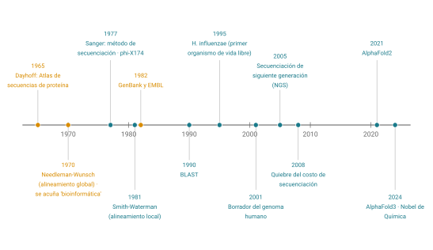
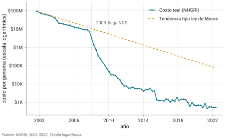
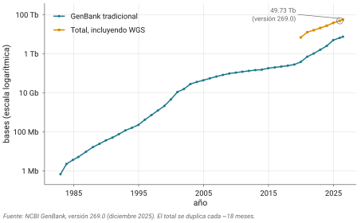
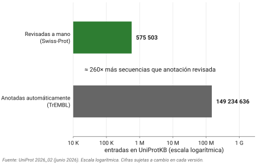
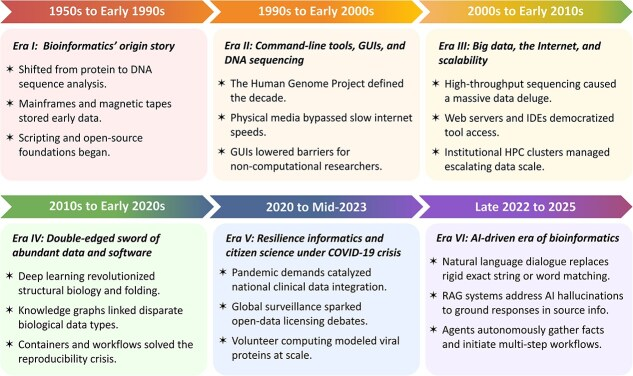

# El curso {.section-divider}

## ¿Quién soy?

- Investigador en el Instituto de Neurobiología, UNAM (lab A-03,
  Juriquilla)
- Estudio la **regeneración en la babosa *Deroceras laeve***: genoma,
  transcriptómica, imagen de microscopía
- Genoma a nivel de cromosomas: [Miranda-Rodríguez et al. 2025,
  *G3*]{.ref}
- Trabajo diario: mitad teoría, mitad terminal, mitad experimental

::: notes
Presentarse con calma: la babosa, el atlas SlugAtlas, y que el análisis
de datos es el pan de cada día del laboratorio. Preguntar nombres y de
dónde vienen.
:::

## ¿Quiénes somos? Wilbert Gutiérrez

- Investigador postdoctoral en el Instituto de Neurobiología, UNAM (lab
  A-03, Juriquilla)
- Estudio la **regeneración y desarrollo embrionario en la babosa
  *Deroceras laeve***: genoma, transcriptómica, metagenómica
- Caracterización metagenómica de las babosas: [Gutiérrez-Sarmiento et
  al. 2025, *Microb Ecol.*]{.ref}
- Trabajo diario: mitad experimental, mitad terminal

::: notes
Presentarse con calma: la babosa, el atlas SlugAtlas, y que el análisis
de datos es el pan de cada día del laboratorio. Preguntar nombres y de
dónde vienen.
:::

## ¿Quiénes somos? Haydée Peruyero

- Matemática. Profesora asociada de tiempo completo ENES Juriquilla
- Estudio topología, geometría y data science con aplicaciones en
  bioinformática y ecología microbiana.
- Análisis topológico de datos captura transferencia horizontal de
  genes: [Guerrero-Flores et al. 2025, Front Mircobiol.]{.ref} .
  MicroAgobiome: plataforma para el análisis de microbiomas agrícolas y
  sus interacciones. Microbioma de mieles: caracterización metagenómica
  y desarrollo de un dashboard interactivo.
- Trabajo diario: programación, docencia, investigación

## Organización del semestre {.smaller}

**Viernes 10:00–15:00 · Excepto Bloque C (por confirmar) 21 de agosto –
27 de noviembre · 15 sesiones**

| Bloque | Sesiones | Docente | Tema |
|------------------|------------------|------------------|------------------|
| **A** | 1 (hoy) | Jero | Introducción + arranque de cómputo |
| **A** | 2–6 | Wilbert | Secuencias, código genético, matrices, FASTA, alineamientos |
| **B** | 7–11 | Jero | Algoritmos, BLAST, homología, bases de datos, browsers |
| **C** | 12–15 | Haydée Peruyero | Introducción a R |

- Exámenes institucionales: 1–11 de diciembre tengo que confirmar si se
  recorrieron por lo del examen de ingreso.

## Cómo trabajamos

- **Sitio del curso**: [jerolon.github.io/Bioinformatica_I_2026](#0)
  - Realmente es el repositorio de fuentes y **temario**, calendario, y
    agregador para las prácticas y presentaciones de los diferentes
    instructores.
  - No es necesario leerlo, pero puede serles útil. Tiene buen material
    de lectura extra
- Cada sesión: **teoría** + **práctica** (laptop y terminal)
- Las entregas serán en **su repositorio git** que crearemos hoy
- Cuenta en el cluster `ken` para las prácticas de cómputo

## Verificar ¿Todos tienen mobaXterm o terminal en mac?

- Si no, ir descargando para windows
  <https://mobaxterm.mobatek.net/download.html> para la práctica más
  adelantes
- ¿Todos tienen cuenta en github? Si no, hacerla ahora o en el descanso

## Evaluación (propuesta) {.smaller}

| Componente                          | Peso |
|-------------------------------------|------|
| Participación y asistencia          | 10%  |
| Prácticas y tareas (en su repo git) | 50%  |
| Proyecto                            | 20%  |
| Exámenes                            | 20%  |

- Exámenes parciales al final de cada unidad
  - Un chance de reponer un parcial si reprobaron (o si reprobaron
    todos, final)
- Proyecto final con presentaciones en diciembre o cuando podamos
  acomodar
- Grupal 1-3 integrantes
- ¿Preguntas?

# ¿Qué es la bioinformática? {.section-divider}

## Las dos ideas de hoy

1.  La bioinformática moldeada por cuellos de botella históricos y
    presentes: un **diluvio de datos**, escasez o abundancia de
    software, cómputo, almacenamiento, etc.
2.  La base práctica de todo lo demás es la **reproducibilidad**: hoy
    empieza con una bitácora y con git

## 1970: la palabra es más vieja de lo que parece

- **Paulien Hogeweg y Ben Hesper**, Utrecht: *"Bio-informatica: een
  werkconcept"*
- Su definición: el estudio de **los procesos informáticos en los
  sistemas biológicos**
- Así como la bioquímica estudia el metabolismo, la bio-informática
  estudiaría el procesamiento de información que hace la vida:
  evolución, DNA → célula, procesamiento neuronal
- No hablaban de usar computadoras para analizar secuencias

[Hogeweg 2011, PLoS Comp Biol: el sentido original reaparece como
"biología de sistemas"]{.ref}

## El sentido moderno

**Bioinformática** en el sentido moderno: desarrollo y aplicación de
métodos computacionales para almacenar, organizar y analizar datos que
provienen de los seres vivos.

::: callout-box
**BISTIC (NIH, 2000)** separó dos términos que se confundían:

- **Bioinformática** → herramientas y datos
- **Biología computacional** → hipótesis, modelos matemáticos y
  simulación
:::

Se popularizó a finales de los 80, cuando la secuenciación empezó a
producir más datos.

::: notes
BISTIC: NIH Biomedical Information Science and Technology Initiative
Consortium.
:::

## ¿Qué hay en un nombre? 🌹 {.smaller}

- La frontera bioinformática / biología computacional / biología de
  sistemas / ciencia de datos **no está zanjada**
- Markowetz 2017: *"All biology is computational biology"*. Ni debería
  zanjarse; el cómputo se volvió parte integral de la biología
- ¿la bioinformática es **infraestructura** al servicio de la biología
  "de verdad", o **investigación** con preguntas propias?

::: callout-box
Mi postura: aprender a construir y correr herramientas, **siempre al
servicio de una pregunta biológica**.
:::

# Una historia corta, con nombres propios {.section-divider}

## Margaret Dayhoff, 1965

- *Atlas of Protein Sequence and Structure*: las **65 proteínas**
  conocidas entonces
- Primera colección de secuencias computarizada y pública: el modelo de
  GenBank y todo lo que vino después
- Con Richard Eck: las matrices **PAM**, el puntaje de qué tan probable
  es que un aminoácido mute a otro
- Cuando Wilbert les explique matrices de sustitución, estarán usando la
  idea de Dayhoff

[Strasser 2010, Journal of the History of Biology: collecting, comparing
and computing sequences as a way of knowing]{.ref}

## La línea del tiempo

{fig-align="center"}

::: notes
Señalar los tres hitos naranjas: Dayhoff 1965, phi-X174 1977, H.
influenzae 1995. NW 1970, SW 1981, EMBL/GenBank 1982, DDBJ 1987 → INSDC,
FASTA/BLAST, levadura 96, C. elegans 98, humano 2001.
:::

## Del genoma humano a AlphaFold {.smaller}

- **2001**: borrador del genoma humano: carrera consorcio público vs.
  Celera (Venter)
- **\~2005**: llega la NGS; secuenciar se abarató **más rápido que el
  cómputo**
- **2021**: AlphaFold2 predice estructura 3D desde secuencia con
  precisión comparable a la experimental; AlphaFold3 (2024) suma
  ligandos, iones, ácidos nucleicos
- **2024**: Nobel de Química: Hassabis y Jumper (AlphaFold), Baker
  (diseño de proteínas)

# El diluvio de datos {.section-divider}

## Secuenciar se volvió lo barato

{fig-align="center"}

- 2001: \~95 millones USD por genoma humano → 2023: **menos de 200 USD**
- La caída de 2008 (NGS) es más rápida que la ley de Moore
- **El análisis se volvió el cuello de botella**

## Las bases de datos explotan {.smaller}

{fig-align="center"}

- **GenBank** (dic 2025): 49.73 billones (e+12) de bases; se duplica
  cada \~18 meses desde 1982
- **SRA**: \>40 petabases de lecturas crudas públicas
- **PubMed**: \>40 millones de citas · **PDB**: \>230,000 estructuras

## La brecha de anotación {.smaller}

{fig-align="center"}

- UniProtKB: **Swiss-Prot** (curado a mano) \~575 mil entradas vs.
  **TrEMBL** (automático) \~149 millones → proporción **260 a 1**
- **Menos del 0.4%** de las proteínas tiene anotación revisada por una
  persona
- Lo que "sabemos" de una proteína cualquiera suele ser una **inferencia
  computacional**, no un hecho medido (importante cuando corramos BLAST)

# ¿Qué hace un bioinformático? {.section-divider}

## El 80% del tiempo

::: callout-box
Encuesta a científicos de datos (CrowdFlower/Forbes 2016): \~60% del
tiempo limpiando y organizando datos, \~19% recolectándolos. **\~80% es
preparar datos antes de poder analizarlos. \~76% ve esto como la parte
más aburrida de su trabajo.**
:::

- Cualquiera que haya trabajado con datos reales se reconoce ahí
- El cuello de botella de data science en general es la recolección,
  limpieza, y preparación de los datos

## Dos mitos sobre la IA {.smaller}

::: desventaja
**Mito 1: "AlphaFold ya resolvió la biología".** Predice estructura
estática, muy bien. No predice función, ni dinámica, ni regiones
desordenadas y a veces alucina estructuras plausibles. Predecir la forma
difiere de entender qué hace, con quién, cuándo y por qué.
:::

::: desventaja
**Mito 2: "Los modelos LLM de frontera vuelven obsoletos a los
bioinformáticos".** El 80% de cuello de botella se abre. ¿Cuál es el
siguiente cuello de botella? La pregunta biológica, la calidad de los
datos, la reproducibiliad, la validación experimental y la evaluación
crítica de los resultados.
:::

## Un caso para discutir: Mythos 5 {.smaller}

- Junio 2026: Anthropic afirma que Mythos 5, "en más de una semana de
  trabajo mayormente autónomo", integró single cell de **138 especies**
  y superó a un modelo de *Science* (TranscriptFormer) siendo 100× más
  chico
- Detalle: un coautor de SAMap (comparación de scRNA-seq entre especies)
  **fue contratado por Anthropic antes del lanzamiento**
- Inferencia razonable: alguien con conocimiento profundo definió el
  problema, eligió el punto de comparación y supo reconocer que el
  resultado era importante

**¿Qué evidencia adicional pedirían antes de creerle al anuncio?**

## ¿Nos deja sin trabajo la IA? {.smaller}

- Las acciones de las empresas apuntan a **acelerar**, no reemplazar:
  Anthropic compró Coefficient Bio (\~400 MUSD), contrató a John Jumper;
  4 laboratorios de IA acumulan ≥80 profesores

- …y a la vez **restringen** sus modelos más potentes en biología (Fable
  5 desvía(ba) consultas como "¿qué es una mitocondria?")

- Desde México, dos perspectivas:

  - **Optimista**: baja la barrera de entrada para quien está bien
    formado
  - **Pesimista**: las herramientas de frontera están tras controles de
    exportación, costos en dólares, hardware prohibitivo y datos
    dominados por el inglés

- Estas se corresponden con lo que se pregunta Cory Doctorow:

::: {}
how is it that some AI’s users describe their experience as a hellish
ordeal, while others delight in the ways that AI is changing their lives
for the better?
:::

[npj Digital Medicine 2026: el oficio de bioinformático sí se transforma
de ejecutar workflows a diseñar, juzgar y responder por los
resultados]{.ref}

## ¿Centauro o centauro inverso? {.smaller}

::::: columns-equal
::: {}
{fig-align="center"
height="330"}

**Centauro**: cabeza humana, cuerpo de máquina (incansable, más fuerte).
La persona hace la pregunta, decide, dirige y juzga; la herramienta hace
el trabajo pesado.
:::

::: {}
{fig-align="center"
width="377"}

**Centauro inverso**: cabeza de máquina, cuerpo humano. El sistema
decide el qué y el cómo; la persona es una marioneta que tiene que
seguirla hasta el límite de sus fuerzas: repartidores dirigidos por la
app, revisores que aprueban lo que el algoritmo ya decidió.
:::
:::::

[Concepto de Cory Doctorow (*Pluralistic*); "centauro" viene del ajedrez
por equipos humano + máquina posterior a Deep Blue. Imágenes: *Centaur
Spartan*, [AdnanVA
(DeviantArt)](https://www.deviantart.com/adnanva/art/Centaur-Spartan-1075119474)
· centauro inverso: collage de [Doctorow, "Reverse centaurs are the
answer to the AI paradox",
2025](https://pluralistic.net/2025/09/11/vulgar-thatcherism/), CC BY
4.0]{.ref}

::: notes
Doctorow: el centauro usa la máquina como herramienta que lo amplifica;
el centauro inverso es una persona usada como periférico de la máquina
(repartidores dirigidos por la app, revisores que aprueban lo que el
algoritmo ya decidió). Pregunta para el grupo: pegar la tarea en el chat
y entregar lo que salga sin leerlo, ¿cuál de los dos es? La meta del
curso es formar centauros: entender lo suficiente para dirigir la
herramienta y responder por el resultado.
:::

## Cada era destapa el siguiente cuello de botella

{fig-align="center"
width="88%"}

[Figura 1 de Truong & Ritchie 2026, *Briefings in Bioinformatics*,
[doi:10.1093/bib/bbag256](https://doi.org/10.1093/bib/bbag256) — CC
BY-NC 4.0]{.ref}

# Reproducibilidad {.section-divider}

## Los números del problema {.smaller}

- **Stodden et al. 2018** (*PNAS*): de 204 artículos de *Science*,
  consiguieron materiales del 44% y reprodujeron el **26%**
- **Culina et al. 2020** (*PLoS Biol*, ecología): código disponible en
  el **27%** de 346 artículos (los datos, en el 79%)
- **Mangul et al. 2019** (herramientas ómicas): 28% de URLs muertas,
  **49% falla una instalación básica**

La reproducibilidad hoy es un problema **más de código que de acceso a
datos**.

## Un centauro reverso, rompe. Un centauro, viaja rápido y seguro {.smaller}

::: desventaja
*Move fast and break things*: un script de 200 líneas en 30 segundos,
que corre, da un número y nadie entiende. Genes inventados; \~147 mil
citas alucinadas estimadas en un año.
:::

::: ventaja
*Move fast with stable infrastructure*: el mismo modelo escribe el
README, documenta el script, explica el error críptico, arma el
`.gitignore`. Trabajo de reproducibilidad que antes se saltaba por
flojera.
:::

**La diferencia entre las dos versiones es la preparación académica** (y
la propiedad de los medios de producción, pero ésa es otra discusión).

## El contexto mexicano {.smaller}

- **LCG (2003)**: primera licenciatura de su tipo en América Latina (CCG
  Cuernavaca + IBt)
- **LIIGH** (Juriquilla, 2015): paleogenómica, genómica de poblaciones y
  de cáncer, cluster propio
- **INMEGEN** (medicina genómica) · **LANGEBIO** (Cinvestav, 2005)
- No es el centro del mundo de la bioinformática, pero es un lugar
  serio: datos, cómputo y gente con preguntas propias. **Ese es su
  ecosistema.**

## Libro para el módulo de alineamientos y algoritmos (octubre) {.smaller}

Un libro moderno y súper didáctico:

- Compeau, P. & Pevzner, P. *Bioinformatics Algorithms: An Active
  Learning Approach*. Active Learning Publishers.
  <https://bioinformaticsalgorithms.org>

- No está en biblioteca pero tienen acceso en
  <https://cogniterra.org/course/868/promo> confirmen y avísenme si
  tienen acceso (hay que hacer cuenta en Cogniterra).

- Hecho sobre todo para alumnos de ciencias de la computación. Sólo
  veremos el capítulo 5: How do we compare biological sequences?

- Tarea: hojear los capítulos, elegir uno que les llame la atención y
  describir en un par de párrafos por qué? Tiene que ver con sus
  proyectos? Se les hizo chistoso?

# La práctica de hoy. Después del break {.section-divider}

## Git para científicos

- La práctica vive en el sitio del curso: [**Práctica: git para
  científicos**](../contenido/01-fundamentos/sesion01-practica.html)
- Hoy:
  - Entran por primera vez a `ken`
  - Montan **el repositorio donde van a entregar todo el semestre**
  - Bitácora en Markdown: la diferencia entre un análisis que existe y
    uno que se puede sostener

::: callout-box
Capítulo de referencia de esta sesión: [¿Qué es la
bioinformática?](../contenido/01-fundamentos/que-es-la-bioinformatica.html)
:::
