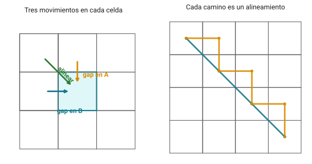
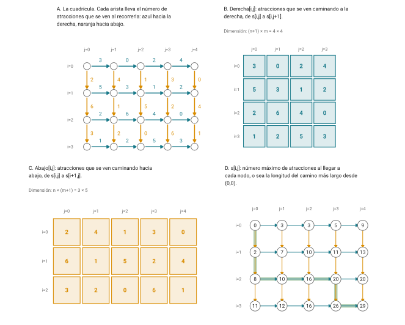
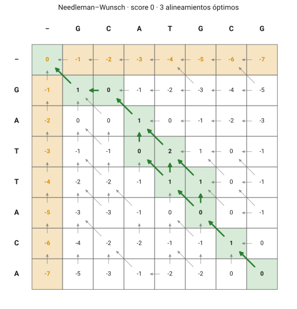
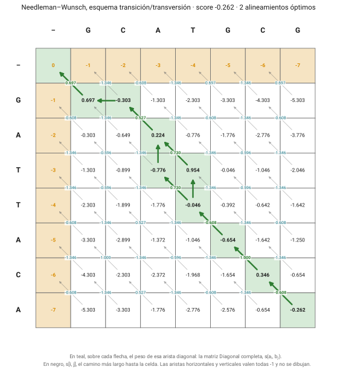
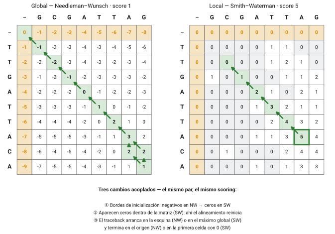
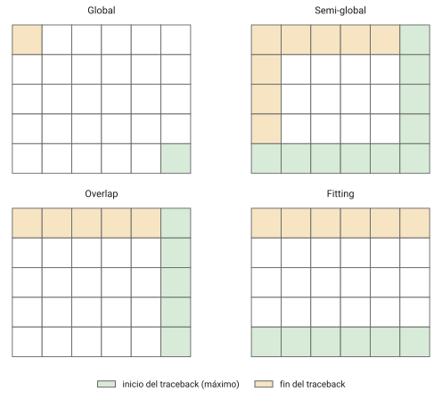
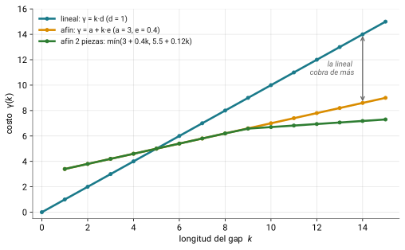
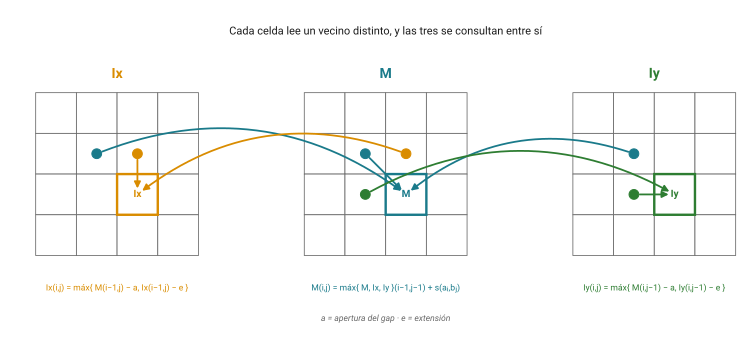
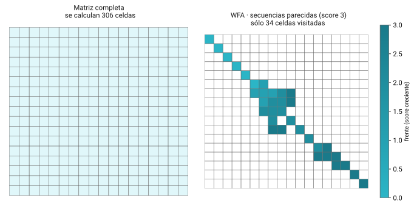

# Regreso al bloque {.section-divider}

## Dónde estamos

- Sesiones 2–6 con Wilbert: secuencias, código genético, **matrices de
  sustitución** (PAM/BLOSUM), FASTA y el **alineamiento como concepto**
- Hoy abrimos la caja negra: cómo se *calcula* el alineamiento óptimo,
  por qué funciona y cuánto cuesta
- Bloque C (sesiones 7–11): algoritmos → BLAST → homología → bases de
  datos → browsers

::: notes
TODO: preguntar qué quedó de la sesión 6 (Hamming, LCS, el turista de
Manhattan sin diagonales, global / local / semiglobal como tipos).
Ajustar el ritmo de la mañana según la respuesta.
:::

## Las dos ideas de hoy

1.  La **programación dinámica** llena una matriz y hace *traceback*:
    Needleman–Wunsch a mano, en papel, sí se puede
2.  Global y local son **el mismo algoritmo** con tres cambios
    acoplados

::: callout-box
El algoritmo garantiza el óptimo **bajo los parámetros dados**. No
garantiza que ese alineamiento sea la historia evolutiva real.
:::

## El plan del día

| Horario     | Bloque                                                   |
|-------------|----------------------------------------------------------|
| 10:00–11:45 | Teoría: programación dinámica, NW, SW, gaps, matrices     |
| 11:45–12:15 | Descanso                                                 |
| 12:15–14:30 | Práctica: NW a mano · `needle` y `water` · Rosalind      |
| 14:30–15:00 | Cierre, dudas, entregable                                |

# ¿Cuántos alineamientos hay? {.section-divider}

## Alinear es recorrer una cuadrícula

{fig-align="center"}

- Una secuencia en horizontal, la otra en vertical; de la esquina
  superior izquierda a la inferior derecha
- Tres movimientos: **diagonal** (residuo contra residuo),
  **horizontal** y **vertical** (gap en una u otra)
- Cada camino distinto es un alineamiento distinto

## El número obsceno {.smaller}

{fig-align="center"}

- Dos secuencias de 11 nt: 705,432 alineamientos
- De 100: cerca de 10⁵⁹ · de 300: 10¹⁷⁹ (átomos del universo
  observable: ~10⁸⁰)
- Enumerarlos y quedarse con el mejor no es una opción

::: notes
TODO: Wilbert ya mostró esta figura en la sesión 6. Decidir si se repite
o si basta con la tabla de números y pasar rápido a la solución.
:::

# Programación dinámica {.section-divider}

## Bellman, años cincuenta {.smaller}

- **Richard Bellman**, RAND Corporation: un problema grande se resuelve
  combinando soluciones **óptimas de subproblemas** más chicos
- Cada subproblema se resuelve **una sola vez** y se guarda en una
  tabla
- El nombre: *"dynamic programming"* para esconder que hacía
  matemáticas de un jefe con *"a pathological fear and hatred of the
  word research"* (Bellman, *Eye of the Hurricane*, 1984)
- Descubrimiento múltiple: Vintsyuk 1968 (reconocimiento de voz),
  Needleman & Wunsch 1970, Sankoff 1972

[Dreyfus 2002, *Operations Research* 50(1):48-51]{.ref}

## El turista de Manhattan

{fig-align="center"}

::: notes
A: cada arista lleva las atracciones que se ven al recorrerla. B y C:
las dos tablas de pesos, con dimensiones DISTINTAS entre sí. D: la tabla
s ya llena; en verde, un camino óptimo. 35 caminos posibles, el más
largo ve 29. Recordar que en la sesión 6 vieron a la voraz perder.
:::

## Una especie de sudoku {.smaller}

Primero lo fácil (los bordes, sumas acumuladas); luego, cada celda a
partir de sus dos vecinas:

$$s[i,j] = \max \begin{cases} s[i-1,j] + \text{Abajo}[i-1,j] \\ s[i,j-1] + \text{Derecha}[i,j-1] \end{cases}$$

:::: columns-equal
::: {}
**Tres tablas, tres tamaños**

- $s$: $(n+1) \times (m+1)$
- `Derecha`: $(n+1) \times m$
- `Abajo`: $n \times (m+1)$
:::

::: {}
**Costo**

- Una comparación por celda
- $O(nm)$ en vez de $\binom{n+m}{n}$ caminos
:::
::::

::: callout-box
Falta **una** cosa para que esto sea un alineamiento: la tercera tabla
de pesos, la **diagonal**.
:::

# Needleman–Wunsch: alineamiento global {.section-divider}

## 1970, *J Mol Biol* {.smaller}

- Primer método de alineamiento de pares por programación dinámica
- El *penalty factor*: *"a number subtracted for every gap made"*
- Con gap lineal $d$ y matriz de sustitución $s$:

$$F(i,j) = \max \begin{cases} F(i-1,j-1) + s(a_i, b_j) \\ F(i-1,j) - d \\ F(i,j-1) - d \end{cases}$$

Los tres términos son los tres vecinos de la cuadrícula: alinear
$a_i$ con $b_j$, gap en una secuencia, gap en la otra.

## La inicialización: donde más se equivocan

$$F(0,0) = 0, \qquad F(i,0) = -i \cdot d, \qquad F(0,j) = -j \cdot d$$

- La primera fila y la primera columna **acumulan** penalización
- Llegar ahí significa haber insertado sólo gaps, y eso cuesta

::: notes
Insistir: en la práctica de la tarde, este es el error número uno al
llenar la matriz a mano.
:::

## La matriz, llena {.smaller}

{fig-align="center"}

GCATGCG contra GATTACA · match +1, mismatch −1, gap −1

::: notes
Ámbar: la inicialización. Flechas grises: de qué vecino vino cada
máximo. Verde: el traceback desde la esquina inferior derecha hasta el
origen. Este par tiene TRES alineamientos óptimos, por eso el camino se
ramifica. Ojo con el par GCATGCU que circula en internet: mezcla T y U.
:::

## El traceback

- Arranca en $F(m,n)$, la esquina inferior derecha; termina en $F(0,0)$
- Se recorre hacia atrás siguiendo de qué vecino vino cada máximo
- **Todo** el camino forma parte del alineamiento: eso es lo que
  significa "global"

::: callout-box
Empates entre vecinos = más de un alineamiento óptimo. No es error del
algoritmo ni de quien lo ejecuta. En la práctica lo van a provocar a
propósito.
:::

## La matriz de sustitución cambia el óptimo {.smaller}

{fig-align="center"}

- Mismo par, gap −1, pero transiciones baratas y transversiones caras
- Sólo cambió la tabla `Diagonal`: el score baja a −0.262 y los
  óptimos pasan de tres a **dos**

# Smith–Waterman: alineamiento local {.section-divider}

## 1981, tres páginas {.smaller}

- Otro problema: la **mejor subsecuencia común**, no las secuencias
  completas
- Dos proteínas que comparten un dominio pero no el resto: la situación
  normal
- El cero: *"a zero is included to prevent calculated negative
  similarity"*

$$H(i,j) = \max \begin{cases} 0 \\ H(i-1,j-1) + s(a_i, b_j) \\ H(i-1,j) - d \\ H(i,j-1) - d \end{cases}$$

## Los tres cambios acoplados: el "ajá" {.smaller}

|                          | Needleman–Wunsch      | Smith–Waterman             |
|--------------------------|-----------------------|----------------------------|
| **Recurrencia**          | tres términos         | cuatro, con el 0           |
| **Inicialización**       | $F(i,0) = -i \cdot d$ | $H(i,0) = 0$               |
| **Inicio del traceback** | esquina $F(m,n)$      | máximo global de la matriz |
| **Fin del traceback**    | origen $F(0,0)$       | primera celda con 0        |

::: desventaja
**Mito:** "Smith–Waterman es sólo NW con max(0, …)". Si agregan el cero
pero dejan la inicialización con gaps acumulados, o arrancan el
traceback en la esquina, **no** obtienen un alineamiento local.
:::

## Global contra local: mismo par, mismo scoring

{fig-align="center"}

::: notes
Par distinto al de NW a propósito: el local necesita un bloque
conservado (GATTA) y GCATGCG/GATTACA no lo tiene. Bordes en cero, ceros
adentro donde el alineamiento reinicia, traceback del máximo global
(verde) a la primera celda con cero.
:::

## Las variantes: bordes y máximos {.smaller}

{fig-align="center"}

- **Semi-global**: no cobra gaps terminales (una secuencia es subcadena
  de la otra)
- **Overlap**: solapes entre reads, como en ensamblado
- **Fitting**: una corta dentro de una larga

Si les parecen tres algoritmos nuevos, todavía no entendieron el
algoritmo.

# Penalizaciones de gap {.section-divider}

## Lineal contra afín {.smaller}

{fig-align="center"}

- Lineal, $\gamma(k) = k \cdot d$: un indel de 10 residuos cobra
  **diez** eventos por uno solo
- Afín, $\gamma(k) = \text{apertura} + k \cdot \text{extensión}$: abrir
  caro, extender barato → un gap largo antes que varios cortos

## Gotoh 1982: tres matrices, mismo O(mn) {.smaller}

{fig-align="center"}

- $M$: caminos que terminan alineando dos residuos · $I_x$, $I_y$: los
  que terminan en gap en una u otra secuencia
- Cada celda lee un vecino distinto y las tres se consultan entre sí

::: notes
Altschul & Erickson 1986: el traceback de Gotoh, tal como se publicó,
no siempre recupera un óptimo. El score sí era correcto; la
reconstrucción no. Cuatro años sin que nadie lo notara.
:::

## Cada penalización es una hipótesis sobre los indels

- minimap2 usa gap afín de **dos piezas** para long reads con indels
  grandes
- Heng Li: el afín simple *"over-penalizes a long INDEL that was often
  evolutionarily created in one event"*
- Sin esa corrección, el aligner parte un indel largo en varios cortos
  y reporta mal las variantes estructurales

# La matriz de sustitución es un parámetro {.section-divider}

## Todo score es un log-odds {.smaller}

$$s(a,b) = \frac{1}{\lambda} \log \frac{q_{ab}}{p_a \cdot p_b}$$

- $q_{ab}$: frecuencia del par en alineamientos verdaderos · $p_a p_b$:
  la esperada por azar
- Positivo: el par se explica mejor por parentesco que por azar
- La matriz de Wilbert **no es una tabla arbitraria**: es una hipótesis
  estadística. Y como es un parámetro, cambiarla cambia el óptimo

## El bug de BLOSUM62 {.smaller}

::: desventaja
- BLOSUM62: la matriz por defecto de BLASTP, probablemente la más usada
  de la historia de la bioinformática
- Styczynski et al. 2008: cerca del **15% de las posiciones** mal
  calculadas por errores en la ponderación de clusters
- *"these errors have gone unnoticed for 15 years"*
- Y las matrices con error **funcionan mejor** que las corregidas: hoy
  se sigue usando la versión con bug
:::

[Styczynski, Jensen, Rigoutsos & Stephanopoulos 2008, *Nat Biotechnol*
26(3):274-275]{.ref}

::: notes
Lo que dice del campo: un error de software sobrevivió quince años en
una herramienta que corre millones de veces al día. Nadie había revisado
el código; funcionaba, así que nadie preguntó. Puente con
reproducibilidad de la sesión 1.
:::

# Cuánto cuesta {.section-divider}

## Tiempo O(mn), espacio O(mn)

- Dos secuencias de 1,000 residuos: un millón de celdas, trivial
- Hirschberg 1975: espacio $O(\min(m,n))$ con el mismo tiempo (fila
  media hacia adelante y hacia atrás, divide y vencerás)
- El problema no es alinear dos secuencias: es alinear una **contra una
  base de datos**

## La aritmética que motiva la sesión 8

::: callout-box
Query de 300 residuos contra 200 millones de secuencias de 300:
300 × 300 × 200,000,000 ≈ **1.8 × 10¹³ operaciones** por búsqueda.
Horas.
:::

Nadie va a esperar horas por un BLAST. ¿Qué se sacrifica para que tarde
segundos? → **próxima sesión**

# Lo que cambió desde 1982 {.section-divider}

## WFA: el mismo óptimo, sin llenar la matriz {.smaller}

{fig-align="center"}

- Marco-Sola et al. 2021: frentes de onda por las diagonales, $O(ns)$
  con $s$ el score óptimo
- Exacto, no heurístico. Brutal cuando las secuencias se parecen; la
  ventaja se evapora cuando no
- BiWFA 2023: memoria $O(s)$

## La DP no fue reemplazada, fue rodeada {.smaller}

- Hardware: Farrar 2007 (SW vectorizado, base de Bowtie2), KSW2 en
  minimap2, Parasail, SWIPE, CUDASW++4.0 en GPU
- SW exacto sigue donde la sensibilidad importa más que la velocidad, y
  como verificación después de que la heurística filtró
- Redes neuronales: SW diferenciable (Petti et al. 2023), DeepBLAST
  (Hamamsy et al. 2024)… **aprenden el scoring, no el algoritmo**

::: callout-box
Si alguien les dice que una red reemplazó a Needleman–Wunsch, pidan el
benchmark.
:::

# Mitos y realidades {.section-divider}

## El resumen {.smaller}

1.  **"NW es O(n²)"**: con gap lineal sí; la formulación original con
    gaps arbitrarios es cúbica
2.  **"SW es NW con max(0, …)"**: son tres cambios acoplados
3.  **"BLAST aproxima a SW"**: comparte el objetivo, no el método
4.  **"BLOSUM62 es la matriz correcta"**: ~15% mal calculada, y la
    corregida funciona peor
5.  **"La DP se inventó en biología"**: Bellman, años cincuenta;
    Vintsyuk en voz, 1968
6.  **"El óptimo es el verdadero"**: óptimo respecto al scoring que
    ustedes eligieron. Nada más

# La práctica de hoy. Después del break {.section-divider}

## needle y water con datos de la babosa {.smaller}

- La práctica vive en el sitio: [**Práctica: needle y
  water**](../contenido/03-alineamientos/clase07-algoritmos.html)
- **Parte 1**: Needleman–Wunsch a mano, en parejas, con un par corto
  del proyecto R-spondina/LGR. Sin computadora
- **Parte 2**: EMBOSS `needle` y `water` sobre los parálogos LGR, la
  sonda "lgr5", los amplicones ISH y el anticuerpo sin blanco
- **Parte 3**: Rosalind EDIT → EDTA → GLOB → LOCA → GAFF
- Cómputo del día: **variables** y el primer script de bash con
  argumentos (`$1`, `$2`)

**Entregable** · matriz de NW resuelta a mano (foto en el repo) + script
que corra `needle`

::: callout-box
Capítulo de referencia: [Algoritmos: Needleman–Wunsch y
Smith–Waterman](../contenido/03-alineamientos/algoritmos.html)
:::

::: notes
TODO: decidir el par corto para la Parte 1 (primers de 20 nt de los
amplicones ISH o el núcleo de 22 aa del epítopo) y el scoring simple.
:::

## Lectura

- Compeau & Pevzner, **cap. 5**: *How Do We Compare Biological
  Sequences?* ·
  [bioinformaticsalgorithms.org](https://bioinformaticsalgorithms.org)
  · acceso vía Cogniterra
- Needleman & Wunsch 1970 · Smith & Waterman 1981 · Gotoh 1982: tres
  papers cortos, los tres en *J Mol Biol*

::: notes
TODO: confirmar quiénes consiguieron acceso en Cogniterra (tarea de la
sesión 1) y si entregaron el párrafo sobre el capítulo que eligieron.
:::
