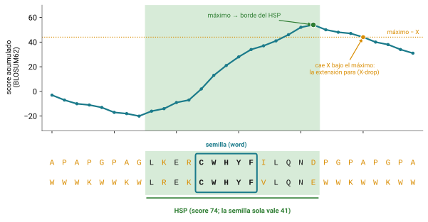
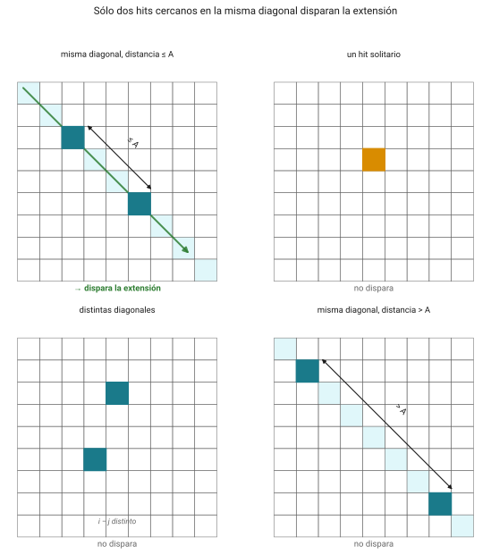
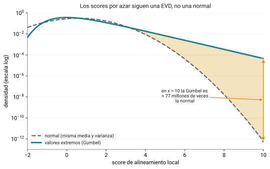
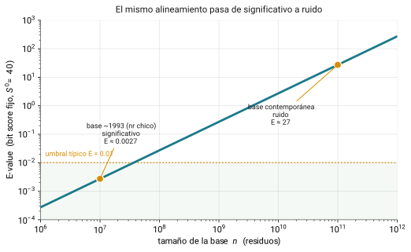
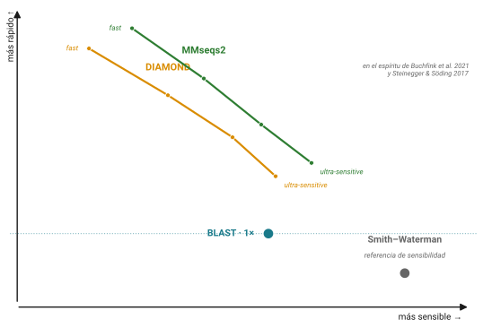

# La cuenta pendiente {.section-divider}

## Donde nos quedamos

::: callout-box
Query de 300 residuos contra 200 millones de secuencias por
Smith–Waterman: ~1.8 × 10¹³ operaciones. **Horas.**
:::

- Nadie espera horas por un BLAST
- La respuesta **no** fue hacer Smith–Waterman más rápido: fue cambiar
  de pregunta
- De "¿cuál es el mejor alineamiento?" a **"¿me sorprendería este
  parecido por azar?"**: una pregunta con respuesta rápida y con número

## Las tres ideas de hoy

1.  **Seed-and-extend**: por qué BLAST es rápido y qué sacrifica
2.  **El E-value**: cómo se lee y, sobre todo, qué **no** es
3.  Los **defaults silenciosos** que cambian el resultado sin avisar

::: callout-box
BLAST no calcula Smith–Waterman ni lo aproxima como algoritmo. Es otra
cosa: una heurística con objetivo propio, estadística propia y una
moneda calibrada, el E-value.
:::

## El plan del día

| Horario     | Bloque                                                        |
|-------------|---------------------------------------------------------------|
| 10:00–11:45 | Teoría: seed-and-extend, E-value, sabores, BLAT, BWA, estructura |
| 11:45–12:15 | Descanso                                                      |
| 12:15–14:30 | Práctica: BLAST+ local sobre la vía WNT de la babosa          |
| 14:30–15:00 | Cierre, dudas, entregable                                     |

# El problema y la prehistoria {.section-divider}

## Alinear dos secuencias está resuelto

- El problema es alinear **una contra todas las demás**
- Smith–Waterman exacto sigue siendo la referencia de sensibilidad,
  pero contra la base entera es inviable
- Hace falta hacer trampa. BLAST es esa trampa, y lleva más de tres
  décadas siendo el idioma común del campo

## FASTP y FASTA (1985, 1988) {.smaller}

- Lipman & Pearson: localizar rápido las regiones prometedoras y sólo
  ahí gastar el alineamiento caro
- FASTA: k-tuples exactos → reescorar diagonales con matriz → unir
  regiones → Smith–Waterman en banda
- Siguen vivos: el servidor FASTA de Virginia y SSEARCH
- BLAST ganó por tres cosas: ~10× más rápido, **E-value calibrado** en
  vez de score crudo, y el servidor del NCBI detrás
- La diferencia técnica: FASTA parte de identidades exactas; BLAST, de
  **neighborhood words**

# Seed-and-extend {.section-divider}

## Sembrar y extender {.smaller}

{fig-align="center"}

- **Sembrar**: palabras de tamaño $W$; en proteínas, todas las vecinas
  que puntúen ≥ $T$ contra la query; en DNA, match exacto
- **Extender**: sin gaps, hacia ambos lados, hasta caer $X$ por debajo
  del máximo (X-drop) → **HSP**; el de mayor score es el **MSP**

## Las dos palancas

::: callout-box
Bajar $T$ aumenta la probabilidad de sembrar un HSP verdadero, pero
dispara el número de hits y el tiempo. Subir $W$ acelera pero pierde
homólogos lejanos.
:::

**Cada default de BLAST es una postura sobre ese equilibrio, no una
verdad.**

## La vuelta de 1997: Gapped BLAST y PSI-BLAST {.smaller}

{fig-align="center"}

- **Dos hits**: la extensión (lo caro) sólo se dispara con dos word
  hits en la misma diagonal y cercanos → se puede subir $T$ sin perder
  sensibilidad neta
- **Extensión con gaps**: un Smith–Waterman confinado a una franja
- **PSI-BLAST**: perfiles, más adelante

# La estadística: el E-value {.section-divider}

## Karlin–Altschul (1990)

$$E = K \cdot m \cdot n \cdot e^{-\lambda S}$$

- $E$: número **esperado** de alineamientos con score ≥ $S$ por puro
  azar en el espacio de búsqueda. Va de 0 a infinito
- $m \cdot n$: query × base = el espacio de búsqueda
- $\lambda$, $K$: constantes del sistema de scoring (para BLOSUM62,
  $\lambda \approx 0.27$ y $K \approx 0.04$)

::: notes
Es lo que separa a BLAST de "un programa que encuentra parecidos" y lo
convierte en un instrumento de medición.
:::

## El bit score: la moneda comparable

$$S' = \frac{\lambda S - \ln K}{\ln 2}, \qquad E = m \cdot n \cdot 2^{-S'}$$

- El score crudo depende de la matriz; el **bit score** absorbe
  $\lambda$ y $K$
- Un raw score de 200 no significa nada sin la matriz; un bit score de
  50 significa lo mismo en cualquier búsqueda

## Por qué valores extremos y no una normal {.smaller}

{fig-align="center"}

- Un score local óptimo ya es un **máximo** entre muchísimos
  alineamientos
- La cola derecha de la Gumbel es más pesada: con una normal, el ruido
  pasaría por señal

## El punto que cambia todo: E depende de la base {.smaller}

{fig-align="center"}

- Mismo alineamiento, bit score 40: base de 10⁷ (`nr` de los noventa)
  → E ≈ 0.003; base de 10¹¹ (`nr` hoy) → E ≈ 27
- No cambió ni una letra de la biología. **Al citar un E-value, citen
  contra qué base y de qué año**

::: notes
El mismo mensaje del capítulo pasado en otra clave: el resultado
depende de un parámetro que ustedes, o el crecimiento de las bases,
eligieron. Un hit significativo en un paper de 1998 puede no serlo hoy.
:::

## La estadística no está probada para gaps {.smaller}

::: desventaja
La teoría de Karlin–Altschul está demostrada sólo para alineamientos
locales **sin** gaps. Para los que BLAST reporta desde 1997, $\lambda$ y
$K$ se estiman **empíricamente**, ajustando la EVD a secuencias
aleatorias.
:::

El número más autoritario de la bioinformática descansa, en su caso más
usado, sobre una simulación y no sobre un teorema. No invalida nada;
conviene saberlo.

# Lo que un E-value no es {.section-divider}

## Casi todos los errores con BLAST son de lectura {.smaller}

- **No es un porcentaje de identidad**: 99% sobre 20 residuos puede
  tener un E-value pésimo
- **No es la probabilidad de que el hit esté equivocado**: "improbable
  por azar" no es "homólogo", y mucho menos "ortólogo"
- **No es un p-value**: $p = 1 - e^{-E}$; para $E$ chico, $p \approx E$,
  pero $E$ puede ser mayor que 1

::: callout-box
Y lo que no se ve en el E-value: la **cobertura** (`qcovs`). Identidad
sin cobertura es engañosa. En la práctica, siempre las dos juntas.
:::

# Los sabores de BLAST {.section-divider}

## La primera decisión: qué se traduce {.smaller}

| Programa       | Query | Base | Traduce             | Uso típico              |
|----------------|-------|------|---------------------|-------------------------|
| `blastn`       | nt    | nt   | no                  | DNA vs DNA              |
| `blastp`       | aa    | aa   | no                  | proteína vs proteína    |
| `blastx`       | nt    | aa   | la query (6 marcos) | anotar ORFs o reads     |
| `tblastn`      | aa    | nt   | la base (6 marcos)  | genomas sin anotar      |
| `tblastx`      | nt    | nt   | ambos (36 marcos)   | regiones sin anotar     |
| `dc-megablast` | nt    | nt   | no                  | codificantes divergentes |
| `deltablast`   | aa    | aa   | no                  | perfil inicial desde CDD |

## "Yo sólo hago un blastn" {.smaller}

::: desventaja
**Mito.** Casi seguro corren **megablast** (word size 28) sin saberlo:
es el default de la web del NCBI y del comando `blastn`. Está optimizado
para secuencias muy parecidas y **pierde homólogos lejanos**.
:::

- El `blastn` de word size 11, el que sirve entre especies, hay que
  pedirlo explícitamente: `-task blastn`
- El default silencioso más caro de la bioinformática cotidiana

## PSI-BLAST y la deriva de perfil {.smaller}

- `blastp` → PSSM con los hits significativos → buscar con el perfil →
  iterar
- Encuentra parecidos débiles que una sola pasada no ve

::: desventaja
**Profile drift**: un falso positivo que entra en la ronda 2 contamina
el perfil y arrastra más falsos positivos en las siguientes. Se
controla mirando qué entra en cada ronda.
:::

# Lo que vino después {.section-divider}

## DIAMOND y MMseqs2 {.smaller}

{fig-align="center"}

- **DIAMOND** (Buchfink 2015, 2021): doble indexado, spaced seeds,
  alfabeto reducido; sensibilidad de BLASTP con 2–4 órdenes de magnitud
  menos de tiempo
- **MMseqs2** (Steinegger & Söding 2017): prefiltro de k-mers; los MSA
  de AlphaFold y ColabFold se generan con MMseqs2
- Cítenlos con versión y modo: el "20,000×" es del modo rápido de 2015

## La postura, sin diplomacia

- Consulta puntual, una query contra `nr` en la web: **BLAST** sigue
  siendo el default correcto (interpretabilidad, E-values calibrados,
  ecosistema del NCBI)
- A escala (proteomas, metagenómica, clustering): **DIAMOND** para
  proteínas y traducido, **MMseqs2** para búsqueda y clustering masivos
- BLAST es la referencia de **sensibilidad**, no de **velocidad**

# BLAT: la misma idea, al revés {.section-divider}

## Qué se indexa {.smaller}

{fig-align="center"}

> "Where BLAST builds an index of the query sequence and then scans
> linearly through the database, BLAT builds an index of the database
> and then scans linearly through the query sequence."

[Kent 2002, *Genome Research* 12(4):656-664]{.ref}

## Indexar la consulta o indexar la base

:::: columns-equal
::: {}
**Indexar la consulta (BLAST)**

- Contra cualquier base, sin preparar nada
- "¿Qué hay en el mundo que se parezca a esto?"
:::

::: {}
**Indexar la base (BLAT)**

- Se paga una vez el índice; cada consulta es casi instantánea
- **Muchas** preguntas contra **el mismo** genoma
:::
::::

::: notes
Honestidad: BLAST también puede indexar la base hoy (makembindex 2008,
megablast indexado en la web). La dicotomía limpia es didáctica; la
consecuencia sigue siendo cierta: BLAT asume alta identidad y BLAST no.
:::

## Nació de una fecha límite {.smaller}

- Kent, UCSC, 2000: colocar 3 millones de ESTs y 13 millones de
  lecturas de ratón sobre el borrador del genoma humano, en ciclos de
  dos semanas
- Índice de k-mers no traslapados (tesela 11) en RAM; teselas
  sobreusadas excluidas
- Diseñado para **≥95% de identidad y longitud > 40**. Fuera de esa
  ventana no encuentra nada
- No es un defecto: es lo que compra la velocidad

## Coser exones

- Un cDNA no tiene intrones; el genoma sí → el alineamiento correcto
  son varios bloques separados por huecos enormes
- BLAT agrupa hits por diagonal, alinea por separado y **cose** con
  programación dinámica, ajustando los bordes a sitios de splicing
- Reconstruye la estructura de exones; salida en formato **PSL**
- Es la versión algorítmica del dot plot genómico contra cDNA

## BLAT en 2026 y las semillas espaciadas {.smaller}

- Sigue vivo y mantenido por UCSC: es lo que corre en el genome browser
- Nicho: colocar interactivamente una secuencia sobre un genoma de la
  misma especie. Para mapeo masivo perdió contra BWA y Bowtie; para
  long reads, contra minimap2

::: callout-box
**PatternHunter (2002)**: una semilla como `111010010100110111` pesa lo
mismo que once consecutivas y tiene **más sensibilidad**, porque sus
aciertos son más independientes. Hoy es estándar en LAST, LASTZ y
DIAMOND.
:::

# Coda: mapear millones de lecturas {.section-divider}

## Un tercer problema {.smaller}

- BLAST: ¿qué hay en el mundo que se parezca a esto?
- BLAT: ¿dónde está esta secuencia en este genoma?
- **BWA: ¿de dónde vino cada uno de estos cien millones de fragmentos?**

Tres dimensiones distintas: escala de millones de consultas, identidad
altísima, y una posición por lectura en vez de una lista de parecidos.

## Burrows–Wheeler en cuatro ideas {.smaller}

1.  **Permutación reversible** del genoma que agrupa contextos parecidos
    (y por eso comprime)
2.  **Búsqueda hacia atrás**: el patrón carácter por carácter; el
    conjunto de candidatos se estrecha en cada paso
3.  **El tiempo depende del largo de la lectura, no del genoma**
4.  Índice **residente**: ~4 GB para el genoma humano, se construye una
    vez

::: notes
No construimos la BWT aquí. El mapeo a fondo (bwa index, bwa mem,
samtools) es contenido de cuarto semestre.
:::

## MAPQ contra E-value {.smaller}

{fig-align="center"}

- **E-value**: sorpresa. Crece con el tamaño de la base
- **MAPQ** $= -10 \log_{10} P(\text{posición equivocada})$: unicidad.
  Depende de si hay otro lugar que explique la lectura igual de bien
- Una lectura **100% idéntica** puede tener **MAPQ 0** si cae en una
  repetición
- MAPQ no es comparable entre alineadores

## Las tres, en una tabla {.smaller}

|                    | BLAST             | BLAT               | BWA-MEM               |
|--------------------|-------------------|--------------------|-----------------------|
| Qué indexa         | la consulta       | el genoma          | el genoma (índice FM) |
| Qué recorre        | la base           | la consulta        | las lecturas          |
| Consulta típica    | una secuencia     | mRNAs, primers     | millones de lecturas  |
| Identidad esperada | hasta ~25%        | ≥95%               | ≥~95%                 |
| Salida             | tabular           | PSL, exones cosidos | SAM/BAM              |
| El número          | E-value: sorpresa | identidad y bloques | MAPQ: unicidad       |
| La pregunta        | ¿qué se parece?   | ¿dónde está acá?   | ¿de dónde vino?       |

::: notes
TODO: figuras/svg/blast_tres.svg existe (esquema de las tres preguntas,
sin referenciar en el capítulo). Decidir si va aquí en lugar de la
tabla o en una diapositiva aparte.
:::

# Cuando la secuencia ya no alcanza {.section-divider}

## Foldseek: buscar estructura como si fuera secuencia {.smaller}

- La estructura se conserva más que la secuencia; lo nuevo es que hay
  estructura predicha para casi todo
- **Alfabeto 3Di** (van Kempen et al. 2024): 20 estados de interacción
  terciaria con el vecino espacial más cercano → una estructura se
  vuelve una cadena y se busca con una matriz tipo BLOSUM
- 4–5 órdenes de magnitud más rápido que Dali y TM-align, conservando
  ~86–88% de su sensibilidad

## La escala nueva y los perfiles que no murieron {.smaller}

- AlphaFold DB: ~300 mil estructuras (2021) → >214 millones (2024)
- Barrio-Hernandez et al. 2023: 2.3 millones de clusters, ~31% sin
  anotación → la materia oscura del espacio de proteínas
- Orden creciente en sensibilidad y costo: **secuencia** (BLAST,
  DIAMOND, MMseqs2) → **perfil** (HMMER, HHblits) → **embeddings**
  (pLM-BLAST) → **estructura** (Foldseek)

::: desventaja
**¿Ortología por estructura?** FoldTree y Unicore (2025) a favor; *Mol
Biol Evol* 2025 en contra: los métodos estructurales no superaron al
modelo LG en filogenómica a gran escala. Homología remota, sí;
ortología, todavía no.
:::

# Mitos y realidades {.section-divider}

## El resumen (1 de 2) {.smaller}

1.  **"BLAST aproxima a Smith–Waterman"**: aproxima el resultado, no
    ejecuta el algoritmo
2.  **"El E-value es un p-value"**: relacionados, pero $E$ puede ser
    mayor que 1
3.  **"E-value bajo = homólogo"**: improbable por azar, nada más
4.  **"Lo que importa es el % de identidad"**: junto con la cobertura
5.  **"megablast es blastn más rápido"**: word size 28 contra 11;
    pierde homólogos lejanos
6.  **"BLAST encuentra todos los homólogos"**: es heurístico

## El resumen (2 de 2) {.smaller}

7.  **"El mejor hit es el ortólogo"**: eso lo desmonta la sesión 10
8.  **"`-max_target_seqs 1` devuelve el mejor hit"**: devuelve el
    primero que pasa el umbral
9.  **"E-value 0 = identidad perfecta"**: es redondeo de un número
    extremadamente pequeño
10. **"BLAT es BLAST más rápido"**: indexa la base y asume ≥95%; busca
    otra cosa
11. **"Estructura conservada implica homología"**: evidencia fuerte,
    no prueba

# La práctica de hoy. Después del break {.section-divider}

## BLAST+ local sobre la vía WNT de la babosa {.smaller}

- La práctica vive en el sitio: [**Práctica: BLAST+
  local**](../contenido/03-alineamientos/sesion08-practica.html)
- Rehacer el **primer paso real** del proyecto R-spondina/LGR: ¿qué
  genes del módulo WNT–RSPO–LGR tiene de verdad el genoma de
  *Deroceras laeve*?
- **Base**: proteoma v1.2 (43,905 proteínas) con `makeblastdb`
- **Consultas**: 72 proteínas de referencia (18 genes × humano y 3
  moluscos) con `blastp -outfmt "6 std qcovs"`
- **Parsear**, el concepto del día: `cut`, `sort` y `awk` sobre la
  tabla; ubicar los hits en el genoma con `mapa_mrna.tsv`
- **Alinear la familia** con MAFFT: el puente a la sesión 9
- Bonus: mejor hit recíproco, anticipo de la sesión 10

**Entregable** · script que reciba un FASTA, corra BLAST contra la base
local y reporte los top-5 hits en tabla

::: notes
Datos, clave de respuestas y SOLUCIONES.md en
planeacion/practica_blast/. Tiempos medidos en Fénix (2026-08-18):
makeblastdb 2 s, blastp 39 s, MAFFT 4 s.
:::

## La trampa de `-max_target_seqs` {.smaller}

::: desventaja
`-max_target_seqs 1` **no** devuelve el mejor hit: devuelve el
**primero** que supera el umbral de E-value (Shah et al. 2019). Parte
fue un bug corregido en BLAST+ 2.8.1 (Madden et al. 2019), pero el
malentendido sobrevive.
:::

Regla para la práctica: pedir más hits de los que necesitan y filtrar
después por `bitscore` con `awk`.

::: callout-box
Capítulo de referencia:
[BLAST](../contenido/03-alineamientos/blast.html)
:::

## Lectura

- Altschul et al. 1990 (*J Mol Biol*) y 1997 (*Nucleic Acids Res*):
  los dos papers de BLAST
- Kerfeld & Scott 2011, *PLoS Biology*: *Using BLAST to Teach
  "E-value-tionary" Concepts* (CC BY)
- Kent 2002, *Genome Research*: BLAT
- Heladia Salgado: [Blast, variables y
  scripts](https://lcg-cursos.github.io/material/introbioinfo/blast_var_for_scripts.html)
