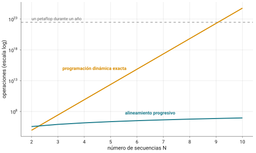
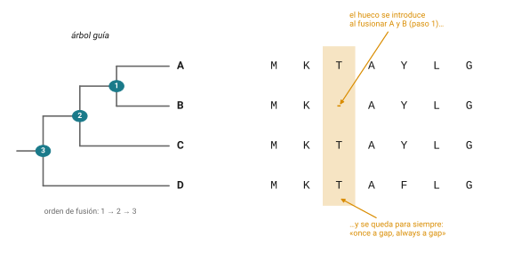
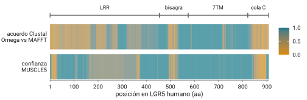

# De dos secuencias a N {.section-divider}

## Donde nos quedamos

- Sesión 7: el alineamiento óptimo de **dos** secuencias es un problema
  resuelto y barato
- Sesión 8: una contra una base de datos exige hacer trampa (BLAST)
- Hoy: tres o más a la vez. Y aquí la trampa no es opcional

::: callout-box
Alinear $N$ secuencias es **NP-completo**. Todo lo que usan (Clustal,
MAFFT, MUSCLE) son heurísticas sin garantía de optimalidad.
:::

## La idea que casi nunca se enseña

**El alineamiento múltiple no es un dato observado: es una estimación
con error, y ese error se propaga a todo lo que hagan después.**

- Un árbol filogenético, un análisis de selección, una anotación de
  dominios: todos parten de un alineamiento múltiple
- Casi todos lo tratan como si fuera la verdad. No lo es: es la mejor
  conjetura de un programa heurístico
- **Cambiar de programa puede cambiar la conclusión**

## El plan del día

| Horario     | Bloque                                                            |
|-------------|-------------------------------------------------------------------|
| 10:00–11:45 | Teoría: por qué no escala, suma de pares, progresivo, herramientas, incertidumbre |
| 11:45–12:15 | Descanso                                                          |
| 12:15–14:30 | Práctica: Clustal Omega contra MAFFT sobre los LGR de la sesión 8 y sus R-spondinas |
| 14:30–15:00 | Cierre, dudas, entregable                                         |

# Por qué la programación dinámica no escala {.section-divider}

## Un hipercubo de N dimensiones {.smaller}

{fig-align="center"}

- Dos secuencias: una matriz. $N$ secuencias: un hipercubo, costo del
  orden de $L^N$
- Tres todavía se puede; veinte, ni de lejos
- El progresivo crece como $N^2 L^2$: por eso es el que todo el mundo
  usa

## No es que falte un algoritmo {.smaller}

- **Wang & Jiang 1994**: decidir si existe un alineamiento con suma de
  pares mejor que un umbral es **NP-completo**
- **Elias 2006** cerró los casos abiertos, incluido el alfabeto del DNA
- **Just 2001**: además es APX-difícil; no hay esquema que se acerque
  tanto como uno quiera al óptimo en tiempo polinomial (salvo P = NP)
- Matiz: la estrella central (Gusfield 1993) garantiza quedar a lo más
  al doble del óptimo. Lo prohibido es acercarse **arbitrariamente**

::: callout-box
**No existe, ni existirá, un programa que garantice el mejor
alineamiento múltiple.** Todo lo que se usa son atajos.
:::

# Cómo se califica: la suma de pares {.section-divider}

## Suma de pares (SP)

- La puntuación de una columna es la suma, sobre todos los
  $\binom{N}{2}$ pares de renglones, del puntaje de ese par
- Residuo contra residuo: matriz de sustitución · residuo contra gap:
  penalización · gap contra gap: 0

Esquema didáctico: match $+1$, mismatch $-1$, residuo/gap $-2$, gap/gap
$0$:

```
s1  W K L
s2  W - L
s3  W K M
```

Columna 1: $+3$ · columna 2: $-2 + 1 - 2 = -3$ · columna 3:
$+1 - 1 - 1 = -1$ · **total: $-1$**

## Algo incómodo

- Cambien la penalización de gap de $-2$ a $-1$: el mismo alineamiento
  ahora vale $+1$
- La puntuación, y con ella cuál alineamiento resulta "el óptimo",
  depende de decisiones de modelado que alguien tomó por ustedes
- Ya lo vieron con pares (sesión 7); con $N$ secuencias el efecto se
  multiplica por $\binom{N}{2}$

::: notes
Ejercicio 1 del capítulo para la tarde o para tarea: recalcular con
gap −1 y con el gap de s2 movido a la última columna.
:::

# Alineamiento progresivo {.section-divider}

## Feng & Doolittle 1987

- No alinear todo a la vez, sino por partes, empezando por los pares
  más parecidos
- Primero un **árbol guía** a partir de las similitudes entre pares;
  luego se alinean los más cercanos y se van agregando secuencias y
  grupos, de las ramas a la raíz
- Rápido y funciona sorprendentemente bien
- El problema que los propios autores vieron: los gaps de A contra B no
  tienen por qué coincidir con los de A contra C. **El orden de fusión
  determina el resultado**

## El pecado original {.smaller}

{fig-align="center"}

::: desventaja
*"In particular, this rule is followed: 'once a gap, always a gap'"*
(Feng & Doolittle 1987, p. 351). Un gap que entra temprano nunca se
quita ni se mueve; a lo más, se agranda. **Un error temprano no se
corrige nunca.**
:::

::: notes
La lógica era razonable: la mejor información sobre un gap está entre
las secuencias más parecidas. El costo: si el árbol guía se equivoca
de orden, el gap se propaga hacia arriba. Casi toda la historia
posterior del MSA es un intento de mitigar esto. Ejercicio 2 del
capítulo (A/B/C con MSTK...) lo muestra a mano: 16 contra 14.
:::

# La caja de herramientas {.section-divider}

## Cuatro familias, cuatro ideas {.smaller}

- **CLUSTAL** (1988 → W 1994 → Omega 2011): pesos por secuencia, gaps
  por posición; Omega escala con árboles guía por mBed y perfiles HMM
  contra HMM. Versión 1.2.4 desde 2016: software terminado, no
  abandonado
- **MAFFT** (Katoh 2002): transformada rápida de Fourier para localizar
  bloques homólogos (volumen y polaridad de cada residuo)
- **MUSCLE** (Edgar 2004): progresivo más refinamiento iterativo;
  MUSCLE5 cambia el juego
- **T-Coffee** (Notredame 2000): biblioteca de alineamientos por pares
  y búsqueda del múltiple más **consistente** con ella. Más lento,
  escala mal

::: notes
CLUSTAL W fue el artículo número 10 más citado de toda la ciencia en el
conteo de Nature 2014 (ClustalX el 28), por encima de BLAST. Los
perfiles HMM son la misma idea que las PSSM de PSI-BLAST de la sesión
8: una columna deja de ser una letra y se vuelve una distribución.
:::

## MAFFT: elegir la estrategia es media práctica {.smaller}

| Modo       | Qué hace                                        | Para                          |
|------------|-------------------------------------------------|-------------------------------|
| `FFT-NS-2` | progresivo puro, rápido (default)               | hasta ~30,000 secuencias      |
| `FFT-NS-i` | progresivo + refinamiento iterativo             | intermedio                    |
| `L-INS-i`  | pares locales (estilo SW) + refinamiento        | < ~200 secuencias, precisión  |
| `G-INS-i`  | pares globales + refinamiento                   | secuencias de largo parecido  |
| `E-INS-i`  | regiones grandes no alineables                  | dominios en contexto variable |

`mafft --auto` elige entre L-INS-i, FFT-NS-i y FFT-NS-2 según el
tamaño.

## Dos ideas que cruzan toda la tabla

:::: columns-equal
::: {}
**Refinamiento iterativo**

- Romper el dogma del gap eterno
- Partir el alineamiento en dos grupos, realinear, aceptar si mejora,
  repetir
- La "i" de `L-INS-i`; `--maxiterate` en MAFFT
:::

::: {}
**Consistencia**

- La apuesta de T-Coffee
- Usar la información de **todos** los pares desde el principio, en
  vez de corregir después
:::
::::

# El alineamiento es una estimación, no un dato {.section-divider}

## Programas distintos, árboles distintos {.smaller}

- **Wong, Suchard & Huelsenbeck 2008** (*Science*): 853 genes ortólogos
  de siete levaduras, siete alineadores → **conclusiones filogenéticas
  distintas**
- **Wu, Chatterji & Eisen 2012**: cerca del 46% de los genes produjo
  uno o más árboles diferentes según el alineador
- El problema de fondo: los métodos río abajo tratan el alineamiento
  como una observación fija y **no propagan su incertidumbre**
- Si el alineamiento está mal, el árbol está mal, y nadie se entera

## MUSCLE5: del diagnóstico al método {.smaller}

- En vez de un alineamiento, un **ensemble** de réplicas: cada una
  perturba los parámetros del HMM y permuta el árbol guía
- La confianza en cualquier inferencia (una columna, una topología) es
  la fracción del ensemble que la sostiene: **column confidence**
- Topologías con bootstrap bajo se resuelven con confianza; algunas con
  bootstrap alto resultan estar mal

::: desventaja
Citando los benchmarks estructurales: los algoritmos actuales colocan
mal **más del 30% de las columnas**. No MUSCLE en particular: todos.
:::

[Edgar 2022, *Nat Commun* 13:6968]{.ref}

## Con sus propios datos {.smaller}

{fig-align="center"}

- 50 receptores LGR, alineados con Clustal Omega y con MAFFT, vistos a
  lo largo de LGR5 humano
- El desacuerdo **entre** programas y la desconfianza **dentro** de
  MUSCLE5 caen en los mismos lugares: el ectodominio LRR y la cola
- El 7TM sale igual lo alinee quien lo alinee

::: notes
Es la figura que ellos mismos van a reconstruir en la tarde, con `awk`,
en los ejercicios 5 y 8 de la práctica. Números por dominio (acuerdo
medio / LC medio de MUSCLE5): LRR 0.61 / 7.2, bisagra 0.78 / 7.5, 7TM
0.96 / 9.0, cola 0.40 / 4.7. No adelantar por qué el LRR es difícil
aunque esté conservado (14 repeticiones en tándem: problema de
registro, no de conservación): es la pregunta del ejercicio 5. Se
regenera con figuras/fig_msa_desacuerdo.R a partir de los alineamientos
de la clave.
:::

## Una hipótesis con barra de error {.smaller}

::: callout-box
**El alineamiento múltiple no es un hecho, es una hipótesis con barra
de error.** Mírenlo con la misma sospecha con la que miran cualquier
otra estimación.
:::

- **GUIDANCE2** (Sela et al. 2015) puntúa qué columnas son confiables
- **trimAl**, **ClipKIT** eliminan las columnas poco fiables antes de
  construir un árbol

## ¿Cuál es "el mejor"? No se sabe {.smaller}

- Distintos benchmarks favorecen distintos programas: BAliBASE 3.0
  (referencias por estructura), HomFam (escala a decenas de miles),
  QuanTest2 (predice estructura secundaria, sin referencias fijas)
- Las referencias mismas tienen sesgos
- Lo que sí: MAFFT es hoy uno de los defaults más comunes en servidores
  y pipelines (motor del Job Dispatcher del EBI); ningún benchmark
  corona a un ganador
- La frontera ya se movió: alineadores con estructura predicha o
  modelos de lenguaje de proteínas. **Quédense con la idea, no con los
  nombres**

# ¿Cuál usar cuándo? {.section-divider}

## Sin ceremonia

- **Pocas secuencias (< ~200), máxima precisión**: MAFFT `L-INS-i` o
  T-Coffee
- **Miles a cientos de miles**: Clustal Omega o MAFFT `FFT-NS-2`
- **Filogenia seria, donde importa la incertidumbre**: MUSCLE5 con su
  ensemble
- **Default docente equilibrado**: `mafft --auto`

::: callout-box
Para la práctica, una familia con decenas de secuencias: Clustal Omega
o MAFFT `L-INS-i`.
:::

# Mitos y realidades {.section-divider}

## El resumen {.smaller}

1.  **"CLUSTAL es el estándar"**: inercia de citación; mide historia,
    no precisión. En muchos pipelines el motor por defecto es MAFFT
2.  **"El alineamiento múltiple es un dato"**: es la estimación de un
    programa heurístico, con error propagable
3.  **"Más secuencias, mejor alineamiento"**: sin curaduría, secuencias
    ruidosas o mal escogidas lo empeoran
4.  **"Existe el alineamiento correcto y el programa lo encuentra"**:
    NP-completo, y aun los mejores yerran más del 30% de las columnas
5.  **"El árbol guía es una filogenia"**: es un agrupamiento rápido por
    similitud para ordenar las fusiones. Usarlo como árbol evolutivo es
    un error clásico

# La práctica de hoy. Después del break {.section-divider}

## Alinear, comparar y poner en duda {.smaller}

- La práctica vive en el sitio: [**Práctica: Clustal Omega contra
  MAFFT**](../contenido/03-alineamientos/sesion09-practica.html)
- Continúa la sesión 8: sus candidatos LGR crecen a **50 receptores de
  11 especies**, más una familia chica, las **17 R-spondinas**
- **Alinear dos veces**: `clustalo` (guardando el árbol guía) y `mafft
  --localpair --maxiterate 1000` (eso es `L-INS-i`)
- **Primero números**, después `t_coffee -other_pg aln_compare`: mide
  desacuerdo entre programas, **no** exactitud de ninguno
- **Ubicar el desacuerdo** por dominio de la proteína, con `awk`: la
  parte de hoy
- **El árbol guía** (`.dnd`) contra el árbol ML real de las R-spondinas
- **Barra de error**: ensemble de MUSCLE5 (`-stratified`,
  `-letterconf`); después Jalview y `trimal`
- Concepto de cómputo: **una variable como parámetro** (`F=rspo`, luego
  `F=lgr`), `time`, y los dos canales de salida (`>`, `2>`)

::: notes
Pendientes de instructor (están en la caja "Pendiente" de la práctica):
crear el módulo `msa` en ken (clustalo, mafft, muscle 5.1, t-coffee,
hmmer, seqkit, trimal), copiar datos/, scripts/ y clave/ a la ruta
$origen y correr la práctica una vez. El ensemble de MUSCLE5 para los
LGR tarda 1 h 45 min en un CPU: se entrega calculado.
:::

## El entregable no es "el alineamiento" {.smaller}

::: callout-box
Un párrafo por familia sobre **dónde los dos métodos no se pusieron de
acuerdo y por qué**: dos regiones concretas, con posiciones en la
secuencia de referencia, y si coinciden con las letras de baja
confianza de MUSCLE5 y con lo que recortó `trimal`.
:::

- Ésa es la parte que se califica en serio, porque es la que enseña a
  desconfiar del dato

::: desventaja
El árbol guía **no** es un árbol filogenético: distancias crudas, sin
modelo evolutivo, sólo para ordenar las fusiones. Si un compañero pone
el `.dnd` en su tesis como "la filogenia de la familia", ¿qué le dicen?
:::

::: callout-box
Capítulo de referencia: [Alineamiento múltiple (CLUSTAL,
MAFFT)](../contenido/03-alineamientos/alineamiento-multiple.html)
:::

## Lectura

- Feng & Doolittle 1987, *J Mol Evol*: el progresivo y su regla
- Edgar 2022, *Nat Commun*: MUSCLE5 y los ensembles
- Wong, Suchard & Huelsenbeck 2008, *Science*: *Alignment uncertainty
  and genomic analysis*
- Katoh & Standley 2013, *Mol Biol Evol*: MAFFT 7 y sus modos

::: notes
TODO: decidir si los ejercicios 1 y 2 del capítulo (suma de pares a
mano; el orden de fusión decide) van en la tarde o como tarea para la
sesión 10.
:::
