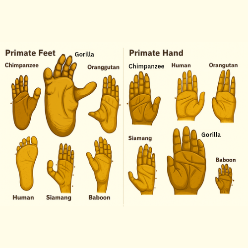

# Homología es binaria {.section-divider}

## La idea central

::: callout-box
**La homología es binaria.** Dos secuencias comparten un ancestro común
o no lo comparten. No existe "45% homólogas", igual que no existe "30%
embarazada".
:::

- Lo continuo es la **similitud**: porcentaje de residuos idénticos o
  parecidos
- La similitud se **mide**; la homología se **infiere** a partir de
  ella
- Confundirlas es el error más extendido del campo

## Los dos objetivos de hoy

1.  Que nunca más escriban **"76% de homología"**
2.  Que entiendan por qué el mejor hit de BLAST **no** es
    necesariamente el ortólogo

## El plan del día

| Horario     | Bloque                                                        |
|-------------|---------------------------------------------------------------|
| 10:00–11:45 | Teoría: Owen, Fitch, árboles, inferencia de ortología, la conjetura |
| 11:45–12:15 | Descanso                                                      |
| 12:15–14:30 | Práctica: reciprocal best hits entre dos levaduras            |
| 14:30–15:00 | Cierre, dudas, entregable                                     |

# De dónde viene la palabra {.section-divider}

## Owen, 1843: antes de Darwin {.smaller}

- La biología molecular no inventó la homología: heredó un concepto
  morfológico y lo trasladó a secuencias

> **Homólogo**: *"the same organ in different animals under every
> variety of form and function"*
>
> **Análogo**: *"a part or organ in one animal which has the same
> function as another part or organ in a different animal"*

- Tres criterios: **posición, desarrollo y composición**. Marco
  tipológico (el arquetipo), sin mecanismo
- Darwin 1859 puso el mecanismo: descendencia con modificación desde un
  ancestro común

::: notes
Antecedentes aún más viejos: Aristóteles; Pierre Belon comparando
esqueletos de ave y humano en 1555. Ejemplo canónico: ala de
murciélago, aleta de ballena y brazo humano (homólogos); ala de ave y
ala de insecto (análogas).
:::

## Lo mismo, en otro animal y en otro lugar

{fig-align="center"
height="480"}

[Ilustración de Aakash Educational Services
([aakash.ac.in](https://www.aakash.ac.in)), sin licencia declarada; se
reproduce con fines docentes y con atribución]{.ref}

::: notes
Seis pies (izquierda) y seis manos (derecha): chimpancé, gorila,
orangután, humano, siamang, babuino. Hacer las dos lecturas por
separado; son las mismas dos que Fitch va a separar con nombres.
:::

## Dos lecturas de la misma lámina {.smaller}

:::: columns-equal
::: {}
**Dentro del panel de la derecha**

- Mano de chimpancé contra mano de humano: *el mismo órgano en
  distintos animales*
- Mismos huesos, mismas posiciones, mismo esbozo embrionario
- Cambian forma y función (dedos del orangután, palma del gorila,
  pulgar humano). Nada de eso toca la homología
- **Homología especial** (Owen 1848)
:::

::: {}
**De un panel al otro**

- Mano de humano contra pie de humano: mismo animal, otro extremo del
  cuerpo
- Los mismos huesos, cinco dedos, el mismo programa de desarrollo
  disparado dos veces
- **Homología serial**: el brazo es el *homotipo* de la pierna (Owen
  1848); "homología repetitiva" (Van Valen 1982)
:::
::::

## La analogía que vale la pena llevarse {.smaller}

| Comparación | Qué separó a las dos copias | Análogo molecular |
|----|----|----|
| Mano de chimpancé vs mano de humano | Una **especiación**, hace ~6–7 Ma | **Ortólogos** |
| Mano vs pie del mismo humano | Una **"duplicación"** del programa de extremidad, en un ancestro vertebrado | **Parálogos** |
| Pie de chimpancé vs mano de humano | Esa misma duplicación, y después la especiación | **Parálogos**, aunque estén en distintas especies |

::: callout-box
**La tercera fila es la que importa.** Lo que define la relación es el
evento que separó las copias, no en qué organismo acabaron. Guárdenla:
es el mito número uno de hoy.
:::

::: notes
Qué se parece más a qué: la mano humana se parece más a la del
chimpancé que al pie humano. La copia separada por especiación conservó
la función; la separada por duplicación se fue a hacer otra cosa. Es la
conjetura de los ortólogos en versión anatómica, con la misma letra
chica: tendencia, no ley (el pie del chimpancé sigue siendo una mano
para agarrar ramas).
:::

## La analogía se cierra sola {.smaller}

- Qué esbozo se vuelve brazo y cuál pierna lo deciden **Tbx5** (anterior)
  y **Tbx4** (posterior), con *Pitx1* río arriba de *Tbx4*
- *Tbx4* y *Tbx5* son **parálogos**: descienden de un único *Tbx4/5*
  ancestral, que el anfioxo, sin extremidades pareadas, conserva como un
  solo gen (Minguillon et al. 2009)
- La homología serial de la mano y el pie está escrita en el genoma
  como paralogía

::: callout-box
**Parálogo es a ortólogo lo que homología serial es a homología
especial.** (Mindell & Meyer 2001 lo llamaron *paramorfismo*; la
palabra no cuajó, la idea sí.)
:::

::: notes
Hasta dónde llega la analogía: un pie no es una copia de una mano como
un gen duplicado es una copia de ADN. Se "duplicó" el despliegue de un
programa regulatorio (co-opción, redespliegue). Y el criterio de
posición de Owen se vuelve resbaloso entre homotipos. Es una analogía,
no una demostración.
:::

# Fitch 1970 {.section-divider}

## Un solo párrafo {.smaller}

- **Parálogos** (*para* = en paralelo): la homología resulta de una
  **duplicación génica** y las copias descienden lado a lado. Ejemplo
  de Fitch: α y β hemoglobina
- **Ortólogos** (*ortho* = exacto): la homología resulta de una
  **especiación**; la historia del gen refleja la de las especies. α
  hemoglobina de humano y de ratón

> *"Phylogenies require orthologous, not paralogous, genes."*

[Fitch 1970, *Systematic Zoology* 19(2):99–113]{.ref}

::: notes
El artículo no trataba de eso: era un método estadístico para
distinguir homología de analogía; los términos fueron casi un
subproducto. Fitch 2000, "Homology: a personal view on some of the
problems", es un lamento sobre en qué se convirtió el uso del término.
:::

## El vocabulario completo {.smaller}

| Término         | Relación                                          | Origen                    |
|-----------------|---------------------------------------------------|---------------------------|
| **Ortólogo**    | Separados por **especiación**                     | Fitch 1970                |
| **Parálogo**    | Separados por **duplicación**                     | Fitch 1970                |
| **Xenólogo**    | Separados por **transferencia horizontal**        | Gray & Fitch 1983         |
| **Ohnólogo**    | Parálogo por **duplicación de genoma completo**   | por Susumu Ohno (1970)    |
| **In-paralog**  | Duplicado **después** de la especiación considerada | Remm et al. 2001        |
| **Out-paralog** | Duplicado **antes** de la especiación considerada | Sonnhammer & Koonin 2002  |

- Los in-paralogs son **co-ortólogos** en conjunto respecto al gen de la
  otra especie. Uno-a-muchos y muchos-a-muchos son la norma, no la
  excepción

::: notes
Los ohnólogos ya los vieron en la práctica de la sesión 7: los dos
receptores LGR de la babosa en los cromosomas 6 y 10.
:::

## El mito número uno {.smaller}

::: desventaja
**"Los ortólogos están en distintas especies y los parálogos en la
misma."** Falso. La α-hemoglobina de ratón y la β-hemoglobina de humano
son **parálogas** aunque estén en especies distintas: descienden de una
duplicación en un ancestro común.
:::

::: callout-box
**Recordatorio, porque va a doler si se les olvida.** Lo que se mide en
porcentaje es la **identidad** o la **similitud** (la evidencia). La
homología es la conclusión.

Excepción legítima: **"homología parcial"**, cuando *esta región* de una
secuencia es homóloga a *aquella región* de la otra (fusión, fisión,
dominios compartidos).
:::

# Árbol de genes ≠ árbol de especies {.section-divider}

## Cinco razones para que no coincidan {.smaller}

**Duplicación · pérdida de genes · transferencia horizontal ·
incomplete lineage sorting (ILS) · hibridación / introgresión**

El modelo **DTL** (Duplication–Transfer–Loss) mapea el árbol de genes
sobre el de especies y asigna un evento a cada nodo interno:

| Nodo del árbol de genes | Relación entre las hojas |
|-------------------------|--------------------------|
| **Especiación**         | Ortólogos                |
| **Duplicación**         | Parálogos                |
| **Transferencia**       | Xenólogos                |

Es la base de todos los métodos de reconciliación.

## Dos ejemplos para el aula

- **Globinas**: α y β, parálogos por duplicación. El ejemplo original de
  Fitch, y el que van a reconocer en cualquier árbol de genes mal
  enraizado
- **ILS**: humano, chimpancé y gorila. Hay regiones del genoma donde
  humano agrupa con gorila y no con chimpancé, sin que nadie haya
  transferido nada. El árbol de especies es uno; el de cada región del
  genoma no siempre lo respeta

## Cómo se delata una transferencia horizontal {.smaller}

- **Composición atípica**: GC y uso de codones que no cuadran con el
  resto del genoma huésped (sesiones 2 y 3)
- **Distribución filogenética irregular**: el gen aparece en géneros no
  emparentados y falta en parientes cercanos
- **Contexto genómico**: secuencias de inserción, transposones,
  integrones flanqueando el gen

Ninguna de las tres prueba nada por sí sola. Las tres juntas son un
caso sólido.

# Cómo se infiere ortología {.section-divider}

## Una propiedad que van a usar sin darse cuenta

- La homología es **transitiva**: si X es homólogo de Y, y Y de Z en la
  misma región, X y Z son homólogos aunque BLAST no encuentre parecido
  directo
- Es lo que permite construir familias encadenando parecidos débiles,
  y lo que hace que los métodos de perfil funcionen

## Reciprocal Best Hits {.smaller}

- A es ortólogo de B si A es el mejor hit de B **y** B es el mejor hit
  de A. Viene de los COGs (Tatusov, Koonin & Lipman 1997)
- Supuesto oculto: los ortólogos son las secuencias que **menos han
  divergido** entre dos especies, porque hasta la especiación eran el
  mismo gen. Ese supuesto falla, y falla mucho

::: desventaja
**"RBH es el estándar de oro."** Dalquen & Dessimoz 2013: en clados
ricos en duplicación (plantas y animales) se pierden hasta **~60%** de
las relaciones ortólogas. Johnson 2007: RBH no es condición lógicamente
suficiente para ortología. Ni necesaria.
:::

Úsenlo como heurística rápida, no como verdad.

## Cómo falla RBH {.smaller}

- **Duplicaciones específicas de linaje**: rompen la reciprocidad
- **Pérdida diferencial de genes**: el ortólogo verdadero ya no está y
  gana otro
- **Tasas evolutivas dispares**: un parálogo que evolucionó más lento
  gana el best hit
- **Genes fusionados / arquitecturas de dominios**: el best hit cae
  sobre un dominio compartido
- **Errores de modelo génico** y genes de evolución rápida

::: notes
En la práctica de la tarde van a medir en sus propios datos qué
fracción de mejores hits sobrevive a la reciprocidad (ejercicio 5) y a
encontrar un caso de uno a muchos (ejercicio 6).
:::

## Grafos, árboles y OrthoFinder {.smaller}

- **Basados en grafos**: OrthoMCL, InParanoid, SonicParanoid, Broccoli,
  Proteinortho
- **Basados en árboles (reconciliación)**: comparan el árbol de genes
  con el de especies para etiquetar cada nodo. TreeFam, Ensembl Compara,
  PhylomeDB, PANTHER (Page & Charleston 1997)
- **OrthoFinder** (Emms & Kelly 2015, 2019): el método de referencia.
  Orthogroups, árboles de genes enraizados, eventos de duplicación y
  árbol de especies, a velocidad de heurística

## Bases de datos y qué método uso {.smaller}

- **OrthoDB** (la base de BUSCO) · **eggNOG** · **OMA** · Ensembl
  Compara · InParanoiDB 9 · PANTHER

::: desventaja
**HomoloGene está descontinuada** (enero 2024; última build de 2014).
Si un tutorial la usa, el tutorial está viejo. Reemplazo: NCBI Orthologs
vía NCBI Datasets.
:::

| Necesitas                                  | Opciones                          |
|--------------------------------------------|-----------------------------------|
| Alta **sensibilidad**                      | Ensembl Compara, OMA HOGs         |
| Alta **especificidad**, relaciones 1-a-1   | RSD, InParanoid                   |
| Análisis propio de novo                    | **OrthoFinder**                   |
| Especies modelo                            | Alliance of Genome Resources      |

::: notes
Quest for Orthologs (Altenhoff et al. 2016) mantiene el benchmark y
deliberadamente no corona un único método.
:::

# La conjetura de los ortólogos {.section-divider}

## Qué afirma y por qué importa

- Los ortólogos conservan la función ancestral **más que los
  parálogos**
- Es el fundamento de todo el *transfer* de anotación funcional: cada
  vez que alguien anota un gen porque "se parece a este otro que sí está
  caracterizado", se apoya en esto
- Y es exactamente eso: una **conjetura**

## Un debate de una década {.smaller}

- **2011, el desafío**: Nehrt et al. comparan expresión y GO en humano y
  ratón; los parálogos con alta identidad parecían más similares
  funcionalmente que los ortólogos
- **2012, las réplicas**: Altenhoff et al., *"Orthologs Tend to Be
  Weakly, but Significantly, More Similar in Function than Paralogs"*.
  Chen & Zhang, Thomas et al.: GO es un mal instrumento para esto
- **El confounder**: sesgo de anotación en Gene Ontology (autoría,
  términos desiguales por especie, rasgos que sólo se estudian en
  ciertas especies)
- **2016–2020**: Kryuchkova-Mostacci & Robinson-Rechavi con expresión en
  tejidos apoyan la conjetura; Stamboulian et al. separan la lectura
  evolutiva de la predictiva

## Veredicto {.smaller}

::: callout-box
La conjetura sobrevive en **forma débil**: los ortólogos tienden a ser,
en promedio, algo más conservados funcionalmente, pero el efecto es
pequeño, los parálogos también predicen función, y buena parte del
debate original fue un artefacto de las anotaciones. Debate
parcialmente resuelto, no dogma.
:::

> *"Some researchers were 'baffled' that such an obvious assumption
> would be tested."*

Que una suposición parezca obvia es precisamente la razón para ponerla
a prueba.

[Stamboulian et al. 2020, *Bioinformatics* 36(Suppl_1):i219–i226]{.ref}

# Otros ejemplos {.section-divider}

## Opsinas: parálogos limpios y una convergencia {.smaller}

- Catarrinos (nosotros incluidos): duplicación de ~40 kb del gen LWS
  hace ~30–40 Ma → genes **L** y **M** yuxtapuestos en el X; ~96%
  idénticos; sólo 3 sitios (180, 277, 285) explican el desplazamiento
  espectral (560 contra 530 nm)
- Platirrinos: un solo locus L/M polimórfico; sólo las hembras
  heterocigotas son tricromáticas
- *Alouatta* (aullador): duplicación L/M **independiente**, convergencia
  · *Aotus* (nocturno): monocromático, perdió la opsina S
- La opsina S es **ortóloga** entre primates; M es **parálogo** de L.
  Un mismo sistema visual contiene los tres conceptos

## TP53 en el elefante {.smaller}

- ~20 copias: 1 ortólogo canónico + ~19 **retrogenes** (sin intrones)
- El relato conocido: la paradoja de Peto (los animales grandes y
  longevos no tienen más cáncer)

::: desventaja
**Nunney 2022** reevaluó el caso: el retrogén ancestral ya estaba
truncado antes de duplicarse, 14 de 19 copias están truncadas a ≤88 aa,
y no hay evidencia de selección. El patrón encaja con **deriva
neutral**.
:::

Un "ejemplo de libro de texto" de adaptación puede estar peor
sustentado de lo que se cree.

## Lactasa: convergencia en el mismo enhancer {.smaller}

- Las variantes de persistencia no están en *LCT*: están ~14 kb
  upstream, en el intrón 13 de *MCM6*, que funciona como enhancer
- Evolucionaron varias veces, con alelos distintos: Europa −13910\*T
  (rs4988235); África y Medio Oriente −13915\*G, −14010\*C, −13907\*G
  (Tishkoff et al. 2007)
- Mismo fenotipo, misma región reguladora, mutaciones distintas:
  convergencia molecular y coevolución gen-cultura

::: callout-box
**Advertencia de coordenadas.** rs4988235 tiene coordenadas distintas
en hg19 y hg38. No las mezclen. Engancha directo con la sesión 11.
:::

# Mitos y realidades {.section-divider}

## El resumen {.smaller}

1.  **"Ortólogos = distintas especies, parálogos = misma especie"**: lo
    que define la relación es el evento, no el organismo
2.  **"RBH es el estándar de oro"**: pierde hasta ~60% de los ortólogos
    en eucariotas con duplicación, y no es lógicamente suficiente
3.  **"Porcentaje de homología"**: error categorial; la homología es
    binaria
4.  **"Las 20 copias de TP53 del elefante son adaptación anticáncer"**:
    cuestionado; compatible con deriva neutral

# La práctica de hoy. Después del break {.section-divider}

## Reciprocal best hits entre dos levaduras {.smaller}

- La práctica vive en el sitio: [**Práctica: reciprocal best
  hits**](../contenido/03-alineamientos/sesion10-practica.html)
- *Saccharomyces cerevisiae* contra *Schizosaccharomyces pombe*: ~500
  Ma de separación, proteomas recortados a ~500 proteínas
- Cómputo del día: **ciclos** (`for`, `while`). RBH no se puede hacer
  sin uno: dos bases, dos búsquedas, dos tablas que cruzar
- Seis ejercicios: construir las bases con un ciclo → buscar en las dos
  direcciones → mejor hit por consulta → cruzar y encontrar los
  recíprocos → **cuánto perdimos** → un caso de uno a muchos

::: callout-box
En `ken`: `-num_threads 2` y no más. Treinta personas pidiendo ocho
hilos son doscientos cuarenta hilos en una máquina que no los tiene.
:::

## Para entregar {.smaller}

En su repositorio, dentro de `sesion10/`:

- `procedencia.md` con la fecha, los proteomas usados y los comandos
- `resultados/rbh.tsv` (es chico; este sí se versiona)
- Un párrafo: **qué fracción de mejores hits sobrevivió a la
  reciprocidad**, y un caso concreto de uno a muchos que hayan
  encontrado

No suban los `.fasta` ni los índices de las bases.

::: callout-box
Capítulo de referencia: [Homología: ortólogo, parálogo,
xenólogo](../contenido/03-alineamientos/homologia.html)
:::

## Lectura

- Fitch 1970, *Syst Zool*: el párrafo original
- Koonin 2005, *Annu Rev Genet*: *Orthologs, paralogs, and evolutionary
  genomics*
- Dalquen & Dessimoz 2013, *Genome Biol Evol*: por qué RBH pierde
  ortólogos
- Heladia Salgado: [Homología y
  ciclos](https://lcg-cursos.github.io/material/introbioinfo/blast_var_for_scripts.html#34)

::: notes
TODO: la imagen de manos y pies está sin licencia declarada y todavía
sin versionar en git (images/manos-pies-primates-aakash.png). Decidir si
se queda con atribución o se reemplaza por una figura propia antes de
publicar.
:::
